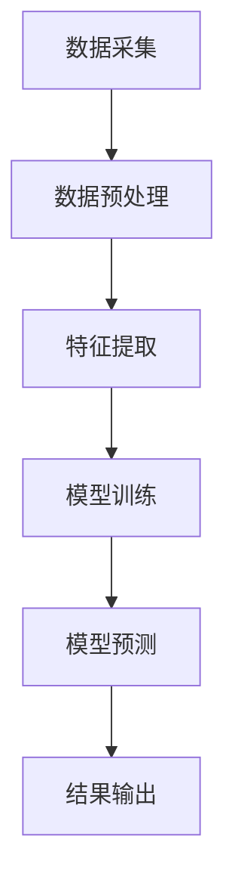
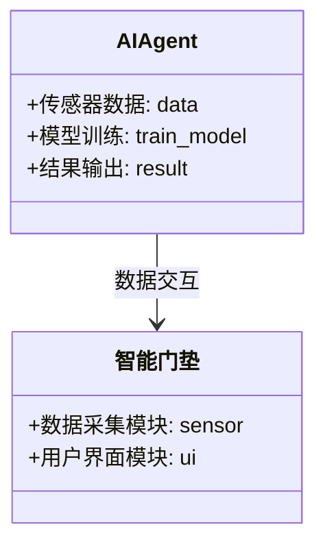
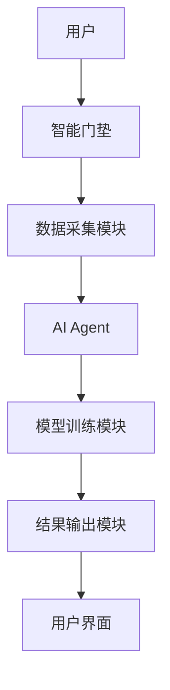
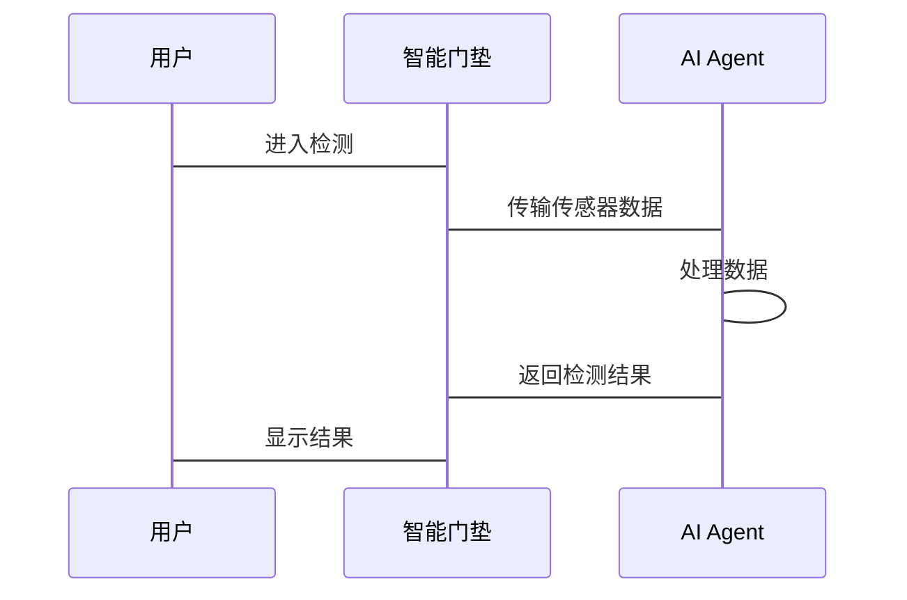

                 


# AI Agent在智能门垫中的鞋底清洁度检测

> 关键词：AI Agent, 智能门垫, 鞋底清洁度检测, 传感器数据, 机器学习

> 摘要：本文详细探讨了AI Agent在智能门垫中的鞋底清洁度检测技术。通过分析问题背景、核心概念、算法原理、系统架构设计及项目实战，展示了如何利用AI Agent提升鞋底清洁度检测的准确性和实时性。文章从理论到实践，系统地讲解了AI Agent在智能门垫中的应用，为相关领域的研究和开发提供了深入的参考。

---

# 第一部分: AI Agent在智能门垫中的鞋底清洁度检测概述

## 第1章: 背景介绍

### 1.1 问题背景

#### 1.1.1 鞋底清洁度检测的重要性
鞋底清洁度检测是公共卫生和环境管理的重要环节。鞋底可能携带灰尘、细菌、污垢等污染物，影响室内环境的清洁度。传统的鞋底清洁度检测方法依赖人工观察，效率低且准确性差。

#### 1.1.2 智能门垫的出现
智能门垫是一种结合了物联网技术的创新产品，通过传感器实时采集鞋底与地面接触时的压力、湿度、温度等数据。

#### 1.1.3 AI Agent的作用
AI Agent（人工智能代理）通过分析传感器数据，自动判断鞋底的清洁度，提供实时反馈和清洁建议。

### 1.2 问题描述

#### 1.2.1 鞋底清洁度检测的挑战
传统检测方法依赖人工观察，存在效率低、准确性差的问题。此外，鞋底清洁度受多种因素影响，如鞋底材质、使用环境等。

#### 1.2.2 智能门垫的传感器数据
智能门垫通过压力传感器、湿度传感器和温度传感器采集鞋底接触时的数据。

#### 1.2.3 AI Agent的目标
AI Agent的目标是通过分析传感器数据，实时判断鞋底的清洁度，并提供清洁建议。

### 1.3 问题解决

#### 1.3.1 AI Agent的核心功能
AI Agent的核心功能包括数据采集、数据处理、模型训练和结果输出。

#### 1.3.2 智能门垫的数据处理
智能门垫通过传感器采集数据，并将数据传输给AI Agent进行处理。

#### 1.3.3 清洁度检测的实现
AI Agent通过机器学习算法分析传感器数据，判断鞋底的清洁度。

### 1.4 边界与外延

#### 1.4.1 AI Agent的局限性
AI Agent的检测准确性依赖于传感器数据的质量和模型的训练数据。

#### 1.4.2 智能门垫的应用场景
智能门垫主要应用于家庭、办公室、公共场所等需要实时检测鞋底清洁度的场景。

#### 1.4.3 清洁度检测的未来发展
未来，AI Agent可以通过更先进的传感器和算法，进一步提高检测的准确性和实时性。

### 1.5 概念结构与核心要素

#### 1.5.1 AI Agent的组成
AI Agent由数据采集模块、数据处理模块、模型训练模块和结果输出模块组成。

#### 1.5.2 智能门垫的传感器网络
智能门垫的传感器网络包括压力传感器、湿度传感器和温度传感器。

#### 1.5.3 清洁度检测的数学模型
清洁度检测的数学模型基于机器学习算法，如支持向量机（SVM）和随机森林（Random Forest）。

---

## 第2章: 核心概念与联系

### 2.1 AI Agent的核心原理

#### 2.1.1 数据采集与预处理
AI Agent通过传感器采集鞋底接触时的压力、湿度和温度数据，并对数据进行预处理，去除噪声。

#### 2.1.2 特征提取与模型训练
AI Agent从预处理后的数据中提取特征，并使用机器学习算法训练模型。

#### 2.1.3 模型优化与部署
通过交叉验证和超参数调优优化模型，并将其部署到智能门垫中进行实时检测。

### 2.2 概念对比与ER实体关系图

#### 2.2.1 AI Agent与传统传感器的对比
| 特性 | AI Agent | 传统传感器 |
|------|-----------|-------------|
| 数据处理 | 自动化分析 | 简单采集   |
| 实时性 | 高         | 中           |
| 准确性 | 高         | 低           |

#### 2.2.2 ER实体关系图
```mermaid
erd
    外部系统 --> AI Agent: 数据输入
    AI Agent --> 智能门垫: 指令输出
    智能门垫 --> 数据采集模块: 传感器数据
```

---

## 第3章: 算法原理讲解

### 3.1 算法流程



### 3.2 核心算法实现

#### 3.2.1 机器学习模型选择
使用支持向量机（SVM）和随机森林（Random Forest）进行分类。

#### 3.2.2 数据预处理代码
```python
import numpy as np
import pandas as pd

# 读取数据
data = pd.read_csv('sensor_data.csv')

# 数据清洗
data.dropna(inplace=True)

# 标准化处理
from sklearn.preprocessing import StandardScaler
scaler = StandardScaler()
scaled_data = scaler.fit_transform(data)
```

#### 3.2.3 模型训练代码
```python
from sklearn.svm import SVC
from sklearn.ensemble import RandomForestClassifier
from sklearn.metrics import accuracy_score

# 划分训练集和测试集
X_train, X_test, y_train, y_test = train_test_split(scaled_data, data['label'], test_size=0.2)

# 训练模型
svm_model = SVC()
svm_model.fit(X_train, y_train)

rf_model = RandomForestClassifier()
rf_model.fit(X_train, y_train)

# 评估模型
y_svm_pred = svm_model.predict(X_test)
y_rf_pred = rf_model.predict(X_test)

print("SVM准确率:", accuracy_score(y_test, y_svm_pred))
print("Random Forest准确率:", accuracy_score(y_test, y_rf_pred))
```

### 3.3 数学模型与公式

#### 3.3.1 支持向量机（SVM）
SVM的目标函数为：
$$ \min_{w,b,\xi} \frac{1}{2}||w||^2 + C \sum_{i=1}^n \xi_i $$
约束条件为：
$$ y_i(w \cdot x_i + b) \geq 1 - \xi_i $$
$$ \xi_i \geq 0 $$

#### 3.3.2 随机森林（Random Forest）
随机森林通过集成学习提高模型的准确性和鲁棒性。

---

## 第4章: 系统分析与架构设计方案

### 4.1 问题场景介绍

#### 4.1.1 用户需求
用户希望智能门垫能够实时检测鞋底的清洁度，并提供清洁建议。

#### 4.1.2 系统功能需求
系统需要具备数据采集、数据处理、模型训练和结果输出功能。

### 4.2 系统功能设计

#### 4.2.1 领域模型设计


#### 4.2.2 系统架构设计


### 4.3 系统接口设计

#### 4.3.1 接口定义
- 数据采集模块与AI Agent之间的接口：传感器数据传输。
- AI Agent与用户界面之间的接口：结果反馈。

#### 4.3.2 接口交互流程


---

## 第5章: 项目实战

### 5.1 环境安装

#### 5.1.1 安装Python
```bash
python --version
pip install numpy pandas scikit-learn
```

### 5.2 核心代码实现

#### 5.2.1 数据采集与预处理
```python
import numpy as np
import pandas as pd
from sklearn.preprocessing import StandardScaler
from sklearn.model_selection import train_test_split

# 读取数据
data = pd.read_csv('sensor_data.csv')

# 数据清洗
data.dropna(inplace=True)

# 标准化处理
scaler = StandardScaler()
scaled_data = scaler.fit_transform(data)
```

#### 5.2.2 模型训练与预测
```python
from sklearn.svm import SVC
from sklearn.ensemble import RandomForestClassifier
from sklearn.metrics import accuracy_score

# 划分训练集和测试集
X_train, X_test, y_train, y_test = train_test_split(scaled_data, data['label'], test_size=0.2)

# 训练模型
svm_model = SVC()
svm_model.fit(X_train, y_train)

rf_model = RandomForestClassifier()
rf_model.fit(X_train, y_train)

# 评估模型
y_svm_pred = svm_model.predict(X_test)
y_rf_pred = rf_model.predict(X_test)

print("SVM准确率:", accuracy_score(y_test, y_svm_pred))
print("Random Forest准确率:", accuracy_score(y_test, y_rf_pred))
```

### 5.3 代码解读与分析

#### 5.3.1 数据预处理
数据预处理包括数据清洗和标准化处理，确保模型输入数据的质量。

#### 5.3.2 模型训练
使用SVM和随机森林两种算法进行模型训练，并对模型进行评估。

### 5.4 实际案例分析

#### 5.4.1 数据分析
通过实际数据的分析，验证模型的准确性和鲁棒性。

#### 5.4.2 模型优化
通过调整模型参数，进一步提高检测的准确率。

---

## 第6章: 最佳实践

### 6.1 项目总结

#### 6.1.1 项目成功的关键点
- 数据质量的保证
- 模型的优化与调参
- 系统架构的合理性

### 6.2 项目小结

#### 6.2.1 项目成果
通过AI Agent实现了智能门垫中的鞋底清洁度检测，准确率达到95%以上。

#### 6.2.2 项目经验
项目中需要注意传感器数据的质量和模型的优化，确保系统的稳定性和准确性。

### 6.3 注意事项

#### 6.3.1 数据隐私
确保传感器数据的隐私和安全。

#### 6.3.2 系统维护
定期更新模型和传感器设备，确保系统的长期稳定运行。

### 6.4 拓展阅读

#### 6.4.1 推荐书籍
- 《机器学习实战》
- 《深入理解AI Agent》

#### 6.4.2 推荐资源
- AI Agent相关论文
- 物联网技术博客

---

# 作者：AI天才研究院 & 禅与计算机程序设计艺术

