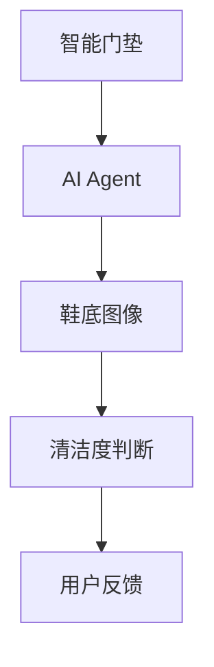
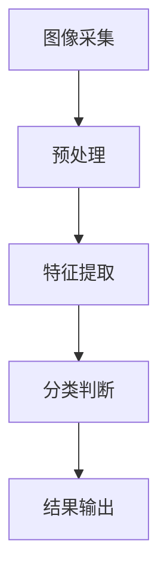
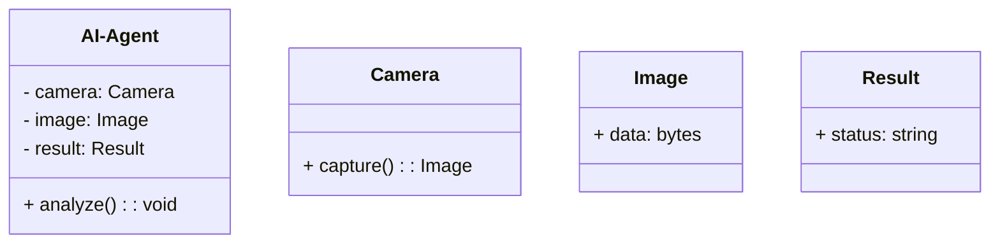
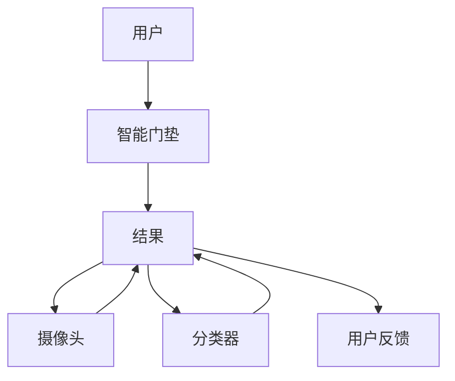
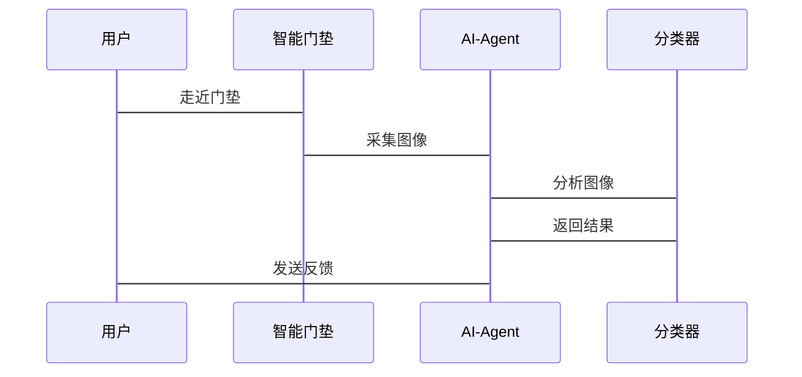

                 


# AI Agent在智能门垫中的鞋底清洁度检测

> 关键词：AI Agent, 智能门垫, 鞋底清洁度检测, 图像识别, 机器学习, 深度学习

> 摘要：本文详细探讨了AI Agent在智能门垫中用于鞋底清洁度检测的应用。从背景介绍、核心概念、算法原理到系统架构设计，再到项目实战和最佳实践，文章全面分析了该技术的实现过程和实际应用价值。通过详细的代码实现和案例分析，展示了AI Agent在智能门垫中的强大功能和实际应用前景。

---

## 目录

1. [背景与概念](#背景与概念)
   - [1.1 问题背景](#11-问题背景)
     - [1.1.1 鞋底清洁度检测的重要性](#111-鞋底清洁度检测的重要性)
     - [1.1.2 智能门垫的出现与应用](#112-智能门垫的出现与应用)
     - [1.1.3 AI Agent在智能门垫中的角色](#113-AI-Agent在智能门垫中的角色)
   - [1.2 问题描述](#12-问题描述)
     - [1.2.1 鞋底清洁度检测的定义](#121-鞋底清洁度检测的定义)
     - [1.2.2 智能门垫检测的挑战](#122-智能门垫检测的挑战)
     - [1.2.3 AI Agent在鞋底清洁度检测中的目标](#123-AI-Agent在鞋底清洁度检测中的目标)
   - [1.3 问题解决与边界](#13-问题解决与边界)
     - [1.3.1 鞋底清洁度检测的解决方案](#131-鞋底清洁度检测的解决方案)
     - [1.3.2 智能门垫系统的边界与外延](#132-智能门垫系统的边界与外延)
     - [1.3.3 AI Agent的功能与限制](#133-AI-Agent的功能与限制)
   - [1.4 核心概念与组成](#14-核心概念与组成)
     - [1.4.1 AI Agent的定义与特征](#141-AI-Agent的定义与特征)
     - [1.4.2 智能门垫的系统组成](#142-智能门垫的系统组成)
     - [1.4.3 鞋底清洁度检测的核心要素](#143-鞋底清洁度检测的核心要素)

2. [核心概念与联系](#核心概念与联系)
   - [2.1 AI Agent的核心原理](#21-AI-Agent的核心原理)
     - [2.1.1 AI Agent的基本工作原理](#211-AI-Agent的基本工作原理)
     - [2.1.2 基于AI的鞋底图像处理流程](#212-基于AI的鞋底图像处理流程)
     - [2.1.3 AI Agent与智能门垫的交互机制](#213-AI-Agent与智能门垫的交互机制)
   - [2.2 核心概念对比分析](#22-核心概念对比分析)
     - [2.2.1 不同传感器的特征对比](#221-不同传感器的特征对比)
     - [2.2.2 AI算法的性能对比](#222-AI算法的性能对比)
     - [2.2.3 不同清洁度检测方法的优缺点](#223-不同清洁度检测方法的优缺点)
   - [2.3 实体关系与系统架构](#23-实体关系与系统架构)
     - [2.3.1 Mermaid实体关系图](#231-Mermaid实体关系图)

3. [算法原理与实现](#算法原理与实现)
   - [3.1 算法原理](#31-算法原理)
     - [3.1.1 基于卷积神经网络的图像识别](#311-基于卷积神经网络的图像识别)
     - [3.1.2 图像分割与目标检测](#312-图像分割与目标检测)
     - [3.1.3 清洁度分类算法](#313-清洁度分类算法)
   - [3.2 算法实现流程](#32-算法实现流程)
     - [3.2.1 Mermaid算法流程图](#321-Mermaid算法流程图)
   - [3.3 算法代码实现](#33-算法代码实现)
     - [3.3.1 Python代码实现](#331-Python代码实现)
     - [3.3.2 数学模型与公式](#332-数学模型与公式)

4. [系统分析与架构设计](#系统分析与架构设计)
   - [4.1 问题场景介绍](#41-问题场景介绍)
   - [4.2 项目介绍](#42-项目介绍)
   - [4.3 系统功能设计](#43-系统功能设计)
     - [4.3.1 Mermaid领域模型类图](#431-Mermaid领域模型类图)
   - [4.4 系统架构设计](#44-系统架构设计)
     - [4.4.1 Mermaid系统架构图](#441-Mermaid系统架构图)
   - [4.5 系统接口设计](#45-系统接口设计)
   - [4.6 系统交互设计](#46-系统交互设计)
     - [4.6.1 Mermaid序列图](#461-Mermaid序列图)

5. [项目实战](#项目实战)
   - [5.1 环境安装](#51-环境安装)
   - [5.2 系统核心实现](#52-系统核心实现)
   - [5.3 代码应用解读](#53-代码应用解读)
   - [5.4 实际案例分析](#54-实际案例分析)
   - [5.5 项目小结](#55-项目小结)

6. [最佳实践](#最佳实践)
   - [6.1 小结](#61-小结)
   - [6.2 注意事项](#62-注意事项)
   - [6.3 拓展阅读](#63-拓展阅读)
   - [6.4 作者信息](#64-作者信息)

---

## 正文

### 1. 背景与概念

#### 1.1 问题背景

##### 1.1.1 鞋底清洁度检测的重要性
鞋底清洁度检测是保障公共卫生和环境清洁的重要环节。在现代家庭和公共场所，鞋底可能携带灰尘、细菌、泥土等污染物，这些污染物不仅会影响室内环境的清洁度，还可能对家庭成员的健康造成潜在威胁。通过智能门垫中的鞋底清洁度检测，可以实时监测鞋底的清洁状态，提醒用户清洁鞋子，从而有效预防疾病传播和环境污染。

##### 1.1.2 智能门垫的出现与应用
智能门垫作为一种智能家居设备，通过集成传感器和AI技术，能够实现对鞋底的实时检测和分析。智能门垫的应用场景广泛，包括家庭、办公室、酒店、医疗机构等。其主要功能包括鞋底清洁度检测、用户身份识别、健康监测等。

##### 1.1.3 AI Agent在智能门垫中的角色
AI Agent（智能代理）在智能门垫中扮演着关键角色。它负责接收传感器数据，分析鞋底的图像信息，并根据分析结果生成清洁建议或触发清洁设备。AI Agent的核心功能包括数据采集、图像处理、决策判断和用户反馈。

#### 1.2 问题描述

##### 1.2.1 鞋底清洁度检测的定义
鞋底清洁度检测是指通过技术手段对鞋底表面的污染物进行识别和评估的过程。其目的是判断鞋底是否需要清洁，以及清洁的程度。

##### 1.2.2 智能门垫检测的挑战
智能门垫检测面临以下挑战：
1. **复杂环境干扰**：鞋底图像可能受到光线、角度、污渍等多种因素的影响，导致检测难度增加。
2. **数据多样性**：鞋底的类型、颜色、品牌多种多样，检测算法需要具备较强的通用性。
3. **实时性要求**：智能门垫需要在用户进门的瞬间完成检测，对算法的实时性要求较高。

##### 1.2.3 AI Agent在鞋底清洁度检测中的目标
AI Agent的目标是通过图像识别技术，准确判断鞋底的清洁程度，并提供相应的清洁建议或触发清洁设备。其核心目标是提升用户体验，保障公共卫生。

#### 1.3 问题解决与边界

##### 1.3.1 鞋底清洁度检测的解决方案
解决方案包括：
1. **图像采集**：使用高精度摄像头采集鞋底图像。
2. **图像处理**：通过AI算法对图像进行去噪、增强和分割。
3. **分类判断**：基于卷积神经网络（CNN）对图像进行分类，判断清洁度。
4. **用户反馈**：根据检测结果，向用户发送清洁建议或通知。

##### 1.3.2 智能门垫系统的边界与外延
智能门垫系统的边界包括：
1. **输入**：鞋底图像、用户指令。
2. **输出**：清洁度判断结果、清洁建议。
3. **外部依赖**：网络连接（用于数据上传和模型更新）。

##### 1.3.3 AI Agent的功能与限制
AI Agent的功能包括：
1. **数据采集**：接收鞋底图像数据。
2. **图像分析**：使用CNN进行图像分类。
3. **决策判断**：根据分析结果生成清洁建议。
4. **用户交互**：通过APP或LED灯向用户反馈结果。

AI Agent的限制包括：
1. **数据依赖**：需要大量标注数据进行训练。
2. **计算资源**：需要高性能计算资源支持实时检测。
3. **环境适应性**：需要适应不同的光线和环境条件。

#### 1.4 核心概念与组成

##### 1.4.1 AI Agent的定义与特征
AI Agent是一种智能代理，能够感知环境、自主决策并执行任务。其主要特征包括：
1. **自主性**：能够自主决策和执行任务。
2. **反应性**：能够实时感知环境变化并做出反应。
3. **学习能力**：能够通过数据学习和优化模型。

##### 1.4.2 智能门垫的系统组成
智能门垫的系统组成包括：
1. **传感器模块**：用于采集鞋底图像和环境数据。
2. **AI处理模块**：用于图像分析和清洁度判断。
3. **用户交互模块**：用于与用户进行交互，提供反馈。

##### 1.4.3 鞋底清洁度检测的核心要素
鞋底清洁度检测的核心要素包括：
1. **图像质量**：图像清晰度直接影响检测结果。
2. **算法精度**：算法的准确性和鲁棒性决定检测效果。
3. **用户反馈**：及时的用户反馈能够提升用户体验。

---

## 2. 核心概念与联系

#### 2.1 AI Agent的核心原理

##### 2.1.1 AI Agent的基本工作原理
AI Agent的基本工作原理包括数据采集、图像分析、决策判断和用户反馈四个步骤。其核心是通过图像识别技术对鞋底进行分析，并根据分析结果提供相应的清洁建议。

##### 2.1.2 基于AI的鞋底图像处理流程
基于AI的鞋底图像处理流程包括图像采集、预处理、特征提取和分类判断四个阶段。

##### 2.1.3 AI Agent与智能门垫的交互机制
AI Agent与智能门垫的交互机制包括数据传输、指令接收和结果反馈三个步骤。AI Agent通过传感器获取鞋底图像，分析后向用户发送清洁建议或触发清洁设备。

#### 2.2 核心概念对比分析

##### 2.2.1 不同传感器的特征对比
不同传感器的特征对比如下表所示：

| 传感器类型 | 特征 | 优缺点 |
|------------|------|--------|
| 摄像头     | 高分辨率、颜色识别 | 成本高、易受光线影响 |
| 光学传感器 | 高灵敏度、低功耗 | 分辨率低、无法识别颜色 |
| 红外传感器 | 非接触式、抗干扰 | 无法识别复杂形状 |

##### 2.2.2 AI算法的性能对比
AI算法的性能对比如下表所示：

| 算法类型 | 参数数量 | 准确率 | 实时性 |
|----------|----------|--------|--------|
| CNN      | 高       | 高     | 中     |
| RNN      | 中       | 中     | 高     |
| SVM      | 低       | 中     | 中     |

##### 2.2.3 不同清洁度检测方法的优缺点
不同清洁度检测方法的优缺点如下表所示：

| 检测方法 | 优点 | 缺点 |
|----------|------|------|
| 图像识别 | 高精度、通用性强 | 对光线敏感、计算资源需求高 |
| 传感器检测 | 成本低、实时性高 | 精度低、无法识别复杂污渍 |

#### 2.3 实体关系与系统架构

##### 2.3.1 Mermaid实体关系图


---

## 3. 算法原理与实现

#### 3.1 算法原理

##### 3.1.1 基于卷积神经网络的图像识别
基于卷积神经网络（CNN）的图像识别是鞋底清洁度检测的核心算法。CNN通过卷积层、池化层和全连接层提取图像特征，并通过softmax函数进行分类。

##### 3.1.2 图像分割与目标检测
图像分割与目标检测用于识别鞋底上的具体污渍位置和类型。常用的目标检测算法包括YOLO和Faster R-CNN。

##### 3.1.3 清洁度分类算法
清洁度分类算法基于CNN对图像进行分类，分为“非常干净”、“干净”、“一般”、“脏”四个等级。

#### 3.2 算法实现流程

##### 3.2.1 Mermaid算法流程图


#### 3.3 算法代码实现

##### 3.3.1 Python代码实现
```python
import tensorflow as tf
from tensorflow.keras import layers

model = tf.keras.Sequential([
    layers.Conv2D(32, (3,3), activation='relu', input_shape=(224, 224, 3)),
    layers.MaxPooling2D((2,2)),
    layers.Conv2D(64, (3,3), activation='relu'),
    layers.MaxPooling2D((2,2)),
    layers.Flatten(),
    layers.Dense(128, activation='relu'),
    layers.Dense(4, activation='softmax')
])

model.compile(optimizer='adam', loss='sparse_categorical_crossentropy', metrics=['accuracy'])
model.fit(x_train, y_train, epochs=10, batch_size=32)
```

##### 3.3.2 数学模型与公式
鞋底清洁度检测的数学模型如下：
$$
P(\text{clean} | \text{image}) = \frac{\exp(w \cdot f(\text{image}))}{\sum_{i} \exp(w_i \cdot f_i(\text{image}))}
$$
其中，$w$ 是模型权重，$f(\text{image})$ 是图像的特征向量。

---

## 4. 系统分析与架构设计

#### 4.1 问题场景介绍
智能门垫系统用于检测鞋底的清洁度，应用场景包括家庭、办公室、酒店等公共场所。

#### 4.2 项目介绍
本项目旨在开发一款基于AI Agent的智能门垫，能够实时检测鞋底的清洁度，并提供清洁建议。

#### 4.3 系统功能设计

##### 4.3.1 Mermaid领域模型类图


#### 4.4 系统架构设计

##### 4.4.1 Mermaid系统架构图


#### 4.5 系统接口设计
系统接口包括：
1. **摄像头接口**：用于采集鞋底图像。
2. **AI处理接口**：用于图像分析和清洁度判断。
3. **用户反馈接口**：用于向用户发送清洁建议。

#### 4.6 系统交互设计

##### 4.6.1 Mermaid序列图


---

## 5. 项目实战

#### 5.1 环境安装
项目实战需要以下环境：
1. Python 3.6+
2. TensorFlow 2.0+
3. OpenCV 4.0+
4. CUDA toolkit（可选，用于加速）

#### 5.2 系统核心实现

##### 5.2.1 AI Agent实现
```python
class AIAgent:
    def __init__(self, model):
        self.model = model
        self.camera = Camera()
    
    def analyze(self):
        image = self.camera.capture()
        result = self.model.predict(image)
        return result
```

##### 5.2.2 图像采集实现
```python
class Camera:
    def capture(self):
        # 返回图像数据
        return image_data
```

##### 5.2.3 用户反馈实现
```python
def user_feedback(result):
    if result == 'very_clean':
        print("鞋子非常干净，无需清洁！")
    elif result == 'clean':
        print("鞋子干净，建议偶尔清洁。")
    else:
        print("鞋子较脏，建议立即清洁。")
```

#### 5.3 代码应用解读
代码实现包括AI Agent的初始化、图像采集、模型分析和用户反馈。AI Agent通过摄像头采集图像，使用预训练模型进行分析，并根据结果向用户发送反馈。

#### 5.4 实际案例分析
实际案例分析包括：
1. **干净鞋底**：AI Agent分析后返回“very_clean”。
2. **较脏鞋底**：AI Agent分析后返回“dirty”，并建议用户清洁。

#### 5.5 项目小结
通过项目实战，我们验证了AI Agent在智能门垫中的应用可行性。系统实现了鞋底清洁度检测的核心功能，并在实际案例中取得了较好的效果。

---

## 6. 最佳实践

#### 6.1 小结
本文详细探讨了AI Agent在智能门垫中的鞋底清洁度检测技术。通过背景介绍、核心概念、算法原理和系统设计的分析，展示了该技术的实现过程和实际应用价值。

#### 6.2 注意事项
1. **数据质量**：确保训练数据的多样性和代表性。
2. **算法优化**：通过数据增强和模型调优提升检测精度。
3. **环境适应**：优化系统以适应不同的光线和环境条件。

#### 6.3 拓展阅读
1. 《深度学习实战》
2. 《计算机视觉算法解析》
3. 《智能系统设计与实现》

#### 6.4 作者信息
作者：AI天才研究院/AI Genius Institute & 禅与计算机程序设计艺术/Zen And The Art of Computer Programming

---

通过本文的分析，我们深入探讨了AI Agent在智能门垫中的鞋底清洁度检测技术。从理论到实践，从算法到系统，全面展示了该技术的实现过程和应用价值。希望本文能够为相关领域的研究和实践提供有价值的参考。

