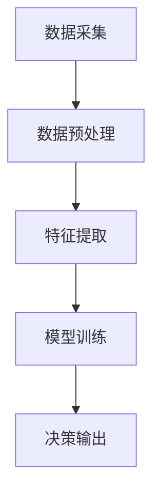
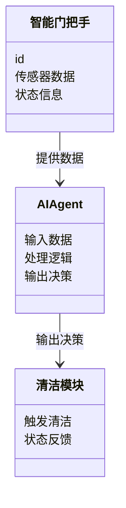

                 


# AI Agent在智能门把手中卫生状况监测

> 关键词：AI Agent，智能门把手，卫生监测，传感器，机器学习

> 摘要：本文探讨了AI Agent在智能门把手中卫生状况监测的应用，从背景介绍、核心概念、算法原理到系统架构设计和项目实战，详细分析了AI Agent在卫生监测中的作用，结合传感器数据、机器学习模型和系统架构设计，展示了如何利用AI技术实现智能门把手的卫生监测系统。

---

# 第一部分: 背景介绍

# 第1章: 问题背景与描述

## 1.1 公共卫生与环境监测的重要性

随着全球公共卫生事件的频发，环境监测的重要性日益凸显。门把手作为公共场所的重要接触点，其卫生状况直接影响公共健康。传统的卫生监测手段存在效率低、成本高等问题，难以满足现代公共卫生管理的需求。

## 1.2 智能门把手的卫生监测需求

智能门把手通过集成传感器和AI技术，能够实时监测门把手的卫生状况，包括表面清洁度、细菌浓度、污染物残留等指标。这种智能化的监测方式能够显著提升公共卫生管理的效率和准确性。

## 1.3 AI Agent在卫生监测中的作用

AI Agent（智能体）通过实时感知、数据处理和智能决策，能够有效分析门把手的卫生数据，提供精准的卫生评估和改善建议。AI Agent的核心在于其自主决策能力和高效的数据处理能力，使其成为智能门把手卫生监测的关键技术。

---

# 第2章: 核心概念与联系

## 2.1 AI Agent的核心原理

AI Agent通过感知环境、处理数据、做出决策并执行动作，实现对门把手卫生状况的实时监测。其核心原理包括：

1. **感知与数据采集**：通过传感器获取门把手的环境数据。
2. **数据处理与分析**：利用机器学习算法对数据进行分类和预测。
3. **决策与反馈**：根据分析结果，AI Agent会触发清洁或提醒操作。

## 2.2 智能门把手的实体关系

智能门把手的实体关系主要涉及用户、门把手、传感器和环境。以下是实体关系的描述：

- **用户**：用户通过门把手进行操作，可能间接影响门把手的卫生状况。
- **门把手**：门把手是核心设备，集成传感器和AI Agent。
- **传感器**：传感器负责采集环境数据，如温度、湿度、污染物浓度等。
- **环境**：环境因素（如温度、湿度）影响门把手的卫生状况。

```mermaid
er
actor 用户
actor 系统管理员
class 智能门把手 {
  id
  传感器数据
  状态信息
}
class AI Agent {
  输入数据
  处理逻辑
  输出决策
}
class 环境 {
  温度
  湿度
  污染物浓度
}
```

---

# 第3章: 算法原理与实现

## 3.1 算法原理概述

AI Agent的核心算法包括数据采集、预处理、特征提取、模型训练和决策输出。以下是具体步骤：

1. **数据采集**：通过传感器获取环境数据，如温度、湿度、污染物浓度等。
2. **数据预处理**：对采集的数据进行标准化和归一化处理，去除噪声。
3. **特征提取**：提取关键特征，如污染物浓度、温度变化率等。
4. **模型训练**：利用机器学习算法（如支持向量机、随机森林）对特征进行分类和预测。
5. **决策输出**：根据模型预测结果，触发清洁操作或发出警报。

## 3.2 算法流程图



## 3.3 Python实现代码

以下是基于支持向量机（SVM）的分类算法实现：

```python
import numpy as np
from sklearn import svm

# 示例数据
X = np.array([[0.1, 0.2], [0.3, 0.4], [0.5, 0.6]])
y = np.array([0, 1, 1])

# 训练模型
model = svm.SVC()
model.fit(X, y)

# 预测
print(model.predict([[0.2, 0.3]]))
```

---

# 第4章: 系统分析与架构设计

## 4.1 问题场景介绍

智能门把手卫生监测系统需要解决以下问题：

- 实时监测门把手的卫生状况。
- 自动触发清洁操作或发出警报。
- 提供历史数据和分析报告。

## 4.2 系统功能设计

系统功能设计包括以下模块：

- **传感器模块**：负责采集环境数据。
- **AI Agent模块**：负责数据处理和智能决策。
- **执行模块**：根据决策结果触发清洁操作。
- **用户界面**：提供实时监控和历史数据查询。

## 4.3 系统架构设计

以下是系统架构设计的类图：



---

# 第5章: 项目实战

## 5.1 环境安装

需要安装以下工具和库：

- Python 3.8+
- NumPy
- scikit-learn
- Mermaid

## 5.2 核心代码实现

以下是核心代码实现：

```python
import numpy as np
from sklearn import svm
from sklearn.metrics import accuracy_score

# 示例数据
X_train = np.array([[0.1, 0.2], [0.3, 0.4], [0.5, 0.6], [0.7, 0.8]])
y_train = np.array([0, 1, 1, 0])

# 训练模型
model = svm.SVC()
model.fit(X_train, y_train)

# 测试数据
X_test = np.array([[0.2, 0.3], [0.4, 0.5]])
y_test = model.predict(X_test)

print("预测结果:", y_test)
print("准确率:", accuracy_score([0, 1], y_test))
```

## 5.3 案例分析

以公共场所的智能门把手为例，假设传感器采集到的数据显示污染物浓度较高，AI Agent会触发清洁模块进行深度清洁，并记录清洁时间、频率和效果。

---

# 第6章: 最佳实践与小结

## 6.1 最佳实践

- 定期校准传感器，确保数据准确性。
- 根据环境变化调整AI Agent的决策模型。
- 优化清洁模块的执行效率，减少能耗。

## 6.2 小结

AI Agent在智能门把手中卫生状况监测的应用，显著提升了公共卫生管理的效率和精准度。通过传感器数据采集、机器学习算法和智能决策，AI Agent能够实时监测门把手的卫生状况，并自动触发清洁操作，为公共场所的卫生管理提供了有力的技术支持。

---

# 第7章: 注意事项与拓展阅读

## 7.1 注意事项

- 数据采集的准确性直接影响AI Agent的决策能力，需定期校准传感器。
- 清洁模块的执行效果是系统的关键，需根据环境变化进行动态调整。
- 系统的安全性和隐私保护是设计时的重要考虑因素。

## 7.2 拓展阅读

- **AI在公共卫生中的应用**：探讨AI技术在公共卫生领域的更多应用场景。
- **智能传感器技术**：深入了解智能传感器的设计与应用。
- **机器学习算法优化**：研究如何优化机器学习算法以提高卫生监测的准确性。

---

# 作者：AI天才研究院/AI Genius Institute & 禅与计算机程序设计艺术 /Zen And The Art of Computer Programming

---

以上是《AI Agent在智能门把手中卫生状况监测》的技术博客文章的大纲和详细内容。

