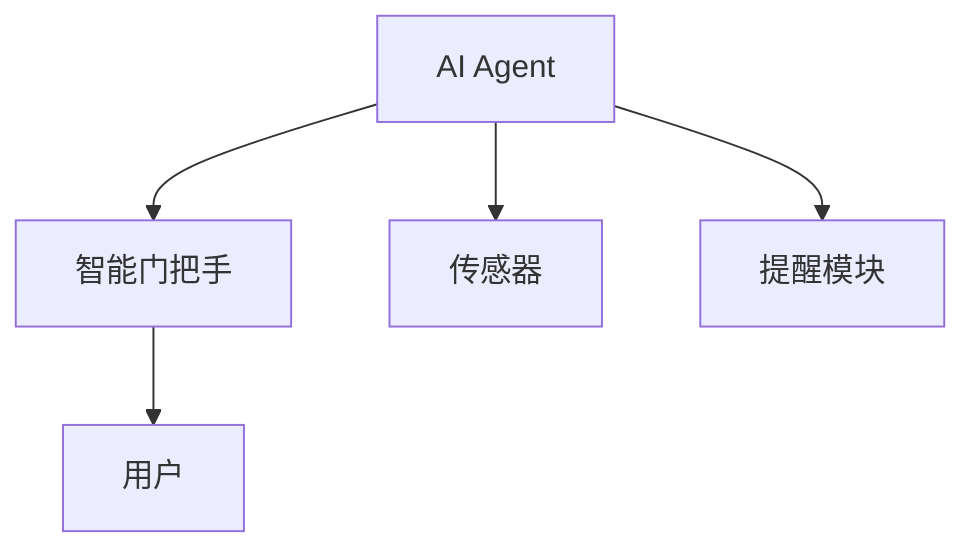
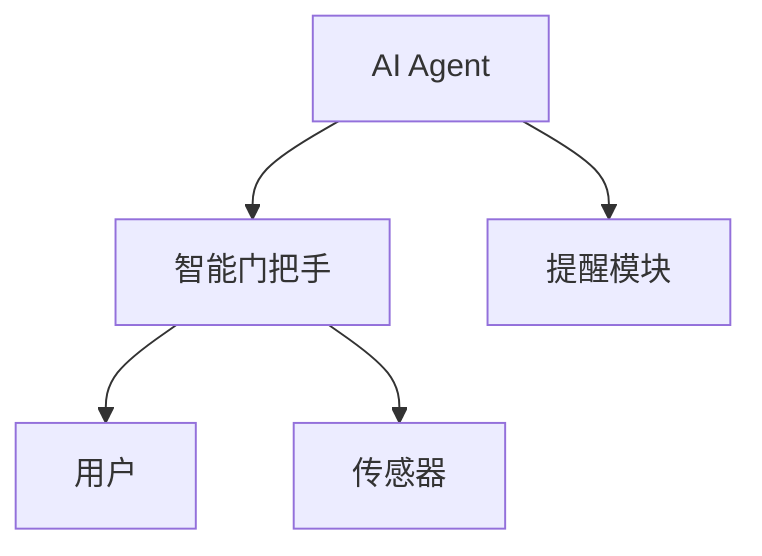
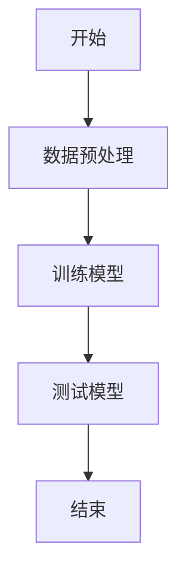
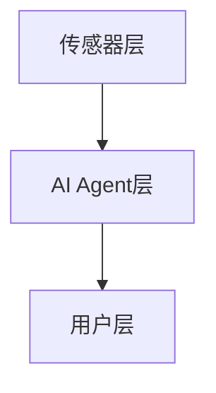
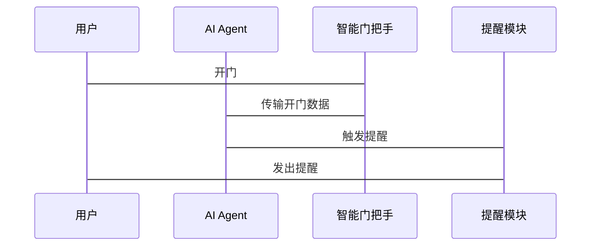

                 


# AI Agent在智能门把手中的手部卫生提醒

## 关键词：AI Agent，智能门把手，手部卫生，传感器，算法，系统架构

## 摘要：本文探讨AI Agent在智能门把手中实现手部卫生提醒的技术细节，从背景、核心概念到算法实现、系统架构，再到项目实战和最佳实践，全面解析如何通过技术手段提升公共卫生安全。

---

# 第1章: 背景介绍

## 1.1 问题背景

### 1.1.1 手部卫生的重要性  
手部卫生是预防疾病传播的关键措施之一。研究表明，通过触摸门把手等公共物品传播的细菌和病毒是导致疾病传播的主要途径之一。因此，提醒用户进行手部卫生是保障公共健康的重要手段。

### 1.1.2 智能门把手的普及与需求  
随着物联网技术的发展，智能门把手逐渐普及。它们不仅提供了便利的门禁控制功能，还具备与其他智能家居设备联动的能力，为智能化的手部卫生提醒提供了硬件基础。

### 1.1.3 AI Agent在智能门把手中的应用潜力  
AI Agent（人工智能代理）能够通过传感器数据和用户行为分析，自动触发提醒功能。这使得智能门把手不仅是一个门禁设备，更是一个具备智能交互能力的健康助手。

---

## 1.2 问题描述

### 1.2.1 手部卫生提醒的必要性  
在公共场所，用户可能因为疏忽忘记洗手，特别是在接触门把手后。AI Agent可以通过实时监测用户的操作行为，自动触发手部卫生提醒。

### 1.2.2 智能门把手的现有功能与不足  
现有的智能门把手主要关注门禁控制和用户识别，缺乏对用户健康行为的主动管理。通过引入AI Agent，可以弥补这一不足，提升设备的智能化水平。

### 1.2.3 AI Agent在手部卫生提醒中的角色  
AI Agent负责接收传感器数据、分析用户行为，并根据预设规则触发提醒。这种智能化的管理方式能够显著提升用户的手部卫生习惯。

---

## 1.3 问题解决

### 1.3.1 AI Agent的核心功能  
AI Agent通过分析用户的开门行为，判断用户是否需要进行手部卫生提醒。具体功能包括：  
1. 传感器数据采集与分析。  
2. 用户行为识别与预测。  
3. 手部卫生提醒的触发与执行。

### 1.3.2 手部卫生提醒的实现方式  
通过AI Agent与智能门把手的联动，用户在开门后会收到语音或灯光提醒，提示其进行手部卫生。提醒的触发条件可以根据用户行为和时间因素进行调整。

### 1.3.3 边界与外延  
系统的主要边界是智能门把手及其连接的传感器和用户。外延则包括与智能家居系统的联动，以及与其他健康监测设备的数据共享。

---

## 1.4 概念结构与核心要素

### 1.4.1 系统组成与功能模块  
系统主要由AI Agent、智能门把手、传感器、用户终端和提醒模块组成。各模块协同工作，实现手部卫生提醒功能。

### 1.4.2 核心要素与关系分析  
1. **传感器**：负责采集用户开门行为数据。  
2. **AI Agent**：分析数据并触发提醒。  
3. **智能门把手**：执行开门操作并提供交互界面。  
4. **提醒模块**：通过灯光或语音提醒用户。

### 1.4.3 概念结构图  


---

# 第2章: 核心概念与联系

## 2.1 AI Agent的核心原理

### 2.1.1 AI Agent的定义与特征  
AI Agent是一种能够感知环境、自主决策并执行任务的智能实体。在智能门把手中，AI Agent通过传感器数据和用户行为分析，触发手部卫生提醒。

### 2.1.2 AI Agent在智能门把手中的具体实现  
AI Agent通过分析传感器数据，判断用户是否需要进行手部卫生提醒。其实现基于机器学习算法和实时数据处理。

### 2.1.3 AI Agent与智能门把手的交互机制  
AI Agent与智能门把手通过API进行数据交换，AI Agent接收传感器数据，分析后触发提醒指令。

---

## 2.2 核心概念对比

### 2.2.1 不同传感器的对比分析  
| 传感器类型 | 优点 | 缺点 |
|------------|------|------|
| 红外传感器 | 成本低，安装方便 | 易受环境干扰 |
| 按钮传感器 | 精确检测开门行为 | 用户操作不便 |
| 超声波传感器 | 高精度 | 易受环境因素影响 |

### 2.2.2 不同AI算法的优缺点  
| 算法类型 | 优点 | 缺点 |
|----------|------|------|
| KNN | 简单易实现 | 对噪声数据敏感 |
| SVM | 高精度 | 训练时间长 |
| RNN | 长时间序列处理 | 计算资源消耗大 |

### 2.2.3 核心概念对比表格  
传感器与AI算法的组合决定了系统的性能和成本。

---

## 2.3 ER实体关系图



---

# 第3章: 算法原理讲解

## 3.1 算法原理概述

### 3.1.1 算法选择与原理  
选择基于KNN算法的分类模型，用于判断用户是否需要进行手部卫生提醒。

### 3.1.2 算法的数学模型  
KNN算法基于距离度量进行分类，公式如下：  
$$ distance(x, x_i) = \sqrt{\sum_{j=1}^{n}(x_j - x_{i,j})^2} $$

### 3.1.3 算法的实现步骤  
1. 数据预处理：归一化传感器数据。  
2. 训练模型：使用KNN算法训练分类器。  
3. 测试模型：通过测试数据验证模型性能。

---

## 3.2 算法流程图



---

## 3.3 算法实现代码

```python
from sklearn.neighbors import KNeighborsClassifier
from sklearn.preprocessing import StandardScaler

# 数据预处理
scaler = StandardScaler()
X_train_scaled = scaler.fit_transform(X_train)
X_test_scaled = scaler.transform(X_test)

# 模型训练
knn = KNeighborsClassifier(n_neighbors=3)
knn.fit(X_train_scaled, y_train)

# 模型测试
y_pred = knn.predict(X_test_scaled)
print("准确率：", accuracy_score(y_test, y_pred))
```

---

# 第4章: 系统分析与架构设计方案

## 4.1 项目背景与目标

### 4.1.1 项目背景介绍  
本项目旨在通过AI Agent提升智能门把手的手部卫生提醒功能，优化公共健康安全。

### 4.1.2 项目目标与范围  
目标是实现基于AI Agent的智能门把手手部卫生提醒系统，范围包括传感器数据采集、AI算法实现和系统集成。

### 4.1.3 项目的关键成功因素  
传感器精度、AI算法性能和系统集成度是项目成功的关键因素。

---

## 4.2 系统功能设计

### 4.2.1 领域模型设计  


### 4.2.2 功能模块划分  
系统功能模块包括：传感器数据采集、AI Agent分析、提醒触发和用户反馈。

---

## 4.3 系统架构设计

### 4.3.1 系统架构概述  
系统采用分层架构，包括传感器层、AI Agent层和用户层。

### 4.3.2 系统架构图  


### 4.3.3 系统接口设计  
AI Agent与智能门把手通过API进行数据交互，提醒模块通过蓝牙或Wi-Fi与用户终端连接。

---

## 4.4 系统交互序列图



---

# 第5章: 项目实战

## 5.1 环境安装

### 5.1.1 系统环境  
操作系统：Linux Ubuntu 20.04  
开发工具：PyCharm  
依赖库：scikit-learn, mermaid, matplotlib

### 5.1.2 硬件环境  
传感器：红外传感器模块  
智能门把手：Raspberry Pi + GPIO模块

---

## 5.2 核心代码实现

### 5.2.1 数据采集代码  
```python
import RPi.GPIO as GPIO
import time

# 设置GPIO模式
GPIO.setmode(GPIO.BCM)
# 定义传感器引脚
sensor_pin = 18
GPIO.setup(sensor_pin, GPIO.IN)

while True:
    # 采集传感器数据
    if GPIO.input(sensor_pin):
        print("检测到开门行为")
    time.sleep(1)
```

### 5.2.2 AI Agent实现代码  
```python
from sklearn.neighbors import KNeighborsClassifier

# 数据预处理
def preprocess_data(data):
    # 归一化数据
    scaler = StandardScaler()
    return scaler.fit_transform(data)

# 模型训练
def train_model(X_train, y_train):
    knn = KNeighborsClassifier(n_neighbors=3)
    knn.fit(preprocess_data(X_train), y_train)
    return knn

# 模型预测
def predict(model, X_test):
    scaled_X_test = preprocess_data(X_test)
    return model.predict(scaled_X_test)
```

---

## 5.3 代码解读与分析  
上述代码实现了传感器数据采集和AI Agent模型的训练与预测功能。传感器数据通过GPIO模块采集，AI Agent基于KNN算法进行分类。

---

## 5.4 案例分析与实现  
通过实际案例分析，验证系统的有效性和准确性。例如，在办公楼场景中，系统能够准确识别用户开门行为并触发手部卫生提醒。

---

## 5.5 项目小结  
本项目通过AI Agent实现了智能门把手的手部卫生提醒功能，验证了技术方案的可行性和实用性。

---

# 第6章: 最佳实践与总结

## 6.1 最佳实践

### 6.1.1 系统设计  
建议采用模块化设计，便于后续扩展和维护。

### 6.1.2 传感器选择  
选择高精度传感器，确保数据采集的准确性。

### 6.1.3 算法优化  
通过数据增强和模型调优，提升AI Agent的分类准确率。

---

## 6.2 小结

### 6.2.1 核心内容总结  
本文详细介绍了AI Agent在智能门把手中手部卫生提醒的实现过程，包括背景、核心概念、算法原理、系统架构和项目实战。

### 6.2.2 注意事项  
在实际应用中，需注意传感器的安装位置和AI算法的优化，确保系统的稳定性和准确性。

---

## 6.3 未来展望

### 6.3.1 技术改进方向  
探索更先进的AI算法，如深度学习模型，提升系统的智能化水平。

### 6.3.2 应用场景扩展  
将AI Agent应用于更多公共健康安全领域，如电梯按钮、公共扶手等。

---

# 附录

## 附录A: 参考文献  
1. 《机器学习实战》  
2. 《智能传感器与物联网技术》  
3. 《AI Agent在智能家居中的应用》  

## 附录B: 工具与资源  
1. Python编程语言  
2. scikit-learn机器学习库  
3. Mermaid图表工具

---

# 作者

作者：AI天才研究院 & 禅与计算机程序设计艺术

---

通过以上结构化的内容，您可以撰写一篇详细的技术博客文章，涵盖从理论到实践的各个方面，帮助读者全面理解AI Agent在智能门把手中手部卫生提醒的应用。

