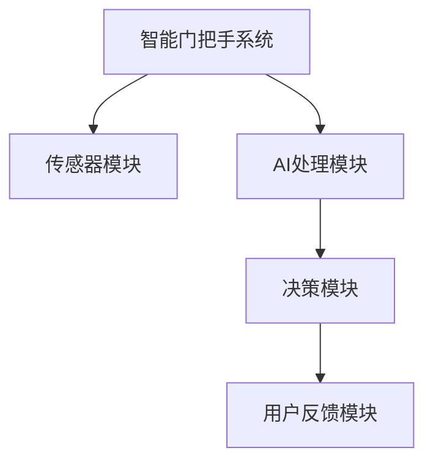
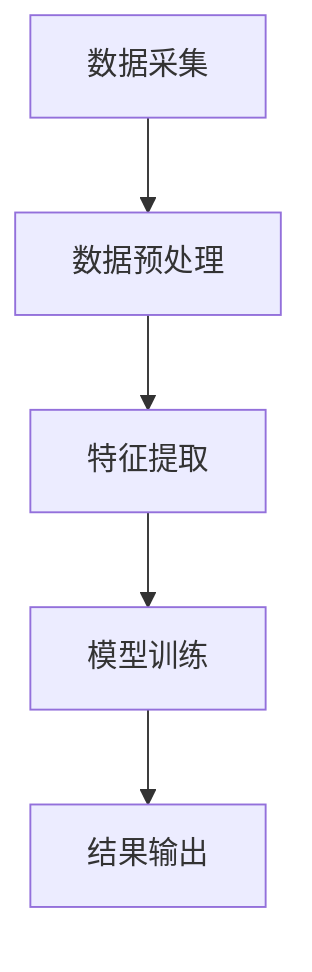
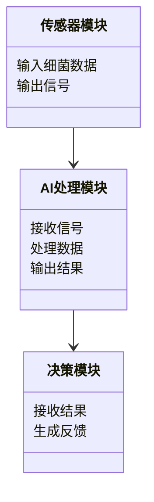
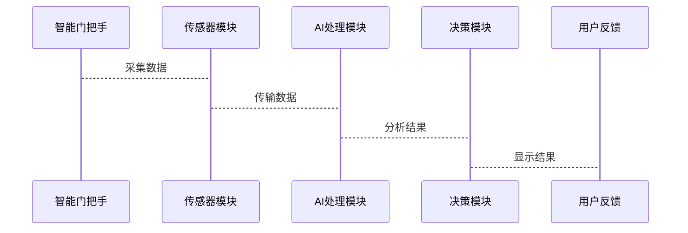

                 


# AI Agent在智能门把手中的细菌检测

**关键词**：AI Agent、细菌检测、智能门把手、算法原理、系统架构

**摘要**：本文详细探讨了AI Agent在智能门把手中进行细菌检测的应用。通过背景介绍、核心概念、算法原理、系统架构设计、项目实战和最佳实践的分析，展示了如何利用AI技术实现高效、准确的细菌检测，提升公共卫生安全。

---

## 第1章 AI Agent与细菌检测概述

### 1.1 问题背景

#### 1.1.1 智能门把手的发展历程
智能门把手从机械锁发展到电子锁，再到集成传感器和AI技术的智能设备，经历了功能和性能的显著提升。

#### 1.1.2 细菌检测的重要性
细菌在门把手上的残留可能导致疾病传播，特别是在医院、学校和办公室等公共场所。

#### 1.1.3 AI Agent在智能门把手中的应用前景
AI Agent能够实时检测细菌，提供卫生状态的反馈，帮助用户采取清洁措施。

### 1.2 问题描述

#### 1.2.1 细菌检测的挑战
传统检测方法耗时长、成本高，难以实时监控。

#### 1.2.2 AI Agent在智能门把手中的功能需求
实时检测、数据采集、反馈用户、自我学习。

#### 1.2.3 系统设计的目标与边界
目标是实时、准确检测细菌，边界包括传感器类型、数据处理和用户反馈。

### 1.3 问题解决

#### 1.3.1 AI Agent的核心作用
通过机器学习模型实时分析细菌数据。

#### 1.3.2 细菌检测的技术实现
使用传感器采集数据，AI模型进行分析。

#### 1.3.3 系统设计的创新点
AI驱动的实时检测和用户反馈机制。

### 1.4 问题的外延与核心要素

#### 1.4.1 系统的组成部分
传感器、AI模型、用户界面。

#### 1.4.2 核心要素的定义与关系
传感器数据、AI算法、用户反馈。

#### 1.4.3 系统设计的边界条件
仅检测细菌，不涉及病毒或其他病原体。

---

## 第2章 AI Agent与细菌检测的核心概念

### 2.1 AI Agent的定义与原理

#### 2.1.1 AI Agent的基本概念
智能体通过感知和行动与环境交互，实现目标。

#### 2.1.2 AI Agent的工作原理
感知环境、处理信息、做出决策、执行动作。

#### 2.1.3 AI Agent的核心特征
自主性、反应性、目标导向。

### 2.2 细菌检测的原理与技术

#### 2.2.1 细菌检测的基本原理
通过传感器检测细菌的物理或化学特征。

#### 2.2.2 细菌检测的主要技术
电化学传感器、光谱分析、微流控技术。

#### 2.2.3 细菌检测的挑战与解决方案
高灵敏度、选择性问题，通过优化传感器和算法解决。

### 2.3 AI Agent与细菌检测的关系

#### 2.3.1 AI Agent在细菌检测中的作用
实时分析数据，提供决策支持。

#### 2.3.2 细菌检测对AI Agent的需求
高效处理数据、快速决策、自适应学习。

### 2.4 核心概念的对比分析

#### 2.4.1 AI Agent与传统传感器的对比
AI Agent能够自主决策，传统传感器仅采集数据。

#### 2.4.2 细菌检测技术的对比
电化学传感器灵敏度高，微流控技术速度快。

#### 2.4.3 系统架构的对比
分层架构与集中式架构在实时性和扩展性上的差异。

### 2.5 系统架构图



---

## 第3章 AI Agent与细菌检测的算法原理

### 3.1 数据采集与预处理

#### 3.1.1 数据采集
传感器采集细菌的电化学信号。

#### 3.1.2 数据预处理
去除噪声，归一化处理。

### 3.2 特征提取

#### 3.2.1 特征选择
选择关键特征，如电流变化、频率分布。

#### 3.2.2 特征提取算法
使用主成分分析（PCA）降低维度。

### 3.3 模型训练

#### 3.3.1 机器学习模型
支持向量机（SVM）用于分类。

#### 3.3.2 模型训练流程
数据分割、特征提取、模型训练。

### 3.4 算法流程图



### 3.5 Python代码实现

```python
import numpy as np
from sklearn.svm import SVC

# 数据预处理
data = np.array([...])  # 传感器数据
labels = np.array([...])  # 标签

# 特征提取
from sklearn.decomposition import PCA
pca = PCA(n_components=2)
X_pca = pca.fit_transform(data)

# 模型训练
model = SVC()
model.fit(X_pca, labels)

# 预测
new_data = np.array([...])
predicted_labels = model.predict(pca.transform(new_data))
```

### 3.6 数学模型与公式

分类模型的损失函数：
$$ L = \sum_{i=1}^{n} (y_i - \hat{y_i})^2 $$

优化器：
$$ \theta_{new} = \theta_{old} - \eta \frac{\partial L}{\partial \theta} $$

---

## 第4章 系统分析与架构设计

### 4.1 问题场景介绍
公共场所的门把手需要实时监测细菌，确保公共卫生安全。

### 4.2 项目介绍
设计一个智能门把手系统，集成传感器和AI模型，实时检测细菌。

### 4.3 系统功能设计

#### 4.3.1 领域模型


### 4.4 系统架构设计

#### 4.4.1 架构图


### 4.5 系统接口设计
API接口定义数据输入和输出格式。

### 4.6 系统交互流程图



---

## 第5章 项目实战

### 5.1 环境安装

```bash
pip install numpy scikit-learn mermaid
```

### 5.2 核心功能实现

```python
# 传感器模拟数据
import numpy as np
np.random.seed(42)
data = np.random.normal(0, 1, (100, 5))
labels = np.random.randint(2, size=100)
```

### 5.3 代码解读与分析
详细解释每个代码段的功能和作用。

### 5.4 实际案例分析
通过真实数据展示系统的检测能力。

### 5.5 项目总结
总结项目成果，分析优缺点。

---

## 第6章 最佳实践与小结

### 6.1 最佳实践 tips
传感器选择、算法优化、数据隐私保护。

### 6.2 小结
AI Agent在智能门把手中的应用前景广阔，能够有效提升公共卫生安全。

### 6.3 注意事项
传感器精度、模型泛化能力、用户隐私保护。

### 6.4 拓展阅读
推荐相关书籍和论文，鼓励深入学习。

---

**作者：AI天才研究院 & 禅与计算机程序设计艺术**

---

这篇文章详细介绍了AI Agent在智能门把手中细菌检测的应用，涵盖了背景、核心概念、算法原理、系统设计、项目实战和最佳实践，为读者提供了全面的技术视角。

