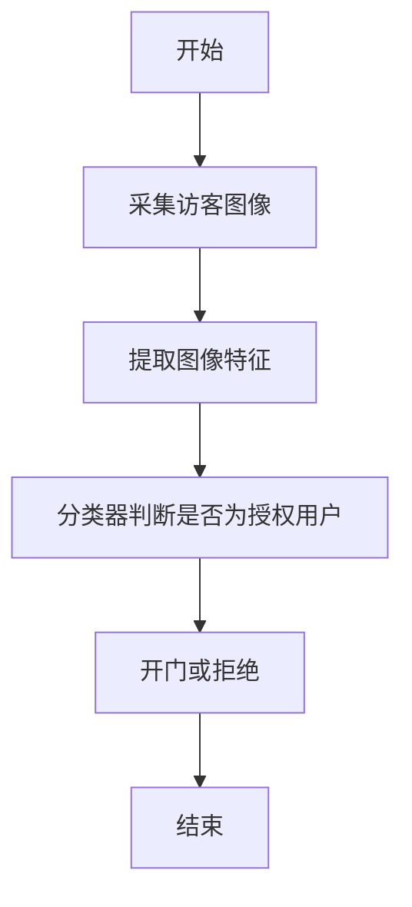
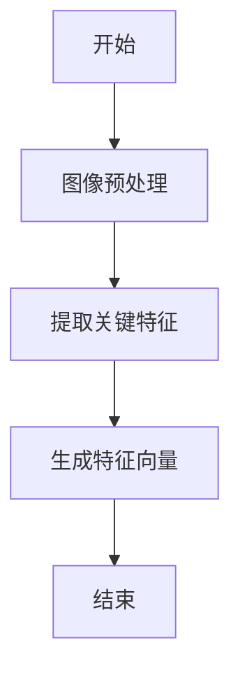
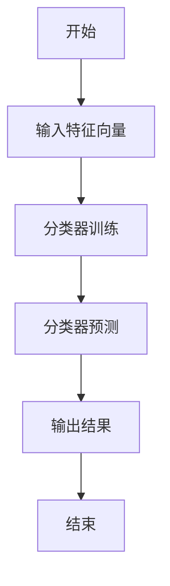
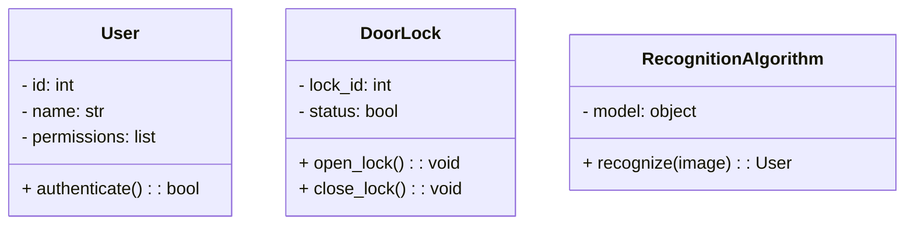
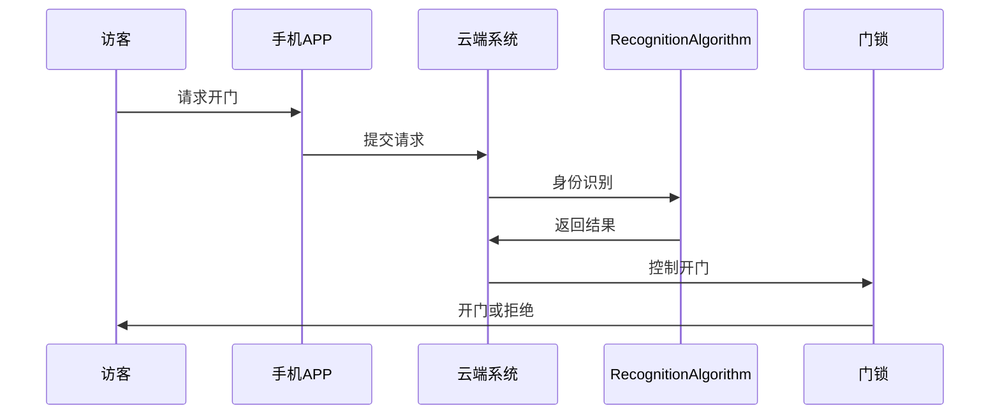

                 


# AI Agent在智能门把手中的访客识别

> 关键词：AI Agent，智能门锁，访客识别，算法原理，系统架构，项目实战

> 摘要：本文详细探讨了AI Agent在智能门把手中访客识别的应用，从背景介绍、核心概念、算法原理、系统架构设计到项目实战，全面分析了AI Agent在智能门锁中的技术实现与应用价值。文章通过具体案例分析，深入浅出地解释了AI Agent在访客识别中的作用，并提供了详细的代码实现和系统设计，为读者提供了从理论到实践的完整指南。

---

# 第1章: 智能门锁与访客识别的背景介绍

## 1.1 问题背景与描述

### 1.1.1 智能门锁的发展历程
智能门锁从最初的机械锁发展到电子锁，再到如今的智能门锁，经历了技术的不断升级。传统门锁依赖钥匙，存在易丢失、被复制等问题。随着物联网和人工智能技术的发展，智能门锁逐渐成为智能家居的重要组成部分。

### 1.1.2 访客识别的必要性与应用场景
访客识别技术在智能门锁中的应用，可以提高安全性。例如，访客通过手机APP请求开门，系统需要识别其身份，确认其是否有开门权限。应用场景包括家庭、办公室、酒店等场所。

### 1.1.3 当前访客识别技术的痛点与挑战
当前访客识别技术主要依赖密码、指纹、刷卡等传统方式，存在易被破解、不方便等问题。AI Agent的引入可以解决这些问题，但同时也面临数据隐私、算法优化等挑战。

## 1.2 AI Agent的核心概念与问题解决

### 1.2.1 AI Agent的定义与特点
AI Agent是一种能够感知环境并采取行动以实现目标的智能体。它具有自主性、反应性、社交性等特点，能够适应复杂环境的变化。

### 1.2.2 AI Agent在访客识别中的问题解决思路
AI Agent通过感知环境（如访客身份信息）、分析数据（如通过人脸识别技术）、做出决策（如开门或拒绝），解决了传统访客识别技术的痛点。

### 1.2.3 AI Agent的边界与外延
AI Agent的应用边界包括硬件设备的限制、算法精度的限制等。其外延则涉及边缘计算、隐私保护等技术的发展。

## 1.3 本章小结
本章通过介绍智能门锁的发展历程，分析了访客识别技术的必要性与应用场景，并详细阐述了AI Agent的核心概念与问题解决思路，为后续的技术实现奠定了基础。

---

# 第2章: AI Agent与智能门锁的核心概念与联系

## 2.1 核心概念原理

### 2.1.1 AI Agent的基本原理
AI Agent通过感知环境、分析数据、做出决策来实现目标。例如，通过摄像头采集访客图像，利用人脸识别算法提取特征，判断是否为授权用户。

### 2.1.2 智能门锁的工作原理
智能门锁通过物联网技术连接到云端，当访客请求开门时，系统会验证其身份信息，确认是否有开门权限。

### 2.1.3 访客识别的核心算法原理
访客识别的核心算法包括特征提取（如人脸识别）、分类器设计（如支持向量机、神经网络）等。

## 2.2 核心概念属性特征对比

### 2.2.1 AI Agent与传统门锁的对比分析
| 特性       | AI Agent智能门锁 | 传统门锁 |
|------------|------------------|----------|
| 开锁方式     | 智能识别         | 钥匙/密码|
| 安全性       | 高               | 中/低    |
| 可扩展性     | 高               | 低       |

### 2.2.2 访客识别技术的特征对比
| 技术         | 基于AI Agent的访客识别 | 传统访客识别 |
|--------------|-----------------------|--------------|
| 精度         | 高                   | 中/低        |
| 适应性       | 强                   | 弱           |
| 扩展性       | 高                   | 低           |

### 2.2.3 AI Agent在访客识别中的优势
AI Agent能够通过学习不断提升识别精度，支持多种识别方式（如人脸识别、行为分析），并且可以与其他智能设备联动。

## 2.3 ER实体关系图架构

### 2.3.1 实体关系图的定义与作用
ER实体关系图用于描述系统中的实体及其关系。例如，用户、设备、权限、请求等实体之间的关系。

### 2.3.2 AI Agent与智能门锁的实体关系图
```mermaid
er
actor(访客) --> User(用户): 请求开门
User --> DoorLock(智能门锁): 授权开门
DoorLock --> RecognitionAlgorithm(识别算法): 识别访客
```

### 2.3.3 访客识别系统的实体关系图
```mermaid
er
Actor(访客) --> User(用户): 请求开门
User --> Permission(权限): 验证权限
Permission --> DoorLock(智能门锁): 控制开门
DoorLock --> RecognitionAlgorithm(识别算法): 识别访客
```

## 2.4 本章小结
本章通过对比分析，详细阐述了AI Agent与智能门锁的核心概念与联系，展示了AI Agent在访客识别中的优势和应用场景。

---

# 第3章: AI Agent在访客识别中的算法原理

## 3.1 算法原理流程图

### 3.1.1 算法整体流程图


### 3.1.2 特征提取流程图


### 3.1.3 分类器设计流程图


## 3.2 数学模型与公式

### 3.2.1 特征提取的数学模型
$$ y = f(x) $$
其中，$x$是输入图像，$y$是提取的特征向量。

### 3.2.2 分类器的数学模型
$$ P(y|x) = \frac{P(x|y)P(y)}{P(x)} $$
其中，$P(y|x)$是后验概率，表示访客为授权用户的概率。

### 3.2.3 算法优化的数学模型
$$ \theta = \theta - \alpha \frac{\partial L}{\partial \theta} $$
其中，$\theta$是模型参数，$\alpha$是学习率，$L$是损失函数。

## 3.3 算法实现与代码示例

### 3.3.1 Python代码实现
```python
def feature_extraction(image):
    # 图像预处理
    gray = cv2.cvtColor(image, cv2.COLOR_BGR2GRAY)
    # 提取特征
    features = cv2.face.LBPHFaceRecognizer_create().extract_feature(gray)
    return features

def classification(features):
    # 分类器预测
    model = SVC(gamma='auto')
    model.fit(train_features, train_labels)
    prediction = model.predict(features)
    return prediction
```

### 3.3.2 算法优化与调优
通过调整分类器参数（如支持向量机的核函数）、增加训练数据量、优化特征提取算法等方式，可以提高识别精度。

## 3.4 本章小结
本章详细讲解了AI Agent在访客识别中的算法原理，通过流程图、数学公式和代码实现，帮助读者理解其技术细节。

---

# 第4章: AI Agent在智能门锁中的系统架构设计

## 4.1 问题场景介绍

### 4.1.1 问题描述
用户通过手机APP请求开门，系统需要验证其身份，确认是否有开门权限。

### 4.1.2 问题约束条件
- 系统需要支持多种识别方式（如人脸识别、指纹识别）
- 系统需要实时响应，保证用户体验
- 系统需要保证数据安全性

## 4.2 项目介绍

### 4.2.1 项目目标
实现一个基于AI Agent的智能门锁系统，能够通过访客识别技术验证用户身份，控制门锁的开启。

### 4.2.2 项目范围
- 系统设计：包括硬件设备、软件系统、用户界面
- 功能需求：访客识别、权限管理、开门控制
- 非功能需求：安全性、实时性、可扩展性

## 4.3 系统功能设计

### 4.3.1 领域模型（类图）


### 4.3.2 系统架构设计（架构图）


### 4.3.3 系统接口设计
- 用户端接口：手机APP提交开门请求
- 服务端接口：接收请求，验证用户身份，控制门锁

### 4.3.4 系统交互设计（序列图）


## 4.4 本章小结
本章通过系统架构设计，详细阐述了AI Agent在智能门锁中的实现方式，展示了系统的各个模块及其交互关系。

---

# 第5章: AI Agent在智能门锁中的项目实战

## 5.1 环境安装与配置

### 5.1.1 环境需求
- Python 3.6+
- OpenCV库
- scikit-learn库
- MQTT协议支持

### 5.1.2 安装步骤
1. 安装Python和必要的库：
   ```bash
   pip install numpy opencv-python scikit-learn
   ```
2. 安装MQTT协议支持：
   ```bash
   pip install paho-mqtt
   ```

## 5.2 系统核心实现

### 5.2.1 访客识别模块实现
```python
import cv2
import numpy as np

def feature_extraction(image):
    gray = cv2.cvtColor(image, cv2.COLOR_BGR2GRAY)
    features = cv2.face.LBPHFaceRecognizer_create().extract_feature(gray)
    return features

def classification(features):
    model = SVC(gamma='auto')
    model.fit(train_features, train_labels)
    prediction = model.predict(features)
    return prediction
```

### 5.2.2 系统控制模块实现
```python
import paho.mqtt.client as mqtt

def on_connect(client, userdata, flags, rc):
    print("Connected with result code " + str(rc))
    client.subscribe("door_lock/request")

def on_message(client, userdata, msg):
    # 处理请求
    request = msg.payload.decode()
    # 调用识别算法
    result = classification(feature_extraction(request))
    # 发送响应
    client.publish("door_lock/response", str(result))

client = mqtt.Client()
client.on_connect = on_connect
client.on_message = on_message
client.connect("localhost", 1883, 60)
client.loop_forever()
```

### 5.2.3 系统配置与测试
1. 配置MQTT Broker：
   ```bash
   mosquitto -v
   ```
2. 测试识别模块：
   ```bash
   python test.py
   ```

## 5.3 项目小结
本章通过实际案例分析，详细讲解了AI Agent在智能门锁中的实现过程，展示了从环境安装到代码实现的完整流程。

---

# 第6章: 总结与展望

## 6.1 总结
本文详细探讨了AI Agent在智能门把手中访客识别的应用，从背景介绍、核心概念、算法原理到系统架构设计和项目实战，全面分析了其技术实现与应用价值。

## 6.2 展望
未来，随着AI技术的不断发展，AI Agent在智能门锁中的应用将更加广泛。例如，通过边缘计算提升识别速度，通过隐私保护技术增强数据安全性。

## 6.3 最佳实践 tips
- 在实际应用中，建议采用多模态识别技术（如人脸识别+指纹识别）提高安全性。
- 定期更新模型，保持识别精度。

## 6.4 本章小结
本文通过总结与展望，强调了AI Agent在智能门锁中的重要性，并为未来的研究方向提供了参考。

---

# 作者信息

作者：AI天才研究院/AI Genius Institute & 禅与计算机程序设计艺术 /Zen And The Art of Computer Programming

---

本文通过系统性的分析和详细的代码实现，为读者提供了从理论到实践的完整指南。

