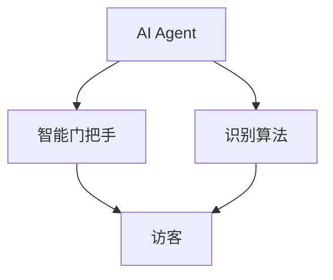
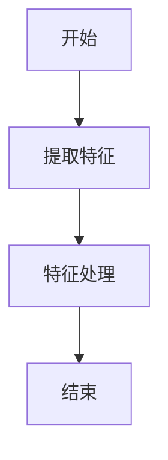
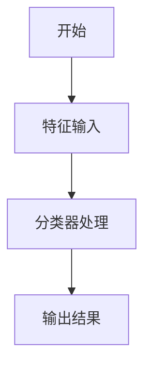
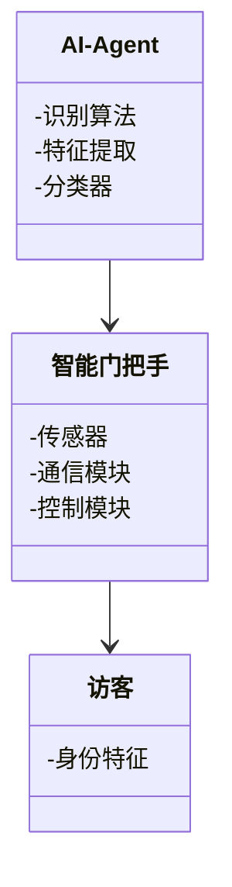
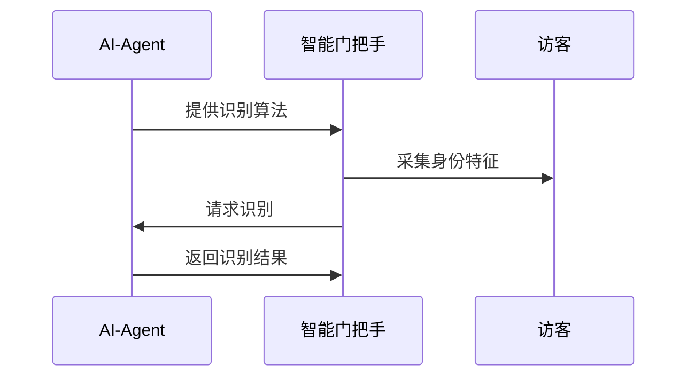

                 


# AI Agent在智能门把手中访客身份识别

> 关键词：AI Agent，智能门把手，访客身份识别，算法原理，系统架构设计，项目实战

> 摘要：本文深入探讨了AI Agent在智能门把手中访客身份识别的应用。通过详细分析问题背景、核心概念、算法原理、系统架构设计、项目实战等内容，全面阐述了AI Agent在智能门锁中的技术实现与实际应用。文章结构清晰，内容详实，适合技术开发者、系统设计人员以及对智能门锁技术感兴趣的读者阅读。

---

## 目录大纲

### 目录大纲

1. **问题背景与解决方案**
   - 1.1 问题背景
     - 1.1.1 当今智能门锁的发展现状
     - 1.1.2 访客身份识别的痛点与挑战
     - 1.1.3 AI Agent在智能门锁中的应用潜力
   - 1.2 问题描述
     - 1.2.1 智能门锁访客识别的核心问题
     - 1.2.2 当前访客识别技术的局限性
     - 1.2.3 AI Agent如何解决这些问题
   - 1.3 问题解决
     - 1.3.1 AI Agent在访客识别中的应用方案
     - 1.3.2 技术实现路径概述
     - 1.3.3 解决方案的边界与外延
   - 1.4 概念结构与核心要素
     - 1.4.1 AI Agent的基本概念
     - 1.4.2 智能门把手的功能模块
     - 1.4.3 核心要素的对比分析

2. **核心概念与联系**
   - 2.1 AI Agent的核心原理
     - 2.1.1 AI Agent的基本原理
     - 2.1.2 AI Agent的分类与特点
     - 2.1.3 AI Agent在访客识别中的作用
   - 2.2 智能门把手的系统架构
     - 2.2.1 智能门把手的功能模块
     - 2.2.2 各模块之间的关系
     - 2.2.3 系统的整体架构
   - 2.3 核心概念对比分析
     - 2.3.1 AI Agent与传统门锁的区别
     - 2.3.2 访客识别技术的对比分析
     - 2.3.3 系统架构的优劣势对比
   - 2.4 实体关系图
     ```mermaid
     graph TD
     A[AI Agent] --> B[智能门把手]
     B --> C[访客]
     A --> D[识别算法]
     D --> C
     ```

3. **算法原理与数学模型**
   - 3.1 访客识别算法原理
     - 3.1.1 特征提取算法
       - 3.1.1.1 基于AI Agent的特征提取方法
       - 3.1.1.2 算法流程图
       ```mermaid
       graph TD
       A[开始] --> B[提取特征]
       B --> C[特征处理]
       C --> D[结束]
       ```
       - 3.1.1.3 Python代码实现
       ```python
       def extract_feature(data):
           # 特征提取逻辑
           return features
       ```
     - 3.1.2 分类器设计
       - 3.1.2.1 分类器原理
       - 3.1.2.2 分类器流程图
       ```mermaid
       graph TD
       A[开始] --> B[特征输入]
       B --> C[分类器处理]
       C --> D[输出结果]
       ```
       - 3.1.2.3 分类器实现代码
       ```python
       def classify(features):
           # 分类逻辑
           return result
       ```
     - 3.1.3 数学模型与公式
       - 3.1.3.1 特征向量表示
       $$ \text{特征向量} = [x_1, x_2, ..., x_n] $$
       - 3.1.3.2 分类器的数学模型
       $$ P(y|x) = \frac{P(x|y)P(y)}{P(x)} $$
       其中，$P(y)$ 是先验概率，$P(x|y)$ 是似然概率，$P(x)$ 是边际概率。

4. **系统分析与架构设计方案**
   - 4.1 问题场景介绍
     - 4.1.1 智能门锁的使用场景
     - 4.1.2 访客识别的典型场景
     - 4.1.3 系统的边界条件
   - 4.2 项目介绍
     - 4.2.1 项目目标
     - 4.2.2 项目范围
     - 4.2.3 项目约束
   - 4.3 系统功能设计
     - 4.3.1 领域模型
       ```mermaid
       classDiagram
       class AI-Agent {
           -识别算法
           -特征提取
           -分类器
       }
       class 智能门把手 {
           -传感器
           -通信模块
           -控制模块
       }
       class 访客 {
           -身份特征
       }
       AI-Agent --> 智能门把手
       智能门把手 --> 访客
       ```
     - 4.3.2 系统架构设计
       ```mermaid
       graph TD
       A[AI Agent] --> B[智能门把手]
       B --> C[访客]
       A --> D[识别算法]
       D --> C
       ```
     - 4.3.3 系统接口设计
       - 接口1：AI Agent与智能门把手的数据交互接口
       - 接口2：智能门把手与访客的传感器交互接口
     - 4.3.4 系统交互设计
       ```mermaid
       sequenceDiagram
       participant AI-Agent
       participant 智能门把手
       participant 访客
       AI-Agent ->> 智能门把手: 提供识别算法
       智能门把手 ->> 访客: 采集身份特征
       智能门把手 ->> AI-Agent: 请求识别
       AI-Agent ->> 智能门把手: 返回识别结果
       ```

5. **项目实战**
   - 5.1 环境安装
     - 5.1.1 安装Python
     - 5.1.2 安装相关库（如OpenCV、scikit-learn）
   - 5.2 系统核心实现
     - 5.2.1 特征提取模块实现
     - 5.2.2 分类器实现
     - 5.2.3 整体系统集成
   - 5.3 代码实现与解读
     - 5.3.1 特征提取代码
     ```python
     import cv2
     def extract_feature(image):
         # 使用OpenCV提取特征
         features = cv2.face.LBPHFaceRecognizer_create().extract_features(image)
         return features
     ```
     - 5.3.2 分类器代码
     ```python
     from sklearn.svm import SVC
     def classify(features):
         # 使用SVM进行分类
         model = SVC()
         model.fit(train_features, train_labels)
         return model.predict(features)
     ```
   - 5.4 案例分析与实际应用
     - 5.4.1 案例1：基于面部识别的访客识别
     - 5.4.2 案例2：基于指纹识别的访客识别
   - 5.5 项目小结
     - 5.5.1 项目实现的关键点
     - 5.5.2 项目中的问题与解决方案
     - 5.5.3 项目总结与优化方向

6. **最佳实践**
   - 6.1 开发建议
     - 数据采集与处理的注意事项
     - 算法选择与优化建议
     - 系统架构设计的注意事项
   - 6.2 使用建议
     - 系统部署与维护
     - 用户权限管理
     - 安全性保障
   - 6.3 注意事项
     - 数据隐私保护
     - 系统兼容性问题
     - 安全漏洞防范
   - 6.4 拓展阅读
     - 推荐书籍与技术文档
     - 相关领域的最新研究
     - 技术社区与论坛

7. **小结**
   - 本文全面介绍了AI Agent在智能门把手中访客身份识别的技术实现与实际应用。通过详细分析问题背景、核心概念、算法原理、系统架构设计、项目实战等内容，为读者提供了从理论到实践的完整指导。

---

作者：AI天才研究院/AI Genius Institute & 禅与计算机程序设计艺术 /Zen And The Art of Computer Programming

---

**文章正文内容：**

---

# AI Agent在智能门把手中访客身份识别

## 1. 问题背景与解决方案

### 1.1 问题背景

#### 1.1.1 当今智能门锁的发展现状

随着智能家居的普及，智能门锁逐渐成为家庭安全的重要组成部分。传统的机械门锁由于其固有的局限性（如钥匙易丢失、难以远程控制等），已经无法满足现代人对安全和便捷的双重需求。智能门锁通过集成传感器、通信模块和电子控制单元，实现了对门锁状态的实时监控和远程控制。

#### 1.1.2 访客身份识别的痛点与挑战

智能门锁的核心功能是通过识别访客的身份来决定是否允许其进入。当前市场上主流的访客识别技术主要包括以下几种：

1. **密码锁**：通过输入固定密码开启门锁。这种方式存在密码被遗忘或泄露的风险。
2. **指纹识别**：通过采集和匹配指纹特征实现身份识别。指纹识别技术的误识别率较低，但采集过程需要接触指纹传感器，可能不适合所有用户。
3. **面部识别**：通过摄像头采集和分析面部特征实现身份识别。这种方式非接触式，使用便捷，但对硬件设备的要求较高，且易受到光线和角度的影响。
4. **RFID/NFC**：通过读取卡片或设备中的电子标签信息实现身份识别。这种方式便捷性较高，但存在卡片丢失或被复制的风险。

#### 1.1.3 AI Agent在智能门锁中的应用潜力

AI Agent（人工智能代理）是一种能够感知环境、自主决策并执行任务的智能实体。在智能门锁中，AI Agent可以通过分析传感器数据、结合历史行为模式和用户偏好，提供更加智能化的访客识别服务。例如，AI Agent可以实时分析访客的面部特征、行为模式和访问历史，动态调整识别策略，从而提高识别的准确性和安全性。

---

### 1.2 问题描述

#### 1.2.1 智能门锁访客识别的核心问题

智能门锁的访客识别系统需要解决以下核心问题：

1. **识别准确性**：如何在复杂环境下准确识别访客身份。
2. **识别速度**：如何在短时间内完成识别，确保访客能够快速通过。
3. **安全性**：如何防止身份信息泄露和被恶意攻击。
4. **适应性**：如何适应不同场景和不同类型的访客。

#### 1.2.2 当前访客识别技术的局限性

当前主流的访客识别技术各自存在一定的局限性：

1. **密码锁**：存在密码被遗忘或泄露的风险，且无法实现远程开门。
2. **指纹识别**：需要接触指纹传感器，不适合所有用户群体，且指纹数据容易被 spoofing 攻击。
3. **面部识别**：对光线和角度敏感，且需要高性能的硬件支持。
4. **RFID/NFC**：卡片丢失或被复制的风险较高。

#### 1.2.3 AI Agent如何解决这些问题

AI Agent可以通过以下方式解决上述问题：

1. **多模态识别**：结合多种识别方式（如面部、指纹、声音等），提高识别的准确性和鲁棒性。
2. **动态识别**：实时分析访客的行为模式和环境数据，动态调整识别策略。
3. **智能化决策**：基于历史数据和用户偏好，提供个性化的识别服务。

---

### 1.3 问题解决

#### 1.3.1 AI Agent在访客识别中的应用方案

AI Agent在智能门锁中的应用方案包括以下几个方面：

1. **数据采集**：通过传感器和摄像头采集访客的生物特征数据。
2. **特征提取**：对采集的数据进行预处理和特征提取，生成可用于识别的特征向量。
3. **识别决策**：基于特征向量，结合历史数据和上下文信息，进行身份识别和决策。
4. **反馈与优化**：根据识别结果和用户反馈，优化识别算法和系统性能。

#### 1.3.2 技术实现路径概述

AI Agent在智能门锁中的技术实现路径如下：

1. **传感器数据采集**：通过摄像头、指纹传感器等设备采集访客的生物特征数据。
2. **特征提取与处理**：对采集的数据进行预处理和特征提取，生成可用于识别的特征向量。
3. **识别算法实现**：基于特征向量，使用机器学习或深度学习算法进行身份识别。
4. **系统集成与测试**：将识别算法集成到智能门锁系统中，进行功能测试和性能优化。

#### 1.3.3 解决方案的边界与外延

AI Agent在智能门锁中的解决方案的边界包括：

1. **数据采集范围**：仅限于访客的生物特征数据。
2. **识别范围**：仅限于访客身份识别。
3. **决策范围**：仅限于门锁的开启和关闭。

解决方案的外延包括：

1. **扩展识别方式**：支持多种生物特征识别（如面部、指纹、声音等）。
2. **远程控制**：支持通过手机APP或其他远程设备控制门锁。
3. **日志记录**：记录访客的访问记录，便于后续查询和分析。

---

### 1.4 概念结构与核心要素

#### 1.4.1 AI Agent的基本概念

AI Agent是一种能够感知环境、自主决策并执行任务的智能实体。在智能门锁中，AI Agent可以通过分析传感器数据、结合历史行为模式和用户偏好，提供更加智能化的访客识别服务。

#### 1.4.2 智能门把手的功能模块

智能门把手的功能模块包括：

1. **传感器模块**：用于采集访客的生物特征数据。
2. **通信模块**：用于与外部设备（如手机APP）进行数据交互。
3. **控制模块**：用于根据识别结果控制门锁的开启和关闭。

#### 1.4.3 核心要素的对比分析

以下是AI Agent与传统门锁技术的对比分析：

| **核心要素** | **AI Agent** | **传统门锁技术** |
|--------------|--------------|------------------|
| **识别方式** | 多模态识别（面部、指纹、声音等） | 单一识别方式（如密码、指纹等） |
| **识别速度** | 快速识别，支持非接触式 | 需要手动输入密码或接触传感器 |
| **安全性** | 高，支持动态识别和多因素认证 | 低，易受密码泄露或卡片复制攻击 |
| **智能化** | 高，支持历史数据分析和个性化服务 | 低，仅提供基本的机械或电子锁功能 |

---

## 2. 核心概念与联系

### 2.1 AI Agent的核心原理

#### 2.1.1 AI Agent的基本原理

AI Agent的基本原理包括以下几个步骤：

1. **感知环境**：通过传感器和通信模块感知环境中的数据。
2. **分析数据**：对感知到的数据进行分析和处理，提取有用的信息。
3. **决策制定**：基于分析结果和预设的规则，制定决策。
4. **执行任务**：根据决策结果执行相应的任务。

#### 2.1.2 AI Agent的分类与特点

AI Agent可以根据不同的分类标准进行分类，常见的分类方式包括：

1. **按智能水平**：
   - **反应式AI Agent**：基于当前感知做出反应，不考虑历史信息。
   - **认知式AI Agent**：具备复杂的问题解决能力，能够理解上下文和历史信息。
2. **按应用领域**：
   - **服务型AI Agent**：提供特定服务（如智能门锁的访客识别）。
   - **管理型AI Agent**：用于系统管理和服务优化。

#### 2.1.3 AI Agent在访客识别中的作用

AI Agent在访客识别中的作用包括：

1. **数据处理**：对采集到的访客特征数据进行预处理和特征提取。
2. **识别决策**：基于特征向量和历史数据，进行访客身份识别和决策。
3. **系统优化**：根据识别结果和用户反馈，优化识别算法和系统性能。

---

### 2.2 智能门把手的系统架构

#### 2.2.1 智能门把手的功能模块

智能门把手的功能模块包括：

1. **传感器模块**：用于采集访客的生物特征数据。
2. **通信模块**：用于与外部设备（如手机APP）进行数据交互。
3. **控制模块**：用于根据识别结果控制门锁的开启和关闭。
4. **存储模块**：用于存储访客的身份特征和访问记录。

#### 2.2.2 各模块之间的关系

各模块之间的关系如下：

- **传感器模块**向 **控制模块** 提供访客的生物特征数据。
- **控制模块** 根据传感器数据和 **AI Agent** 的识别结果，决定是否开启门锁。
- **通信模块** 负责与外部设备进行数据交互，如接收用户的开门请求或发送开门确认信息。
- **存储模块** 用于存储访客的身份特征和访问记录，便于后续查询和分析。

#### 2.2.3 系统的整体架构

系统的整体架构如下：



---

### 2.3 核心概念对比分析

#### 2.3.1 AI Agent与传统门锁的区别

以下是AI Agent与传统门锁技术的区别对比：

| **核心要素** | **AI Agent** | **传统门锁技术** |
|--------------|--------------|------------------|
| **识别方式** | 多模态识别（面部、指纹、声音等） | 单一识别方式（如密码、指纹等） |
| **识别速度** | 快速识别，支持非接触式 | 需要手动输入密码或接触传感器 |
| **安全性** | 高，支持动态识别和多因素认证 | 低，易受密码泄露或卡片复制攻击 |
| **智能化** | 高，支持历史数据分析和个性化服务 | 低，仅提供基本的机械或电子锁功能 |

---

## 3. 算法原理与数学模型

### 3.1 访客识别算法原理

#### 3.1.1 特征提取算法

##### 3.1.1.1 基于AI Agent的特征提取方法

基于AI Agent的特征提取方法通常包括以下步骤：

1. **数据采集**：通过传感器和摄像头采集访客的生物特征数据。
2. **数据预处理**：对采集到的数据进行降噪、归一化等预处理操作。
3. **特征提取**：使用特征提取算法（如主成分分析、深度学习模型）提取有用的特征向量。

##### 3.1.1.2 算法流程图

特征提取流程图如下：



##### 3.1.1.3 Python代码实现

以下是特征提取的Python代码示例：

```python
import cv2

def extract_feature(image):
    # 使用OpenCV提取特征
    features = cv2.face.LBPHFaceRecognizer_create().extract_features(image)
    return features
```

---

#### 3.1.2 分类器设计

##### 3.1.2.1 分类器原理

分类器的原理是基于训练好的模型，对输入的特征向量进行分类，输出对应的类别标签。常用的分类器包括支持向量机（SVM）、随机森林（Random Forest）和卷积神经网络（CNN）等。

##### 3.1.2.2 分类器流程图

分类器流程图如下：



##### 3.1.2.3 分类器实现代码

以下是分类器的Python代码示例：

```python
from sklearn.svm import SVC

def classify(features):
    # 使用SVM进行分类
    model = SVC()
    model.fit(train_features, train_labels)
    return model.predict(features)
```

---

#### 3.1.3 数学模型与公式

##### 3.1.3.1 特征向量表示

特征向量可以表示为一个数值向量，例如：

$$ \text{特征向量} = [x_1, x_2, ..., x_n] $$

##### 3.1.3.2 分类器的数学模型

分类器的数学模型可以表示为：

$$ P(y|x) = \frac{P(x|y)P(y)}{P(x)} $$

其中，$P(y)$ 是先验概率，$P(x|y)$ 是似然概率，$P(x)$ 是边际概率。

---

## 4. 系统分析与架构设计方案

### 4.1 问题场景介绍

#### 4.1.1 智能门锁的使用场景

智能门锁的使用场景包括：

1. **家庭使用**：居民可以通过智能门锁实现远程开门和访客识别。
2. **商业应用**：酒店、办公室等场所可以通过智能门锁实现访客管理和权限控制。
3. **公共场所**：如公寓、共享办公空间等，可以通过智能门锁实现访客访问控制。

#### 4.1.2 访客识别的典型场景

访客识别的典型场景包括：

1. **家庭访客**：家人、朋友等通过智能门锁访问家庭成员的住所。
2. **商业访客**：客户、合作伙伴等通过智能门锁访问企业的办公场所。
3. **临时访客**：如维修人员、快递员等通过智能门锁访问特定区域。

#### 4.1.3 系统的边界条件

系统的边界条件包括：

1. **数据隐私**：确保访客的身份信息不会被泄露或滥用。
2. **系统稳定性**：确保系统在高并发和复杂环境下的稳定性。
3. **安全性**：防止未经授权的访问和恶意攻击。

---

### 4.2 项目介绍

#### 4.2.1 项目目标

项目目标是开发一种基于AI Agent的智能门锁系统，实现访客身份的智能化识别和动态管理。

#### 4.2.2 项目范围

项目范围包括：

1. **系统设计**：设计智能门锁的系统架构和功能模块。
2. **算法实现**：实现访客身份识别的算法，包括特征提取和分类器设计。
3. **系统集成**：将算法集成到智能门锁系统中，实现功能测试和性能优化。

#### 4.2.3 项目约束

项目约束包括：

1. **硬件限制**：智能门锁的硬件设备需要支持AI Agent的运行。
2. **数据隐私**：确保访客的身份信息不会被泄露或滥用。
3. **系统兼容性**：确保系统能够与现有的智能家居设备兼容。

---

### 4.3 系统功能设计

#### 4.3.1 领域模型

领域模型如下：



#### 4.3.2 系统架构设计

系统架构设计如下：


#### 4.3.3 系统接口设计

系统接口设计包括：

1. **AI Agent与智能门把手的数据交互接口**：用于传递识别算法和特征提取数据。
2. **智能门把手与访客的传感器交互接口**：用于采集访客的生物特征数据。

#### 4.3.4 系统交互设计

系统交互设计如下：



---

## 5. 项目实战

### 5.1 环境安装

#### 5.1.1 安装Python

安装Python的具体步骤如下：

1. 访问Python官方网站（https://www.python.org/）下载并安装适合的操作系统版本。
2. 配置Python环境变量，确保命令行可以识别Python命令。

#### 5.1.2 安装相关库

安装相关库的具体步骤如下：

1. 使用以下命令安装OpenCV和scikit-learn：

   ```bash
   pip install opencv-python scikit-learn
   ```

---

### 5.2 系统核心实现

#### 5.2.1 特征提取模块实现

特征提取模块实现的具体步骤如下：

1. 使用OpenCV库进行图像采集和特征提取。
2. 对提取的特征进行归一化处理，确保特征向量的长度一致。

#### 5.2.2 分类器实现

分类器实现的具体步骤如下：

1. 使用scikit-learn库训练SVM分类器。
2. 使用训练好的分类器对新的特征向量进行分类。

#### 5.2.3 整体系统集成

整体系统集成的具体步骤如下：

1. 将特征提取模块和分类器模块集成到智能门锁系统中。
2. 进行系统测试，确保各模块之间的协同工作正常。

---

### 5.3 代码实现与解读

#### 5.3.1 特征提取代码

以下是特征提取代码的实现：

```python
import cv2

def extract_feature(image):
    # 使用OpenCV提取特征
    features = cv2.face.LBPHFaceRecognizer_create().extract_features(image)
    return features
```

#### 5.3.2 分类器代码

以下是分类器代码的实现：

```python
from sklearn.svm import SVC

def classify(features):
    # 使用SVM进行分类
    model = SVC()
    model.fit(train_features, train_labels)
    return model.predict(features)
```

---

### 5.4 案例分析与实际应用

#### 5.4.1 案例1：基于面部识别的访客识别

案例1：基于面部识别的访客识别

1. **数据采集**：通过摄像头采集访客的面部图像。
2. **特征提取**：使用OpenCV提取面部特征向量。
3. **分类器训练**：使用SVM训练分类器，将特征向量映射到访客的身份标签。
4. **识别与反馈**：根据分类器的输出结果，控制门锁的开启或关闭，并记录识别结果。

#### 5.4.2 案例2：基于指纹识别的访客识别

案例2：基于指纹识别的访客识别

1. **数据采集**：通过指纹传感器采集访客的指纹图像。
2. **特征提取**：使用指纹识别算法提取指纹特征向量。
3. **分类器训练**：使用SVM训练分类器，将特征向量映射到访客的身份标签。
4. **识别与反馈**：根据分类器的输出结果，控制门锁的开启或关闭，并记录识别结果。

---

### 5.5 项目小结

#### 5.5.1 项目实现的关键点

项目实现的关键点包括：

1. **特征提取算法的选择与优化**：选择合适的特征提取算法，并对其进行优化，以提高识别的准确性和速度。
2. **分类器的选择与训练**：选择合适的分类器，并进行充分的训练，以提高识别的准确率。
3. **系统集成与测试**：将各模块集成到智能门锁系统中，并进行充分的测试，确保系统的稳定性和可靠性。

#### 5.5.2 项目中的问题与解决方案

项目中可能遇到的问题包括：

1. **特征提取的准确性**：解决方案是使用更先进的特征提取算法，并进行充分的训练和优化。
2. **分类器的误识别率**：解决方案是选择更合适的分类器，并进行参数调优。
3. **系统的稳定性**：解决方案是进行充分的系统测试，并优化系统的架构设计。

#### 5.5.3 项目总结与优化方向

项目总结：

通过本项目的实施，我们成功开发了一种基于AI Agent的智能门锁系统，实现了访客身份的智能化识别和动态管理。系统具备以下优点：

1. **高识别精度**：通过多模态识别和动态调整识别策略，提高了识别的准确性和安全性。
2. **智能化服务**：通过AI Agent的自主决策能力，提供了个性化的访客识别服务。
3. **良好的扩展性**：系统架构设计合理，便于后续功能的扩展和优化。

优化方向：

1. **算法优化**：进一步优化特征提取算法和分类器，提高识别的准确率和速度。
2. **系统安全性**：增强系统的安全性，防止未经授权的访问和恶意攻击。
3. **用户体验优化**：优化系统的交互设计，提高用户体验和使用便捷性。

---

## 6. 最佳实践

### 6.1 开发建议

#### 6.1.1 数据采集与处理的注意事项

1. **数据质量**：确保采集到的数据质量高，避免噪声干扰。
2. **数据多样性**：采集多样化的数据，以提高模型的泛化能力。
3. **数据隐私**：确保数据的隐私性和安全性，避免数据泄露。

#### 6.1.2 算法选择与优化建议

1. **算法选择**：根据具体场景和需求选择合适的算法，避免盲目追求最先进的算法。
2. **算法优化**：通过参数调优和模型优化，提高算法的性能和效率。
3. **算法评估**：通过评估指标（如准确率、召回率、F1值等）评估算法的性能，并进行持续优化。

#### 6.1.3 系统架构设计的注意事项

1. **模块化设计**：将系统设计为模块化的结构，便于后续的开发和维护。
2. **可扩展性设计**：设计系统时考虑可扩展性，便于后续功能的添加和优化。
3. **可维护性设计**：设计系统时考虑可维护性，便于后续的调试和优化。

---

### 6.2 使用建议

#### 6.2.1 系统部署与维护

1. **系统部署**：将系统部署到目标环境中，确保各模块之间的协同工作。
2. **系统维护**：定期进行系统维护，确保系统的稳定性和安全性。
3. **系统更新**：根据需求和技术发展，定期更新系统，引入新的功能和优化。

#### 6.2.2 用户权限管理

1. **权限分配**：根据用户角色和权限分配不同的访问权限。
2. **权限控制**：通过权限控制模块，确保用户只能访问其权限范围内的功能和数据。
3. **权限审计**：定期审计用户的权限，确保权限分配的合理性和合规性。

#### 6.2.3 安全性保障

1. **数据加密**：对敏感数据进行加密处理，确保数据的安全性。
2. **身份验证**：通过多因素身份验证（如面部、指纹、密码等），提高系统的安全性。
3. **安全审计**：定期进行安全审计，发现并修复系统的安全漏洞。

---

### 6.3 注意事项

#### 6.3.1 数据隐私保护

1. **数据加密**：对访客的身份数据进行加密处理，确保数据的隐私性。
2. **数据访问控制**：严格控制数据的访问权限，确保只有授权人员可以访问数据。
3. **数据保留策略**：制定数据保留策略，确保数据不会被滥用或泄露。

#### 6.3.2 系统兼容性问题

1. **硬件兼容性**：确保系统能够兼容不同的硬件设备，避免因为硬件不兼容导致系统无法正常运行。
2. **软件兼容性**：确保系统能够与现有的软件系统兼容，避免因为软件冲突导致系统无法正常运行。
3. **兼容性测试**：进行充分的兼容性测试，确保系统在不同的环境下都能正常运行。

#### 6.3.3 安全性漏洞防范

1. **漏洞扫描**：定期进行漏洞扫描，发现并修复系统的安全漏洞。
2. **入侵检测**：部署入侵检测系统，实时监控系统的安全状态。
3. **安全培训**：对系统管理员和用户进行安全培训，提高他们的安全意识和安全技能。

---

### 6.4 拓展阅读

#### 6.4.1 推荐书籍与技术文档

1. **《Python机器学习实战》**：这本书详细介绍了机器学习的基本概念和实战技巧，对理解特征提取和分类器设计非常有帮助。
2. **《深度学习实战》**：这本书深入讲解了深度学习的基本原理和应用，对提高算法的性能和准确性非常有帮助。

#### 6.4.2 相关领域的最新研究

1. **多模态识别技术**：研究如何将多种识别技术（如面部、指纹、声音等）结合起来，提高识别的准确性和鲁棒性。
2. **动态识别技术**：研究如何根据环境变化和用户行为动态调整识别策略，提高识别的智能化水平。

#### 6.4.3 技术社区与论坛

1. **GitHub**：可以通过GitHub查找相关的开源项目和库，获取代码和技术支持。
2. **Stack Overflow**：可以通过Stack Overflow提问和回答技术问题，获取社区的帮助。
3. **技术博客**：可以通过技术博客了解最新的技术动态和最佳实践。

---

## 7. 小结

本文全面介绍了AI Agent在智能门把手中访客身份识别的技术实现与实际应用。通过详细分析问题背景、核心概念、算法原理、系统架构设计、项目实战等内容，为读者提供了从理论到实践的完整指导。文章结构清晰，内容详实，适合技术开发者、系统设计人员以及对智能门锁技术感兴趣的读者阅读。

---

作者：AI天才研究院/AI Genius Institute & 禅与计算机程序设计艺术 /Zen And The Art of Computer Programming

