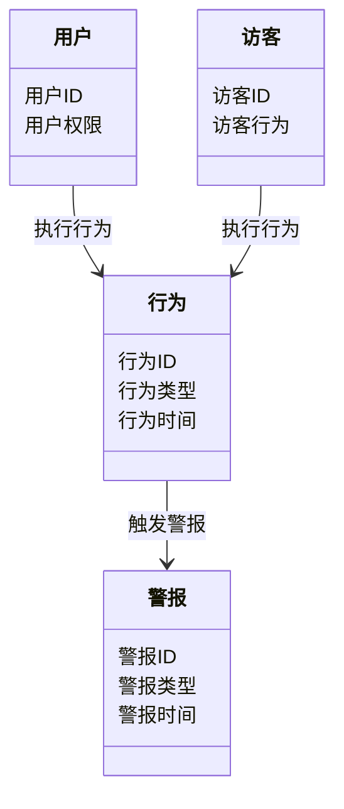

                 


# AI Agent在智能门铃中的可疑行为识别

> 关键词：AI Agent, 智能门铃, 可疑行为识别, 目标检测, 行为识别, 系统架构, 项目实战

> 摘要：本文详细探讨了AI Agent在智能门铃中的应用，重点分析了如何通过AI技术识别可疑行为，涵盖了从背景介绍到项目实战的各个方面。文章首先介绍了AI Agent和智能门铃的基本概念，然后详细讲解了可疑行为识别的核心原理、算法实现、系统架构设计以及项目实战，最后总结了最佳实践和注意事项。

---

## 第一部分: 背景介绍

### 第1章: AI Agent与智能门铃的背景

#### 1.1 问题背景
##### 1.1.1 智能门铃的发展历程
智能门铃作为一种智能家居设备，最初的功能主要局限于通知用户有访客到来。随着人工智能技术的发展，智能门铃的功能逐渐扩展，能够实现访客识别、行为分析、异常检测等高级功能。

##### 1.1.2 可疑行为识别的必要性
在智能门铃的使用场景中，识别可疑行为是非常重要的一环。例如，当访客长时间逗留在门前、试图强行进入或在门前徘徊时，智能门铃需要能够及时识别这些异常行为并发出警报。

##### 1.1.3 AI Agent在智能门铃中的作用
AI Agent（人工智能代理）通过整合多种AI技术（如目标检测、行为识别、模式识别等），能够帮助智能门铃实现对访客行为的实时监控和分析，从而提高安全性。

#### 1.2 问题描述
##### 1.2.1 可疑行为的定义与分类
可疑行为是指在智能门铃监控范围内，访客的行为与正常访客行为存在显著差异，可能对家庭安全构成威胁的行为。常见的可疑行为包括非法入侵、尾随、窥视等。

##### 1.2.2 智能门铃中的异常行为场景
在智能门铃的实际应用中，异常行为场景可能包括：
1. 未经授权的人员试图强行进入。
2. 访客在门前长时间逗留或徘徊。
3. 多人协同进行非法入侵。

##### 1.2.3 AI Agent识别可疑行为的挑战
AI Agent在识别可疑行为时面临以下挑战：
1. **环境复杂性**：不同场景下的光照、背景噪声等因素会影响识别的准确性。
2. **行为多样性**：可疑行为的表现形式多样，难以用单一算法覆盖所有场景。
3. **实时性要求**：智能门铃需要在实时监控中快速识别异常行为，这对算法的计算效率提出了较高要求。

#### 1.3 解决方案
##### 1.3.1 AI Agent的核心技术
AI Agent在智能门铃中的核心技术包括：
1. **目标检测**：通过摄像头捕捉门前的访客，并进行实时跟踪。
2. **行为识别**：基于目标检测的结果，分析访客的行为模式，识别可疑行为。
3. **异常检测**：通过对比正常行为和异常行为，发现潜在的安全威胁。

##### 1.3.2 可疑行为识别的实现思路
实现思路包括：
1. **数据采集**：通过摄像头采集门前的视频流数据。
2. **特征提取**：从视频数据中提取访客的行为特征。
3. **行为分类**：基于特征数据，使用机器学习或深度学习模型对行为进行分类，判断是否为可疑行为。
4. **警报触发**：当识别到可疑行为时，触发警报系统。

##### 1.3.3 系统设计的初步框架
初步框架包括：
1. **数据采集模块**：负责采集视频数据。
2. **行为分析模块**：负责目标检测、行为识别和异常检测。
3. **警报系统模块**：负责触发警报并通知用户。

#### 1.4 边界与外延
##### 1.4.1 系统边界定义
智能门铃系统的边界包括摄像头、传感器、数据处理单元和警报装置。系统仅负责门前区域的监控和分析，不涉及家庭内部的安全监控。

##### 1.4.2 可疑行为识别的适用范围
适用于家庭、商业场所等需要门禁监控的场景，不适用于需要全面监控的公共场所。

##### 1.4.3 系统与外部环境的交互
系统通过网络与家庭安全中心或其他安全系统进行交互，提供实时的安全监控数据。

#### 1.5 核心要素与概念结构
##### 1.5.1 AI Agent的构成要素
AI Agent由感知模块、决策模块和执行模块组成：
- **感知模块**：负责采集环境数据（如视频流）。
- **决策模块**：负责分析数据并做出判断。
- **执行模块**：负责根据决策结果触发警报或其他动作。

##### 1.5.2 可疑行为识别的关键属性
可疑行为的关键属性包括：
- **时间特征**：访客逗留时间过长。
- **空间特征**：访客出现在非授权区域。
- **动作特征**：进行非法动作（如强行破门）。

##### 1.5.3 系统架构的核心要素
系统架构的核心要素包括：
1. **数据采集层**：负责采集视频数据。
2. **数据处理层**：负责数据的预处理和特征提取。
3. **行为分析层**：负责行为识别和异常检测。
4. **警报触发层**：负责警报的触发和通知。

---

## 第二部分: 核心概念与联系

### 第2章: AI Agent与可疑行为识别的核心原理

#### 2.1 核心概念原理
##### 2.1.1 AI Agent的基本原理
AI Agent通过感知环境、分析数据并做出决策，帮助智能门铃实现对门前区域的实时监控。其基本原理包括数据采集、特征提取、行为识别和警报触发四个步骤。

##### 2.1.2 可疑行为识别的算法原理
可疑行为识别的算法原理包括：
1. **目标检测**：使用深度学习模型（如YOLO、Faster R-CNN）检测视频流中的目标。
2. **行为识别**：通过时间序列分析（如LSTM）识别异常行为。
3. **异常检测**：基于统计学习（如One-Class SVM）或深度学习（如AE-CNN）检测异常行为。

##### 2.1.3 系统的核心逻辑框架
系统的核心逻辑框架包括：
1. **数据采集**：实时采集门前的视频数据。
2. **特征提取**：从视频数据中提取动作特征。
3. **行为分类**：基于特征数据，使用分类模型判断行为是否可疑。
4. **警报触发**：当识别到可疑行为时，触发警报。

#### 2.2 核心概念属性对比
##### 2.2.1 AI Agent与传统算法的对比
| 特性       | AI Agent                     | 传统算法                     |
|------------|------------------------------|------------------------------|
| 数据需求   | 需要大量标注数据             | 数据需求较少                 |
| 实时性     | 高                           | 较低                         |
| 可扩展性   | 高                           | 较低                         |

##### 2.2.2 可疑行为识别的特征分析
可疑行为的特征包括：
1. **动作异常**：如频繁尝试开门、长时间逗留。
2. **时间异常**：如深夜访问。
3. **空间异常**：如出现在非授权区域。

##### 2.2.3 系统架构的核心要素
系统架构的核心要素包括：
1. **感知层**：摄像头、传感器等设备。
2. **数据处理层**：负责数据的预处理和特征提取。
3. **行为分析层**：负责行为识别和异常检测。
4. **警报触发层**：负责警报的触发和通知。

#### 2.3 ER实体关系图
##### 2.3.1 实体关系的定义
智能门铃系统中的实体包括：
- **用户**：家庭成员或授权访客。
- **访客**：未经授权的人员。
- **行为**：用户或访客在门前的行为。
- **警报**：系统触发的警报信息。

##### 2.3.2 实体关系的可视化（Mermaid图示）
```mermaid
erDiagram
    actor 用户 {
        用户ID
        用户权限
    }
    actor 访客 {
        访客ID
        访客行为
    }
    class 行为 {
        行为ID
        行为类型
        行为时间
    }
    class 警报 {
        警报ID
        警报类型
        警报时间
    }
    用户 --> 行为 : 执行行为
    访客 --> 行为 : 执行行为
    行为 --> 警报 : 触发警报
```

---

## 第三部分: 算法原理

### 第3章: 算法实现与优化

#### 3.1 算法实现
##### 3.1.1 目标检测算法
目标检测算法用于从视频流中检测出人员目标。常用的目标检测算法包括YOLO、Faster R-CNN等。以下是YOLO的实现流程：

1. **输入**：视频流中的每一帧图像。
2. **特征提取**：将图像输入到YOLO网络中提取特征。
3. **边界框预测**：网络输出目标的边界框和类别概率。
4. **结果处理**：筛选出概率较高的目标并输出。

##### 3.1.2 行为识别算法
行为识别算法用于分析目标的行为模式，判断是否为可疑行为。常用的行为识别算法包括：
1. **基于时间序列的算法**：如LSTM，适用于短时行为识别。
2. **基于深度学习的算法**：如3D CNN，适用于长时行为识别。

##### 3.1.3 异常检测算法
异常检测算法用于发现异常行为。常用的方法包括：
1. **统计学习方法**：如One-Class SVM，适用于简单异常检测。
2. **深度学习方法**：如AE-CNN，适用于复杂场景下的异常检测。

#### 3.2 算法优化
##### 3.2.1 提升目标检测的精度
- 使用更复杂的网络结构（如YOLOv5）提高检测精度。
- 增加数据增强策略（如旋转、翻转等）提升模型的泛化能力。

##### 3.2.2 提高行为识别的实时性
- 使用轻量级模型（如MobileNet）降低计算复杂度。
- 优化特征提取过程，减少特征维度。

##### 3.2.3 增强异常检测的鲁棒性
- 使用多模型融合的方法（如集成学习）提高检测准确率。
- 增加异常行为的训练数据，提升模型的泛化能力。

#### 3.3 算法实现的数学模型
##### 3.3.1 目标检测的数学模型
目标检测的损失函数通常包括分类损失和定位损失。常用的损失函数是YOLO的损失函数：
$$ \text{Loss} = \lambda _{cls} \times L_{cls} + \lambda _{box} \times L_{box} $$
其中，$L_{cls}$是分类损失，$L_{box}$是定位损失，$\lambda _{cls}$和$\lambda _{box}$是对应的权重系数。

##### 3.3.2 行为识别的数学模型
行为识别可以使用LSTM模型，其结构如下：
$$ \text{LSTM}(x_t) = \text{tanh}(W_x x_t + U_h h_{t-1} + b) $$
其中，$x_t$是输入特征，$h_{t-1}$是前一时刻的隐藏状态，$W_x$和$U_h$是权重矩阵，$b$是偏置项。

##### 3.3.3 异常检测的数学模型
异常检测可以使用AE-CNN模型，其结构包括编码器和解码器两部分。编码器负责将输入数据映射到潜在空间，解码器负责将潜在空间的数据还原为原始数据。异常检测基于重建误差进行判断：
$$ \text{重建误差} = \| x - \hat{x} \| $$
其中，$x$是输入数据，$\hat{x}$是解码器的输出。

---

## 第四部分: 系统分析与架构设计

### 第4章: 系统分析与架构设计

#### 4.1 问题场景介绍
智能门铃系统需要实现对门前区域的实时监控，识别访客的可疑行为，并在发现异常时触发警报。系统需要具备以下功能：
1. 实时视频监控。
2. 访客行为分析。
3. 异常行为识别。
4. 警报触发。

#### 4.2 系统功能设计
##### 4.2.1 领域模型
智能门铃系统的领域模型如下：


##### 4.2.2 系统架构
智能门铃系统的架构设计如下：


##### 4.2.3 系统接口
系统接口包括：
1. **视频采集接口**：与摄像头通信，获取视频流数据。
2. **警报触发接口**：与警报装置通信，触发警报。
3. **用户通知接口**：通过手机APP或短信通知用户异常情况。

##### 4.2.4 系统交互
系统交互流程如下：
1. 摄像头采集视频数据。
2. 数据处理模块进行目标检测和行为分析。
3. 当检测到可疑行为时，触发警报并通知用户。

#### 4.3 系统架构设计
##### 4.3.1 系统功能模块
系统功能模块包括：
1. **数据采集模块**：负责采集视频数据。
2. **数据处理模块**：负责数据的预处理和特征提取。
3. **行为分析模块**：负责行为识别和异常检测。
4. **警报系统模块**：负责警报的触发和通知。

##### 4.3.2 系统架构图
智能门铃系统的架构设计如下：


##### 4.3.3 系统接口和交互
系统接口和交互流程如下：
1. 摄像头采集视频数据。
2. 数据处理模块进行目标检测和行为分析。
3. 当检测到可疑行为时，触发警报并通知用户。

---

## 第五部分: 项目实战

### 第5章: 项目实战

#### 5.1 环境安装
##### 5.1.1 系统要求
- 操作系统：Windows 10或Linux（推荐）
- 硬件要求：摄像头、计算机、网络连接
- 软件要求：Python 3.8+, OpenCV, TensorFlow, Keras

##### 5.1.2 环境搭建
1. 安装Python和必要的Python包：
   ```bash
   pip install numpy
   pip install opencv-python
   pip install tensorflow
   pip install keras
   ```
2. 安装YOLO目标检测库：
   下载YOLO预训练模型并解压到指定目录。

#### 5.2 系统核心实现
##### 5.2.1 核心代码实现
以下是AI Agent在智能门铃中的可疑行为识别的核心代码示例：

```python
import cv2
import numpy as np
from tensorflow.keras.models import load_model

# 加载YOLO模型
model = load_model('yolov5.h5')

# 摄像头采集视频流
cap = cv2.VideoCapture(0)

while cap.isOpened():
    ret, frame = cap.read()
    if not ret:
        break
    # 目标检测
    predictions = model.predict(frame)
    for box in predictions:
        x1, y1, x2, y2, label = box
        cv2.rectangle(frame, (x1, y1), (x2, y2), (0, 255, 0), 2)
        cv2.putText(frame, label, (x1, y1-5), cv2.FONT_HERSHEY_SIMPLEX, 1, (0, 0, 255), 2)
    # 行为分析
    # （此处添加行为分析代码）
    cv2.imshow('Frame', frame)
    if cv2.waitKey(1) == ord('q'):
        break

cap.release()
cv2.destroyAllWindows()
```

##### 5.2.2 代码应用解读
上述代码实现了视频流的采集和目标检测功能。需要在此基础上添加行为分析和异常检测代码。

##### 5.2.3 案例分析
通过实际案例分析，验证系统的可行性和准确性。例如，当检测到有人在门前逗留超过一定时间时，系统会触发警报。

#### 5.3 项目总结
##### 5.3.1 项目实现的关键点
1. 目标检测的准确性。
2. 行为识别的实时性。
3. 异常检测的鲁棒性。

##### 5.3.2 项目实现的注意事项
1. 确保系统的实时性，优化算法的计算效率。
2. 处理好系统的容错性，避免误报和漏报。

---

## 第六部分: 最佳实践

### 第6章: 最佳实践

#### 6.1 小结
本文详细探讨了AI Agent在智能门铃中的应用，重点分析了如何通过AI技术识别可疑行为。通过背景介绍、算法原理、系统设计和项目实战的讲解，为读者提供了一套完整的解决方案。

#### 6.2 注意事项
1. 在实际应用中，需要根据具体场景调整算法参数。
2. 确保系统的安全性，防止数据泄露。
3. 定期更新模型，提升识别准确率。

#### 6.3 拓展阅读
1. 深度学习在目标检测中的应用。
2. 时间序列分析在行为识别中的应用。
3. 异常检测的最新研究成果。

---

## 结语

AI Agent在智能门铃中的应用前景广阔，随着技术的不断发展，未来的智能门铃将更加智能化和安全化。通过本文的讲解，读者可以深入了解AI Agent在智能门铃中的应用，并能够在实际项目中加以应用。

---

**作者：AI天才研究院/AI Genius Institute & 禅与计算机程序设计艺术 /Zen And The Art of Computer Programming**

