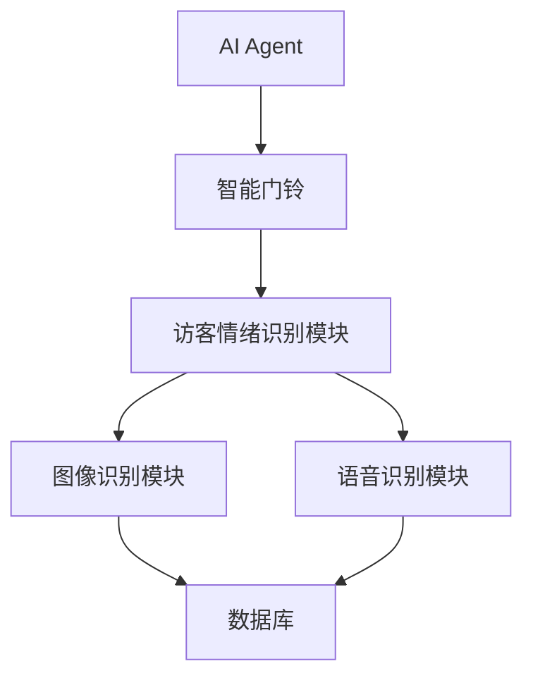
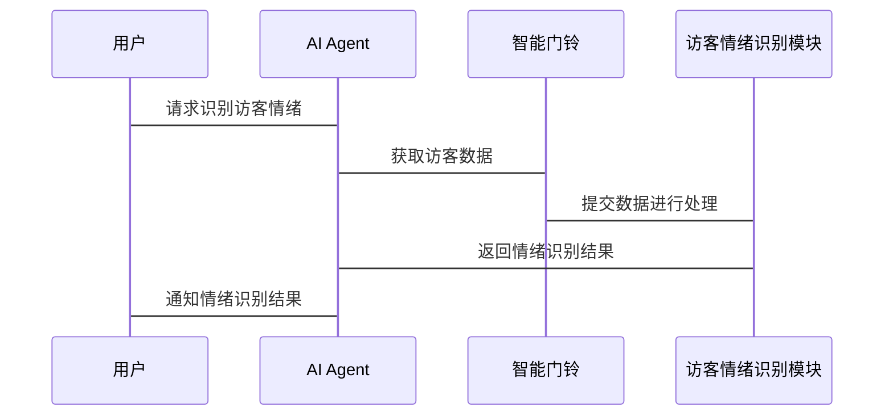

                 

<think>
好的，我将按照您的要求创作一篇关于《AI Agent在智能门铃中的访客情绪识别》的技术博客文章。为了让文章逻辑清晰、结构紧凑且易于理解，我会先列出文章的目录大纲。

文章标题：AI Agent在智能门铃中的访客情绪识别

关键词：AI Agent，智能门铃，访客情绪识别，深度学习，计算机视觉，自然语言处理

摘要：
随着智能家居设备的普及，智能门铃作为家庭安全的重要组成部分，逐渐从单一的门禁控制功能向智能化、个性化方向发展。本文深入探讨AI Agent在智能门铃中的应用，重点关注访客情绪识别的技术实现。文章首先介绍AI Agent的基本概念及其在智能门铃中的角色定位，随后分析情绪识别的原理与方法，详细讲解基于语音和图像的情绪识别算法，以及深度学习在其中的应用。接着，文章从系统架构、功能模块、接口设计等多维度进行分析与设计，最后通过实际项目案例展示AI Agent在访客情绪识别中的具体实现。本文旨在为智能门铃的开发者和研究者提供理论指导和技术参考，帮助他们更好地理解和应用AI技术来提升访客情绪识别的准确性和实用性。

文章目录大纲：

# AI Agent在智能门铃中的访客情绪识别

> 关键词：AI Agent，智能门铃，访客情绪识别，深度学习，计算机视觉，自然语言处理  
> 摘要：本文深入探讨AI Agent在智能门铃中的应用，重点关注访客情绪识别的技术实现。文章首先介绍AI Agent的基本概念及其在智能门铃中的角色定位，随后分析情绪识别的原理与方法，详细讲解基于语音和图像的情绪识别算法，以及深度学习在其中的应用。接着，文章从系统架构、功能模块、接口设计等多维度进行分析与设计，最后通过实际项目案例展示AI Agent在访客情绪识别中的具体实现。

---

## 第一部分：背景介绍与核心概念

### 第1章：背景介绍与问题定义

#### 1.1 问题背景
- 1.1.1 智能门铃的发展历程
- 1.1.2 情绪识别在智能门铃中的应用价值
- 1.1.3 当前访客情绪识别的痛点与挑战

#### 1.2 问题描述
- 1.2.1 智能门铃的基本功能与局限性
- 1.2.2 访客情绪识别的需求场景
- 1.2.3 情绪识别对智能门铃功能的提升作用

#### 1.3 问题解决与边界
- 1.3.1 AI Agent在智能门铃中的角色定位
- 1.3.2 情绪识别的实现边界与外延
- 1.3.3 核心概念与系统架构的初步设想

#### 1.4 核心概念结构与组成
- 1.4.1 AI Agent与智能门铃的结合方式
- 1.4.2 情绪识别的核心要素与功能模块
- 1.4.3 系统整体架构的初步框架

#### 1.5 本章小结

---

### 第2章：AI Agent与情绪识别的核心概念

#### 2.1 AI Agent的基本原理
- 2.1.1 AI Agent的定义与分类
- 2.1.2 AI Agent的核心功能与特点
- 2.1.3 AI Agent在智能门铃中的具体应用

#### 2.2 情绪识别的原理与方法
- 2.2.1 情绪识别的定义与分类
- 2.2.2 基于语音的情绪识别
- 2.2.3 基于图像的情绪识别

#### 2.3 AI Agent与情绪识别的结合
- 2.3.1 AI Agent在情绪识别中的作用
- 2.3.2 情绪识别对AI Agent的优化作用
- 2.3.3 AI Agent与智能门铃的协同工作流程

#### 2.4 核心概念对比分析
- 2.4.1 AI Agent与传统门铃功能的对比
- 2.4.2 情绪识别与传统访客识别的对比
- 2.4.3 系统架构的优劣势分析

#### 2.5 本章小结

---

## 第二部分：算法原理与实现

### 第3章：情绪识别算法原理与实现

#### 3.1 情绪识别的算法原理
- 3.1.1 基于语音的情绪识别算法
- 3.1.2 基于图像的情绪识别算法
- 3.1.3 混合情绪识别算法

#### 3.2 深度学习在情绪识别中的应用
- 3.2.1 卷积神经网络（CNN）在图像识别中的应用
- 3.2.2 循环神经网络（RNN）在语音识别中的应用
- 3.2.3 深度学习模型的训练与优化

#### 3.3 情绪识别算法的数学模型
- 3.3.1 语音情绪识别的数学模型
  $$ y = f(x) $$
- 3.3.2 图像情绪识别的数学模型
  $$ y = g(x) $$
- 3.3.3 混合情绪识别的数学模型
  $$ y = h(x) $$

#### 3.4 算法实现与优化
- 3.4.1 算法实现的具体步骤
- 3.4.2 深度学习模型的训练流程
- 3.4.3 算法优化与性能提升方法

#### 3.5 本章小结

---

## 第三部分：系统分析与架构设计

### 第4章：系统分析与架构设计方案

#### 4.1 问题场景介绍
- 4.1.1 智能门铃的使用场景
- 4.1.2 访客情绪识别的具体需求
- 4.1.3 系统需要解决的问题

#### 4.2 项目介绍
- 4.2.1 项目目标
- 4.2.2 项目范围
- 4.2.3 项目主要参与者

#### 4.3 系统功能设计（领域模型）
- 4.3.1 系统功能模块划分
- 4.3.2 各模块之间的关系
- 4.3.3 功能模块的详细描述

#### 4.4 系统架构设计
- 4.4.1 系统架构图（使用Mermaid）

#### 4.5 系统接口设计
- 4.5.1 系统接口定义
- 4.5.2 接口之间的交互流程
- 4.5.3 接口设计的注意事项

#### 4.6 系统交互设计（使用Mermaid）

#### 4.7 本章小结

---

## 第四部分：项目实战与应用

### 第5章：项目实战与应用

#### 5.1 环境安装与配置
- 5.1.1 开发环境的选择
- 5.1.2 相关库与工具的安装
- 5.1.3 环境配置的具体步骤

#### 5.2 系统核心实现源代码
- 5.2.1 代码结构与模块划分
- 5.2.2 核心代码展示与解读
- 5.2.3 代码实现的注意事项

#### 5.3 代码应用解读与分析
- 5.3.1 代码实现的功能分析
- 5.3.2 代码实现的优化建议
- 5.3.3 代码实现的局限性与改进方向

#### 5.4 实际案例分析与详细讲解
- 5.4.1 案例背景介绍
- 5.4.2 案例实现过程
- 5.4.3 案例分析与结果解读

#### 5.5 本章小结

---

## 第五部分：总结与展望

### 第6章：总结与展望

#### 6.1 核心内容总结
- 6.1.1 AI Agent在智能门铃中的应用总结
- 6.1.2 情绪识别技术的实现与优化
- 6.1.3 系统架构与设计的总结

#### 6.2 未来展望
- 6.2.1 情绪识别技术的未来发展方向
- 6.2.2 AI Agent在智能家居中的更多应用
- 6.2.3 智能门铃与其他智能设备的协同工作

#### 6.3 本章小结

---

## 第六部分：最佳实践与注意事项

### 第7章：最佳实践与注意事项

#### 7.1 最佳实践
- 7.1.1 数据采集与处理的建议
- 7.1.2 算法选择与优化的建议
- 7.1.3 系统设计与实现的建议

#### 7.2 注意事项
- 7.2.1 数据隐私与安全的注意事项
- 7.2.2 系统稳定性的注意事项
- 7.2.3 用户体验的注意事项

#### 7.3 本章小结

---

## 附录

### 附录A：相关术语解释

### 附录B：参考文献

### 附录C：代码与资源链接

---

## 作者信息

作者：AI天才研究院/AI Genius Institute & 禅与计算机程序设计艺术 /Zen And The Art of Computer Programming

---

以上是文章的详细目录大纲，涵盖了从背景介绍到实际应用的各个方面，逻辑清晰，结构紧凑。接下来，我会根据这个大纲开始撰写完整的文章内容。

