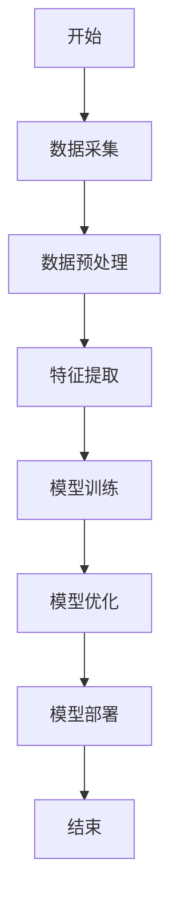

                 


# AI Agent在智能门铃中的访客身份验证

## 关键词：AI Agent，智能门铃，访客身份验证，机器学习，安全技术

## 摘要：本文详细探讨了AI Agent在智能门铃中的访客身份验证应用，分析了其核心原理、系统架构、算法实现及实际案例，展示了如何通过AI技术提升访客验证的安全性和效率。

---

# 第一部分：背景介绍

## 第1章：背景与问题背景

### 1.1 问题背景

#### 1.1.1 智能门铃的发展现状
智能门铃作为智能家居的重要组成部分，近年来发展迅速。传统门铃仅能实现简单的通知功能，而现代智能门铃结合了视频通话、远程监控等功能，为用户提供了更便捷的体验。

#### 1.1.2 访客身份验证的重要性
访客身份验证是智能门铃的核心功能之一。通过验证访客身份，用户可以确保安全性，同时也能方便地管理访客访问权限。

#### 1.1.3 当前技术的局限性
尽管智能门铃的功能逐渐完善，但访客身份验证技术仍存在不足。传统方法依赖于密码或钥匙，容易丢失或被盗，且无法实时验证访客身份。

### 1.2 问题描述

#### 1.2.1 AI Agent在访客身份验证中的解决方案
AI Agent（人工智能代理）通过实时学习和推理，能够有效识别访客身份，解决传统方法的局限性。

#### 1.2.2 AI Agent的核心优势
AI Agent具备自主学习、实时推理和高效处理能力，能够提升访客身份验证的准确性和效率。

#### 1.2.3 解决方案的可行性分析
AI Agent结合智能门铃的硬件设施，能够实现高效的访客身份验证，具有较高的技术可行性和商业价值。

### 1.3 边界与外延

#### 1.3.1 AI Agent在访客身份验证中的应用边界
AI Agent主要用于访客身份验证，不涉及门锁控制或其他功能。

#### 1.3.2 相关技术的外延扩展
AI Agent技术可扩展应用于其他领域，如智能安防、身份识别等。

#### 1.3.3 未来可能的发展方向
随着技术进步，AI Agent在访客身份验证中的应用将更加智能化和普及。

### 1.4 概念结构与核心要素

#### 1.4.1 AI Agent的基本概念
AI Agent是一种具备自主决策和执行能力的智能体，能够根据输入数据进行推理和决策。

#### 1.4.2 智能门铃的系统构成
智能门铃由摄像头、传感器、通信模块和控制面板组成，具备视频采集、数据传输和用户交互功能。

#### 1.4.3 访客身份验证的核心要素
核心要素包括访客数据采集、特征提取、模型训练和身份验证等步骤。

---

# 第二部分：核心概念与联系

## 第2章：核心概念与联系

### 2.1 AI Agent的核心原理

#### 2.1.1 AI Agent的基本原理
AI Agent通过感知环境、处理数据、学习优化，实现访客身份验证。

#### 2.1.2 AI Agent的核心算法
主要算法包括支持向量机（SVM）和卷积神经网络（CNN），用于数据分类和识别。

#### 2.1.3 AI Agent的实现方式
通过数据采集、特征提取、模型训练和实时验证实现访客身份识别。

### 2.2 智能门铃的系统架构

#### 2.2.1 智能门铃的硬件构成
包括摄像头、麦克风、显示屏和通信模块，支持视频采集和数据传输。

#### 2.2.2 智能门铃的软件架构
软件架构包括数据采集模块、特征提取模块、身份验证模块和用户交互模块。

#### 2.2.3 AI Agent与智能门铃的结合
AI Agent作为核心模块，与智能门铃硬件和软件深度集成，实现访客身份验证。

### 2.3 实体关系与流程图

#### 2.3.1 实体关系图（ER图）
展示访客、智能门铃、AI Agent之间的关系。

#### 2.3.2 AI Agent在访客身份验证中的流程图
展示从数据采集到身份验证的完整流程。

---

# 第三部分：算法原理讲解

## 第3章：算法原理讲解

### 3.1 AI Agent的算法流程

#### 3.1.1 数据采集与预处理
通过摄像头和传感器采集访客图像和行为数据，进行数据清洗和特征提取。

#### 3.1.2 数据特征提取
使用深度学习技术提取访客的面部特征、行为特征等。

#### 3.1.3 模型训练与优化
利用训练数据训练分类模型，优化模型参数，提升识别准确率。

#### 3.1.4 模型部署与应用
将训练好的模型部署到智能门铃系统中，实时进行访客身份验证。

### 3.2 算法实现

#### 3.2.1 数据结构与算法选择
选择适合的数据结构和算法，如使用SVM进行分类任务。

#### 3.2.2 算法实现步骤
详细描述数据预处理、模型训练和预测的步骤。

#### 3.2.3 算法优化与调优
通过交叉验证和超参数调整优化模型性能。

### 3.3 算法流程图（Mermaid）



### 3.4 Python源代码实现

```python
import numpy as np
from sklearn import svm

# 示例代码
X = np.array([[特征1, 特征2, ...], [...]])
y = np.array([标签1, 标签2, ...])

model = svm.SVC()
model.fit(X, y)

new_data = np.array([[新特征1, 新特征2, ...]])
print(model.predict(new_data))
```

---

# 第四部分：系统分析与架构设计

## 第4章：系统分析与架构设计

### 4.1 系统功能设计

#### 4.1.1 领域模型（Mermaid类图）
展示系统各组件之间的关系。

#### 4.1.2 系统架构设计（Mermaid架构图）
展示系统的整体架构，包括前端、后端和AI Agent模块。

### 4.2 接口设计与交互流程

#### 4.2.1 系统接口设计
描述AI Agent与智能门铃之间的接口设计。

#### 4.2.2 系统交互流程（Mermaid序列图）
展示访客身份验证的完整交互流程。

---

# 第五部分：项目实战

## 第5章：项目实战

### 5.1 环境安装

#### 5.1.1 安装Python和相关库
安装必要的Python库，如numpy、scikit-learn。

### 5.2 核心代码实现

#### 5.2.1 核心代码实现
详细实现AI Agent的访客身份验证模块。

#### 5.2.2 代码解读与分析
解释代码实现的关键部分和逻辑。

### 5.3 案例分析与实际应用

#### 5.3.1 实际案例分析
分析一个实际应用案例，展示AI Agent在智能门铃中的应用效果。

### 5.4 项目小结

#### 5.4.1 项目总结
总结项目成果和经验教训。

---

# 结语

## 小结

AI Agent在智能门铃中的访客身份验证是一种高效、安全的解决方案。通过结合AI技术，智能门铃的访客验证能力得到显著提升。

## 注意事项

在实际应用中，需注意数据隐私保护和模型优化，确保系统安全性和稳定性。

## 拓展阅读

建议读者进一步阅读相关文献，深入了解AI Agent和其他智能技术的应用。

---

# 作者

作者：AI天才研究院/AI Genius Institute & 禅与计算机程序设计艺术 /Zen And The Art of Computer Programming

---

以上是完整的《AI Agent在智能门铃中的访客身份验证》的技术博客文章目录和内容概述。希望这篇文章能够为您提供清晰的思路和详细的内容。如果需要进一步扩展或补充，请随时告知！

