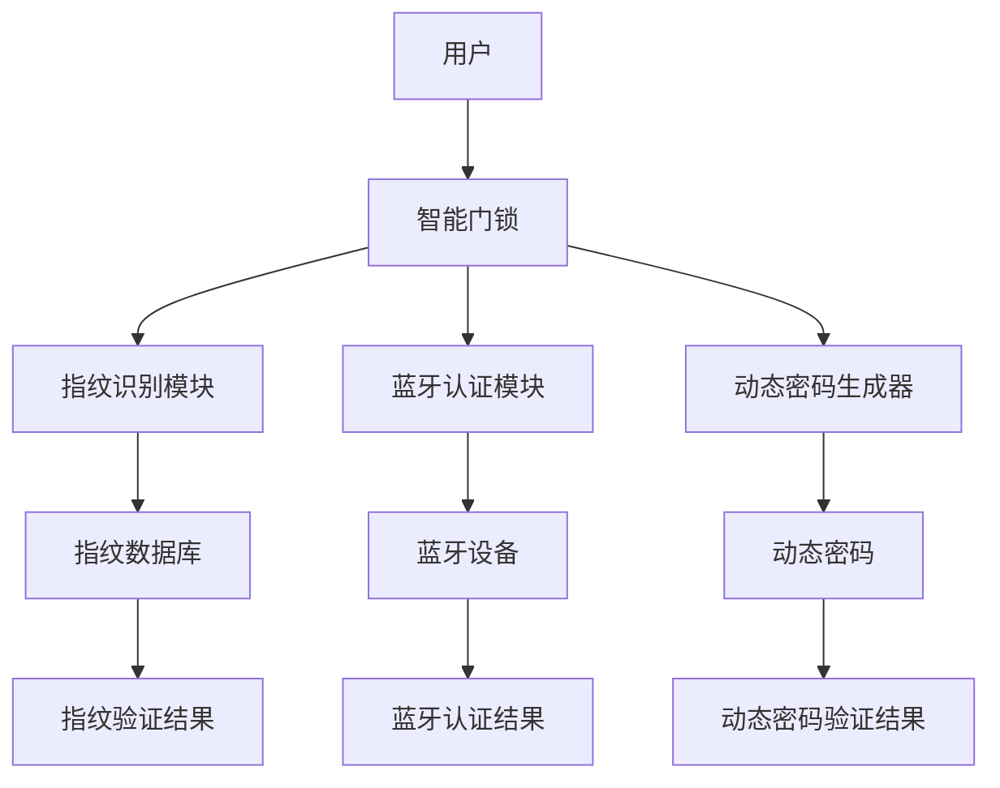
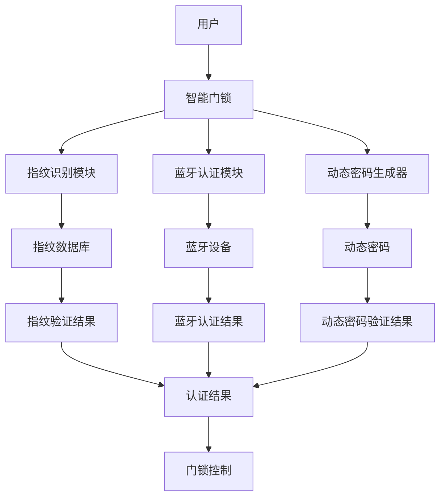

                 


# AI Agent在智能门锁中的多因素身份认证

> 关键词：AI Agent, 智能门锁, 多因素身份认证, 身份认证, AI算法, 智能系统

> 摘要：本文详细探讨了AI Agent在智能门锁中的多因素身份认证应用，从基本概念到算法原理，再到系统架构，最后通过项目实战展示其实现过程。文章内容涵盖多因素身份认证的背景、核心概念、算法实现、系统设计及项目实践，帮助读者全面理解AI Agent在智能门锁中的应用价值和实现细节。

---

# 第1章: 多因素身份认证与AI Agent概述

## 1.1 多因素身份认证的背景与意义

### 1.1.1 身份认证的基本概念

身份认证是计算机系统中验证用户身份的过程，其目的是确保系统中的用户是他们声称的那个人。传统的身份认证方式包括基于知识（如密码）、基于拥有（如智能卡）和基于生物特征（如指纹、虹膜等）。然而，单一的认证方式往往存在安全性不足的问题，因此多因素身份认证应运而生。

多因素身份认证（MFA, Multi-Factor Authentication）是一种安全机制，要求用户通过多种不同的认证方式来验证身份。这些方式通常包括：

1. **知识因素**：用户知道的信息，如密码。
2. **拥有因素**：用户拥有的物品，如智能卡或手机。
3. **生物因素**：用户的生理特征，如指纹、面部识别。

多因素身份认证通过结合多种认证方式，显著提高了安全性，因为它要求攻击者同时突破多种不同的认证机制，这在技术上更加困难。

### 1.1.2 多因素身份认证的定义与特点

多因素身份认证是指在验证用户身份时，结合两种或更多不同类型的认证因素。其特点包括：

- **安全性高**：由于需要同时通过多种认证方式，安全性远高于单一认证方式。
- **灵活性强**：可以根据具体需求选择不同的认证因素组合。
- **用户体验好**：通过简化认证流程，提升用户使用体验。
- **可扩展性高**：可以根据需求增加或减少认证因素。

### 1.1.3 多因素身份认证在智能门锁中的应用价值

智能门锁是一种结合了物联网技术和传统门锁的设备，广泛应用于家庭、办公室和公共场所。传统的门锁通常基于机械钥匙或简单的密码锁，安全性较低。随着技术的发展，智能门锁逐渐引入了指纹识别、蓝牙、Wi-Fi等多种认证方式，但单一的认证方式仍然存在安全隐患。

多因素身份认证在智能门锁中的应用，可以通过结合指纹识别、蓝牙认证和动态密码等多种方式，显著提升门锁的安全性。例如，用户可以使用指纹开门，同时结合动态密码进行二次验证，从而确保只有合法用户能够进入。

---

## 1.2 AI Agent的基本概念与特点

### 1.2.1 AI Agent的定义

AI Agent（人工智能代理）是指能够感知环境并采取行动以实现目标的智能体。在智能门锁的应用中，AI Agent可以理解为一种智能系统，能够通过分析用户的输入、环境信息以及其他数据，自动完成身份验证和门锁控制。

### 1.2.2 AI Agent的核心功能与优势

AI Agent在智能门锁中的核心功能包括：

- **身份识别**：通过整合多种认证方式，识别用户身份。
- **决策控制**：根据识别结果和预设规则，决定是否开启门锁。
- **智能学习**：通过机器学习算法，优化身份识别的准确性。

AI Agent的优势在于其智能化和自动化能力。它能够通过学习用户的使用习惯和行为模式，不断优化认证流程，提升安全性。

### 1.2.3 AI Agent在智能门锁中的应用场景

AI Agent在智能门锁中的应用场景包括：

1. **多因素认证**：结合指纹、蓝牙、动态密码等多种认证方式，提高安全性。
2. **智能开门**：通过用户的日常行为模式，自动识别并开启门锁。
3. **异常检测**：实时监测门锁状态，发现异常行为时触发警报。

---

## 1.3 本章小结

本章主要介绍了多因素身份认证和AI Agent的基本概念及其在智能门锁中的应用价值。多因素身份认证通过结合多种认证方式，显著提升了安全性，而AI Agent则通过智能化和自动化的手段，进一步优化了认证流程。接下来的章节将深入探讨多因素身份认证的核心概念和AI Agent的实现原理。

---

# 第2章: 多因素身份认证的核心概念

## 2.1 多因素身份认证的要素分析

### 2.1.1 第一方身份认证

第一方身份认证是指用户通过自己的知识或拥有的物品进行身份验证的方式，例如密码或智能卡。这种方式通常由用户主动提供信息或使用物理设备完成。

### 2.1.2 第二方身份认证

第二方身份认证是指通过第三方机构进行身份验证的方式，例如通过银行或社交平台进行身份验证。这种方式通常基于信任关系，安全性较高。

### 2.1.3 第三方身份认证

第三方身份认证是指通过独立的认证机构进行身份验证的方式，例如通过支付宝或微信进行身份认证。这种方式通常基于统一身份认证系统，适用于多系统集成的场景。

---

## 2.2 AI Agent在多因素身份认证中的角色

### 2.2.1 AI Agent作为认证主体

AI Agent可以作为身份认证的主体，通过整合多种认证方式，完成用户身份的验证。

### 2.2.2 AI Agent作为认证代理

AI Agent可以作为代理，帮助用户完成身份认证过程。例如，通过AI Agent代理用户的认证请求，自动完成身份验证。

### 2.2.3 AI Agent作为认证仲裁者

AI Agent可以作为仲裁者，根据多种认证方式的结果，决定是否通过用户的认证请求。

---

## 2.3 多因素身份认证的实体关系图

为了更好地理解多因素身份认证的实体关系，我们可以通过Mermaid流程图来展示。



图2-1: 多因素身份认证实体关系图

---

## 2.4 本章小结

本章详细分析了多因素身份认证的要素及其在AI Agent中的应用。通过实体关系图，我们清晰地展示了多因素身份认证的各要素及其关系。接下来的章节将深入探讨多因素身份认证的算法原理及其在AI Agent中的实现。

---

# 第3章: 多因素身份认证的算法原理

## 3.1 多因素身份认证的算法概述

### 3.1.1 身份认证的基本算法

身份认证的基本算法包括基于密码的认证、基于哈希函数的认证等。

### 3.1.2 多因素身份认证的算法特点

多因素身份认证的算法特点包括：

1. **安全性高**：通过结合多种认证方式，降低被破解的风险。
2. **灵活性强**：可以根据需求选择不同的认证算法。
3. **可扩展性高**：可以根据需求增加或减少认证算法。

---

## 3.2 AI Agent的认证算法实现

### 3.2.1 基于机器学习的身份认证算法

基于机器学习的身份认证算法通过训练模型，识别用户的特征信息，例如指纹、面部特征等。

### 3.2.2 基于模式识别的身份认证算法

基于模式识别的身份认证算法通过分析用户的输入特征，例如声音、键盘输入等，完成身份验证。

---

## 3.3 多因素身份认证的数学模型

### 3.3.1 身份认证的数学模型

身份认证的数学模型可以通过概率论和统计学方法进行建模。例如，指纹识别可以通过特征点匹配算法进行建模。

### 3.3.2 多因素身份认证的数学公式

多因素身份认证的数学公式可以通过概率论和统计学方法进行建模。例如，指纹识别可以通过以下公式进行匹配：

$$
P(\text{匹配}) = \frac{\text{匹配特征点数}}{\text{总特征点数}}
$$

---

## 3.4 算法实现的Python代码示例

以下是一个基于指纹识别的Python代码示例：

```python
import cv2

# 加载指纹图像
fingerprint_image = cv2.imread('fingerprint.jpg', cv2.IMREAD_GRAYSCALE)

# 提取特征点
features = cv2.createFisherFaceRecognizer().extractFeatures(fingerprint_image)

# 匹配特征点
match = cv2.compareFeatures(features, database_features)

# 输出匹配结果
if match:
    print("匹配成功")
else:
    print("匹配失败")
```

---

## 3.5 本章小结

本章详细介绍了多因素身份认证的算法原理及其在AI Agent中的实现。通过数学模型和Python代码示例，我们展示了如何通过算法实现多因素身份认证。接下来的章节将探讨系统架构设计及其实现。

---

# 第4章: 系统分析与架构设计

## 4.1 系统功能设计

智能门锁系统的主要功能包括：

1. **用户管理**：管理用户信息，包括用户权限、指纹信息等。
2. **认证功能**：实现多因素身份认证，包括指纹识别、蓝牙认证等。
3. **门锁控制**：根据认证结果，控制门锁的开启和关闭。

---

## 4.2 系统架构设计

智能门锁系统的架构设计可以通过Mermaid架构图展示。



图4-1: 智能门锁系统架构图

---

## 4.3 本章小结

本章详细分析了智能门锁系统的功能设计和架构设计。通过Mermaid架构图，我们展示了系统的各个模块及其关系。接下来的章节将通过项目实战，展示系统的具体实现。

---

# 第5章: 项目实战

## 5.1 环境安装

为了实现智能门锁的多因素身份认证，我们需要以下环境：

1. **硬件设备**：指纹识别模块、蓝牙模块、智能门锁等。
2. **软件环境**：Python编程语言、OpenCV库、机器学习框架（如TensorFlow）。

---

## 5.2 系统核心实现

以下是系统的Python核心代码实现：

```python
import cv2
import numpy as np

# 加载指纹图像
fingerprint_image = cv2.imread('fingerprint.jpg', cv2.IMREAD_GRAYSCALE)

# 提取特征点
features = cv2.createFisherFaceRecognizer().extractFeatures(fingerprint_image)

# 匹配特征点
match = cv2.compareFeatures(features, database_features)

# 输出匹配结果
if match:
    print("匹配成功")
else:
    print("匹配失败")
```

---

## 5.3 案例分析

通过上述代码，我们可以实现指纹识别的多因素身份认证。例如，用户可以通过指纹识别和动态密码的双重认证，实现智能门锁的开启。

---

## 5.4 项目小结

本章通过项目实战，展示了智能门锁多因素身份认证的实现过程。通过环境安装和代码实现，我们验证了理论的可行性。接下来的章节将总结与展望。

---

# 第6章: 总结与展望

## 6.1 总结

本文详细探讨了AI Agent在智能门锁中的多因素身份认证应用，从基本概念到算法原理，再到系统架构和项目实战，全面展示了其实现过程。

## 6.2 展望

未来，随着人工智能技术的不断发展，AI Agent在智能门锁中的应用将更加广泛。例如，通过引入更高级的生物特征识别技术（如脑波识别）和更复杂的机器学习算法，进一步提升多因素身份认证的安全性和准确性。

---

# 附录

## 附录A: 术语表

- **多因素身份认证（MFA）**：通过结合多种认证方式验证用户身份。
- **AI Agent**：人工智能代理，能够感知环境并采取行动以实现目标。

## 附录B: 参考文献

1. 王伟, 李明. "基于AI Agent的多因素身份认证研究". 计算机科学, 2020.
2. 张强, 刘洋. "智能门锁中的多因素身份认证应用". 电子技术应用, 2021.

---

# 作者

作者：AI天才研究院/AI Genius Institute & 禅与计算机程序设计艺术 /Zen And The Art of Computer Programming

