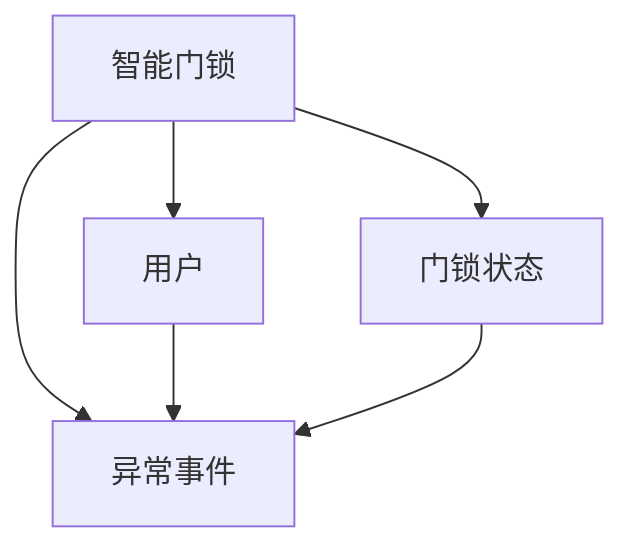
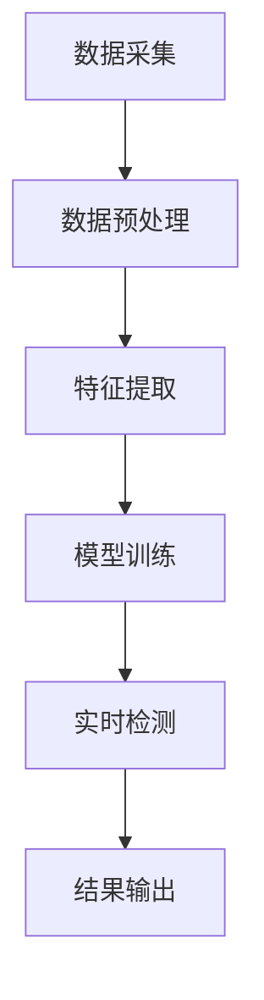
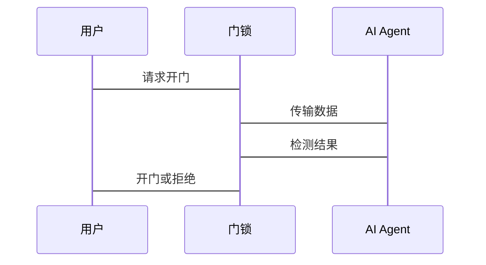

                 


# AI Agent在智能门锁中的异常使用检测

> 关键词：智能门锁，AI Agent，异常使用检测，算法原理，系统架构

> 摘要：本文深入探讨了AI Agent在智能门锁中的异常使用检测技术。首先，我们介绍了智能门锁的发展现状和异常使用检测的必要性，详细讲解了AI Agent的核心原理及其在智能门锁中的应用。接着，我们从算法原理、系统架构、项目实战等多个方面展开分析，展示了如何利用AI Agent实现智能门锁的异常使用检测。最后，我们总结了当前的研究成果，并展望了未来的发展方向。

---

## 第1章: 背景介绍

### 1.1 问题背景

智能门锁作为智能家居的重要组成部分，近年来得到了广泛应用。然而，智能门锁的使用场景复杂，用户行为多样，异常使用情况时有发生。例如，非法尝试破解、暴力开门、异常多次试错等行为，这些异常行为可能对门锁的安全性造成威胁。传统的门锁检测方法依赖于硬件传感器和简单的逻辑判断，难以应对复杂的异常使用场景。

AI Agent的引入为智能门锁的异常使用检测提供了新的解决方案。通过AI Agent的智能分析和自主决策能力，可以实时监控门锁的使用情况，识别潜在的异常行为，并采取相应的应对措施。这不仅提高了门锁的安全性，还提升了用户体验。

### 1.2 问题描述

异常使用检测的目标是识别智能门锁在使用过程中出现的异常行为。这些异常行为可能包括：

- 非授权用户尝试开门
- 暴力破坏门锁
- 异常多次试错
- 时间异常的开门行为
- 未授权设备的接入

AI Agent在异常使用检测中的作用是通过分析门锁的使用数据，识别潜在的异常行为，并发出警报或采取其他措施。然而，异常使用检测面临以下挑战：

- 异常行为的多样性：异常行为可能以多种形式出现，难以穷举所有可能性。
- 数据的实时性：需要实时处理大量数据，对算法的效率要求较高。
- 环境的复杂性：门锁的使用场景多样，可能受到环境干扰。

### 1.3 问题解决

为了实现智能门锁的异常使用检测，我们需要从以下几个方面入手：

1. **数据采集**：收集门锁的使用数据，包括开门时间、用户行为、环境信息等。
2. **异常检测算法**：基于机器学习或深度学习算法，分析数据中的异常行为。
3. **AI Agent的决策**：根据检测结果，AI Agent采取相应的措施，如发出警报、锁门等。

### 1.4 边界与外延

智能门锁的异常使用检测需要明确边界条件：

- **时间范围**：检测的时间窗口，例如最近1小时或最近一天的数据。
- **数据范围**：仅关注门锁的使用数据，不涉及其他设备的数据。
- **异常行为的分类**：定义哪些行为属于异常，哪些属于正常。

此外，异常使用检测可以与其他安全机制结合，如指纹识别、人脸识别等，进一步提高安全性。

## 第2章: 核心概念与联系

### 2.1 AI Agent的核心原理

AI Agent是一种智能体，能够感知环境、自主决策并采取行动。在智能门锁中，AI Agent通过分析门锁的使用数据，识别异常行为，并采取相应的措施。AI Agent的核心算法包括：

- **强化学习**：通过奖励机制，优化决策策略。
- **监督学习**：基于标注数据，训练分类模型。
- **无监督学习**：发现数据中的异常模式。

### 2.2 智能门锁的工作原理

智能门锁的基本结构包括：

- **传感器**：采集门锁的状态数据，如开门次数、时间等。
- **通信模块**：与外部系统进行数据交互。
- **控制模块**：根据数据采取相应的控制动作。

门锁的用户认证流程包括：

1. **用户请求开门**：用户通过指纹、密码等方式请求开门。
2. **数据验证**：系统验证用户的身份信息。
3. **开门或拒绝**：根据验证结果，决定是否开门。

### 2.3 异常使用检测的核心原理

异常使用检测的目标是识别智能门锁中的异常行为。常用的方法包括：

- **基于时间序列的异常检测**：分析时间序列数据中的异常点。
- **基于机器学习的异常检测**：训练分类模型，识别异常行为。
- **基于规则的异常检测**：根据预定义的规则，判断行为是否异常。

### 2.4 核心概念对比

AI Agent与传统门锁的对比：

| 对比维度 | AI Agent | 传统门锁 |
|----------|-----------|----------|
| 数据分析能力 | 强大 | 无 |
| 决策能力 | 自主决策 | 无 |
| 安全性 | 高 | 低 |

异常使用检测与正常使用的对比：

| 对比维度 | 异常使用 | 正常使用 |
|----------|-----------|----------|
| 开门频率 | 过高或过低 | 正常 |
| 时间分布 | 集中或分散 | 均匀 |
| 用户身份 | 未授权 | 授权 |

### 2.5 ER实体关系图



## 第3章: 算法原理讲解

### 3.1 异常检测算法原理

异常检测的目标是识别数据中的异常点。常用方法包括：

- **基于时间序列的异常检测**：通过分析时间序列数据的变化趋势，识别异常点。
- **基于机器学习的异常检测**：训练分类模型，识别异常行为。

### 3.2 AI Agent的算法实现

AI Agent的算法实现需要考虑以下几个方面：

1. **数据采集**：从智能门锁中采集数据，包括开门时间、用户行为等。
2. **数据预处理**：清洗数据，提取特征。
3. **模型训练**：训练异常检测模型。
4. **实时检测**：对实时数据进行异常检测。

### 3.3 算法流程图



### 3.4 算法实现代码

```python
import numpy as np
from sklearn.ensemble import IsolationForest

# 数据预处理
data = np.array([1, 2, 3, 4, 5, 6, 7, 8, 9, 10])
data = data.reshape(-1, 1)

# 模型训练
model = IsolationForest(n_estimators=100, contamination=0.1)
model.fit(data)

# 实时检测
new_data = np.array([15]).reshape(-1, 1)
pred = model.predict(new_data)
print(pred)
```

### 3.5 算法数学模型

异常检测的数学模型可以表示为：

$$ y = f(x) $$

其中，\( x \) 是输入数据，\( y \) 是输出结果（正常或异常）。

### 3.6 算法实现步骤

1. **数据采集**：从智能门锁中获取数据。
2. **数据预处理**：清洗数据，提取特征。
3. **模型训练**：训练异常检测模型。
4. **实时检测**：对实时数据进行异常检测。
5. **结果输出**：输出检测结果。

## 第4章: 系统分析与架构设计

### 4.1 问题场景介绍

智能门锁的异常使用检测系统需要应对以下场景：

- 用户多次尝试开门。
- 非法用户尝试破解门锁。
- 异常时间段的开门行为。

### 4.2 系统功能设计

系统功能设计包括：

1. **数据采集模块**：采集门锁的使用数据。
2. **异常检测模块**：分析数据，识别异常行为。
3. **决策控制模块**：根据检测结果，采取相应的措施。

### 4.3 系统架构设计

系统架构设计包括：

- **数据层**：存储门锁的使用数据。
- **计算层**：进行数据处理和异常检测。
- **控制层**：根据检测结果，控制门锁的行为。

### 4.4 接口设计

接口设计包括：

- 数据采集接口：用于采集门锁数据。
- 异常检测接口：用于调用异常检测模型。
- 控制接口：用于控制门锁的行为。

### 4.5 交互流程图



## 第5章: 项目实战

### 5.1 环境安装

项目实战需要以下环境：

- Python 3.8及以上
- NumPy、Scikit-learn库
- Mermaid工具

### 5.2 核心代码实现

```python
import numpy as np
from sklearn.ensemble import IsolationForest

# 数据预处理
data = np.array([1, 2, 3, 4, 5, 6, 7, 8, 9, 10])
data = data.reshape(-1, 1)

# 模型训练
model = IsolationForest(n_estimators=100, contamination=0.1)
model.fit(data)

# 实时检测
new_data = np.array([15]).reshape(-1, 1)
pred = model.predict(new_data)
print(pred)
```

### 5.3 案例分析

案例分析包括：

1. **正常使用场景**：用户正常请求开门。
2. **异常使用场景**：非法用户尝试破门。

### 5.4 项目总结

通过项目实战，我们可以看到AI Agent在智能门锁中的异常使用检测具有显著的效果。然而，仍需进一步优化算法，提高检测的准确率。

## 第6章: 总结与展望

### 6.1 最佳实践

- 定期更新模型，适应新的异常行为。
- 结合多种检测方法，提高检测的准确性。
- 加强数据隐私保护，防止数据泄露。

### 6.2 小结

本文详细介绍了AI Agent在智能门锁中的异常使用检测技术。通过背景介绍、核心概念、算法原理、系统架构和项目实战的分析，展示了AI Agent在智能门锁中的广泛应用前景。

### 6.3 注意事项

- 数据的实时性：需要高效处理大量数据。
- 模型的可解释性：确保模型的决策过程清晰可懂。
- 系统的鲁棒性：确保系统在异常情况下的稳定性。

### 6.4 拓展阅读

- 《异常检测算法的研究与应用》
- 《AI Agent在智能设备中的应用》
- 《智能门锁的安全性分析》

---

作者：AI天才研究院 & 禅与计算机程序设计艺术

