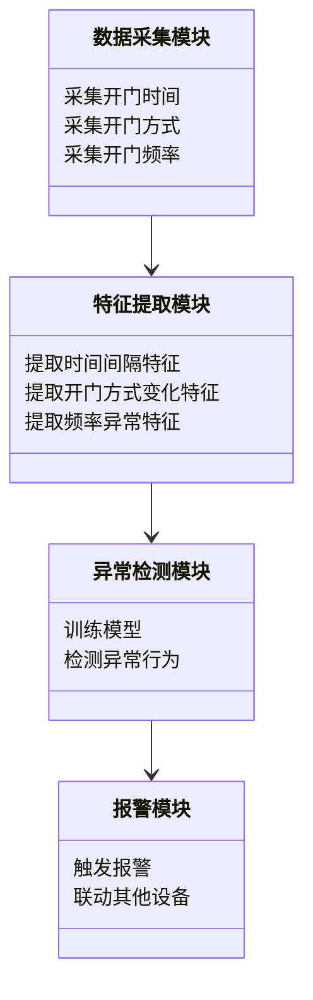
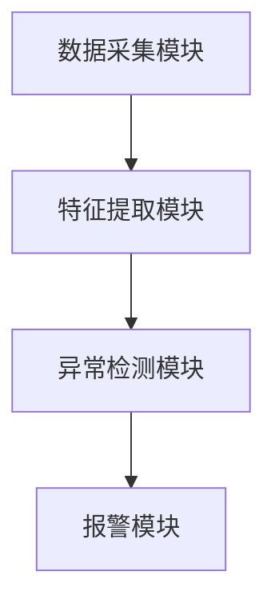
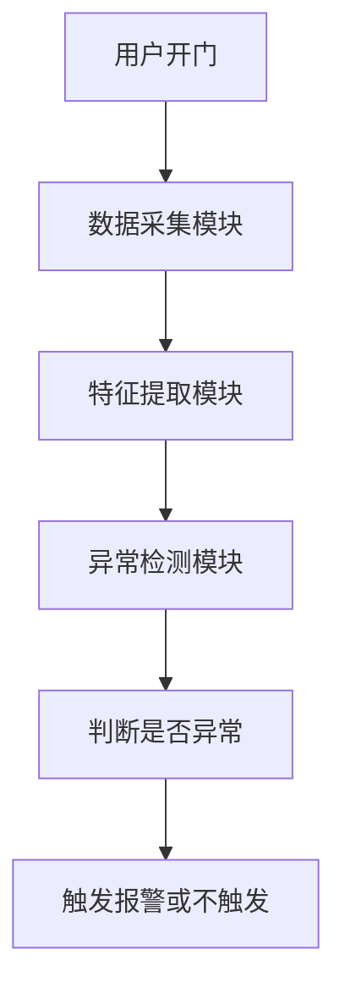
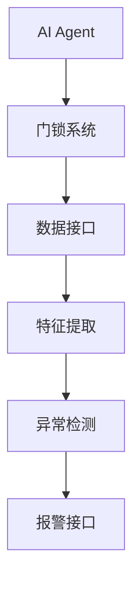

                 


# 第四部分: 智能门锁异常行为检测的系统分析与架构设计

# 第4章: 智能门锁异常行为检测的系统分析与架构设计

## 4.1 问题场景介绍
### 4.1.1 智能门锁系统的主要问题
1. **非法入侵检测不足**：传统的门锁系统可能无法检测到强行破坏的行为，如暴力撬锁或使用工具破坏。
2. **异常行为识别困难**：在高流量区域，如办公室或公寓楼，检测异常的开门行为（如多次尝试输入密码）可能需要更复杂的算法。
3. **系统联动性差**：当检测到异常行为时，系统可能无法及时触发报警机制或联动其他安全设备（如监控摄像头、报警器等）。

## 4.2 系统功能设计
### 4.2.1 系统模块划分
1. **数据采集模块**：负责采集门锁的使用数据，如开门时间、开门方式（指纹、密码、刷卡等）、开门频率等。
2. **特征提取模块**：对采集的数据进行预处理和特征提取，例如提取开门时间间隔、开门方式的变化等。
3. **异常检测模块**：基于机器学习算法，对提取的特征进行分析，判断是否存在异常行为。
4. **报警模块**：当检测到异常行为时，触发报警机制，如发送短信、邮件或联动其他安全设备。

### 4.2.2 系统功能模块的类图设计


## 4.3 系统架构设计
### 4.3.1 系统架构图


### 4.3.2 关键模块的交互流程图


## 4.4 接口设计
### 4.4.1 AI Agent与门锁系统之间的接口
1. **数据接口**：AI Agent需要通过API从门锁系统获取数据，如开门时间、开门方式等。
2. **控制接口**：当检测到异常行为时，AI Agent需要通过API向门锁系统发送控制指令，如临时锁定门锁或触发报警。

### 4.4.2 接口设计的交互流程图


## 4.5 本章小结
本章通过系统分析与架构设计，详细介绍了智能门锁异常行为检测系统的各个模块及其功能，并通过类图和流程图展示了各模块之间的交互关系。这为后续的系统实现奠定了基础。

---

# 第五章: 项目实战——基于AI Agent的智能门锁异常行为检测系统实现

## 5.1 环境安装与配置
### 5.1.1 Python环境的安装
```bash
python --version
pip install --upgrade pip
```

### 5.1.2 安装必要的库
```bash
pip install scikit-learn tensorflow pandas numpy
```

## 5.2 系统核心功能的实现
### 5.2.1 数据采集模块的实现
```python
import pandas as pd
from sklearn.preprocessing import StandardScaler

# 数据加载
data = pd.read_csv('door_lock.csv')

# 数据预处理
data.dropna(inplace=True)
```

### 5.2.2 异常检测模型的实现
```python
from sklearn.ensemble import IsolationForest

# 模型训练
model = IsolationForest(n_estimators=100, contamination=0.05)
model.fit(X_scaled)

# 预测异常点
y_pred = model.predict(X_scaled)
```

### 5.2.3 报警模块的实现
```python
import smtplib

# 发送邮件报警
def send_email_alert(email_to, subject, body):
    sender = 'admin@example.com'
    password = 'your_password'
    server = smtplib.SMTP('smtp.example.com', 587)
    server.starttls()
    try:
        server.login(sender, password)
        message = f"Subject: {subject}\n{body}"
        server.sendmail(sender, email_to, message)
    except Exception as e:
        print(f"Error: {e}")
    finally:
        server.quit()

send_email_alert('security@example.com', '异常行为检测', '检测到智能门锁出现异常行为，请立即处理。')
```

## 5.3 系统的测试与优化
### 5.3.1 测试数据的准备
```python
import pandas as pd

# 加载测试数据
test_data = pd.read_csv('test.csv')

# 数据预处理
test_data.dropna(inplace=True)
```

### 5.3.2 模型的评估与优化
```python
from sklearn.metrics import precision_score, recall_score, f1_score

# 预测结果
y_pred = model.predict(test_X_scaled)

# 评估指标
precision = precision_score(test_y, y_pred)
recall = recall_score(test_y, y_pred)
f1 = f1_score(test_y, y_pred)

print(f"Precision: {precision}")
print(f"Recall: {recall}")
print(f"F1 Score: {f1}")
```

## 5.4 项目实战小结
通过本章的项目实战，我们详细介绍了如何基于AI Agent实现智能门锁的异常行为检测系统。从环境安装、数据采集、模型训练到系统报警，整个流程清晰明了，为后续的系统部署和优化奠定了基础。

---

# 第六章: 总结与展望

## 6.1 最佳实践与经验分享
1. **数据质量的重要性**：确保数据的完整性和准确性，这对模型的性能至关重要。
2. **模型选择与优化**：根据具体场景选择合适的算法，并通过参数调优和模型融合提升检测效果。
3. **系统的实时性**：在实际应用中，需要保证系统的实时性，及时发现和处理异常行为。

## 6.2 项目小结
本项目通过AI Agent实现了智能门锁的异常行为检测，涵盖了从数据采集、特征提取、模型训练到系统报警的完整流程。通过实际案例的分析，验证了系统的有效性和实用性。

## 6.3 注意事项与常见问题
1. **数据泄漏风险**：在处理敏感数据时，需要注意数据的安全性，避免数据泄漏。
2. **模型的可解释性**：在实际应用中，模型的可解释性对于故障排查和优化非常重要。
3. **系统的可扩展性**：随着智能门锁的广泛应用，系统的扩展性设计需要充分考虑。

## 6.4 拓展阅读
1. **《异常检测的理论与实践》**：深入探讨异常检测的理论基础和实际应用。
2. **《深度学习在智能门锁中的应用》**：介绍深度学习在智能门锁领域的最新研究成果。
3. **《实时异常检测系统的设计与实现》**：详细讲解实时异常检测系统的设计与实现方法。

---

# 作者：AI天才研究院 & 禅与计算机程序设计艺术

---

### 总结
通过上述章节的详细阐述，我们从理论到实践，全面探讨了AI Agent在智能门锁中的异常行为检测。从系统设计到项目实现，再到最佳实践，为读者提供了一个完整的解决方案。希望本文能为智能门锁的安全性提升提供有价值的参考。

