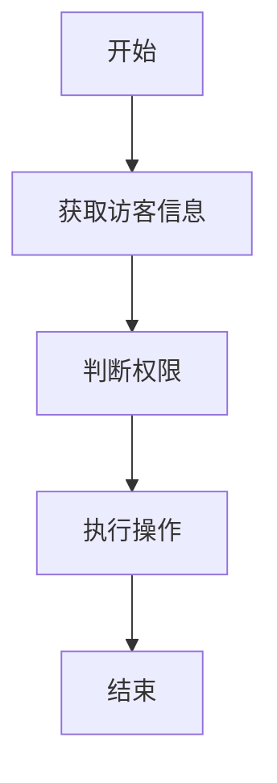
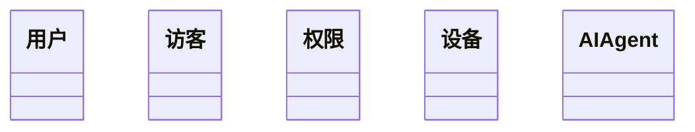
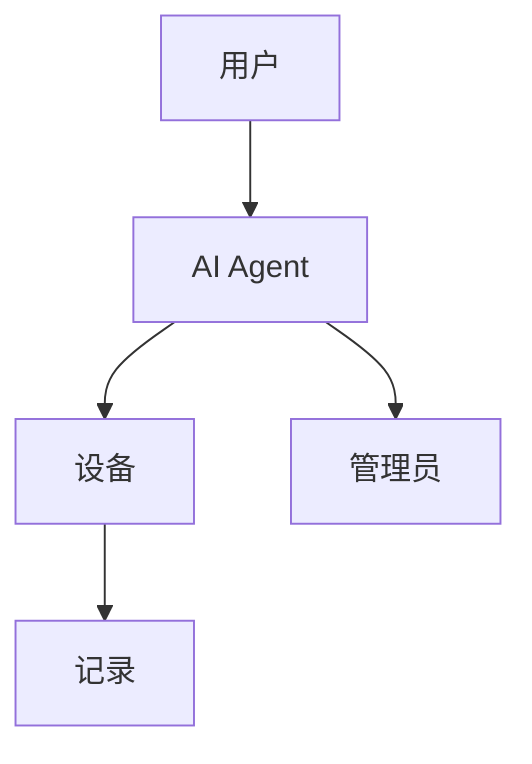
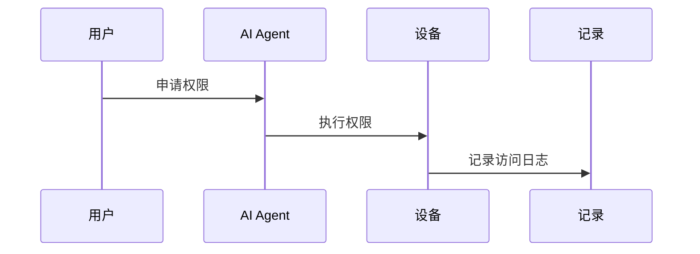

                 


# AI Agent在智能门锁中的访客权限管理

> 关键词：AI Agent, 智能门锁, 访客权限管理, 系统架构设计, 机器学习算法

> 摘要：本文深入探讨了AI Agent在智能门锁中的访客权限管理的应用，分析了AI Agent的核心原理、智能门锁的系统架构、访客权限管理的业务流程，以及如何通过算法优化实现高效的访客权限管理。文章从背景介绍、核心概念、算法原理、系统分析与架构设计、项目实战等多个维度进行详细阐述，并通过实际案例分析和代码实现，展示了AI Agent在智能门锁中的实际应用价值。

---

## 第一部分: AI Agent在智能门锁中的访客权限管理背景介绍

### 第1章: 问题背景与核心概念

#### 1.1 问题背景
智能门锁作为智能家居的重要组成部分，近年来得到了快速发展。传统的机械门锁由于其固有缺陷（如钥匙易丢失、权限管理复杂等），逐渐被智能门锁所取代。智能门锁通过电子技术实现开门权限的管理，极大地提高了安全性、便捷性和管理效率。

然而，智能门锁在访客权限管理方面仍然存在一些问题：
- **权限管理复杂性**：访客权限的申请、审批、执行过程需要人工干预，效率低下。
- **安全性不足**：传统的权限管理方式可能被破解或绕过，存在安全隐患。
- **用户体验不佳**：访客在申请权限时需要多次手动操作，体验较差。

AI Agent（人工智能代理）作为一种能够自主决策和执行任务的智能体，可以为智能门锁的访客权限管理提供新的解决方案。

#### 1.2 核心概念与问题描述
AI Agent是一种智能体，能够通过感知环境、分析信息、做出决策并执行任务。在智能门锁中，AI Agent可以作为访客权限管理的核心模块，负责处理访客的权限申请、审批、执行等业务。

智能门锁的系统架构包括硬件层、软件层和网络层。硬件层包括门锁、传感器等；软件层包括操作系统、应用程序和AI Agent；网络层负责数据的传输和通信。

访客权限管理的业务流程包括访客申请权限、系统审批权限、执行权限三大部分。AI Agent在这一过程中起到关键作用。

#### 1.3 问题解决与边界定义
AI Agent通过自动化处理访客权限申请、审批和执行，解决了传统访客权限管理中的效率低、安全性差和用户体验不佳的问题。AI Agent的边界包括与智能门锁硬件的交互、与用户（访客和管理员）的交互，以及与网络的交互。

---

## 第二部分: 核心概念与原理分析

### 第2章: AI Agent与智能门锁的原理

#### 2.1 AI Agent的核心原理
AI Agent通过感知环境、分析信息、做出决策并执行任务。基于规则的AI Agent通过预定义的规则进行决策，适用于简单的场景；基于学习的AI Agent通过机器学习模型进行决策，适用于复杂的场景。混合型AI Agent结合了两种方式，具有更强的适应性和灵活性。

#### 2.2 智能门锁的系统架构
智能门锁的硬件层包括门锁、传感器等，软件层包括操作系统、应用程序和AI Agent，网络层负责数据的传输和通信。

#### 2.3 访客权限管理的业务流程
访客权限管理包括访客申请权限、系统审批权限、执行权限三大部分。AI Agent在这一过程中起到关键作用。

### 第3章: AI Agent与智能门锁的实体关系

#### 3.1 实体关系分析
用户与权限的关系：用户申请权限，权限与设备的关系：权限控制设备的访问，AI Agent与设备的关系：AI Agent通过设备执行权限。

#### 3.2 ER实体关系图
```mermaid
er
  actor: 用户
  actor: 访客
  actor: 管理员
  entity: 权限
  entity: 设备
  entity: 记录
  relation: 用户-权限
  relation: 权限-设备
  relation: 设备-记录
```

---

## 第三部分: 算法原理与数学模型

### 第4章: AI Agent的决策算法

#### 4.1 算法原理
基于规则的决策算法通过预定义规则进行决策，基于学习的决策算法通过机器学习模型进行决策，混合型决策算法结合了两种方式。

#### 4.2 算法流程图


#### 4.3 数学模型与公式
基于概率的决策模型：
$$ P(\text{允许访问} | \text{访客信息}) = \frac{\text{符合权限的条件数}}{\text{总条件数}} $$

基于逻辑回归的决策模型：
$$ y = \frac{e^{b_1x_1 + b_2x_2 + \dots + b_nx_n}}{1 + e^{b_1x_1 + b_2x_2 + \dots + b_nx_n}} $$

---

## 第四部分: 系统分析与架构设计

### 第5章: 系统分析与架构设计

#### 5.1 问题场景分析
访客权限管理的典型场景包括访客申请权限、系统审批权限、执行权限。

#### 5.2 系统架构设计
智能门锁的领域模型类图：


系统架构图：


系统接口设计包括AI Agent与设备的接口、AI Agent与用户的接口、AI Agent与管理员的接口。

系统交互流程图：


---

## 第五部分: 项目实战

### 第6章: 项目实战

#### 6.1 环境安装
需要安装Python、机器学习库（如scikit-learn）、智能门锁硬件等。

#### 6.2 核心代码实现
```python
class AI-Agent:
    def __init__(self):
        self.permissions = {}

    def request_access(self, user, time):
        # 基于规则的决策
        if self.permissions.get(user, False):
            return True
        else:
            return False

    def approve_access(self, user):
        self.permissions[user] = True

    def deny_access(self, user):
        self.permissions[user] = False
```

#### 6.3 案例分析
案例分析：访客申请权限，AI Agent判断权限，执行权限。

#### 6.4 项目小结
通过项目实战，展示了AI Agent在智能门锁中的实际应用价值。

---

## 第六部分: 最佳实践与总结

### 第7章: 最佳实践与总结

#### 7.1 最佳实践
- 确保AI Agent的决策算法具有良好的可解释性。
- 定期更新AI Agent的模型，以应对新的安全威胁。
- 提供完善的日志记录和权限审计功能。

#### 7.2 小结
本文详细探讨了AI Agent在智能门锁中的访客权限管理的应用，分析了AI Agent的核心原理、智能门锁的系统架构、访客权限管理的业务流程，以及如何通过算法优化实现高效的访客权限管理。

#### 7.3 注意事项
- 注意数据隐私和安全问题。
- 定期维护系统，确保硬件和软件的正常运行。
- 提供用户友好的界面和操作流程。

#### 7.4 拓展阅读
建议进一步研究AI Agent在其他领域的应用，如智能交通、智能医疗等。

---

作者：AI天才研究院/AI Genius Institute & 禅与计算机程序设计艺术 /Zen And The Art of Computer Programming

