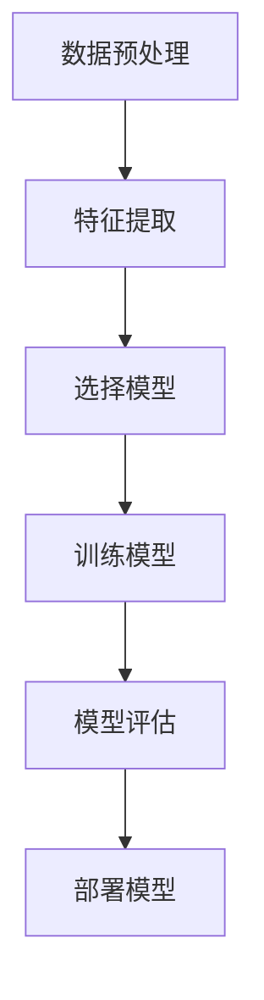
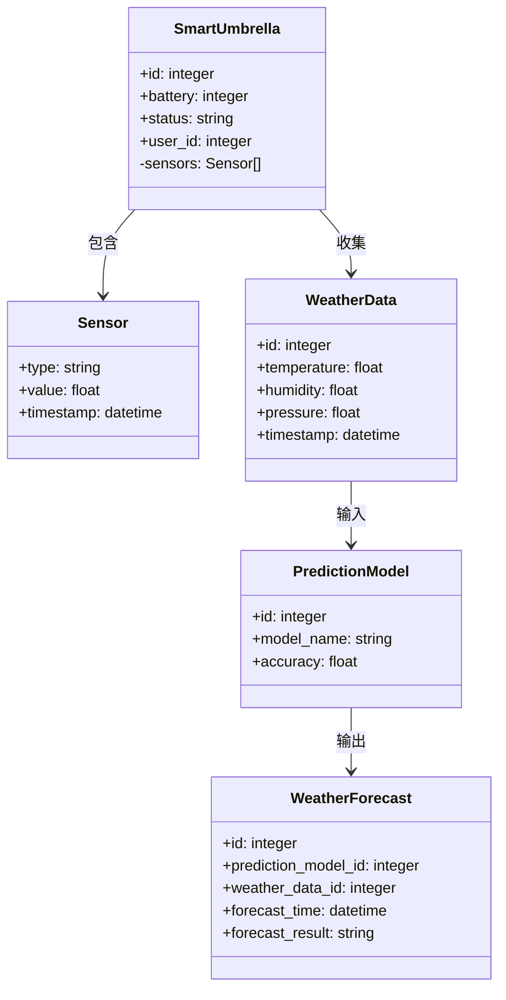
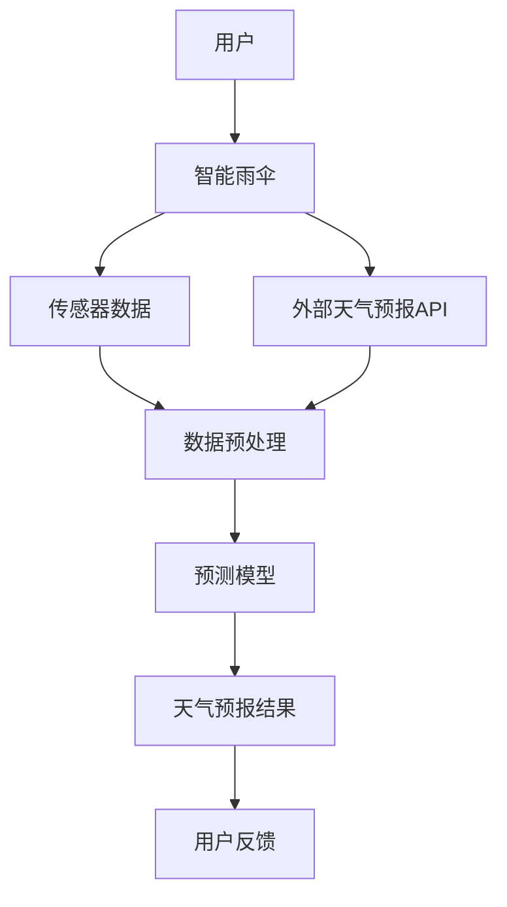
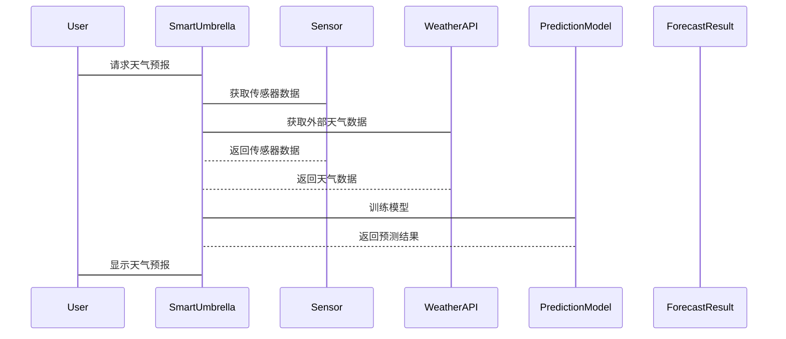

                 


# AI Agent在智能雨伞中的天气预报系统

> 关键词：AI Agent，智能雨伞，天气预报，系统设计，算法原理

> 摘要：本文详细探讨了AI Agent在智能雨伞中的天气预报系统的应用，从背景介绍、核心概念、算法原理到系统设计和项目实战，全面分析了该系统的实现过程和实际应用。

---

# 第一部分: AI Agent在智能雨伞中的天气预报系统背景介绍

## 第1章: 问题背景与描述

### 1.1 问题背景

#### 1.1.1 智能雨伞的发展现状
智能雨伞作为一种结合了物联网技术和人工智能的创新产品，近年来得到了广泛关注。它不仅具备传统雨伞的基本功能，还集成了一系列智能传感器和通信模块，能够实时感知环境数据并提供相应的服务。

#### 1.1.2 天气预报系统的需求分析
天气预报是人们日常生活中不可或缺的信息。传统天气预报系统依赖于大型气象站和复杂的计算模型，但其数据获取和更新频率有限。智能雨伞作为一种便携设备，能够实时收集环境数据，并通过AI Agent进行分析，为用户提供更精准、更及时的天气预报。

#### 1.1.3 AI Agent在智能雨伞中的作用
AI Agent（智能代理）在智能雨伞中的天气预报系统中扮演着关键角色。它能够实时接收传感器数据，结合历史天气数据和用户行为模式，预测未来天气情况，并为用户提供智能化的建议。

### 1.2 问题描述

#### 1.2.1 天气预报系统的核心问题
天气预报的核心问题是准确性和实时性。传统的天气预报系统依赖于大型气象站和复杂的计算模型，但在智能雨伞这种小型设备中，如何在有限的资源下实现高精度的天气预测是一个挑战。

#### 1.2.2 AI Agent在天气预报中的任务
AI Agent需要完成以下任务：
1. 实时接收并处理传感器数据（温度、湿度、气压等）。
2. 结合历史数据和外部天气预报API，预测未来天气情况。
3. 根据预测结果，向用户发送提醒或建议。

#### 1.2.3 智能雨伞天气预报系统的边界与外延
智能雨伞天气预报系统的边界包括智能雨伞硬件、传感器数据、AI Agent算法、用户交互界面以及外部天气预报API。其外延则涉及用户行为分析、数据存储与管理、网络安全等方面。

## 第2章: 核心概念与联系

### 2.1 核心概念原理

#### 2.1.1 AI Agent的基本原理
AI Agent是一种智能实体，能够感知环境、自主决策并执行任务。在智能雨伞中，AI Agent通过传感器数据和外部API获取信息，利用机器学习模型进行预测，并通过用户交互界面提供服务。

#### 2.1.2 天气预报系统的原理
天气预报系统通过收集气象数据（温度、湿度、气压等），结合历史数据和预测模型，生成天气预报结果。AI Agent通过优化数据处理和预测算法，提升预报的准确性和实时性。

#### 2.1.3 智能雨伞的集成原理
智能雨伞通过集成多种传感器和通信模块，实时收集环境数据，并通过AI Agent进行分析和预测。用户可以通过手机APP或语音助手获取天气预报信息，并根据建议决定是否需要携带雨伞。

### 2.2 核心概念对比表

| **核心概念** | **传统天气预报系统** | **智能雨伞天气预报系统** |
|--------------|-----------------------|---------------------------|
| 数据来源     | 大型气象站            | 传感器数据 + 外部API      |
| 数据处理     | 中央处理中心          | AI Agent本地处理         |
| 预报精度     | 较高但延迟较大        | 高精度且实时性较强       |
| 用户交互     | 通过网站或电视         | 手机APP或语音助手         |

### 2.3 ER实体关系图

```mermaid
erDiagram
    user {
        id : integer
        username : string
        password : string
    }
    weather_data {
        id : integer
        temperature : float
        humidity : float
        pressure : float
        timestamp : datetime
    }
    prediction_model {
        id : integer
        model_name : string
        accuracy : float
    }
    smart_umbrella {
        id : integer
        user_id : integer
        status : string
        battery : integer
    }
    weather_forecast {
        id : integer
        prediction_model_id : integer
        weather_data_id : integer
        forecast_time : datetime
        forecast_result : string
    }
    user --> smart_umbrella : 使用
    smart_umbrella --> weather_data : 收集
    weather_data --> prediction_model : 输入
    prediction_model --> weather_forecast : 输出
```

---

# 第二部分: AI Agent在智能雨伞中的天气预报系统算法原理

## 第3章: 算法原理讲解

### 3.1 机器学习模型选择

#### 3.1.1 回归模型
回归模型用于预测连续型变量，如温度和湿度。常用的回归模型包括线性回归（Linear Regression）和决策树回归（Decision Tree Regression）。

#### 3.1.2 分类模型
分类模型用于预测离散型变量，如天气状况（晴天、雨天、阴天）。常用的分类模型包括随机森林（Random Forest）和支持向量机（Support Vector Machine, SVM）。

### 3.2 算法实现流程



### 3.3 代码实现与分析

#### 3.3.1 数据预处理

```python
import pandas as pd
import numpy as np

# 加载数据
data = pd.read_csv('weather.csv')

# 删除缺失值
data.dropna(inplace=True)

# 标准化处理
from sklearn.preprocessing import StandardScaler
scaler = StandardScaler()
scaled_data = scaler.fit_transform(data[['temperature', 'humidity', 'pressure']])
```

#### 3.3.2 特征提取与模型选择

```python
from sklearn.ensemble import RandomForestClassifier
from sklearn.model_selection import train_test_split

# 特征矩阵和目标向量
X = scaled_data
y = data['weather_condition'].values

# 分割数据集
X_train, X_test, y_train, y_test = train_test_split(X, y, test_size=0.2, random_state=42)

# 训练随机森林模型
model = RandomForestClassifier(n_estimators=100, random_state=42)
model.fit(X_train, y_train)
```

#### 3.3.3 模型评估

```python
from sklearn.metrics import accuracy_score, confusion_matrix, classification_report

# 预测结果
y_pred = model.predict(X_test)

# 评估指标
print("Accuracy:", accuracy_score(y_test, y_pred))
print("Confusion Matrix:", confusion_matrix(y_test, y_pred))
print("Classification Report:", classification_report(y_test, y_pred))
```

---

## 第4章: 系统分析与架构设计

### 4.1 项目背景

智能雨伞天气预报系统的开发旨在为用户提供实时、精准的天气预报服务，提升用户体验。

### 4.2 系统功能设计

#### 4.2.1 领域模型设计



### 4.3 系统架构设计

#### 4.3.1 分层架构



### 4.4 系统交互设计

#### 4.4.1 序列图



---

## 第5章: 项目实战

### 5.1 环境安装

```bash
pip install numpy pandas scikit-learn mermaid
```

### 5.2 核心代码实现

#### 5.2.1 数据预处理

```python
import pandas as pd
import numpy as np

# 加载数据
data = pd.read_csv('weather.csv')

# 删除缺失值
data.dropna(inplace=True)

# 标准化处理
from sklearn.preprocessing import StandardScaler
scaler = StandardScaler()
scaled_data = scaler.fit_transform(data[['temperature', 'humidity', 'pressure']])
```

#### 5.2.2 模型训练

```python
from sklearn.ensemble import RandomForestClassifier
from sklearn.model_selection import train_test_split

# 特征矩阵和目标向量
X = scaled_data
y = data['weather_condition'].values

# 分割数据集
X_train, X_test, y_train, y_test = train_test_split(X, y, test_size=0.2, random_state=42)

# 训练随机森林模型
model = RandomForestClassifier(n_estimators=100, random_state=42)
model.fit(X_train, y_train)
```

#### 5.2.3 模型评估

```python
from sklearn.metrics import accuracy_score, confusion_matrix, classification_report

# 预测结果
y_pred = model.predict(X_test)

# 评估指标
print("Accuracy:", accuracy_score(y_test, y_pred))
print("Confusion Matrix:", confusion_matrix(y_test, y_pred))
print("Classification Report:", classification_report(y_test, y_pred))
```

---

## 第6章: 总结与展望

### 6.1 总结

本文详细探讨了AI Agent在智能雨伞中的天气预报系统的实现过程，从背景介绍、核心概念到算法原理和系统设计，全面分析了该系统的实现细节和实际应用。

### 6.2 小结

通过本文的分析，读者可以了解AI Agent在智能雨伞中的作用，掌握天气预报系统的实现方法，并能够通过实际案例理解系统的运行原理。

### 6.3 注意事项

在实际应用中，需要注意数据安全、模型优化和用户体验等问题，确保系统的稳定性和可靠性。

### 6.4 拓展阅读

建议读者进一步阅读相关领域的书籍和论文，深入了解AI Agent和天气预报系统的最新研究成果。

---

# 作者：AI天才研究院/AI Genius Institute & 禅与计算机程序设计艺术 /Zen And The Art of Computer Programming

