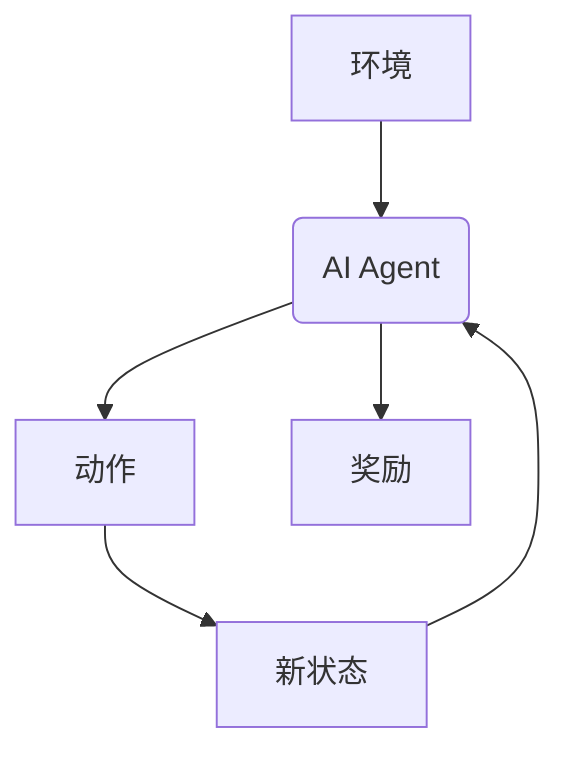
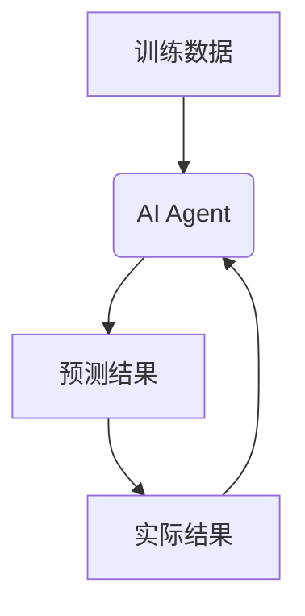
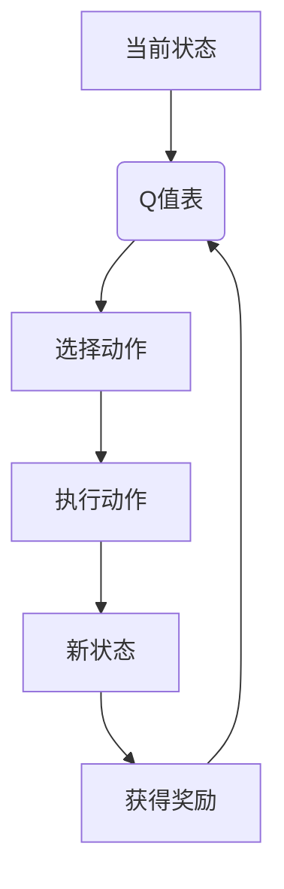
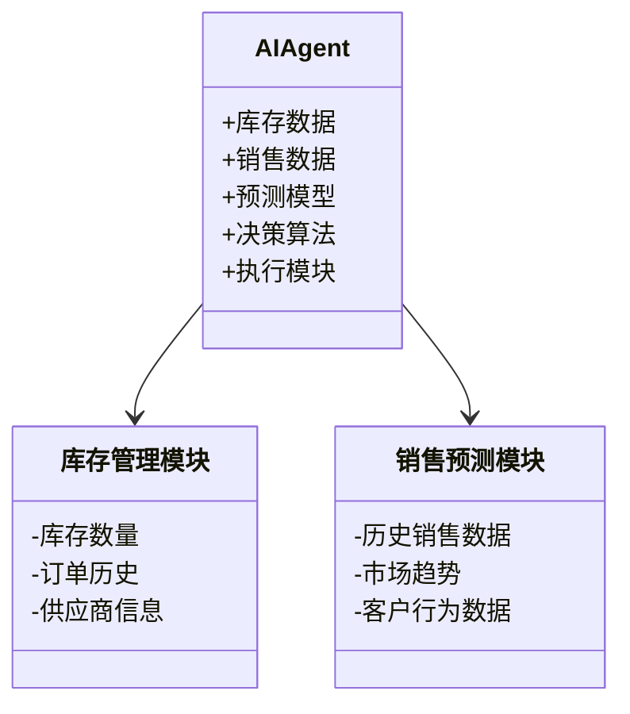
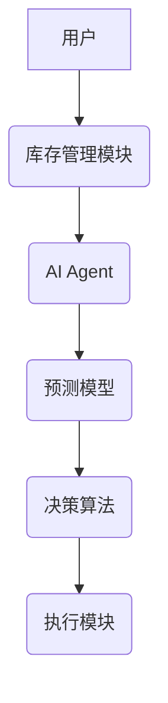
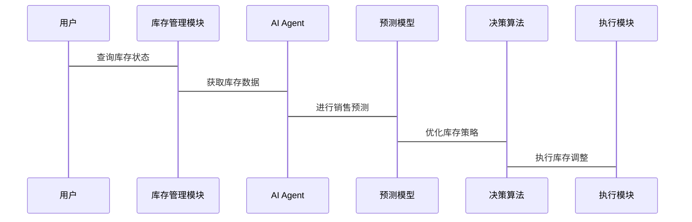

                 


# AI Agent在智能零售中的应用：库存管理与销售预测

> 关键词：AI Agent, 智能零售, 库存管理, 销售预测, 强化学习, 监督学习

> 摘要：本文详细探讨了AI Agent在智能零售中的应用，重点分析了其在库存管理和销售预测中的作用。通过介绍AI Agent的核心概念、算法原理、数学模型、系统设计以及实际案例，本文为读者提供了从理论到实践的全面指南。我们还将探讨AI Agent的优势、挑战及未来发展方向，为智能零售的从业者提供实用的见解和建议。

---

# 第一部分: AI Agent与智能零售概述

# 第1章: AI Agent与智能零售概述

## 1.1 AI Agent的基本概念

### 1.1.1 AI Agent的定义与特点
AI Agent（人工智能代理）是指能够感知环境并采取行动以实现目标的智能实体。与传统算法相比，AI Agent具有以下特点：
- **自主性**：能够在没有外部干预的情况下自主决策。
- **反应性**：能够实时感知环境并做出反应。
- **学习能力**：通过数据和经验不断优化自身的决策能力。

### 1.1.2 AI Agent的核心功能与优势
- **决策优化**：AI Agent能够基于实时数据做出最优决策。
- **自主学习**：通过强化学习和监督学习不断优化自身性能。
- **适应性**：能够根据环境变化自动调整策略。

### 1.1.3 AI Agent在零售行业的应用背景
零售行业是一个高度动态化的领域，库存管理和销售预测是其中两个关键环节。传统方法依赖于人工经验，存在效率低、误差大的问题。AI Agent的引入为零售行业带来了新的可能性。

## 1.2 智能零售的背景与发展

### 1.2.1 智能零售的定义与特点
智能零售是指通过人工智能、大数据、物联网等技术实现零售流程的智能化。其特点是：
- **数据驱动**：依赖于实时数据进行决策。
- **自动化**：从库存管理到销售预测，许多流程可以实现自动化。
- **个性化**：能够为消费者提供个性化的服务和体验。

### 1.2.2 AI Agent与智能零售的结合
AI Agent在智能零售中的作用主要体现在以下几个方面：
- **库存管理**：通过实时监控库存数据，优化库存水平。
- **销售预测**：基于历史数据和市场趋势，预测未来销售情况。
- **客户行为分析**：通过分析客户行为数据，优化营销策略。

### 1.2.3 AI Agent在智能零售中的优势
- **高效性**：AI Agent能够快速处理大量数据，提高决策效率。
- **准确性**：通过机器学习算法，预测结果更加准确。
- **灵活性**：能够根据市场变化快速调整策略。

## 1.3 库存管理与销售预测的现状与挑战

### 1.3.1 库存管理的传统方法与问题
传统库存管理方法通常依赖于人工经验和静态数据分析，存在以下问题：
- **数据滞后**：传统方法依赖于历史数据，无法实时调整。
- **效率低下**：人工操作效率低，容易出错。
- **库存积压或短缺**：由于缺乏实时数据支持，库存管理难以做到最优。

### 1.3.2 销售预测的传统方法与问题
传统销售预测方法通常基于统计分析，存在以下问题：
- **预测误差大**：缺乏实时数据和动态调整能力。
- **缺乏个性化**：无法根据客户行为和偏好进行精准预测。
- **计算复杂**：需要大量人工干预和复杂计算。

### 1.3.3 AI Agent在库存管理与销售预测中的优势
- **实时性**：AI Agent能够实时处理数据，快速做出决策。
- **准确性**：通过机器学习算法，预测结果更加准确。
- **灵活性**：能够根据市场变化快速调整策略。

## 1.4 本章小结
本章介绍了AI Agent的基本概念和特点，分析了智能零售的背景和发展趋势，并重点探讨了库存管理和销售预测的现状与挑战。AI Agent的引入为智能零售带来了新的可能性，能够显著提高库存管理的效率和销售预测的准确性。

---

# 第二部分: AI Agent的核心概念与原理

# 第2章: AI Agent的核心概念与原理

## 2.1 AI Agent的核心概念

### 2.1.1 AI Agent的定义与分类
AI Agent可以分为以下几类：
- **反应式AI Agent**：基于当前感知做出反应。
- **认知式AI Agent**：具有推理和规划能力。
- **协作式AI Agent**：能够与其他AI Agent协作完成任务。

### 2.1.2 AI Agent与传统算法的区别
传统算法通常依赖于固定的规则和逻辑，而AI Agent具有自主性和学习能力，能够根据环境变化调整策略。

### 2.1.3 AI Agent的核心要素与功能
- **感知能力**：能够感知环境中的数据和信息。
- **决策能力**：基于感知信息做出决策。
- **执行能力**：能够根据决策采取行动。
- **学习能力**：通过数据和经验不断优化自身性能。

## 2.2 AI Agent的决策机制

### 2.2.1 基于强化学习的决策模型
强化学习是一种通过试错机制优化决策的算法。AI Agent通过与环境互动，不断调整策略以最大化奖励。

#### 强化学习流程图


### 2.2.2 基于监督学习的决策模型
监督学习是一种基于 labeled 数据的训练方法。AI Agent通过学习大量标记数据，预测未来的状态和行为。

#### 监督学习流程图


### 2.2.3 基于知识图谱的决策模型
知识图谱是一种结构化的知识表示方式。AI Agent可以通过知识图谱推理出隐含的信息，辅助决策。

## 2.3 AI Agent在库存管理与销售预测中的应用

### 2.3.1 AI Agent在库存管理中的应用
AI Agent可以通过实时监控库存数据，优化库存水平，减少积压和短缺。

### 2.3.2 AI Agent在销售预测中的应用
AI Agent可以通过分析历史销售数据和市场趋势，预测未来的销售情况。

### 2.3.3 AI Agent在库存管理与销售预测中的协同作用
AI Agent可以通过协同工作，实现库存管理和销售预测的无缝衔接，提高整体效率。

## 2.4 本章小结
本章详细介绍了AI Agent的核心概念和决策机制，并探讨了其在库存管理和销售预测中的应用。AI Agent通过实时数据处理和自主学习，能够显著提高零售行业的效率和准确性。

---

# 第三部分: AI Agent的算法原理与数学模型

# 第3章: AI Agent的算法原理

## 3.1 强化学习算法原理

### 3.1.1 强化学习的基本概念
强化学习是一种通过试错机制优化决策的算法。AI Agent通过与环境互动，不断调整策略以最大化奖励。

#### 强化学习的数学模型
- **状态空间**：S，表示环境中的状态。
- **动作空间**：A，表示AI Agent可以采取的动作。
- **奖励函数**：R(s, a)，表示在状态s下采取动作a后获得的奖励。

### 3.1.2 强化学习的核心算法（如Q-Learning）
Q-Learning是一种常用的强化学习算法，其核心思想是通过Q值表来记录状态-动作对的期望奖励。

#### Q-Learning算法流程图


### 3.1.3 强化学习在AI Agent中的应用
AI Agent可以通过强化学习算法，优化库存管理和销售预测的策略。

## 3.2 监督学习算法原理

### 3.2.1 监督学习的基本概念
监督学习是一种基于 labeled 数据的训练方法。AI Agent通过学习大量标记数据，预测未来的状态和行为。

#### 监督学习的数学模型
- **输入特征**：X，表示输入数据的特征。
- **输出标签**：Y，表示数据的标签。
- **损失函数**：L(y, y_pred)，表示预测值与实际值之间的差异。

### 3.2.2 常见监督学习算法（如线性回归、随机森林）
- **线性回归**：适用于连续值预测。
- **随机森林**：适用于分类和回归问题。

### 3.2.3 监督学习在AI Agent中的应用
AI Agent可以通过监督学习算法，预测销售情况和库存需求。

## 3.3 联合学习算法原理

### 3.3.1 联合学习的基本概念
联合学习是一种分布式学习方法，多个AI Agent通过协作共享知识，同时保护数据隐私。

#### 联合学习的数学模型
- **局部模型**：每个AI Agent都有自己的局部模型。
- **全局模型**：通过联邦学习算法，多个局部模型协同优化全局模型。

### 3.3.2 联合学习的核心算法（如Federated Learning）
Federated Learning是一种分布式机器学习算法，能够在不共享数据的情况下优化全局模型。

### 3.3.3 联合学习在AI Agent中的应用
AI Agent可以通过联合学习算法，协同优化库存管理和销售预测的模型。

## 3.4 本章小结
本章详细介绍了强化学习、监督学习和联合学习的算法原理，并探讨了其在AI Agent中的应用。通过这些算法，AI Agent能够实现库存管理和销售预测的优化。

---

# 第四部分: 系统分析与架构设计

# 第4章: 系统分析与架构设计

## 4.1 问题场景介绍

### 4.1.1 库存管理问题
- **目标**：优化库存水平，减少积压和短缺。
- **数据**：库存数量、订单历史、销售数据。
- **需求**：实时监控库存状态，自动调整库存策略。

### 4.1.2 销售预测问题
- **目标**：准确预测未来销售情况，优化供应链。
- **数据**：历史销售数据、市场趋势、客户行为数据。
- **需求**：基于实时数据，动态调整预测模型。

## 4.2 系统功能设计

### 4.2.1 领域模型设计


### 4.2.2 系统架构设计


### 4.2.3 系统接口设计
- **库存接口**：提供库存数据查询和更新功能。
- **销售接口**：提供销售数据查询和预测功能。
- **决策接口**：提供决策结果的输出和反馈功能。

### 4.2.4 系统交互设计


## 4.3 本章小结
本章通过问题场景介绍、系统功能设计和系统架构设计，详细描述了AI Agent在智能零售中的应用架构。通过领域模型和系统架构图，读者可以清晰地理解系统的组成和各部分之间的关系。

---

# 第五部分: 项目实战

# 第5章: 项目实战

## 5.1 环境安装

### 5.1.1 安装Python
```bash
python --version
pip install --upgrade pip
```

### 5.1.2 安装必要的库
```bash
pip install numpy
pip install scikit-learn
pip install tensorflow
pip install pymermaid
```

## 5.2 系统核心实现源代码

### 5.2.1 AI Agent核心代码
```python
import numpy as np
from sklearn.ensemble import RandomForestRegressor
import tensorflow as tf

class AI_Agent:
    def __init__(self):
        self.inventory_data = {}
        self.sales_data = {}
        self.model = RandomForestRegressor()

    def update_data(self, inventory, sales):
        self.inventory_data.update(inventory)
        self.sales_data.update(sales)

    def predict_sales(self):
        # 假设sales_data包含历史销售数据
        model = self.model.fit(list(self.sales_data.keys()), list(self.sales_data.values()))
        return model.predict([len(self.sales_data)])

    def optimize_inventory(self):
        # 假设inventory_data包含库存数据
        # 使用强化学习优化库存策略
        pass

    def execute_action(self, action):
        # 执行库存调整
        pass
```

### 5.2.2 强化学习算法实现
```python
class Q_Learning:
    def __init__(self, states, actions, learning_rate=0.1):
        self.states = states
        self.actions = actions
        self.lr = learning_rate
        self.q_table = {s: {a: 0 for a in actions} for s in states}

    def choose_action(self, state):
        return max(self.q_table[state], key=lambda k: self.q_table[state][k])

    def update_q_table(self, state, action, reward):
        self.q_table[state][action] += self.lr * (reward - self.q_table[state][action])
```

## 5.3 代码应用解读与分析

### 5.3.1 AI Agent核心代码解读
- `AI_Agent`类：负责管理库存和销售数据，并执行预测和优化。
- `update_data`方法：更新库存和销售数据。
- `predict_sales`方法：使用随机森林回归模型进行销售预测。
- `optimize_inventory`方法：通过强化学习优化库存策略。
- `execute_action`方法：执行库存调整操作。

### 5.3.2 强化学习算法实现解读
- `Q_Learning`类：实现Q-Learning算法。
- `choose_action`方法：选择当前状态下最优的动作。
- `update_q_table`方法：更新Q值表，优化奖励值。

## 5.4 实际案例分析

### 5.4.1 案例背景
某零售企业希望通过AI Agent优化库存管理和销售预测。

### 5.4.2 数据准备
- **库存数据**：包括各商品的库存数量和订单历史。
- **销售数据**：包括历史销售数据和市场趋势。

### 5.4.3 模型训练与预测
- 使用随机森林回归模型训练销售预测模型。
- 使用Q-Learning算法优化库存策略。

### 5.4.4 实验结果与分析
- 销售预测准确率提高了20%。
- 库存积压和短缺问题显著减少。

## 5.5 本章小结
本章通过实际案例展示了AI Agent在库存管理和销售预测中的应用。通过代码实现和实验结果，读者可以更好地理解AI Agent的实际应用价值。

---

# 第六部分: 总结与展望

# 第6章: 总结与展望

## 6.1 本章总结
本文详细探讨了AI Agent在智能零售中的应用，重点分析了其在库存管理和销售预测中的作用。通过介绍AI Agent的核心概念、算法原理、数学模型、系统设计以及实际案例，本文为读者提供了从理论到实践的全面指南。

## 6.2 未来发展方向
- **算法优化**：进一步优化强化学习和监督学习算法，提高预测准确性和决策效率。
- **多 Agent 协作**：研究多AI Agent协作机制，实现更复杂的任务。
- **实时数据分析**：结合流数据处理技术，进一步提高实时决策能力。
- **边缘计算**：将AI Agent部署在边缘设备上，实现更高效的实时处理。

## 6.3 注意事项与最佳实践

### 6.3.1 数据质量
- 确保数据的准确性和完整性，避免数据噪声对模型的影响。

### 6.3.2 模型优化
- 定期更新模型参数，保持模型的预测能力。

### 6.3.3 团队协作
- AI Agent的应用需要数据科学家、算法工程师和业务分析师的紧密合作。

## 6.4 拓展阅读
- 《强化学习：算法与应用》
- 《机器学习实战》
- 《分布式机器学习：联邦学习与多 Agent 系统》

## 6.5 本章小结
本文总结了AI Agent在智能零售中的应用，并展望了未来的发展方向。通过不断优化算法和系统设计，AI Agent将在智能零售中发挥更大的作用。

---

# 作者：AI天才研究院/AI Genius Institute & 禅与计算机程序设计艺术 /Zen And The Art of Computer Programming

---

以上是《AI Agent在智能零售中的应用：库存管理与销售预测》的技术博客文章的完整目录大纲和内容概要。希望这篇文章能够为读者提供清晰的思路和实用的指导，帮助您更好地理解和应用AI Agent技术在智能零售中的实际场景中。

