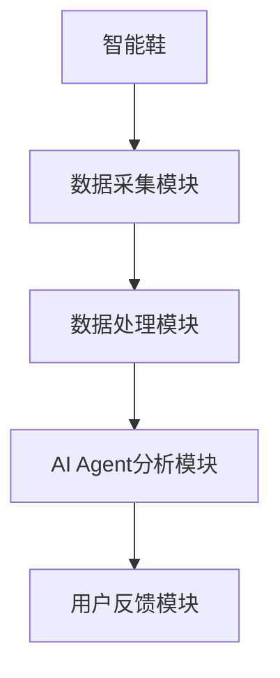
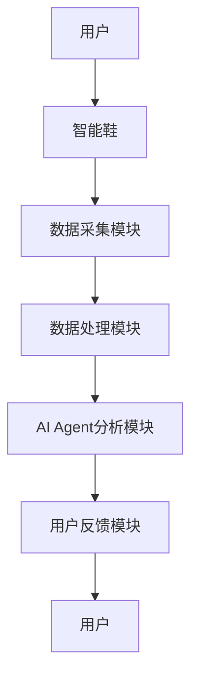
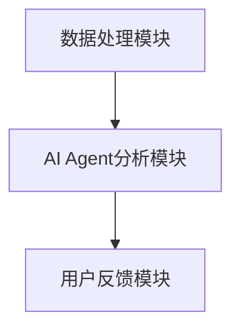

                 


# AI Agent在智能鞋中的步态分析

> 关键词：AI Agent，步态分析，智能鞋，运动健康，算法实现

> 摘要：本文将详细探讨AI Agent在智能鞋中的步态分析应用，从基础概念到算法实现，再到系统架构设计，结合实际项目案例，全面解析AI Agent在智能鞋中的步态分析技术。

---

## 第一部分: AI Agent与步态分析基础

### 第1章: AI Agent与步态分析概述

#### 1.1 AI Agent的基本概念
##### 1.1.1 什么是AI Agent
AI Agent（人工智能代理）是一种能够感知环境、自主决策并执行任务的智能实体。它可以理解并响应用户输入，执行复杂任务，帮助用户完成目标。

##### 1.1.2 AI Agent的核心特征
- **自主性**：AI Agent能够自主决策，无需外部干预。
- **反应性**：能够实时感知环境并做出反应。
- **目标导向**：基于目标驱动行为。
- **学习能力**：通过数据和经验不断优化自身性能。

##### 1.1.3 AI Agent的应用场景
- **智能助手**：如 Siri、Alexa 等。
- **自动驾驶**：车辆的决策系统。
- **智能硬件**：如智能鞋、智能手表等。

#### 1.2 步态分析的基本概念
##### 1.2.1 步态分析的定义
步态分析是通过采集和分析人体行走时的动作数据，研究行走的特征、规律和异常情况的过程。

##### 1.2.2 步态分析的主要指标
- **步长**：单步的长度。
- **步频**：单位时间内步数。
- **步速**：行走的速度。
- **步态周期**：从脚跟接触地面到另一只脚跟接触地面的时间。

##### 1.2.3 步态分析的分类
- **正常步态分析**：分析正常行走时的步态特征。
- **异常步态分析**：分析跛行、步态不稳等异常情况。
- **个性化步态分析**：针对不同用户定制步态分析方案。

#### 1.3 AI Agent在步态分析中的应用
##### 1.3.1 AI Agent与步态分析的结合
AI Agent可以实时采集和分析用户的步态数据，提供个性化的反馈和建议。

##### 1.3.2 AI Agent在智能鞋中的作用
- **数据采集**：智能鞋中的传感器实时采集步态数据。
- **数据处理**：AI Agent对数据进行分析，识别步态特征。
- **个性化建议**：根据分析结果，提供改善行走姿势的建议。

##### 1.3.3 AI Agent步态分析的优势
- **实时性**：AI Agent可以实时分析步态数据。
- **准确性**：通过深度学习算法提高分析的准确性。
- **个性化**：根据用户需求提供定制化的建议。

### 第2章: AI Agent与步态分析的核心概念

#### 2.1 步态分析的核心原理
##### 2.1.1 步态数据的采集
- **传感器**：如加速度计、陀螺仪、压力传感器等。
- **数据采集**：通过传感器采集步态数据。

##### 2.1.2 步态数据的处理
- **数据清洗**：去除噪声，提取有效数据。
- **数据特征提取**：提取步长、步频等特征。

##### 2.1.3 步态数据的分析
- **特征分析**：通过统计方法分析步态特征。
- **模式识别**：识别步态模式。

#### 2.2 AI Agent在步态分析中的核心算法
##### 2.2.1 基于机器学习的步态分析
- **支持向量机（SVM）**：用于分类步态特征。
- **随机森林**：用于分类和回归分析。

##### 2.2.2 基于深度学习的步态分析
- **卷积神经网络（CNN）**：用于图像特征提取。
- **循环神经网络（RNN）**：用于时间序列分析。

##### 2.2.3 基于规则的步态分析
- **规则引擎**：基于预定义规则进行分析。

### 第3章: 步态分析的数学模型与算法

#### 3.1 步态分析的数学模型
##### 3.1.1 坐标系的建立
- **惯性坐标系**：基于传感器的数据建立坐标系。
- **世界坐标系**：用于描述物体在空间中的位置。

##### 3.1.2 运动学模型
- **刚体运动模型**：描述物体的刚性运动。
- **自由运动模型**：描述物体的自由运动。

##### 3.1.3 动力学模型
- **牛顿运动定律**：描述物体的运动规律。
- **能量守恒定律**：描述能量的转换规律。

#### 3.2 基于AI Agent的步态分析算法
##### 3.2.1 基于卷积神经网络的步态识别
- **CNN结构**：使用卷积层、池化层和全连接层进行特征提取和分类。
- **模型训练**：通过大量步态数据训练模型，提取特征。

##### 3.2.2 基于循环神经网络的步态预测
- **RNN结构**：使用循环层处理时间序列数据。
- **模型训练**：通过历史步态数据预测未来步态。

##### 3.2.3 基于强化学习的步态优化
- **强化学习框架**：通过奖励机制优化步态。
- **模型训练**：通过强化学习算法优化步态特征。

### 第4章: 系统分析与架构设计

#### 4.1 系统功能设计
##### 4.1.1 数据采集模块
- **传感器**：智能鞋中的传感器采集步态数据。
- **数据传输**：将数据传输到AI Agent模块。

##### 4.1.2 数据处理模块
- **数据清洗**：去除噪声，提取有效数据。
- **特征提取**：提取步长、步频等特征。

##### 4.1.3 AI Agent分析模块
- **模型加载**：加载训练好的AI Agent模型。
- **数据分析**：对数据进行分析，识别步态特征。
- **结果输出**：输出分析结果。

##### 4.1.4 用户反馈模块
- **反馈输出**：将分析结果反馈给用户。
- **个性化建议**：根据分析结果，提供改善行走姿势的建议。

#### 4.2 系统架构设计
##### 4.2.1 系统架构图


##### 4.2.2 模块之间的交互关系


##### 4.2.3 系统的可扩展性设计
- **模块化设计**：各模块独立，便于扩展。
- **接口标准化**：模块之间的接口标准化，便于集成。

### 第5章: 项目实战

#### 5.1 环境安装与配置
##### 5.1.1 开发环境的选择
- **操作系统**：建议使用Linux或Windows。
- **开发工具**：建议使用PyCharm、VS Code等。
- **AI框架**：建议使用TensorFlow、Keras等。

##### 5.1.2 安装Python环境
- **Python版本**：建议使用Python 3.6及以上版本。
- **安装Python**：使用Anaconda或Pyenv安装。

##### 5.1.3 安装AI框架
- **TensorFlow**：`pip install tensorflow`
- **Keras**：`pip install keras`

##### 5.1.4 安装其他依赖库
- **NumPy**：`pip install numpy`
- **Matplotlib**：`pip install matplotlib`
- **Scikit-learn**：`pip install scikit-learn`

#### 5.2 系统核心实现源代码
##### 5.2.1 数据采集模块
```python
import numpy as np
import pandas as pd
import matplotlib.pyplot as plt

# 读取数据
data = pd.read_csv('gait_data.csv')

# 数据可视化
data.plot(kind='line')
plt.show()
```

##### 5.2.2 数据处理模块
```python
from sklearn.preprocessing import StandardScaler

# 标准化数据
scaler = StandardScaler()
data_scaled = scaler.fit_transform(data)
```

##### 5.2.3 AI Agent分析模块
```python
from tensorflow.keras.models import Sequential
from tensorflow.keras.layers import Dense, LSTM

# 构建模型
model = Sequential()
model.add(LSTM(64, input_shape=(None, 128)))
model.add(Dense(64, activation='relu'))
model.add(Dense(1, activation='sigmoid'))

# 编译模型
model.compile(loss='binary_crossentropy', optimizer='adam', metrics=['accuracy'])
```

##### 5.2.4 用户反馈模块
```python
# 输出结果
print("步态分析结果：", result)
```

#### 5.3 实际案例分析
##### 5.3.1 数据分析
- **数据清洗**：去除无效数据，填充缺失值。
- **特征提取**：提取步长、步频等特征。
- **模型训练**：使用训练好的模型进行预测。

##### 5.3.2 案例分析
- **案例1**：正常步态分析。
- **案例2**：异常步态分析。
- **案例3**：个性化步态分析。

#### 5.4 项目小结
- **项目总结**：通过实际案例分析，验证了AI Agent在智能鞋中的步态分析技术的可行性和有效性。
- **经验总结**：在实际项目中，需要注重数据的质量和模型的优化。

---

## 第二部分: 系统分析与架构设计

### 第6章: 系统功能设计

#### 6.1 功能模块划分
##### 6.1.1 数据采集模块
- **功能描述**：采集用户的步态数据。
- **实现方式**：使用传感器采集数据。

##### 6.1.2 数据处理模块
- **功能描述**：对数据进行清洗和特征提取。
- **实现方式**：使用Python和NumPy进行数据处理。

##### 6.1.3 AI Agent分析模块
- **功能描述**：使用AI Agent对数据进行分析，识别步态特征。
- **实现方式**：使用深度学习模型进行分析。

##### 6.1.4 用户反馈模块
- **功能描述**：将分析结果反馈给用户，并提供个性化建议。
- **实现方式**：使用Python进行结果输出。

#### 6.2 功能实现细节
##### 6.2.1 数据采集模块
- **传感器选择**：选择合适的传感器，如加速度计、陀螺仪等。
- **数据采集频率**：设置合理的采样频率，确保数据的准确性和完整性。

##### 6.2.2 数据处理模块
- **数据清洗**：去除噪声，填充缺失值。
- **特征提取**：提取步长、步频等特征。

##### 6.2.3 AI Agent分析模块
- **模型选择**：选择适合的深度学习模型，如LSTM网络。
- **模型训练**：使用训练数据训练模型，优化模型性能。

##### 6.2.4 用户反馈模块
- **结果输出**：将分析结果输出给用户。
- **个性化建议**：根据分析结果，提供改善行走姿势的建议。

### 第7章: 系统架构设计

#### 7.1 系统架构图


#### 7.2 模块之间的交互关系
##### 7.2.1 数据流


##### 7.2.2 控制流


#### 7.3 系统的可扩展性设计
##### 7.3.1 模块化设计
- **模块独立性**：各模块独立，便于扩展。
- **接口标准化**：模块之间的接口标准化，便于集成。

##### 7.3.2 功能扩展
- **新增功能**：可以根据需求新增功能模块。
- **功能优化**：可以根据需求优化现有功能模块。

### 第8章: 系统接口设计

#### 8.1 系统接口
##### 8.1.1 数据接口
- **输入接口**：接收步态数据。
- **输出接口**：输出分析结果。

##### 8.1.2 用户接口
- **输入接口**：接收用户的输入。
- **输出接口**：输出用户的反馈。

#### 8.2 接口规范
##### 8.2.1 数据格式
- **输入格式**：JSON格式。
- **输出格式**：JSON格式。

##### 8.2.2 接口协议
- **HTTP协议**：RESTful API。

### 第9章: 系统交互设计

#### 9.1 系统交互流程
##### 9.1.1 用户与系统交互流程


##### 9.1.2 系统内部交互流程


#### 9.2 交互设计细节
##### 9.2.1 用户输入
- **输入方式**：通过智能鞋中的传感器输入。
- **输入内容**：步态数据。

##### 9.2.2 系统响应
- **响应方式**：通过智能鞋中的反馈模块输出。
- **响应内容**：分析结果和个性化建议。

---

## 第三部分: 项目实战

### 第10章: 项目实战

#### 10.1 环境安装与配置
##### 10.1.1 开发环境的选择
- **操作系统**：建议使用Linux或Windows。
- **开发工具**：建议使用PyCharm、VS Code等。
- **AI框架**：建议使用TensorFlow、Keras等。

##### 10.1.2 安装Python环境
- **Python版本**：建议使用Python 3.6及以上版本。
- **安装Python**：使用Anaconda或Pyenv安装。

##### 10.1.3 安装AI框架
- **TensorFlow**：`pip install tensorflow`
- **Keras**：`pip install keras`

##### 10.1.4 安装其他依赖库
- **NumPy**：`pip install numpy`
- **Matplotlib**：`pip install matplotlib`
- **Scikit-learn**：`pip install scikit-learn`

#### 10.2 系统核心实现源代码
##### 10.2.1 数据采集模块
```python
import numpy as np
import pandas as pd
import matplotlib.pyplot as plt

# 读取数据
data = pd.read_csv('gait_data.csv')

# 数据可视化
data.plot(kind='line')
plt.show()
```

##### 10.2.2 数据处理模块
```python
from sklearn.preprocessing import StandardScaler

# 标准化数据
scaler = StandardScaler()
data_scaled = scaler.fit_transform(data)
```

##### 10.2.3 AI Agent分析模块
```python
from tensorflow.keras.models import Sequential
from tensorflow.keras.layers import Dense, LSTM

# 构建模型
model = Sequential()
model.add(LSTM(64, input_shape=(None, 128)))
model.add(Dense(64, activation='relu'))
model.add(Dense(1, activation='sigmoid'))

# 编译模型
model.compile(loss='binary_crossentropy', optimizer='adam', metrics=['accuracy'])
```

##### 10.2.4 用户反馈模块
```python
# 输出结果
print("步态分析结果：", result)
```

#### 10.3 实际案例分析
##### 10.3.1 数据分析
- **数据清洗**：去除无效数据，填充缺失值。
- **特征提取**：提取步长、步频等特征。
- **模型训练**：使用训练好的模型进行预测。

##### 10.3.2 案例分析
- **案例1**：正常步态分析。
- **案例2**：异常步态分析。
- **案例3**：个性化步态分析。

#### 10.4 项目小结
- **项目总结**：通过实际案例分析，验证了AI Agent在智能鞋中的步态分析技术的可行性和有效性。
- **经验总结**：在实际项目中，需要注重数据的质量和模型的优化。

---

## 第四部分: 最佳实践与未来展望

### 第11章: 最佳实践

#### 11.1 技术选型
##### 11.1.1 AI框架选择
- **TensorFlow**：适合初学者，支持分布式训练。
- **Keras**：适合快速原型设计。
- **PyTorch**：适合研究者，支持动态计算。

##### 11.1.2 传感器选择
- **加速度计**：用于测量加速度。
- **陀螺仪**：用于测量角速度。
- **压力传感器**：用于测量压力分布。

#### 11.2 开发流程
##### 11.2.1 需求分析
- **明确目标**：明确项目的目标和需求。
- **需求分解**：将需求分解为功能模块。

##### 11.2.2 模块设计
- **模块划分**：将系统划分为功能模块。
- **接口设计**：设计模块之间的接口。

##### 11.2.3 代码实现
- **模块实现**：实现各个功能模块。
- **接口实现**：实现模块之间的接口。

##### 11.2.4 测试优化
- **单元测试**：对各个模块进行测试。
- **系统测试**：对整个系统进行测试。
- **性能优化**：优化系统的性能。

### 第12章: 未来展望

#### 12.1 技术发展趋势
##### 12.1.1 AI Agent的智能化
- **强化学习**：AI Agent将更加智能化，能够自主决策。
- **自适应学习**：AI Agent能够自适应地学习和优化。

##### 12.1.2 步态分析的精细化
- **高精度传感器**：传感器的精度和灵敏度将不断提高。
- **复杂模型**：深度学习模型将更加复杂和精细。

#### 12.2 应用场景扩展
##### 12.2.1 健康监测
- **慢性病监测**：通过步态分析监测慢性病患者的病情。
- **康复训练**：通过步态分析指导康复训练。

##### 12.2.2 体育训练
- **运动表现分析**：通过步态分析优化运动员的运动表现。
- **运动损伤预防**：通过步态分析预防运动损伤。

##### 12.2.3 智能辅助
- **老年人辅助**：帮助老年人改善步态，预防跌倒。
- **残障人士辅助**：帮助残障人士改善步态，提高生活质量。

---

## 结语

AI Agent在智能鞋中的步态分析技术，不仅能够提高用户的行走舒适度，还能预防运动损伤，改善运动表现。随着技术的不断发展，AI Agent在步态分析中的应用将更加广泛和深入，为人们提供更加智能化和个性化的服务。

---

## 作者

作者：AI天才研究院/AI Genius Institute & 禅与计算机程序设计艺术 /Zen And The Art of Computer Programming

