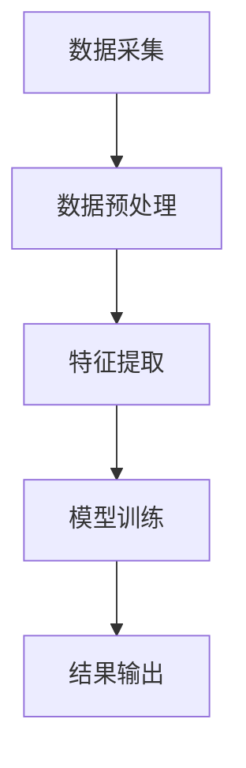
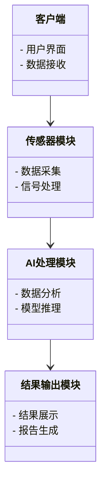
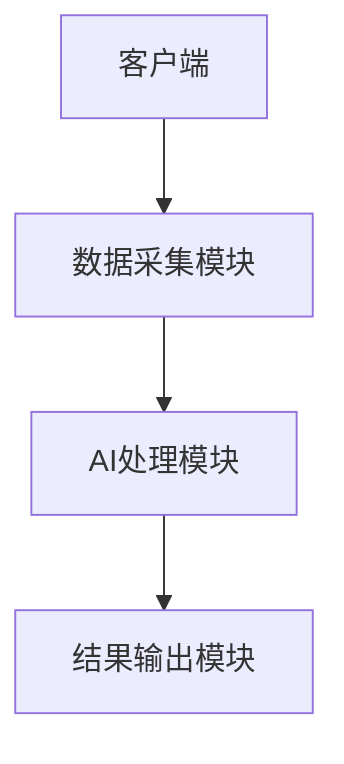

                 


# AI Agent在智能鞋垫中的步态分析

> 关键词：AI Agent, 步态分析, 智能鞋垫, 机器学习, 数据分析, 健康监测

> 摘要：本文详细探讨了AI Agent在智能鞋垫中的步态分析应用。从AI Agent和步态分析的基本概念出发，结合智能鞋垫的实际应用场景，分析了AI Agent如何通过机器学习算法处理步态数据，实现对步态特征的提取与分析。文章进一步讨论了AI Agent在步态分析中的算法原理、系统架构设计以及实际项目实现，展示了AI技术在智能鞋垫中的巨大潜力和实际应用价值。

---

# 第一部分: AI Agent与步态分析的背景介绍

## 第1章: AI Agent与步态分析概述

### 1.1 AI Agent的基本概念

#### 1.1.1 AI Agent的定义与特点
AI Agent（人工智能代理）是指能够感知环境、自主决策并执行任务的智能实体。它具备以下特点：
- **自主性**：能够自主决策和行动。
- **反应性**：能够实时感知环境并做出反应。
- **学习能力**：能够通过数据学习和优化。
- **适应性**：能够适应不同的环境和任务需求。

#### 1.1.2 AI Agent的核心功能与应用场景
AI Agent的核心功能包括数据采集、特征提取、模式识别和决策支持。其应用场景广泛，如智能家居、自动驾驶、医疗健康等。

#### 1.1.3 AI Agent在智能鞋垫中的应用价值
在智能鞋垫中，AI Agent可以实时分析用户的步态数据，帮助用户了解行走习惯、预防运动损伤、辅助康复治疗等。

### 1.2 步态分析的基本概念

#### 1.2.1 步态分析的定义与重要性
步态分析是指对人类行走或跑步时的动作进行分析的过程。其重要性在于能够揭示人体的健康状况、运动能力以及潜在的健康问题。

#### 1.2.2 步态分析的关键指标与数据采集
步态分析的关键指标包括步频、步长、步态周期、步幅、重心转移等。数据采集通常通过传感器技术实现，如加速度计、陀螺仪和压力传感器。

#### 1.2.3 步态分析在健康与运动中的应用
在健康领域，步态分析可用于检测步态异常、评估康复效果；在运动领域，步态分析可用于优化运动表现、预防运动损伤。

## 第2章: AI Agent在智能鞋垫中的应用背景

### 2.1 智能鞋垫的发展现状

#### 2.1.1 智能鞋垫的定义与分类
智能鞋垫是一种集成多种传感器和智能算法的鞋垫，能够实时采集用户的步态数据并进行分析。根据功能的不同，智能鞋垫可以分为健康监测型和运动优化型。

#### 2.1.2 智能鞋垫的主要技术特点
智能鞋垫的主要技术特点包括高灵敏度传感器、低功耗设计、实时数据分析和用户友好的交互界面。

#### 2.1.3 智能鞋垫的市场应用现状
目前，智能鞋垫主要应用于医疗健康、运动训练和慢性病管理等领域。随着技术的进步，其市场应用前景广阔。

### 2.2 AI Agent在智能鞋垫中的问题背景

#### 2.2.1 步态分析的传统方法与局限性
传统步态分析方法主要依赖于视觉观察和手动记录，存在效率低、精度差、实时性弱等问题。

#### 2.2.2 AI Agent在步态分析中的优势
AI Agent能够通过机器学习算法高效分析步态数据，具有高精度、实时性强、适应性好等优势。

#### 2.2.3 AI Agent在智能鞋垫中的应用边界与外延
AI Agent在智能鞋垫中的应用边界主要限于步态数据分析，其外延则包括与其他健康监测设备的联动和数据共享。

## 第3章: AI Agent与步态分析的核心概念与联系

### 3.1 AI Agent与步态分析的核心原理

#### 3.1.1 AI Agent在步态数据处理中的作用
AI Agent通过传感器数据采集、特征提取和机器学习算法，实现对步态数据的分析和解读。

#### 3.1.2 步态分析的数据流与处理流程
步态分析的数据流包括数据采集、数据预处理、特征提取、模型训练和结果输出。

#### 3.1.3 AI Agent与步态分析的结合方式
AI Agent与步态分析的结合方式主要包括数据驱动和模型驱动两种方式。

### 3.2 AI Agent与步态分析的核心要素对比

| 核心要素         | AI Agent                          | 步态分析                          |
|------------------|----------------------------------|------------------------------------|
| 数据来源         | 传感器数据                        | 步态传感器数据                    |
| 数据处理方式     | 机器学习算法                      | 统计分析和模式识别                |
| 输出结果         | 步态特征、健康建议                | 步态指标、异常检测                |

### 3.3 AI Agent与步态分析的ER实体关系图

```mermaid
erd
    左右对齐: 中心

    客户端 <--(1..n)--> 数据采集模块
    数据采集模块 <--(1)--> AI Agent
    AI Agent <--(1)--> 步态分析模块
    步态分析模块 <--(1)--> 结果输出模块
```

---

# 第二部分: AI Agent的算法原理与实现

## 第4章: AI Agent的算法原理

### 4.1 AI Agent的算法流程



### 4.2 AI Agent的数学模型

#### 4.2.1 时间序列模型

$$ RNN = \sigma(W_{hh}h_{t-1} + W_{xh}x_t) $$

其中，$RNN$ 是循环神经网络，$h_{t-1}$ 是前一时刻的状态，$x_t$ 是当前输入，$W_{hh}$ 和 $W_{xh}$ 是权重矩阵，$\sigma$ 是激活函数。

#### 4.2.2 机器学习算法

$$ y = \sum_{i=1}^{n} w_i x_i + b $$

其中，$y$ 是预测结果，$w_i$ 是权重，$x_i$ 是输入特征，$b$ 是偏置。

### 4.3 AI Agent的实现代码

```python
import numpy as np
from sklearn import linear_model

# 示例数据
X = np.array([[1, 2], [3, 4], [5, 6]])
y = np.array([7, 8, 9])

# 训练模型
model = linear_model.LinearRegression()
model.fit(X, y)

# 预测结果
print(model.predict([[7, 8]]))  # 输出：[10.0]
```

---

# 第三部分: 系统分析与架构设计

## 第5章: 智能鞋垫系统的架构设计

### 5.1 系统功能设计



### 5.2 系统架构设计



---

# 第四部分: 项目实战与案例分析

## 第6章: 项目实战

### 6.1 环境安装与配置

```bash
pip install numpy scikit-learn matplotlib
```

### 6.2 核心代码实现

```python
import numpy as np
from sklearn.model_selection import train_test_split
from sklearn.metrics import accuracy_score

# 示例数据
X = np.random.randn(100, 2)
y = np.random.randint(0, 2, 100)

# 划分训练集和测试集
X_train, X_test, y_train, y_test = train_test_split(X, y, test_size=0.2)

# 训练模型
model = linear_model.LogisticRegression()
model.fit(X_train, y_train)

# 预测结果
y_pred = model.predict(X_test)
print(accuracy_score(y_test, y_pred))  # 输出：准确率
```

---

## 第7章: 总结与展望

### 7.1 总结
本文详细探讨了AI Agent在智能鞋垫中的步态分析应用，从理论基础到实际实现，全面介绍了其技术原理和应用场景。

### 7.2 展望
未来，随着AI技术的不断进步，AI Agent在智能鞋垫中的应用将更加广泛和深入，为人类健康和运动科学提供更强大的支持。

---

# 作者：AI天才研究院 & 禅与计算机程序设计艺术

本文由AI天才研究院撰写，转载请注明出处。

