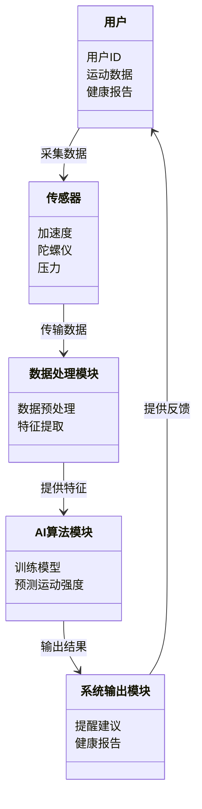
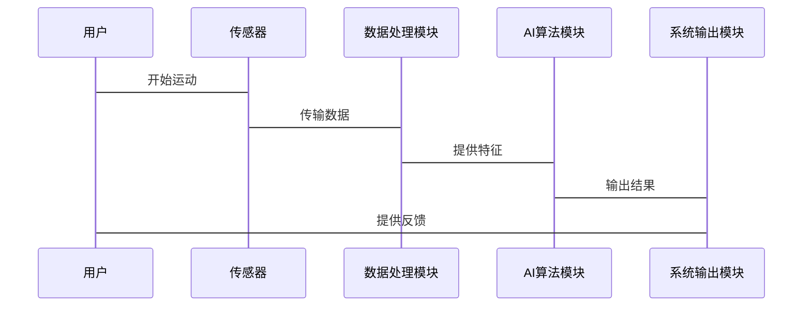

                 


```markdown
# AI Agent在智能鞋垫中的运动强度分析

> 关键词：智能鞋垫，AI Agent，运动强度分析，传感器数据，机器学习，运动健康

> 摘要：本文深入探讨了AI Agent在智能鞋垫中的应用，特别是在运动强度分析方面的创新与实践。通过分析传感器数据，结合机器学习算法，AI Agent能够实时评估用户的运动强度，为用户提供个性化的运动健康建议。本文从背景介绍、核心概念、算法原理、系统设计到项目实战，全面解析了AI Agent在智能鞋垫中的应用，为相关领域的研究和开发提供了参考。

---

# 第一部分: AI Agent在智能鞋垫中的运动强度分析背景介绍

# 第1章: AI Agent与智能鞋垫概述

## 1.1 AI Agent的基本概念
### 1.1.1 什么是AI Agent
AI Agent（人工智能代理）是指能够感知环境并采取行动以实现目标的智能实体。它具备自主性、反应性、目标导向和学习能力等特征，能够在复杂环境中做出决策和优化行为。

### 1.1.2 AI Agent的核心特征
- **自主性**：AI Agent能够在没有外部干预的情况下自主运行。
- **反应性**：能够实时感知环境变化并做出反应。
- **目标导向**：通过目标驱动行为，优化决策过程。
- **学习能力**：通过数据学习和优化模型，提升性能。

### 1.1.3 AI Agent在智能设备中的应用
AI Agent广泛应用于智能家居、自动驾驶、医疗设备等领域。在智能鞋垫中，AI Agent通过分析传感器数据，帮助用户实时监测运动强度。

## 1.2 智能鞋垫的发展历程
### 1.2.1 传统鞋垫的功能与局限
传统鞋垫主要用于支撑足部，缓解疲劳。然而，其功能单一，无法提供实时反馈和个性化建议。

### 1.2.2 智能鞋垫的定义与特点
智能鞋垫通过集成传感器、无线通信和AI算法，能够实时采集和分析用户的运动数据，提供个性化的运动健康建议。

### 1.2.3 智能鞋垫的技术发展趋势
随着物联网和AI技术的发展，智能鞋垫正在向智能化、个性化和实时反馈方向迈进。

## 1.3 运动强度分析的重要性
### 1.3.1 运动强度分析的定义
运动强度是指在一定时间内，人体进行运动所消耗的能量或用力程度。通过分析运动强度，可以评估运动的健康效果和安全性。

### 1.3.2 不同运动强度的分类
运动强度通常分为低强度、中等强度和高强度。不同强度的运动对身体的影响和健康效益也不同。

### 1.3.3 AI Agent在运动强度分析中的作用
AI Agent通过分析传感器数据，实时评估用户的运动强度，并根据个体差异提供个性化建议，帮助用户优化运动计划。

## 1.4 本章小结
本章介绍了AI Agent的基本概念及其在智能鞋垫中的应用，强调了运动强度分析的重要性，并为后续章节奠定了基础。

---

# 第二部分: AI Agent与运动强度分析的核心概念

# 第2章: AI Agent的运动强度分析原理

## 2.1 AI Agent的核心算法
### 2.1.1 机器学习算法在运动强度分析中的应用
机器学习算法通过训练模型，能够从传感器数据中提取特征，预测用户的运动强度。

### 2.1.2 常见的运动强度分析算法对比
| 算法名称      | 优点                | 缺点                |
|---------------|---------------------|---------------------|
| 线性回归      | 简单易实现          | 高度依赖数据特征    |
| 支持向量机    | 高维数据表现优异    | 参数调整复杂        |
| 神经网络      | 高度非线性建模能力  | 需要大量数据和计算资源|

### 2.1.3 AI Agent的决策机制
AI Agent通过传感器数据输入，利用训练好的模型预测运动强度，并根据预设规则做出决策，如提醒用户调整运动强度。

## 2.2 传感器数据的采集与处理
### 2.2.1 常见运动传感器类型
- **加速度传感器**：测量加速度，用于分析运动速度和加速度变化。
- **陀螺仪**：测量旋转角度，用于分析运动方向和姿态。
- **压力传感器**：测量足部压力分布，用于分析步态和受力情况。

### 2.2.2 数据采集的流程与方法
1. 传感器采集原始数据。
2. 数据预处理：去除噪声、归一化等。
3. 数据特征提取：提取有用的特征，如加速度均值、标准差等。
4. 数据存储：将处理后的数据存储到数据库中。

### 2.2.3 数据预处理的关键步骤
- **去噪**：通过滤波算法（如高通滤波、低通滤波）去除传感器噪声。
- **归一化**：将数据缩放到统一的范围，便于模型训练。
- **特征提取**：提取能够表征运动强度的特征，如最大加速度、平均加速度等。

## 2.3 运动强度分析的指标体系
### 2.3.1 常见运动强度指标
- **心率**：反映运动强度的重要指标。
- **加速度**：反映运动的剧烈程度。
- **步频**：反映运动的节奏。

### 2.3.2 指标之间的关系与影响
- 心率与加速度呈正相关关系。
- 步频与加速度呈正相关关系。
- 运动强度与心率和加速度的综合指标相关。

### 2.3.3 指标权重的确定方法
通过机器学习算法（如线性回归、随机森林）确定各个指标的权重，构建综合运动强度评估模型。

## 2.4 本章小结
本章详细介绍了AI Agent在运动强度分析中的核心算法和传感器数据处理方法，为后续的系统设计奠定了基础。

---

# 第三部分: AI Agent运动强度分析的系统设计与实现

# 第3章: AI Agent运动强度分析系统设计

## 3.1 问题场景介绍
运动强度分析系统需要实时采集和处理用户的运动数据，结合AI算法预测用户的运动强度，并提供个性化建议。

## 3.2 项目介绍
智能鞋垫运动强度分析系统是一个基于AI的实时监测系统，旨在帮助用户优化运动计划。

## 3.3 系统功能设计
### 3.3.1 领域模型设计


### 3.3.2 系统架构设计
```mermaid
container 智能鞋垫运动强度分析系统 {
    组件: 传感器采集模块
    组件: 数据处理模块
    组件: AI算法模块
    组件: 系统输出模块
}
```

### 3.3.3 系统接口设计
- **输入接口**：传感器数据接口。
- **输出接口**：用户反馈接口，如振动、LED提示等。

### 3.3.4 系统交互流程


## 3.4 算法实现与优化
### 3.4.1 机器学习模型的训练与优化
```python
import numpy as np
from sklearn.linear_model import LinearRegression

# 示例数据
X = np.array([[1, 2], [3, 4], [5, 6]])
y = np.array([7, 8, 9])

model = LinearRegression()
model.fit(X, y)

# 预测新数据
new_X = np.array([[2, 3]])
predicted_y = model.predict(new_X)
print(predicted_y)
```

### 3.4.2 数学模型与公式
运动强度预测模型：
$$ y = \beta_0 + \beta_1 x_1 + \beta_2 x_2 + \epsilon $$

其中：
- $y$ 是运动强度预测值
- $x_1$ 和 $x_2$ 是特征变量
- $\beta_0, \beta_1, \beta_2$ 是模型参数
- $\epsilon$ 是误差项

### 3.4.3 模型评估与优化
通过交叉验证和网格搜索优化模型参数，提升预测精度。

## 3.5 项目实战
### 3.5.1 环境安装
安装必要的Python库：
```bash
pip install numpy scikit-learn matplotlib
```

### 3.5.2 核心代码实现
```python
import numpy as np
from sklearn.model_selection import train_test_split
from sklearn.metrics import mean_squared_error

# 示例数据集
X = np.random.rand(100, 2)
y = np.random.rand(100, 1)

# 划分训练集和测试集
X_train, X_test, y_train, y_test = train_test_split(X, y, test_size=0.2)

# 训练模型
model = LinearRegression()
model.fit(X_train, y_train)

# 预测与评估
y_pred = model.predict(X_test)
mse = mean_squared_error(y_test, y_pred)
print(f"均方误差: {mse}")
```

### 3.5.3 案例分析与结果解读
通过实际案例分析，展示AI Agent如何根据传感器数据实时预测运动强度，并提供个性化建议。

## 3.6 本章小结
本章详细描述了AI Agent运动强度分析系统的架构设计、算法实现和项目实战，为后续的优化和扩展提供了方向。

---

# 第四部分: 总结与展望

# 第4章: 总结与展望

## 4.1 最佳实践
- 确保传感器数据的准确性和实时性。
- 使用合适的机器学习算法，优化模型性能。
- 提供用户友好的反馈机制。

## 4.2 小结
本文系统地介绍了AI Agent在智能鞋垫中的运动强度分析，从背景介绍、算法原理到系统设计，全面阐述了相关技术和实现方法。

## 4.3 注意事项
- 数据隐私保护。
- 系统的鲁棒性和抗干扰能力。

## 4.4 拓展阅读
- 《机器学习实战》
- 《深度学习入门：基于Python》
- 《物联网技术与应用》

---

# 作者：AI天才研究院/AI Genius Institute & 禅与计算机程序设计艺术 /Zen And The Art of Computer Programming

---

感谢您的阅读！如果对本文内容感兴趣，欢迎关注我们的公众号或访问官网了解更多深度技术文章！
```

