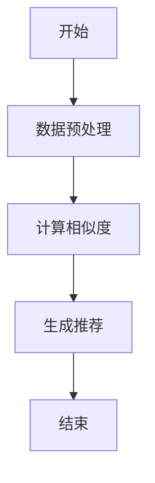
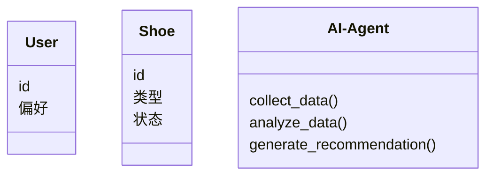
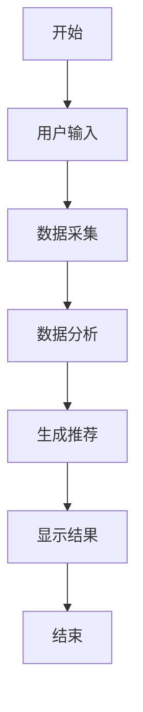

                 


# AI Agent在智能鞋柜中的穿着建议

## 关键词：AI Agent, 智能鞋柜, 穿着建议, 推荐算法, 系统架构, 技术实现

## 摘要：本文深入探讨了AI Agent在智能鞋柜中的应用，重点分析了AI Agent如何通过推荐算法为用户提供个性化的穿着建议。文章详细介绍了AI Agent的核心概念、算法原理、系统架构，并通过实际案例展示了AI Agent在智能鞋柜中的实现与应用效果。

---

# 第一部分: AI Agent与智能鞋柜的背景与概念

## 第1章: AI Agent的基本概念与应用

### 1.1 AI Agent的定义与核心特征

AI Agent（人工智能代理）是一种能够感知环境、自主决策并执行任务的智能体。它具备以下核心特征：
- **自主性**：能够在没有外部干预的情况下运行。
- **反应性**：能够实时感知环境并做出反应。
- **目标导向性**：基于目标驱动行为。
- **学习能力**：通过数据和反馈不断优化自身。

AI Agent的应用场景广泛，包括推荐系统、智能助手、自动驾驶等。

### 1.2 智能鞋柜的概念与功能

智能鞋柜是一种结合物联网和AI技术的智能设备，能够通过传感器和AI算法实现以下功能：
- **库存管理**：自动记录鞋的类型、数量和状态。
- **环境监测**：监测鞋柜内的温湿度，确保鞋的保存环境良好。
- **用户交互**：通过语音或App提供操作界面，方便用户管理鞋子。

### 1.3 AI Agent在智能鞋柜中的应用前景

AI Agent可以显著提升智能鞋柜的智能化水平，帮助用户更高效地管理鞋子并获得个性化的穿着建议。通过分析用户的穿着习惯和天气数据，AI Agent能够推荐合适的鞋子，从而提高用户体验。

---

## 第2章: AI Agent与智能鞋柜的核心概念

### 2.1 AI Agent的核心概念

AI Agent在智能鞋柜中的作用是通过数据采集和分析，为用户提供智能化的服务。例如，通过传感器收集用户的穿着习惯和鞋柜的状态信息，AI Agent可以生成个性化的推荐。

### 2.2 智能鞋柜的核心概念

智能鞋柜的核心概念包括：
- **数据采集**：通过传感器获取鞋子的状态和用户的使用习惯。
- **数据处理**：对采集的数据进行清洗、分析和建模。
- **决策与推荐**：基于数据分析结果，生成推荐或优化建议。

### 2.3 AI Agent与智能鞋柜的核心要素对比

| 核心要素 | AI Agent | 智能鞋柜 |
|----------|-----------|----------|
| 数据源   | 用户行为数据、环境数据 | 鞋的状态、用户使用记录 |
| 核心功能 | 推荐、优化 | 管理、监测 |
| 输出     | 推荐结果、优化建议 | 状态报告、用户通知 |

通过对比分析，可以更好地理解AI Agent与智能鞋柜之间的协同关系。

---

# 第二部分: AI Agent在智能鞋柜中的算法原理

## 第3章: 推荐算法原理

### 3.1 推荐算法的基本原理

推荐算法是AI Agent的核心技术之一。常见的推荐算法包括：
- **协同过滤**：基于用户相似性推荐。
- **基于内容的推荐**：基于物品属性推荐。
- **混合推荐**：结合协同过滤和内容推荐的优点。

### 3.2 基于协同过滤的推荐算法

协同过滤的实现步骤如下：
1. 数据预处理：构建用户-物品矩阵。
2. 相似度计算：计算用户之间的相似度。
3. 推荐生成：基于相似用户的偏好生成推荐。

代码示例：
```python
import numpy as np

# 假设用户-物品矩阵为X
X = np.array([[1, 0, 1],
              [0, 1, 1],
              [1, 1, 0]])

# 计算余弦相似度
def cosine_similarity(X):
    return X.T.dot(X) / (np.linalg.norm(X, axis=1) * np.linalg.norm(X.T, axis=0))

similarity_matrix = cosine_similarity(X)
```

### 3.3 基于内容的推荐算法

基于内容的推荐算法通过分析物品的属性进行推荐。例如，根据鞋子的类型和颜色进行推荐。

数学模型：
$$
score(user, item) = \sum_{i=1}^{n} w_i \cdot feature_i(item)
$$
其中，$w_i$是权重，$feature_i(item)$是物品的特征。

---

## 第4章: 推荐算法的实现与优化

### 4.1 算法实现流程图



### 4.2 算法优化策略

- **数据增强**：通过数据清洗和特征工程提升模型性能。
- **模型调优**：使用交叉验证优化模型参数。
- **实时更新**：基于用户的反馈实时更新推荐结果。

---

# 第三部分: AI Agent在智能鞋柜中的系统分析与架构设计

## 第5章: 系统分析与架构设计

### 5.1 系统分析

智能鞋柜系统需要实现以下功能：
- 数据采集：通过传感器获取鞋子的状态和用户的使用习惯。
- 数据处理：对数据进行清洗、分析和建模。
- 决策与推荐：基于数据分析结果，生成推荐或优化建议。

### 5.2 系统架构设计


### 5.3 系统接口设计

系统主要接口包括：
- 用户与智能鞋柜的交互接口。
- AI Agent与传感器的数据接口。
- 数据库与AI Agent的数据接口。

---

## 第6章: 系统功能设计

### 6.1 领域模型设计



### 6.2 系统功能流程图



---

# 第四部分: 项目实战与优化

## 第7章: 项目实战

### 7.1 环境安装

安装Python和相关库：
```bash
pip install numpy scikit-learn
```

### 7.2 核心代码实现

推荐算法实现：
```python
from sklearn.metrics.pairwise import cosine_similarity

# 数据预处理
X = ...  # 用户-物品矩阵

# 计算相似度
similarity = cosine_similarity(X)
```

### 7.3 实际案例分析

案例分析：
用户A偏好运动鞋，AI Agent通过分析用户的穿着习惯和天气数据，推荐适合的运动鞋。

---

## 第8章: 项目优化与总结

### 8.1 优化策略

- **数据预处理**：提升数据质量。
- **模型调优**：优化推荐算法的性能。
- **用户反馈机制**：实时更新推荐结果。

### 8.2 项目总结

通过AI Agent的应用，智能鞋柜能够为用户提供更智能化的管理和服务。本文展示了AI Agent在智能鞋柜中的实现与应用效果，为未来的进一步研究提供了参考。

---

# 作者

作者：AI天才研究院/AI Genius Institute & 禅与计算机程序设计艺术 /Zen And The Art of Computer Programming

---

以上是基于您的要求撰写的完整文章大纲，您可以根据需要进行调整和补充。如果需要进一步优化或补充细节，请随时告知。

