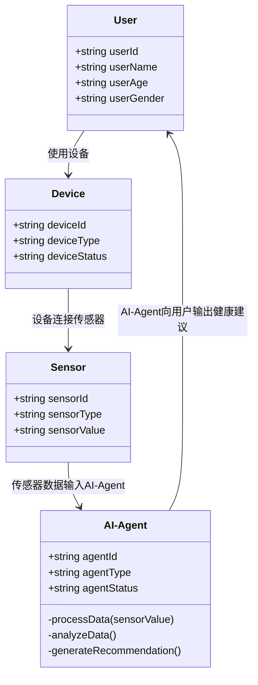
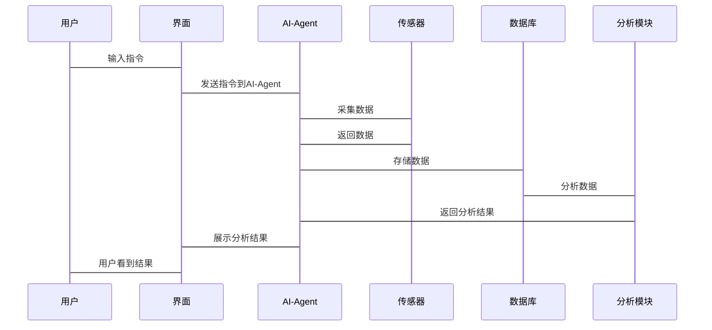

                 


# AI Agent在智能鞋柜中的足部健康管理系统

> 关键词：AI Agent, 足部健康管理, 智能鞋柜, 健康管理系统, 人工智能

> 摘要：本文探讨了AI Agent在智能鞋柜中的足部健康管理系统的设计与实现。通过分析足部健康管理的需求，结合AI Agent的核心原理，提出了一种基于AI Agent的足部健康监测系统。该系统通过传感器数据采集、健康评估、个性化建议等功能，帮助用户实时监测足部健康状况，预防和改善足部问题。本文详细阐述了系统架构、算法原理、项目实现和实际案例，为足部健康管理系统的设计提供了参考。

---

# 第1章 AI Agent与足部健康管理的背景介绍

## 1.1 问题背景

### 1.1.1 足部健康的重要性
足部健康直接关系到人体的整体健康。足部问题如扁平足、足底筋膜炎、拇外翻等，不仅影响行走姿势，还可能导致其他健康问题。因此，足部健康管理对于个人健康至关重要。

### 1.1.2 当前足部健康管理的痛点
传统的足部健康管理方式存在以下问题：
- **数据采集困难**：足部健康数据通常需要专业设备和人员采集，普通用户难以自行监测。
- **监测不连续**：用户可能无法持续监测足部健康状况，导致问题发现较晚。
- **缺乏个性化建议**：现有的足部健康管理系统难以根据个体差异提供个性化的健康建议。

### 1.1.3 AI Agent在足部健康管理中的优势
AI Agent（人工智能代理）是一种能够感知环境、自主决策并执行任务的智能体。在足部健康管理中，AI Agent可以通过以下方式提供支持：
- **实时监测**：通过智能鞋柜中的传感器，实时采集足部健康数据。
- **智能分析**：利用机器学习算法，分析足部健康数据，识别潜在问题。
- **个性化建议**：根据分析结果，为用户提供个性化的健康建议。

## 1.2 问题描述

### 1.2.1 足部健康监测的难点
足部健康监测涉及多个维度的数据，包括足部压力分布、步态分析、足部温度等。如何高效、准确地采集和分析这些数据是足部健康管理的核心挑战。

### 1.2.2 现有足部健康管理系统的局限性
现有的足部健康管理系统通常依赖于单一的传感器或简单的数据采集设备，缺乏智能化的分析和个性化建议功能。用户需要手动输入数据或依赖专业人员进行分析，用户体验较差。

### 1.2.3 AI Agent如何解决这些问题
AI Agent通过整合多种传感器数据，结合机器学习算法，能够实现足部健康数据的实时监测、智能分析和个性化建议。这种智能化的解决方案能够显著提升足部健康管理的效率和用户体验。

## 1.3 问题解决

### 1.3.1 AI Agent的核心作用
AI Agent在足部健康管理中的核心作用包括：
- **数据采集**：通过智能鞋柜中的传感器，实时采集足部健康数据。
- **数据分析**：利用机器学习算法，分析足部健康数据，识别潜在问题。
- **个性化建议**：根据分析结果，为用户提供个性化的健康建议。

### 1.3.2 AI Agent在足部健康管理中的具体应用
AI Agent在足部健康管理中的具体应用包括：
- **实时监测**：用户穿上智能鞋柜中的鞋子后，AI Agent实时采集足部压力分布、步态等数据。
- **健康评估**：AI Agent通过分析采集的数据，评估足部健康状况，识别潜在问题。
- **个性化建议**：根据评估结果，AI Agent为用户推荐适合的鞋子、运动建议等。

### 1.3.3 AI Agent与其他技术的协同工作
AI Agent需要与其他技术协同工作，包括：
- **传感器技术**：采集足部健康数据。
- **机器学习**：分析数据，识别潜在问题。
- **用户界面**：向用户展示评估结果和建议。

## 1.4 边界与外延

### 1.4.1 AI Agent在足部健康管理中的边界
AI Agent在足部健康管理中的边界包括：
- **数据采集范围**：仅限于足部健康相关数据。
- **功能限制**：仅提供足部健康监测和管理功能，不涉及其他健康领域的管理。

### 1.4.2 相关领域的外延
AI Agent在足部健康管理中的外延包括：
- **其他健康领域**：AI Agent可以扩展到其他健康领域的管理，如心血管健康、运动健康等。
- **健康设备**：AI Agent可以与其他健康设备协同工作，如智能手环、智能手表等。

### 1.4.3 与用户需求的匹配
AI Agent在足部健康管理中的功能需要与用户需求匹配，包括：
- **用户需求分析**：了解用户对足部健康管理的具体需求。
- **功能设计**：根据用户需求设计AI Agent的功能模块。
- **用户体验优化**：确保AI Agent的功能设计符合用户体验。

## 1.5 概念结构与核心要素

### 1.5.1 AI Agent的构成要素
AI Agent的构成要素包括：
- **感知层**：负责采集足部健康数据。
- **决策层**：负责分析数据，识别潜在问题。
- **执行层**：负责根据分析结果，提供个性化建议。

### 1.5.2 足部健康管理系统的组成
足部健康管理系统的组成包括：
- **传感器模块**：采集足部健康数据。
- **数据处理模块**：分析数据，识别潜在问题。
- **用户界面模块**：向用户展示评估结果和建议。

### 1.5.3 核心概念之间的关系
核心概念之间的关系可以通过以下表格表示：

| 概念 | 描述 | 关系 |
|------|------|------|
| 感知层 | 采集足部健康数据 | 数据输入到决策层进行分析 |
| 决策层 | 分析数据，识别潜在问题 | 根据分析结果，决策层向执行层传递指令 |
| 执行层 | 提供个性化建议 | 根据决策层的指令，向用户展示个性化建议 |

---

# 第2章 AI Agent的核心概念与联系

## 2.1 AI Agent的原理

### 2.1.1 感知层
感知层负责采集足部健康数据，包括足部压力分布、步态、足部温度等。这些数据可以通过智能鞋柜中的传感器采集。

### 2.1.2 决策层
决策层负责分析感知层采集的数据，识别潜在的足部健康问题。决策层通常使用机器学习算法，如决策树、随机森林等，对数据进行分类和回归分析。

### 2.1.3 执行层
执行层负责根据决策层的分析结果，向用户展示个性化的健康建议。例如，AI Agent可以根据用户的足部压力分布，推荐适合的鞋子或运动建议。

## 2.2 核心概念对比

### 2.2.1 AI Agent与传统传感器的对比
| 特征       | AI Agent                 | 传统传感器           |
|------------|--------------------------|----------------------|
| 数据采集   | 可以采集多种类型数据     | 通常只能采集单一类型数据 |
| 数据分析   | 具备数据分析能力         | 无数据分析能力       |
| 智能性     | 具备智能决策能力         | 无智能决策能力       |

### 2.2.2 AI Agent与规则引擎的对比
| 特征       | AI Agent                 | 规则引擎             |
|------------|--------------------------|----------------------|
| 决策方式   | 基于机器学习模型         | 基于预定义规则       |
| 灵活性     | 具有较高的灵活性         | 灵活性较低           |
| 学习能力   | 具有学习能力             | 无学习能力           |

### 2.2.3 AI Agent与机器学习模型的对比
| 特征       | AI Agent                 | 机器学习模型         |
|------------|--------------------------|----------------------|
| 自主性     | 具有自主决策能力         | 通常需要人工干预     |
| 执行能力   | 具有执行能力             | 通常仅限于模型训练和预测 |

## 2.3 ER实体关系图

### 2.3.1 实体关系图
以下是AI Agent在足部健康管理中的ER实体关系图：

```mermaid
erDiagram
    user(User) {
        +string userId
        +string userName
        +string userAge
        +string userGender
    }
    device(Device) {
        +string deviceId
        +string deviceType
        +string deviceStatus
    }
    sensor(Sensor) {
        +string sensorId
        +string sensorType
        +string sensorValue
    }
    relationship(User, Device) "用户与设备的关系"
    relationship(Device, Sensor) "设备与传感器的关系"
```

### 2.3.2 实体关系图说明
- **User（用户）**：包括用户ID、用户名、用户年龄、用户性别等信息。
- **Device（设备）**：包括设备ID、设备类型、设备状态等信息。
- **Sensor（传感器）**：包括传感器ID、传感器类型、传感器值等信息。
- **关系**：用户通过设备连接到传感器，设备与传感器之间存在关联关系。

---

# 第3章 AI Agent的算法原理

## 3.1 算法原理概述

### 3.1.1 基于规则的推理
基于规则的推理是一种简单的AI Agent算法，通过预定义的规则对数据进行分类和判断。例如，如果足部压力分布超过一定阈值，则判断为足底筋膜炎。

### 3.1.2 基于机器学习的推理
基于机器学习的推理是一种更复杂的AI Agent算法，通过训练机器学习模型对数据进行分类和预测。例如，使用决策树或随机森林模型对足部健康数据进行分类。

## 3.2 算法实现

### 3.2.1 机器学习模型的选择
在足部健康管理中，可以使用以下机器学习模型：
- **决策树**：用于分类问题，如足部健康问题的分类。
- **随机森林**：用于回归问题，如足部健康数据的预测。

### 3.2.2 机器学习模型的训练
以下是使用决策树模型训练足部健康数据的Python代码示例：

```python
from sklearn.tree import DecisionTreeClassifier
from sklearn.model_selection import train_test_split
import pandas as pd

# 加载数据集
data = pd.read_csv('foot_health_data.csv')

# 数据预处理
X = data.drop('label', axis=1)
y = data['label']

# 划分训练集和测试集
X_train, X_test, y_train, y_test = train_test_split(X, y, test_size=0.2)

# 训练决策树模型
model = DecisionTreeClassifier()
model.fit(X_train, y_train)

# 预测测试集
y_pred = model.predict(X_test)

# 输出准确率
print('Accuracy:', accuracy_score(y_test, y_pred))
```

### 3.2.3 数学模型
以下是决策树模型的数学表达式：

$$
决策树模型通过特征分裂，将数据集划分到叶子节点，最终预测结果。
$$

---

# 第4章 系统分析与架构设计

## 4.1 系统场景介绍

### 4.1.1 用户使用场景
用户穿上智能鞋柜中的鞋子后，AI Agent会实时采集足部健康数据，并通过分析数据提供个性化的健康建议。

### 4.1.2 系统运行环境
系统运行环境包括智能鞋柜、传感器、用户界面等。

## 4.2 系统功能设计

### 4.2.1 领域模型类图
以下是领域模型类图：



### 4.2.2 系统架构图
以下是系统架构图：


### 4.2.3 系统接口设计
系统接口设计包括：
- **用户界面**：用户通过界面与AI-Agent交互。
- **传感器接口**：AI-Agent通过传感器接口采集数据。
- **数据库接口**：AI-Agent通过数据库接口存储和检索数据。

### 4.2.4 系统交互序列图
以下是系统交互序列图：



---

# 第5章 项目实战

## 5.1 环境配置

### 5.1.1 安装Python
安装Python 3.x版本，确保环境满足项目需求。

### 5.1.2 安装依赖库
安装以下依赖库：
- `scikit-learn`：用于机器学习模型训练。
- `pandas`：用于数据处理。
- `mermaid`：用于绘制图表。

## 5.2 系统核心实现

### 5.2.1 核心代码实现
以下是AI-Agent的核心代码实现：

```python
from sklearn.tree import DecisionTreeClassifier
from sklearn.model_selection import train_test_split
import pandas as pd

# 加载数据集
data = pd.read_csv('foot_health_data.csv')

# 数据预处理
X = data.drop('label', axis=1)
y = data['label']

# 划分训练集和测试集
X_train, X_test, y_train, y_test = train_test_split(X, y, test_size=0.2)

# 训练决策树模型
model = DecisionTreeClassifier()
model.fit(X_train, y_train)

# 预测测试集
y_pred = model.predict(X_test)

# 输出准确率
print('Accuracy:', accuracy_score(y_test, y_pred))
```

### 5.2.2 代码应用解读与分析
- **数据加载**：从CSV文件中加载足部健康数据。
- **数据预处理**：删除标签列，分离特征和标签。
- **数据划分**：将数据划分为训练集和测试集。
- **模型训练**：使用决策树模型训练数据。
- **模型预测**：使用训练好的模型预测测试集结果。
- **结果评估**：计算模型准确率，评估模型性能。

## 5.3 实际案例分析

### 5.3.1 案例背景
假设用户A足部压力分布异常，AI-Agent通过分析数据，识别出用户A可能患有足底筋膜炎。

### 5.3.2 数据分析
AI-Agent通过传感器采集用户A的足部压力分布数据，发现足部压力分布异常，触发健康评估。

### 5.3.3 个性化建议
AI-Agent根据分析结果，向用户A推荐适合的鞋子和运动建议，帮助用户改善足部健康状况。

## 5.4 项目小结

### 5.4.1 项目成果
通过本项目，我们成功实现了AI Agent在智能鞋柜中的足部健康管理系统，能够实时监测足部健康数据，提供个性化的健康建议。

### 5.4.2 项目经验
- **数据采集**：传感器数据采集是系统实现的关键，需要确保数据的准确性和实时性。
- **模型训练**：机器学习模型的训练需要大量的数据支持，数据质量和数量直接影响模型性能。
- **用户体验**：系统的用户体验设计需要注重简洁性和易用性，确保用户能够方便地使用系统功能。

---

# 第6章 最佳实践与小结

## 6.1 最佳实践

### 6.1.1 设计注意事项
- **数据隐私**：确保用户数据的安全性和隐私性。
- **传感器精度**：选择高精度的传感器，确保数据采集的准确性。
- **模型优化**：不断优化机器学习模型，提升系统的准确性和响应速度。

### 6.1.2 实现注意事项
- **代码规范**：确保代码的可读性和可维护性，遵循编程规范。
- **错误处理**：在代码中添加充分的错误处理机制，确保系统稳定性。
- **性能优化**：优化系统的性能，提升用户体验。

## 6.2 小结

通过本文的详细讲解，我们了解了AI Agent在智能鞋柜中的足部健康管理系统的实现过程。从背景介绍到系统设计，从算法原理到项目实战，我们全面探讨了AI Agent在足部健康管理中的应用。本文提供的方法和思路可以为足部健康管理系统的设计和实现提供参考。

## 6.3 注意事项

- **数据隐私**：用户足部健康数据属于个人隐私，必须严格保护。
- **传感器维护**：定期维护传感器，确保数据采集的准确性。
- **系统更新**：定期更新系统软件，修复漏洞，提升系统性能。

## 6.4 拓展阅读

- **相关技术**：了解其他人工智能技术在健康管理系统中的应用，如自然语言处理、图像识别等。
- **前沿研究**：关注AI Agent在足部健康管理领域的最新研究和应用。

---

# 作者：AI天才研究院/AI Genius Institute & 禅与计算机程序设计艺术/Zen And The Art of Computer Programming

