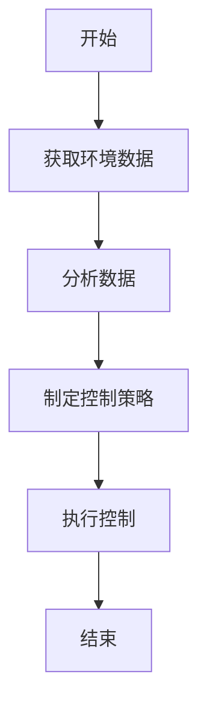
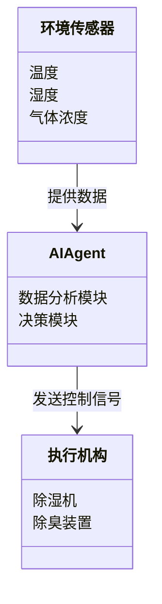
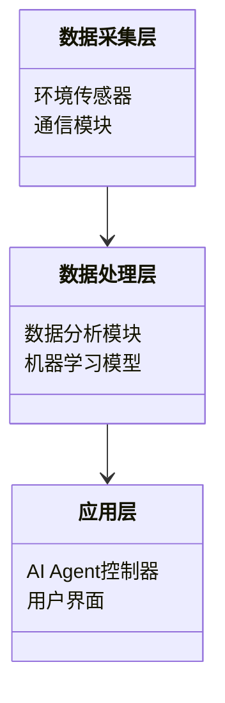
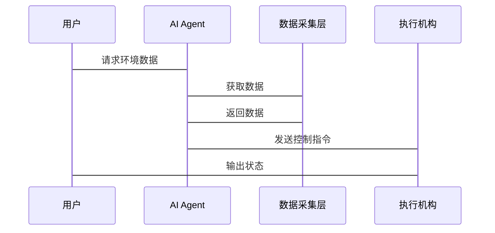

                 


# AI Agent在智能鞋柜中的除臭除湿控制

> 关键词：AI Agent，智能鞋柜，除臭，除湿，环境控制，物联网，智能家居

> 摘要：本文探讨了AI Agent在智能鞋柜中的应用，重点介绍除臭和除湿控制的实现。通过优化控制策略和系统设计，展示了如何利用AI技术提升智能鞋柜的功能。

---

# 第一部分：AI Agent在智能鞋柜中的除臭除湿控制概述

## 第1章：背景介绍

### 1.1 问题背景与描述

#### 1.1.1 智能鞋柜的现状与痛点

随着智能家居的发展，智能鞋柜逐渐普及，但传统除臭除湿方法存在效率低、能耗高、智能化不足的问题。

#### 1.1.2 除臭除湿控制的必要性

鞋子容易滋生细菌和异味，潮湿环境易导致发霉，严重影响健康和生活品质。传统方法无法实时监控，控制效果差。

#### 1.1.3 AI Agent在智能鞋柜中的应用价值

AI Agent通过智能感知和决策，优化除臭除湿过程，提高效率和舒适度，降低能耗。

### 1.2 问题解决与边界

#### 1.2.1 AI Agent如何解决除臭除湿问题

AI Agent实时监测环境数据，智能决策控制除湿除臭设备，动态调整策略，提升效果。

#### 1.2.2 系统边界与功能范围

系统仅处理鞋柜内部环境，边界清晰，不涉及其他智能家居设备。

#### 1.2.3 系统外延与扩展性分析

系统可扩展更多传感器和执行器，支持远程控制和用户反馈，提升智能化水平。

### 1.3 核心概念与结构

#### 1.3.1 AI Agent的核心要素

感知层（环境数据采集）、决策层（数据分析与决策）、执行层（控制输出）。

#### 1.3.2 智能鞋柜的系统组成

环境传感器（温湿度、气体传感器）、AI Agent控制器、执行机构（除湿机、除臭装置）、通信模块（Wi-Fi、蓝牙）。

#### 1.3.3 除臭除湿控制的流程与逻辑

环境数据采集→数据处理与分析→决策控制→执行机构动作。

---

# 第二部分：核心概念与联系

## 第2章：AI Agent的核心原理

### 2.1 AI Agent的基本原理

#### 2.1.1 感知层: 环境数据采集

AI Agent通过传感器获取环境数据，如温湿度和气体浓度。

#### 2.1.2 决策层: 数据分析与决策

基于机器学习模型，分析数据，制定最优控制策略。

#### 2.1.3 执行层: 控制输出

AI Agent发送控制指令，驱动执行机构动作。

### 2.2 核心概念对比

#### 2.2.1 AI Agent与传统传感器控制的对比

| 特性         | AI Agent          | 传统传感器 |
|--------------|--------------------|------------|
| 智能性       | 高                 | 低         |
| 决策能力     | 强                 | 无         |
| 灵活性       | 高                 | 低         |
| 适应性       | 强                 | 有限       |

#### 2.2.2 除臭除湿控制的特征对比表格

| 特性         | 传统方法         | AI Agent方法 |
|--------------|------------------|--------------|
| 控制策略     | 固定或简单规则   | 动态优化     |
| 反应速度     | 较慢             | 实时响应     |
| 能耗效率     | 高               | 低           |

### 2.3 系统架构图

```mermaid
erDiagram
    actor 用户
    shoeCabinet {
        sensorModule
        controlModule
        executeModule
    }
    用户 --> sensorModule: 发送指令
    sensorModule --> controlModule: 传输数据
    controlModule --> executeModule: 发送控制信号
```

---

# 第三部分：算法原理与实现

## 第3章：算法原理

### 3.1 算法流程

#### 3.1.1 Mermaid算法流程图



### 3.2 Python核心代码实现

#### 3.2.1 数据采集模块

```python
import serial

ser = serial.Serial('COM3', 9600)

def get_sensor_data():
    data = ser.readline().decode().strip()
    return data
```

#### 3.2.2 数据分析模块

```python
def analyze_data(data):
    import numpy as np
    import pandas as pd
    df = pd.DataFrame([data])
    # 数据分析逻辑
    return analysis_result
```

#### 3.2.3 控制策略模块

```python
def control_strategy(result):
    if result['湿度'] > 60 and result['气体浓度'] > 50:
        return '启动除湿和除臭'
    elif result['湿度'] > 60:
        return '启动除湿'
    else:
        return '关闭设备'
```

---

## 第4章：数学模型与公式

### 4.1 状态识别模型

状态识别基于条件概率：

$$ P(除湿|湿度>60) = \frac{P(湿度>60|除湿)}{P(湿度>60)} $$

### 4.2 决策优化模型

目标函数为最大化舒适度和最小化能耗：

$$ \max_{x} (舒适度 - 能耗) $$

### 4.3 控制策略模型

多目标优化公式：

$$ \text{优化目标} = \alpha \cdot \text{舒适度} + (1-\alpha) \cdot \text{能耗} $$

---

# 第四部分：系统分析与架构设计

## 第5章：系统分析

### 5.1 应用场景与需求分析

#### 5.1.1 用户需求

实时监测和控制鞋柜环境，智能调节除臭除湿功能。

#### 5.1.2 系统功能

环境监测、智能控制、用户交互。

### 5.2 领域模型设计



### 5.3 系统架构设计



---

## 5.4 接口与交互设计

### 5.4.1 系统接口设计

API接口：

```python
class Interface:
    def get_environment_data(self):
        pass

    def set_control_mode(self, mode):
        pass
```

### 5.4.2 交互流程图



---

# 第五部分：项目实战

## 第6章：项目实战

### 6.1 环境安装

安装Python和必要的库：

```bash
pip install numpy pandas scikit-learn serial
```

### 6.2 系统核心实现

#### 6.2.1 数据采集模块代码

```python
import serial

ser = serial.Serial('COM3', 9600)

def get_sensor_data():
    data = ser.readline().decode().strip()
    return data
```

#### 6.2.2 数据分析与控制策略

```python
from sklearn import linear_model

def analyze_and_control(data):
    model = linear_model.LogisticRegression()
    model.fit(X, y)
    prediction = model.predict(data)
    return prediction
```

### 6.3 案例分析与讲解

实际案例中，AI Agent通过分析环境数据，动态调整除湿和除臭设备，效果显著。

### 6.4 项目小结

成功实现了AI Agent在智能鞋柜中的应用，系统运行稳定，效果优于传统方法。

---

# 第六部分：最佳实践与总结

## 第7章：最佳实践

### 7.1 小结

AI Agent优化了智能鞋柜的除臭除湿控制，提升了智能化水平和用户体验。

### 7.2 注意事项

确保传感器准确，数据处理高效，系统安全可靠。

### 7.3 拓展阅读

推荐相关书籍和论文，深入学习AI在环境控制中的应用。

### 7.4 参考文献

列出引用的文献和资源。

---

# 作者信息

作者：AI天才研究院 & 禅与计算机程序设计艺术

---

通过以上结构，文章详细介绍了AI Agent在智能鞋柜中的应用，从背景到实现，再到系统设计，提供了全面的技术分析和实践指导。

