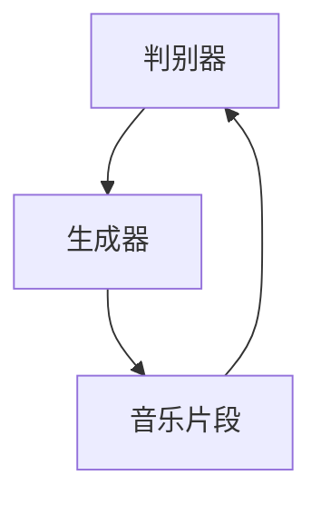
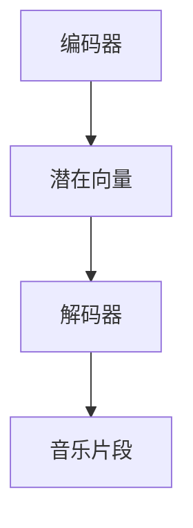
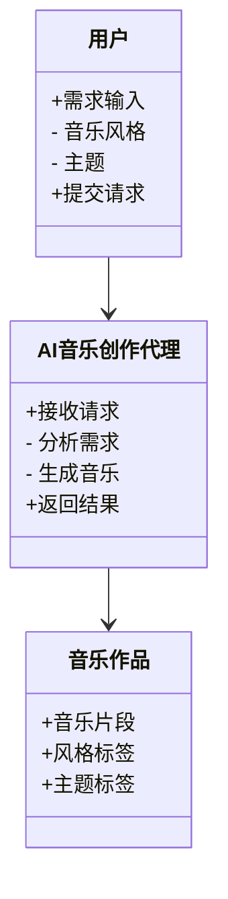

                 


# AI Agent在智能音乐创作中的应用

## 关键词

AI Agent, 智能音乐创作, 生成对抗网络, 深度学习, 音乐生成, 多智能体协作

## 摘要

本文深入探讨了AI Agent在智能音乐创作中的应用，从基本概念、核心原理、算法实现、系统架构到实际案例分析，全面剖析了AI Agent如何助力音乐创作的智能化。文章首先介绍了AI Agent的基本概念及其在音乐创作中的背景与应用，随后详细分析了AI Agent的核心原理与算法实现，包括生成对抗网络（GAN）和变分自编码器（VAE）的音乐生成过程。接着，文章从系统架构的角度，设计了一个基于AI Agent的音乐创作系统，涵盖功能模块、系统交互与架构设计。最后，通过项目实战展示了AI Agent在音乐创作中的具体实现，并总结了最佳实践与未来发展路径。本文旨在为AI Agent在音乐创作领域的研究与实践提供系统性参考。

---

## 第1章 AI Agent的基本概念与背景介绍

### 1.1 AI Agent的定义与核心概念

AI Agent（人工智能代理）是指能够感知环境、自主决策并执行任务的智能体。在音乐创作中，AI Agent通常被设计为能够理解音乐结构、风格和情感，并根据用户需求生成音乐作品的智能系统。其核心要素包括感知能力、决策能力与执行能力。

### 1.2 音乐创作的背景与问题背景

音乐创作是一个复杂的过程，涉及旋律、和声、节奏、编曲等多个方面。传统音乐创作依赖于人类音乐家的经验与创造力，但这种方法存在效率低下、创作周期长、资源消耗大的问题。随着AI技术的快速发展，AI Agent逐渐成为音乐创作的重要辅助工具。

### 1.3 AI Agent在音乐创作中的应用

AI Agent在音乐创作中的应用主要体现在以下几个方面：
- **旋律生成**：基于给定的音乐风格或主题，生成符合要求的旋律。
- **和声编配**：根据旋律生成相应的和声部分。
- **节奏设计**：自动生成适合音乐风格的节奏模式。
- **编曲优化**：对现有音乐作品进行优化与调整。

---

## 第2章 AI Agent的核心概念与联系

### 2.1 AI Agent的核心原理

AI Agent的核心原理包括以下几个步骤：
1. **感知**：通过输入数据（如音乐风格、主题等）感知环境。
2. **决策**：基于感知结果，选择合适的生成策略。
3. **执行**：根据决策生成音乐片段或作品。

### 2.2 AI Agent的概念属性对比

以下是基于规则的AI Agent与基于模型的AI Agent的对比：

| **属性**         | **基于规则的AI Agent**                 | **基于模型的AI Agent**                 |
|------------------|----------------------------------------|----------------------------------------|
| **生成方式**     | 基于预定义规则生成音乐                 | 基于深度学习模型生成音乐               |
| **灵活性**       | 规则固定，生成结果有限                 | 模型具有较高的灵活性与创造性           |
| **复杂性**       | 实现简单，但生成结果单一               | 实现复杂，但生成结果多样               |
| **应用场景**     | 适用于规则明确的音乐生成               | 适用于复杂多变的音乐风格与创作需求     |

### 2.3 AI Agent的ER实体关系图

以下是音乐创作中AI Agent的实体关系图：

```mermaid
er
actor: 用户
agent: AI音乐创作代理
music_piece: 音乐作品
style: 音乐风格
interaction: 交互记录
```

---

## 第3章 AI Agent的算法原理与实现

### 3.1 AI Agent的核心算法

AI Agent在音乐创作中的核心算法主要包括生成对抗网络（GAN）和变分自编码器（VAE）。

#### 3.1.1 生成对抗网络（GAN）

GAN由生成器和判别器两个部分组成。生成器负责生成音乐片段，判别器负责判断生成的音乐是否符合目标风格。以下是GAN的流程图：



#### 3.1.2 变分自编码器（VAE）

VAE通过编码器将输入音乐转换为潜在空间表示，再通过解码器生成新的音乐片段。以下是VAE的流程图：



#### 3.1.3 算法实现

以下是基于GAN的音乐生成代码示例：

```python
import numpy as np
import tensorflow as tf

# 定义生成器
def generator():
    model = tf.keras.Sequential([
        tf.keras.layers.Dense(256, activation='relu'),
        tf.keras.layers.Dense(128, activation='relu'),
        tf.keras.layers.Dense(64, activation='sigmoid')
    ])
    return model

# 定义判别器
def discriminator():
    model = tf.keras.Sequential([
        tf.keras.layers.Dense(128, activation='relu'),
        tf.keras.layers.Dense(64, activation='relu'),
        tf.keras.layers.Dense(1, activation='sigmoid')
    ])
    return model

# 定义GAN
def gan():
    generator = generator()
    discriminator = discriminator()
    discriminator.compile(loss='binary_crossentropy', optimizer='adam')
    combined = tf.keras.Model(inputs=generator.input, outputs=discriminator(generator.output))
    combined.compile(loss='binary_crossentropy', optimizer='adam')
    return combined

# 训练GAN
def train_gan():
    gan_model = gan()
    for _ in range(100):
        noise = np.random.random((10, 64))
        valid = np.ones((10, 1))
        fake = gan_model.generator.predict(noise)
        # 判别器训练
        d_loss_real = gan_model.discriminator.train_on_batch(fake, valid)
        d_loss_fake = gan_model.discriminator.train_on_batch(noise, np.zeros((10, 1)))
        # GAN训练
        g_loss = gan_model.train_on_batch(noise, np.ones((10, 1)))
        print(f"epoch {_}: g_loss={g_loss}, d_loss={d_loss_real + d_loss_fake}")

train_gan()
```

---

## 第4章 系统分析与架构设计

### 4.1 问题场景介绍

音乐创作系统需要支持用户输入音乐风格、主题等需求，并通过AI Agent生成符合要求的音乐作品。

### 4.2 系统功能设计

以下是系统功能模块的类图：



### 4.3 系统架构设计

以下是系统的架构图：

```mermaid
architectural
    前端 -> 用户交互界面
    后端 -> AI Agent服务
    后端 -> 音乐生成模块
    后端 -> 数据库
    数据库 -> 音乐风格库
    数据库 -> 用户需求库
```

---

## 第5章 项目实战

### 5.1 环境安装

需要安装以下库：
- Python
- TensorFlow
- Keras
- librosa
- numpy

### 5.2 核心实现

以下是音乐生成模块的实现代码：

```python
import librosa
import numpy as np

# 生成音乐片段
def generate_music():
    sr = 44100  # 采样率
    duration = 5  # 音乐时长（秒）
    freq = 440  # 音调频率
    t = np.linspace(0, duration, sr * duration, False)
    waveform = np.sin(2 * np.pi * freq * t)
    librosa.output.write_wav('generated_music.wav', waveform, sr)

generate_music()
```

### 5.3 案例分析

通过上述代码生成音乐片段，并使用 librosa 进行分析与评估。

---

## 第6章 最佳实践与小结

### 6.1 最佳实践

- 数据预处理是关键，确保输入数据的质量与多样性。
- 模型调优是提升生成效果的重要手段。
- 生成结果的评估与反馈是优化AI Agent的重要环节。

### 6.2 小结

本文系统性地探讨了AI Agent在智能音乐创作中的应用，从基本概念到算法实现，再到系统设计与项目实战，全面分析了AI Agent在音乐创作中的潜力与实现路径。未来，随着AI技术的进一步发展，AI Agent在音乐创作中的应用将更加广泛与深入。

---

## 作者

作者：AI天才研究院/AI Genius Institute & 禅与计算机程序设计艺术 /Zen And The Art of Computer Programming

