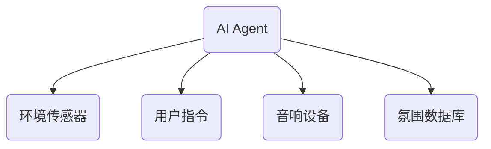
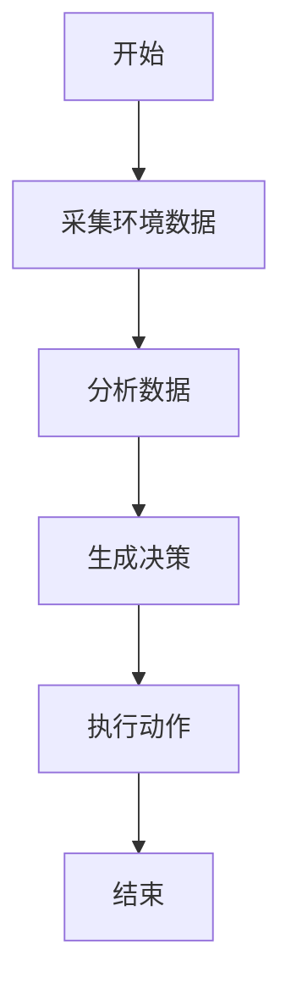
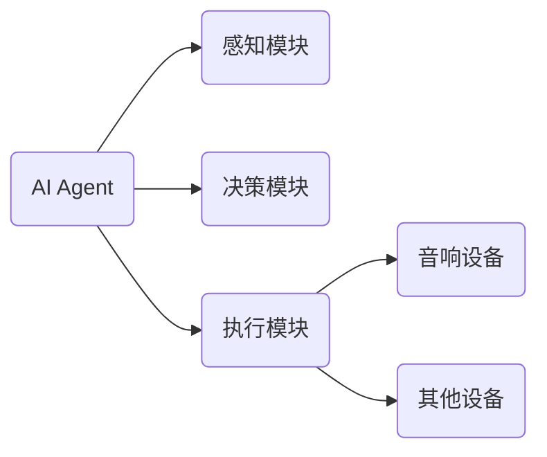

                 


# AI Agent在智能音响中的家庭氛围营造

## 关键词：
AI Agent, 智能音响, 家庭氛围, 情感分析, 物联网, 机器学习

## 摘要：
本文探讨了AI Agent在智能音响中的应用，详细分析了如何通过AI技术营造家庭氛围。从背景介绍、核心概念、算法原理到系统架构设计和实际案例分析，逐步深入，展示了AI Agent如何通过感知、决策和执行来优化家庭环境。文章还提供了代码示例和系统设计图，帮助读者理解技术细节。

---

# 第1章: 背景介绍与核心概念

## 1.1 AI Agent的基本概念
### 1.1.1 AI Agent的定义与特点
AI Agent（人工智能代理）是一种智能体，能够感知环境并采取行动以实现目标。其特点包括自主性、反应性、目标导向和社交能力。

### 1.1.2 家庭氛围营造的背景与需求
现代家庭越来越注重舒适性和个性化，用户希望通过智能设备营造适合自己情绪和需求的氛围。

### 1.1.3 智能音响的发展现状
智能音响已不仅是音乐播放设备，还支持语音交互、智能家居控制等功能。

## 1.2 AI Agent与家庭氛围营造的关系
### 1.2.1 AI Agent在家庭环境中的作用
AI Agent通过分析环境数据和用户行为，调整音响设置，营造合适氛围。

### 1.2.2 家庭氛围营造的核心要素
包括声音、光线、温度、湿度等，AI Agent需要综合考虑这些因素。

### 1.2.3 智能音响在家庭氛围营造中的地位
智能音响作为核心设备，通过AI Agent联动其他设备，形成完整的家庭氛围系统。

---

# 第2章: AI Agent的核心概念与联系

## 2.1 AI Agent的原理
### 2.1.1 感知层: 环境数据的采集与分析
通过麦克风、温度传感器等采集环境数据，分析用户情绪和环境状态。

### 2.1.2 决策层: 基于数据的智能决策
利用机器学习模型，根据感知数据生成决策，如选择合适的音乐类型。

### 2.1.3 执行层: 动作的实现与反馈
调整音响设置，联动其他设备，并通过反馈优化决策。

## 2.2 核心概念对比分析
### 2.2.1 AI Agent与传统音响的对比
传统音响仅提供固定功能，AI Agent可自适应环境和用户需求。

### 2.2.2 家庭氛围与单一音响功能的对比
单一音响关注音乐播放，AI Agent则关注整体氛围营造。

### 2.2.3 对比表格
| 特性      | 传统音响        | AI Agent集成的智能音响 |
|-----------|-----------------|------------------------|
| 感知      | 无              | 温度、声音、用户行为    |
| 决策      | 固定模式        | 自适应机器学习模型     |
| 执行      | 调整音量        | 联动灯光、空调等设备    |

## 2.3 实体关系架构图


---

# 第3章: AI Agent的算法原理

## 3.1 算法原理概述
### 3.1.1 感知层算法
使用特征提取技术，从环境数据中提取有用的特征。

### 3.1.2 决策层算法
基于机器学习模型，如随机森林或神经网络，进行决策。

### 3.1.3 执行层算法
通过反馈机制优化执行动作。

## 3.2 算法实现流程图


## 3.3 算法实现代码示例
### 3.3.1 环境数据采集
```python
import numpy as np

def collect_environment_data():
    # 示例环境数据采集
    data = np.random.rand(10, 3)  # 假设采集10个数据点，每个数据点有3个特征
    return data
```

### 3.3.2 智能决策算法
```python
def decision_algorithm(data):
    # 示例决策算法
    if data[0] > 0.5:
        return 'play_jazz'  # 情绪愉悦，播放爵士乐
    else:
        return 'play_classical'  # 情绪低落，播放古典乐
```

---

# 第4章: 系统分析与架构设计方案

## 4.1 系统架构设计
### 4.1.1 系统模块划分
- 感知模块：采集环境数据
- 决策模块：分析数据并生成决策
- 执行模块：调整音响设置并联动其他设备

### 4.1.2 系统架构图


---

# 第5章: 项目实战

## 5.1 环境安装
安装Python、TensorFlow、Flask等工具。

## 5.2 核心代码实现
### 5.2.1 环境数据采集模块
```python
import numpy as np

def collect_environment_data():
    data = np.random.rand(10, 3)
    return data
```

### 5.2.2 决策模块
```python
def decision_algorithm(data):
    if data[0] > 0.5:
        return 'play_jazz'
    else:
        return 'play_classical'
```

### 5.2.3 执行模块
```python
def execute_action(action):
    if action == 'play_jazz':
        print("播放爵士乐")
    elif action == 'play_classical':
        print("播放古典乐")
```

## 5.3 实际案例分析
通过实际案例展示AI Agent如何根据环境数据调整音响设置，联动其他设备，营造家庭氛围。

---

# 第6章: 最佳实践与小结

## 6.1 实用建议
- 数据隐私保护
- 设备兼容性测试
- 用户反馈优化

## 6.2 注意事项
- 确保数据安全
- 定期系统更新

## 6.3 项目小结
通过AI Agent和智能音响的结合，可以显著提升家庭氛围营造的智能化水平，为用户带来更好的体验。

---

# 作者：AI天才研究院/AI Genius Institute & 禅与计算机程序设计艺术 /Zen And The Art of Computer Programming

