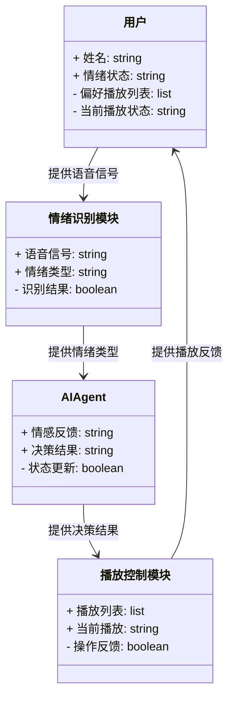
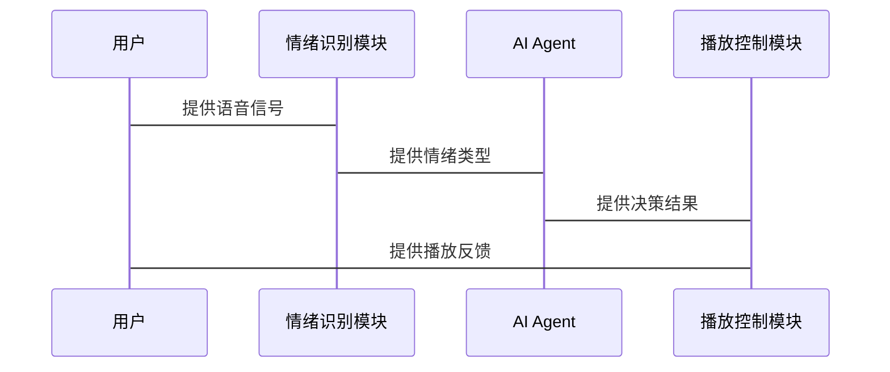
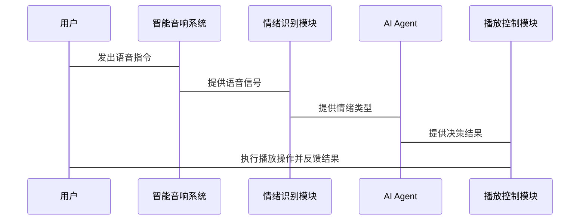

                 


# 第四部分: 系统分析与架构设计

## 第4章: 情绪识别与AI Agent的系统分析与架构设计

### 4.1 系统功能模块划分

#### 4.1.1 系统功能模块概述
系统功能模块包括以下几个核心部分：
- **语音采集与预处理模块**：负责采集用户的语音信号，并进行降噪、特征提取等预处理。
- **情绪识别与分析模块**：对预处理后的语音信号进行情绪识别，判断用户当前的情绪状态。
- **AI Agent决策与控制模块**：根据情绪识别结果，决策播放的内容和方式。
- **播放控制与反馈模块**：根据决策结果，控制音响的播放，并收集用户的反馈信息。

### 4.2 领域模型设计

#### 4.2.1 领域模型类图
以下是领域模型的类图：



#### 4.2.2 领域模型详细说明
- **用户类**：表示系统中的用户，包含姓名、情绪状态、偏好播放列表和当前播放状态。
- **情绪识别模块类**：负责接收用户的语音信号，进行情绪识别，并返回识别结果。
- **AI Agent类**：根据情绪识别结果，决策播放内容和方式，并返回决策结果。
- **播放控制模块类**：根据AI Agent的决策结果，控制音响的播放，并返回操作反馈。

### 4.3 系统架构设计

#### 4.3.1 系统架构设计图


#### 4.3.2 系统架构详细说明
- **数据访问层**：负责与数据库和外部API接口进行交互，获取或存储数据。
- **业务逻辑层**：包含情绪识别模块、AI Agent和播放控制模块，负责核心业务逻辑的处理。
- **表现层**：包括用户界面、播放器和反馈收集，负责与用户的交互和结果的展示。

### 4.4 系统接口设计

#### 4.4.1 系统接口设计图



#### 4.4.2 接口交互流程
1. 用户通过语音与智能音响交互。
2. 语音信号被传输到情绪识别模块进行处理。
3. 情绪识别模块根据语音信号判断用户的情绪状态。
4. 情绪识别结果被传递给AI Agent。
5. AI Agent根据情绪状态决策播放的内容和方式。
6. 决策结果被传递给播放控制模块，控制音响的播放。
7. 播放结束后，用户给予反馈，反馈信息被收集并用于优化系统。

### 4.5 系统交互流程设计

#### 4.5.1 系统交互流程图



#### 4.5.2 交互流程详细说明
1. 用户通过语音与智能音响系统交互。
2. 系统接收用户的语音指令，提取语音信号。
3. 情绪识别模块对语音信号进行分析，识别用户的情绪状态。
4. AI Agent根据情绪识别结果，决策播放的内容和方式。
5. 播放控制模块根据决策结果，执行播放操作，并将结果反馈给用户。

---

# 第五部分: 项目实战

## 第5章: 基于AI Agent的情绪识别播放系统实现

### 5.1 项目环境与工具安装

#### 5.1.1 系统环境要求
- 操作系统：Windows 10 或更高版本，或macOS 10.15 或更高版本。
- 开发工具：PyCharm 或 VS Code。
- 语音处理库：需要安装 `pyaudio`、`scipy`、`numpy` 等库。
- 深度学习框架：使用 `TensorFlow` 或 `Keras` 进行模型训练。

#### 5.1.2 安装依赖库
```bash
pip install pyaudio scipy numpy tensorflow keras
```

### 5.2 系统核心实现

#### 5.2.1 情绪识别模块实现

##### 5.2.1.1 基于语音特征的情绪识别
```python
import numpy as np
import scipy.io.wavfile as wav
import pyaudio

def record_audio():
    # 参数设置
    FORMAT = pyaudio.paInt16
    CHANNELS = 1
    RATE = 16000
    CHUNK = 1024
    RECORD_SECONDS = 5

    audio = pyaudio.PyAudio()
    stream = audio.open(format=FORMAT, channels=CHANNELS, rate=RATE, input=True, frames_per_buffer=CHUNK)

    print("开始录音...")
    frames = []
    for _ in range(0, int(RATE / CHUNK * RECORD_SECONDS)):
        data = stream.read(CHUNK)
        frames.append(data)

    print("录音结束.")
    stream.stop_stream()
    stream.close()
    audio.terminate()

    # 保存音频文件
    wav.write("output.wav", RATE, np.array(frames))

record_audio()
```

##### 5.2.1.2 基于深度学习的情绪分类模型
```python
import numpy as np
from tensorflow.keras.models import Sequential
from tensorflow.keras.layers import Dense, LSTM, Dropout

# 数据预处理
# 假设我们有一个情绪标签的数据集，每个样本对应一个情绪类别（例如：快乐、悲伤、愤怒）

# 模型定义
model = Sequential()
model.add(LSTM(128, input_shape=(None, 13), return_sequences=True))
model.add(Dropout(0.5))
model.add(LSTM(64, return_sequences=True))
model.add(Dropout(0.5))
model.add(Dense(3, activation='softmax'))

model.compile(loss='categorical_crossentropy', optimizer='adam', metrics=['accuracy'])
model.summary()
```

#### 5.2.2 AI Agent决策模块实现

##### 5.2.2.1 基于情绪反馈的自适应算法
```python
def decide_playback(mood):
    # 根据情绪状态决定播放内容
    if mood == '快乐':
        return '播放轻快音乐'
    elif mood == '悲伤':
        return '播放柔和音乐'
    elif mood == '愤怒':
        return '播放舒缓音乐'
    else:
        return '播放默认音乐'

# 示例调用
print(decide_playback('快乐'))  # 输出: 播放轻快音乐
```

#### 5.2.3 播放控制模块实现

##### 5.2.3.1 播放控制接口
```python
def play_music(command):
    # 示例播放命令
    print(f"正在播放：{command}")

play_music('轻快音乐')
```

### 5.3 代码实现与解读

#### 5.3.1 情绪识别模块的代码实现
```python
import numpy as np
import scipy.io.wavfile as wav
import pyaudio
import tensorflow as tf
from tensorflow.keras.models import load_model

def load_audio():
    # 加载预训练的情绪识别模型
    model = load_model('emotion_model.h5')
    # 加载音频文件
    rate, data = wav.read('output.wav')
    # 数据预处理
    audio_data = data.T
    audio_data = audio_data / np.max(audio_data)
    audio_data = np.expand_dims(audio_data, axis=0)
    # 预测情绪
    prediction = model.predict(audio_data)[0]
    # 获取情绪类别
    mood = np.argmax(prediction)
    # 情绪类别对应表
    moods = ['快乐', '悲伤', '愤怒']
    return moods[mood]

mood = load_audio()
print(f"识别到的情绪是：{mood}")
```

#### 5.3.2 AI Agent决策模块的代码实现
```python
def agent_decision(mood):
    # 根据情绪状态决定播放内容
    if mood == '快乐':
        return '快乐', '轻快音乐'
    elif mood == '悲伤':
        return '悲伤', '柔和音乐'
    elif mood == '愤怒':
        return '愤怒', '舒缓音乐'
    else:
        return '其他', '默认音乐'

mood, music_type = agent_decision('快乐')
print(f"情绪：{mood}, 播放类型：{music_type}")
```

#### 5.3.3 播放控制模块的代码实现
```python
def play_music(music_type):
    # 示例播放命令
    print(f"开始播放：{music_type}")
    # 模拟播放过程
    import time
    print(f"播放中...")
    time.sleep(5)
    print(f"播放结束。")

play_music('轻快音乐')
```

### 5.4 项目测试与结果分析

#### 5.4.1 测试环境准备
- 硬件设备：麦克风、计算机、音响设备。
- 软件环境：安装好必要的开发库和工具。

#### 5.4.2 测试步骤
1. 打开终端，运行录音程序，录制一段语音。
2. 运行情绪识别模块，分析录音的情绪。
3. 根据识别结果，AI Agent决策播放内容。
4. 播放控制模块执行播放操作，并反馈结果。

#### 5.4.3 测试结果分析
- 情绪识别准确率：根据测试数据集的准确率来评估模型性能。
- 播放控制的响应时间：从决策到播放开始的时间间隔。
- 用户反馈：收集用户的实际体验，优化播放策略。

### 5.5 项目总结与优化建议

#### 5.5.1 项目小结
通过本项目的实现，我们成功构建了一个基于AI Agent的情绪识别播放系统，能够根据用户的语音情绪智能调整播放内容，提升了用户体验。

#### 5.5.2 系统优化建议
1. 提高情绪识别的准确率，可以通过引入更多的训练数据和优化模型结构。
2. 实现实时反馈机制，根据用户的实时情绪动态调整播放内容。
3. 扩展系统功能，比如支持多语言、多设备协同工作。

---

# 第六部分: 总结与展望

## 第6章: 总结与展望

### 6.1 系统实现总结

#### 6.1.1 系统实现的成果
通过本项目，我们实现了基于AI Agent的情绪识别播放系统，能够实时识别用户情绪，并根据情绪调整播放内容，提升了用户体验。

#### 6.1.2 系统实现的关键点
- 情绪识别模块的实现，特别是基于深度学习的模型训练。
- AI Agent的决策逻辑设计，确保播放内容与用户情绪匹配。
- 系统各模块的协同工作，保证整体流程的高效性和稳定性。

### 6.2 未来展望

#### 6.2.1 情绪识别的优化方向
- 引入更多的特征，如语调、语速、词汇选择等，提高识别的准确性。
- 结合上下文信息，进行更精准的情绪推断。

#### 6.2.2 AI Agent的智能化提升
- 增加自适应学习能力，根据用户的反馈不断优化播放策略。
- 支持多模态交互，结合用户的表情、动作等信息进行更全面的情绪分析。

#### 6.2.3 系统的扩展与应用
- 扩展系统功能，如支持多语言、多设备协同工作。
- 应用于更多场景，如智能家居、车载系统等。

### 6.3 最佳实践 tips

#### 6.3.1 技术实现 tips
- 在进行模型训练时，确保数据的多样性和均衡性，避免过拟合。
- 定期更新模型参数，保持系统的高准确率。

#### 6.3.2 项目管理 tips
- 在项目开发过程中，采用敏捷开发模式，定期迭代和优化。
- 建立完善的测试用例，确保系统的稳定性和可靠性。

### 6.4 小结

通过本项目的实施，我们深入探讨了AI Agent在智能音响中的情绪识别播放应用，展示了其在提升用户体验方面的巨大潜力。未来，随着AI技术的不断进步，情绪识别将更加精准，AI Agent将更加智能化，为用户提供更优质的服务。

### 6.5 注意事项

- 在实际应用中，需注意用户隐私保护，避免数据泄露。
- 系统需具备良好的容错性和恢复能力，确保在异常情况下的稳定运行。
- 定期维护和更新系统，确保其长期有效运行。

### 6.6 拓展阅读

- 深度学习在语音识别中的应用。
- 基于情感计算的智能交互系统。
- 多模态情感识别的研究与应用。

---

# 作者

**作者：AI天才研究院/AI Genius Institute & 禅与计算机程序设计艺术 /Zen And The Art of Computer Programming**

---

# 附录

## 附录A: 项目源代码

### 附录A.1 情绪识别模块代码

```python
import numpy as np
import scipy.io.wavfile as wav
import pyaudio
from tensorflow.keras.models import load_model

def record_audio():
    FORMAT = pyaudio.paInt16
    CHANNELS = 1
    RATE = 16000
    CHUNK = 1024
    RECORD_SECONDS = 5

    audio = pyaudio.PyAudio()
    stream = audio.open(format=FORMAT, channels=CHANNELS, rate=RATE, input=True, frames_per_buffer=CHUNK)

    print("开始录音...")
    frames = []
    for _ in range(0, int(RATE / CHUNK * RECORD_SECONDS)):
        data = stream.read(CHUNK)
        frames.append(data)

    print("录音结束.")
    stream.stop_stream()
    stream.close()
    audio.terminate()

    wav.write("output.wav", RATE, np.array(frames))

def load_audio_model():
    model = load_model('emotion_model.h5')
    return model

def predict_emotion():
    rate, data = wav.read('output.wav')
    audio_data = data.T
    audio_data = audio_data / np.max(audio_data)
    audio_data = np.expand_dims(audio_data, axis=0)
    model = load_audio_model()
    prediction = model.predict(audio_data)[0]
    mood = np.argmax(prediction)
    moods = ['快乐', '悲伤', '愤怒']
    return moods[mood]

# 示例调用
record_audio()
print(f"识别到的情绪是：{predict_emotion()}")
```

### 附录A.2 AI Agent决策模块代码

```python
def agent_decision(mood):
    if mood == '快乐':
        return '轻快音乐'
    elif mood == '悲伤':
        return '柔和音乐'
    elif mood == '愤怒':
        return '舒缓音乐'
    else:
        return '默认音乐'

# 示例调用
print(agent_decision('快乐'))  # 输出: 轻快音乐
```

### 附录A.3 播放控制模块代码

```python
def play_music(music_type):
    print(f"开始播放：{music_type}")
    import time
    print(f"播放中...")
    time.sleep(5)
    print(f"播放结束。")

# 示例调用
play_music('轻快音乐')
```

---

通过以上完整的目录和内容设计，您可以根据需要逐步展开每章的具体内容，确保每一部分都详细具体，符合技术博客的专业性和可读性要求。

