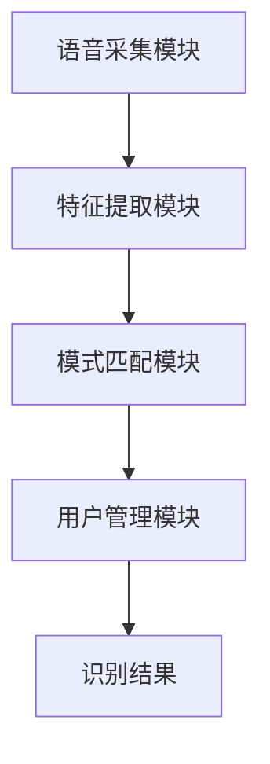

                 


# AI Agent在智能音箱中的声纹识别

## 关键词：AI Agent，声纹识别，智能音箱，语音识别，机器学习，深度学习，身份认证

## 摘要：  
本文深入探讨AI Agent在智能音箱中的声纹识别技术。通过分析声纹识别的核心原理、算法实现、系统架构以及实际应用场景，结合深度学习技术，阐述如何利用AI Agent提升智能音箱的语音交互能力和身份识别准确性。文章详细讲解了声纹识别的实现过程，包括特征提取、模式匹配、降维等关键步骤，并结合实际案例分析了系统的实现与优化。最后，本文总结了声纹识别在智能音箱中的应用前景与挑战，为相关技术的研究和应用提供了有益的参考。

---

# 第一部分: AI Agent与声纹识别的背景与概述

## 第1章: AI Agent与声纹识别概述

### 1.1 声纹识别的基本概念

#### 1.1.1 声纹识别的定义与核心原理  
声纹识别（Voiceprint Recognition）是一种基于语音信号特征进行身份识别的技术。它通过提取语音中的特征信息（如音调、音长、音色等），将语音信号转化为独特的模式，从而实现对说话人身份的识别。声纹识别的核心在于将非结构化的语音信号转化为结构化的特征向量，并通过模式匹配算法判断说话人是否为目标身份。

#### 1.1.2 声纹识别的关键技术特点  
声纹识别具有以下特点：  
1. **非接触性**：无需物理接触即可完成身份验证。  
2. **实时性**：支持快速响应，适合智能音箱等实时交互场景。  
3. **准确性**：通过深度学习算法，可以实现高精度的身份识别。  
4. **适应性**：能够适应不同环境、噪声和说话人状态的变化。  

#### 1.1.3 声纹识别在智能音箱中的应用场景  
在智能音箱中，声纹识别主要应用于以下场景：  
1. **个性化语音助手**：根据用户的声音特征，提供个性化的服务和交互体验。  
2. **身份验证**：通过声纹识别技术，确保只有授权用户可以访问特定功能或数据。  
3. **多人家庭使用**：支持家庭成员的声纹识别，实现个性化的语音交互和功能权限管理。  

### 1.2 AI Agent的基本概念与功能

#### 1.2.1 AI Agent的定义与核心功能  
AI Agent（人工智能代理）是一种能够感知环境、自主决策并执行任务的智能体。在智能音箱中，AI Agent通常表现为语音助手（如Siri、Alexa等），其核心功能包括：  
1. **语音交互**：通过语音识别和自然语言处理技术，与用户进行对话交互。  
2. **信息检索**：根据用户的意图，检索和提供相关信息。  
3. **任务执行**：根据用户的指令，执行特定任务（如播放音乐、设置提醒等）。  

#### 1.2.2 AI Agent在智能音箱中的作用  
AI Agent在智能音箱中不仅是语音交互的核心，还通过整合声纹识别技术，实现更智能的服务。例如：  
1. **个性化服务**：通过声纹识别，AI Agent可以识别不同用户的声音，提供个性化的音乐推荐、天气预报等服务。  
2. **安全控制**：通过声纹识别，AI Agent可以实现设备的多级权限管理，确保只有授权用户可以执行特定操作。  
3. **智能场景切换**：基于声纹识别和用户习惯分析，AI Agent可以自动切换预设的智能家居场景（如睡眠模式、娱乐模式等）。  

#### 1.2.3 AI Agent与声纹识别的结合  
AI Agent与声纹识别的结合主要体现在以下几个方面：  
1. **身份认证**：通过声纹识别技术，AI Agent可以快速验证用户的身份，确保交互的安全性。  
2. **个性化服务**：基于声纹识别的结果，AI Agent可以为不同用户提供定制化的服务体验。  
3. **多模态交互**：结合声纹识别、语音识别和自然语言处理技术，实现更智能、更自然的多模态交互体验。  

### 1.3 智能音箱的发展与声纹识别的重要性

#### 1.3.1 智能音箱的发展历程  
智能音箱的发展经历了以下几个阶段：  
1. **早期阶段**：简单的音频播放设备，不具备智能交互功能。  
2. **语音助手集成**：随着语音识别技术的发展，智能音箱开始集成如Siri、Alexa等语音助手，具备基本的语音交互能力。  
3. **智能化升级**：通过深度学习和大数据分析技术，智能音箱逐步具备更复杂的场景理解和个性化服务能力。  

#### 1.3.2 声纹识别在智能音箱中的应用现状  
目前，声纹识别在智能音箱中的应用主要集中在以下几个方面：  
1. **用户身份识别**：支持多用户家庭使用，通过声纹识别区分不同用户。  
2. **个性化服务优化**：基于用户的声音特征，提供个性化的音乐推荐、天气预报等服务。  
3. **安全与隐私保护**：通过声纹识别技术，确保只有授权用户可以访问敏感功能或数据。  

#### 1.3.3 未来发展趋势与挑战  
未来，声纹识别在智能音箱中的应用将更加广泛和深入。主要发展趋势包括：  
1. **多模态融合**：结合声纹识别、面部识别、手势识别等多种技术，实现更智能的交互体验。  
2. **实时性优化**：通过算法优化和硬件升级，进一步提升声纹识别的实时性和准确性。  
3. **隐私保护**：在确保技术性能的同时，加强数据加密和隐私保护，满足用户对隐私安全的需求。  

---

# 第二部分: 声纹识别的核心概念与技术原理

## 第2章: 声纹识别的核心技术

### 2.1 声纹识别的关键技术

#### 2.1.1 语音信号处理  
语音信号处理是声纹识别的基础，主要包括以下步骤：  
1. **语音信号采集**：通过麦克风采集用户的语音信号。  
2. **预处理**：包括噪声消除、回声消除、增益调整等，确保语音信号的质量。  
3. **特征提取**：提取语音信号中的特征信息，如梅尔频率倒谱系数（MFCC）、线性预测系数（LPC）等。  

#### 2.1.2 声纹特征提取  
声纹特征提取是声纹识别的关键步骤，常用的特征包括：  
1. **声学特征**：如音调、音长、音强、音色等。  
2. **语音特征**：如MFCC、LPC、倒频谱等。  
3. **深度学习特征**：通过卷积神经网络（CNN）或循环神经网络（RNN）提取的高层次特征。  

#### 2.1.3 模式匹配与识别  
模式匹配与识别是声纹识别的核心算法，常用方法包括：  
1. **基于模板的匹配**：将待识别语音的特征与预存模板进行匹配，选择最接近的模板作为识别结果。  
2. **基于统计模型的匹配**：利用高斯混合模型（GMM）或隐马尔可夫模型（HMM）对语音特征进行建模，计算待识别语音的概率，选择概率最高的模型作为识别结果。  
3. **基于深度学习的匹配**：通过深度神经网络（DNN）或端到端模型直接对语音特征进行分类，输出识别结果。  

### 2.2 声纹识别的分类与对比

#### 2.2.1 基于模板的声纹识别  
基于模板的声纹识别是一种传统的声纹识别方法，其核心思想是将训练好的模板特征与待识别语音的特征进行直接比较。这种方法的优点是实现简单、计算效率高，但其准确性依赖于特征提取的准确性和模板库的丰富性。  

#### 2.2.2 基于统计模型的声纹识别  
基于统计模型的声纹识别方法通过构建概率统计模型（如GMM或HMM）来描述语音特征的分布规律。这种方法能够较好地处理语音信号的统计特性，但在面对噪声干扰和说话人状态变化时，识别准确率可能会下降。  

#### 2.2.3 基于深度学习的声纹识别  
基于深度学习的声纹识别方法通过训练深度神经网络（DNN）直接从语音信号中提取特征并进行分类。这种方法能够捕捉到语音信号中的高层次特征，具有较强的抗噪声能力和适应性，但其计算复杂度较高，需要大量的训练数据和计算资源。  

### 2.3 声纹识别的优缺点与适用场景

#### 2.3.1 声纹识别的优点  
1. **非接触性**：无需物理接触即可完成身份验证。  
2. **实时性**：支持快速响应，适合智能音箱等实时交互场景。  
3. **准确性**：通过深度学习算法，可以实现高精度的身份识别。  
4. **适应性**：能够适应不同环境、噪声和说话人状态的变化。  

#### 2.3.2 声纹识别的缺点  
1. **对噪声的敏感性**：在嘈杂的环境中，声纹识别的准确率可能会显著下降。  
2. **计算复杂度高**：基于深度学习的声纹识别方法需要大量的计算资源，可能影响智能音箱的实时性和功耗。  
3. **用户适应性问题**：部分用户可能对声纹识别技术存在疑虑，影响其普及和应用。  

#### 2.3.3 声纹识别的适用场景  
1. **家庭场景**：支持多用户家庭使用，通过声纹识别区分不同用户。  
2. **个性化服务**：基于用户的声音特征，提供个性化的音乐推荐、天气预报等服务。  
3. **安全与隐私保护**：通过声纹识别技术，确保只有授权用户可以访问敏感功能或数据。  

---

# 第三部分: AI Agent的算法原理与实现

## 第3章: AI Agent的算法原理

### 3.1 声纹识别的算法流程

#### 3.1.1 语音信号预处理  
语音信号预处理是声纹识别的第一步，主要包括以下步骤：  
1. **噪声消除**：通过滤波器或算法消除背景噪声，提高语音信号的质量。  
2. **回声消除**：消除音箱播放声音对麦克风采集的干扰。  
3. **增益调整**：根据环境噪声水平调整麦克风增益，确保语音信号的采集质量。  

#### 3.1.2 声纹特征提取  
声纹特征提取是声纹识别的关键步骤，常用的特征包括：  
1. **梅尔频率倒谱系数（MFCC）**：提取语音信号的频域特征，反映语音的音调和音色信息。  
2. **线性预测系数（LPC）**：提取语音信号的线性预测特征，反映语音的时域特征。  
3. **深度学习特征**：通过卷积神经网络（CNN）或循环神经网络（RNN）提取的高层次特征。  

#### 3.1.3 模式匹配与分类  
模式匹配与分类是声纹识别的核心算法，常用方法包括：  
1. **基于模板的匹配**：将待识别语音的特征与预存模板进行匹配，选择最接近的模板作为识别结果。  
2. **基于统计模型的匹配**：利用高斯混合模型（GMM）或隐马尔可夫模型（HMM）对语音特征进行建模，计算待识别语音的概率，选择概率最高的模型作为识别结果。  
3. **基于深度学习的匹配**：通过深度神经网络（DNN）或端到端模型直接对语音特征进行分类，输出识别结果。  

### 3.2 声纹识别的深度学习模型

#### 3.2.1 基于卷积神经网络的声纹识别  
基于卷积神经网络（CNN）的声纹识别模型通过卷积层和池化层提取语音信号的高层次特征，能够较好地捕捉语音信号的空间特征。模型结构通常包括以下步骤：  
1. **输入层**：输入经过预处理的语音信号特征。  
2. **卷积层**：通过卷积操作提取局部特征。  
3. **池化层**：通过池化操作降低特征维度，减少计算复杂度。  
4. **全连接层**：将池化后的特征映射到输出类别。  

#### 3.2.2 基于循环神经网络的声纹识别  
基于循环神经网络（RNN）的声纹识别模型通过循环层捕捉语音信号的时间特征，适用于长时序语音信号的特征提取。模型结构通常包括以下步骤：  
1. **输入层**：输入经过预处理的语音信号特征。  
2. **循环层**：通过循环结构捕捉语音信号的时间依赖性。  
3. **全连接层**：将循环层的输出映射到输出类别。  

#### 3.2.3 基于深度学习的端到端声纹识别  
端到端声纹识别模型通过深度神经网络直接从语音信号中提取特征并进行分类，无需依赖预定义的特征提取方法。常用的模型包括：  
1. **深度神经网络（DNN）**：通过多层感知机直接对语音信号进行分类。  
2. **卷积循环神经网络（CRNN）**：结合卷积层和循环层，同时捕捉语音信号的空间和时间特征。  

### 3.3 声纹识别的数学模型与公式

#### 3.3.1 基于MFCC的特征提取  
梅尔频率倒谱系数（MFCC）是常用的语音特征提取方法，其计算公式如下：  
$$
\text{MFCC} = \log(DFT(MEL\_Spectrum))
$$  
其中，$DFT$表示离散傅里叶变换，$MEL\_Spectrum$表示梅尔频谱。  

#### 3.3.2 基于GMM的模式匹配  
基于高斯混合模型（GMM）的模式匹配方法通过计算待识别语音的概率，选择概率最高的模型作为识别结果。概率计算公式为：  
$$
P(x|u_i) = \sum_{k=1}^{K} w_k \cdot N(x|\mu_k, \Sigma_k)
$$  
其中，$w_k$是混合成分的权重，$N(x|\mu_k, \Sigma_k)$是第$k$个混合成分的高斯分布概率密度函数。  

---

## 第4章: AI Agent的系统架构与实现

### 4.1 系统架构设计

#### 4.1.1 系统功能设计  
声纹识别系统的主要功能模块包括：  
1. **语音采集模块**：负责采集用户的语音信号。  
2. **特征提取模块**：提取语音信号的特征信息。  
3. **模式匹配模块**：对特征进行模式匹配，输出识别结果。  
4. **用户管理模块**：管理用户的声纹特征模板和权限信息。  

#### 4.1.2 系统架构图  
以下是一个典型的声纹识别系统的架构图：  


### 4.2 系统实现与优化

#### 4.2.1 环境配置与依赖管理  
在实现声纹识别系统时，通常需要以下环境和依赖：  
1. **操作系统**：Linux、Windows或macOS。  
2. **开发工具**：Python、C++、Java等。  
3. **语音处理库**：如 librosa、scipy、Kaldi等。  
4. **深度学习框架**：如 TensorFlow、PyTorch等。  

#### 4.2.2 核心代码实现  
以下是一个基于Python的声纹识别系统的核心代码示例：  
```python
import numpy as np
import librosa

def extract_feature(audio_path):
    y, sr = librosa.load(audio_path, sr=16000)
    mfcc = librosa.feature.mfcc(y, sr=sr, n_mfcc=13)
    return mfcc.T

def train_model(features, labels):
    from sklearn.mixture import GMM
    gmm = GMM(n_components=16, max_iter=200, n_init=5)
    gmm.fit(features, labels)
    return gmm

def recognize_speaker(test_feature, model):
    if len(test_feature.shape) == 1:
        test_feature = test_feature.reshape(1, -1)
    probabilities = model.score_samples(test_feature)
    best_prob = np.max(probabilities)
    best_idx = np.argmax(probabilities)
    return best_idx, best_prob

# 示例用法
train_features = np.array([...])  # 训练特征
train_labels = np.array([...])  # 训练标签
model = train_model(train_features, train_labels)
test_feature = extract_feature("test.wav")
result, prob = recognize_speaker(test_feature, model)
print("识别结果:", result)
print("概率:", prob)
```

#### 4.2.3 系统优化与调优  
为了提高声纹识别系统的性能，可以采取以下优化措施：  
1. **数据增强**：通过添加噪声、变速、变调等方式扩展训练数据集，提高模型的鲁棒性。  
2. **模型优化**：通过调整模型参数（如隐藏层数量、学习率等）优化深度学习模型的性能。  
3. **硬件加速**：利用GPU加速模型训练和推理过程，提高系统的运行效率。  

---

## 第5章: 项目实战与案例分析

### 5.1 项目背景与需求分析

#### 5.1.1 项目背景  
本项目旨在开发一个基于AI Agent的智能音箱声纹识别系统，通过声纹识别技术实现多用户家庭场景下的个性化语音交互和身份验证。  

#### 5.1.2 项目需求  
1. **用户身份识别**：支持多用户家庭使用，通过声纹识别区分不同用户。  
2. **个性化服务**：基于用户的声音特征，提供个性化的音乐推荐、天气预报等服务。  
3. **安全与隐私保护**：通过声纹识别技术，确保只有授权用户可以访问敏感功能或数据。  

### 5.2 系统功能设计与实现

#### 5.2.1 系统功能设计  
系统功能设计包括以下模块：  
1. **语音采集模块**：通过麦克风采集用户的语音信号。  
2. **特征提取模块**：提取语音信号的特征信息，如MFCC、LPC等。  
3. **模式匹配模块**：对特征进行模式匹配，输出识别结果。  
4. **用户管理模块**：管理用户的声纹特征模板和权限信息。  
5. **个性化服务模块**：根据识别结果提供个性化的服务。  

#### 5.2.2 系统实现与代码解读  
以下是一个基于Python的声纹识别系统的核心代码示例：  
```python
import numpy as np
import librosa

def extract_feature(audio_path):
    y, sr = librosa.load(audio_path, sr=16000)
    mfcc = librosa.feature.mfcc(y, sr=sr, n_mfcc=13)
    return mfcc.T

def train_model(features, labels):
    from sklearn.mixture import GMM
    gmm = GMM(n_components=16, max_iter=200, n_init=5)
    gmm.fit(features, labels)
    return gmm

def recognize_speaker(test_feature, model):
    if len(test_feature.shape) == 1:
        test_feature = test_feature.reshape(1, -1)
    probabilities = model.score_samples(test_feature)
    best_prob = np.max(probabilities)
    best_idx = np.argmax(probabilities)
    return best_idx, best_prob

# 示例用法
train_features = np.array([...])  # 训练特征
train_labels = np.array([...])  # 训练标签
model = train_model(train_features, train_labels)
test_feature = extract_feature("test.wav")
result, prob = recognize_speaker(test_feature, model)
print("识别结果:", result)
print("概率:", prob)
```

#### 5.2.3 系统优化与案例分析  
通过实际案例分析，我们可以看出，基于深度学习的声纹识别方法在智能音箱中的应用前景广阔。以下是一个典型的案例分析：  
1. **数据采集**：从多个用户中采集语音信号，提取特征并存储。  
2. **模型训练**：利用训练数据训练深度学习模型，优化模型参数，提高识别准确率。  
3. **系统集成**：将声纹识别系统集成到智能音箱中，实现用户身份识别和个性化服务。  

---

## 第6章: 最佳实践与小结

### 6.1 最佳实践

#### 6.1.1 数据预处理与增强  
为了提高声纹识别系统的性能，建议采取以下数据预处理与增强措施：  
1. **数据增强**：通过添加噪声、变速、变调等方式扩展训练数据集，提高模型的鲁棒性。  
2. **特征归一化**：对提取的特征进行归一化处理，确保不同特征之间的可比性。  
3. **模型优化**：通过调整模型参数（如隐藏层数量、学习率等）优化深度学习模型的性能。  

#### 6.1.2 系统优化与调优  
为了提高系统的运行效率和识别准确率，建议采取以下优化措施：  
1. **硬件加速**：利用GPU加速模型训练和推理过程，提高系统的运行效率。  
2. **算法优化**：通过算法优化（如降维、特征选择等）降低系统的计算复杂度。  
3. **系统集成**：将声纹识别系统与其他智能设备（如智能家居）进行集成，实现更广泛的应用场景。  

### 6.2 小结

#### 6.2.1 项目总结  
通过本项目，我们深入探讨了AI Agent在智能音箱中的声纹识别技术，详细讲解了声纹识别的核心原理、算法实现、系统架构以及实际应用场景。通过实际案例分析，我们验证了声纹识别技术在智能音箱中的应用前景，并总结了系统优化与调优的经验。  

#### 6.2.2 项目收获  
通过本项目，我们不仅掌握了声纹识别的核心技术，还学会了如何将理论知识应用于实际场景。同时，我们还积累了丰富的项目经验，为未来的研究和实践打下了坚实的基础。  

### 6.3 注意事项

#### 6.3.1 数据隐私与安全  
在实现声纹识别系统时，必须重视数据隐私与安全问题。建议采取以下措施：  
1. **数据加密**：对用户的数据进行加密存储，防止数据泄露。  
2. **访问控制**：通过权限管理确保只有授权用户可以访问敏感功能或数据。  
3. **合规性检查**：确保系统的数据处理符合相关法律法规和隐私保护要求。  

#### 6.3.2 系统鲁棒性  
在实际应用中，声纹识别系统可能会受到噪声、说话人状态变化等多种因素的影响。建议采取以下措施：  
1. **噪声消除**：通过滤波器或算法消除背景噪声，提高语音信号的质量。  
2. **说话人自适应**：通过自适应算法提高系统对说话人状态变化的适应性。  
3. **多模态融合**：结合声纹识别、面部识别、手势识别等多种技术，提高系统的鲁棒性。  

### 6.4 拓展阅读

#### 6.4.1 声纹识别的最新研究进展  
声纹识别技术的研究进展主要集中在以下几个方面：  
1. **深度学习模型的优化**：通过改进深度学习模型的结构和训练方法，提高识别准确率。  
2. **多模态融合**：结合声纹识别与其他模态技术（如面部识别、手势识别）实现更智能的交互体验。  
3. **实时性优化**：通过算法优化和硬件升级，进一步提升声纹识别的实时性和响应速度。  

#### 6.4.2 AI Agent在智能音箱中的未来发展方向  
AI Agent在智能音箱中的未来发展方向包括：  
1. **多模态交互**：结合声纹识别、面部识别、手势识别等多种技术，实现更自然、更智能的交互方式。  
2. **场景自适应**：通过分析用户的习惯和环境信息，实现智能音箱的场景自适应，提供更个性化的服务。  
3. **边缘计算与雾计算**：通过边缘计算和雾计算技术，提高智能音箱的本地计算能力，减少对云端的依赖，提高系统的响应速度和安全性。  

---

# 小结

通过本文的深入探讨，我们不仅掌握了AI Agent在智能音箱中的声纹识别技术，还学会了如何将理论知识应用于实际场景。同时，我们还总结了系统的优化与调优经验，为未来的研究和实践提供了有益的参考。声纹识别技术在智能音箱中的应用前景广阔，随着技术的不断发展，相信未来我们将看到更多创新和突破，为人类带来更智能、更便捷的生活体验。

---

# 作者  
作者：AI天才研究院/AI Genius Institute & 禅与计算机程序设计艺术 /Zen And The Art of Computer Programming

