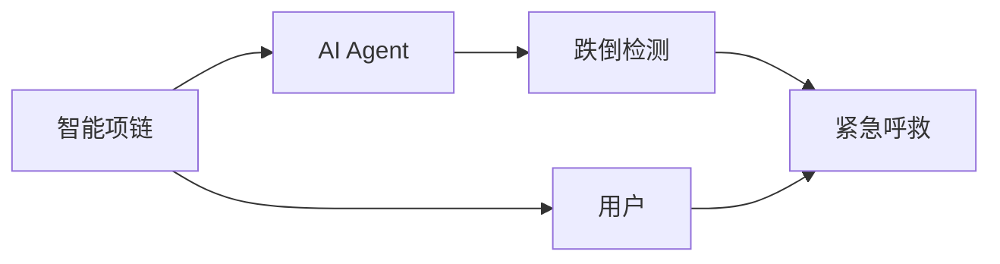

                 


---

# AI Agent在智能项链中的跌倒检测与紧急呼救

## 关键词：AI Agent, 跌倒检测, 紧急呼救, 智能项链, 人工智能, 健康监测

## 摘要：
本文深入探讨AI Agent在智能项链中的应用，重点分析其在跌倒检测与紧急呼救中的技术原理和实现方法。文章从背景介绍、核心概念、算法原理、系统设计到项目实战，全面解析AI Agent如何通过感知、决策和执行机制实现智能监测和响应，为老年人健康保驾护航。

---

## 第一部分：背景介绍

### 第1章：AI Agent与智能项链概述

#### 1.1 跌倒检测的重要性
- 跌倒事件的高发性：根据世界卫生组织统计，每年有数百万人因跌倒导致严重伤害，尤其是老年人群体。
- 跌倒对老年人健康的影响：跌倒可能导致骨折、脑损伤甚至死亡，严重影响生活质量。
- 跌倒检测的必要性：及时检测跌倒并采取措施，可以显著降低伤害风险。

#### 1.2 AI Agent的基本概念
- 什么是AI Agent：AI Agent是具有感知环境、做出决策并执行动作的智能实体，能够主动完成任务。
- AI Agent的核心功能：感知、决策、执行。
- AI Agent在智能设备中的应用：广泛应用于智能家居、可穿戴设备等领域，提供智能化服务。

#### 1.3 智能项链的技术背景
- 智能项链的功能与特点：集成传感器、AI算法，具备实时监测和智能响应功能。
- 智能项链的硬件组成：包括加速度传感器、陀螺仪、蓝牙模块、麦克风等。
- AI Agent在智能项链中的实现：通过传感器数据采集和AI算法分析，实现跌倒检测和紧急呼救。

#### 1.4 跌倒检测与紧急呼救的概念结构
- 跌倒检测的定义与范围：基于传感器数据，识别用户是否发生跌倒。
- 紧急呼救的定义与范围：在检测到跌倒后，启动呼救机制，联系紧急联系人或医疗单位。
- 跌倒检测与紧急呼救的关系：跌倒是触发呼救的条件，两者共同构成完整的监测与响应系统。

---

## 第二部分：核心概念与联系

### 第2章：AI Agent的核心原理

#### 2.1 AI Agent的感知机制
- 传感器数据的采集与处理：智能项链中的加速度传感器和陀螺仪实时采集用户的运动数据。
- 数据特征的提取与分析：通过分析加速度和角速度的变化，识别用户的正常行走和跌倒行为。

#### 2.2 AI Agent的决策机制
- 跌倒判定的逻辑：基于时间序列模型，分析加速度和陀螺仪数据，判断是否发生跌倒。
- 紧急呼救的触发条件：结合跌倒判定和用户位置信息，决定是否启动呼救机制。

#### 2.3 AI Agent的执行机制
- 紧急呼救的实现方式：通过蓝牙或 GSM 模块发送紧急呼救信息，通知预设的紧急联系人。
- 与其他设备的联动：与智能家居系统联动，启动灯光、门禁等设备，帮助救援人员快速响应。

#### 2.4 核心概念对比表
| **对比项**       | **传统跌倒检测**                | **AI Agent检测**                  |
|-------------------|----------------------------------|-----------------------------------|
| 检测方式           | 单一传感器数据                  | 多传感器融合                      |
| 数据分析方式       | 简单阈值判断                    | 复杂算法分析                      |
| 响应速度           | 较慢                            | 实时快速                          |
| 准确率             | 较低                            | 高                                 |

#### 2.5 实体关系图


---

## 第三部分：算法原理讲解

### 第3章：跌倒检测算法

#### 3.1 数据采集与预处理
- 传感器数据的采集：智能项链中的加速度传感器和陀螺仪持续采集用户的身体运动数据。
- 数据预处理：去除噪声，提取关键特征，如加速度最大值、变化率等。

#### 3.2 跌倒判定模型
- 时间序列模型：使用 LSTM 神经网络，分析加速度和陀螺仪的时间序列数据。
- 分类模型：通过训练好的分类器，判断当前行为是否为跌倒。

#### 3.3 算法流程图


#### 3.4 核心算法代码
```python
import numpy as np
from sklearn.model_selection import train_test_split
from tensorflow.keras.models import Sequential
from tensorflow.keras.layers import LSTM, Dense, Dropout

# 数据准备
X = ...  # 加速度和陀螺仪数据
y = ...  # 标签：0代表未跌倒，1代表跌倒

# 划分训练集和测试集
X_train, X_test, y_train, y_test = train_test_split(X, y, test_size=0.2)

# 模型构建
model = Sequential()
model.add(LSTM(64, input_shape=(timesteps, features)))
model.add(Dropout(0.2))
model.add(Dense(1, activation='sigmoid'))

model.compile(loss='binary_crossentropy', optimizer='adam', metrics=['accuracy'])

# 训练模型
model.fit(X_train, y_train, epochs=10, batch_size=32)
```

#### 3.5 紧急呼救触发机制
- 跌倒判定后，系统通过蓝牙模块发送紧急呼救信号。
- 呼救信号包含用户位置信息，通知预设的紧急联系人或医疗单位。

---

## 第四部分：系统分析与架构设计

### 第4章：系统设计与实现

#### 4.1 项目背景与目标
- 项目背景：解决老年人跌倒检测与紧急呼救的问题。
- 项目目标：开发一款基于AI Agent的智能项链，实现实时监测和智能响应。

#### 4.2 系统功能设计
- 跌倒检测模块：实时监测用户跌倒行为。
- 紧急呼救模块：在检测到跌倒后，启动呼救机制。

#### 4.3 系统架构设计


#### 4.4 系统接口设计
- 用户端接口：智能项链的传感器数据接口。
- 紧急呼救接口：与紧急联系人或医疗单位的通信接口。

#### 4.5 系统交互流程图


---

## 第五部分：项目实战

### 第5章：开发环境与核心代码

#### 5.1 开发环境搭建
- 硬件：智能项链设备、蓝牙模块、GSM模块。
- 软件：Python、TensorFlow、传感器数据处理库。

#### 5.2 核心代码实现
```python
import numpy as np
import serial
import time

# 初始化蓝牙模块
ser = serial.Serial('COM3', 9600)

def send_alert():
    # 发送紧急信号
    ser.write(b'alert')
    time.sleep(1)
    ser.write(b'摔倒了！')

# 跌倒检测主程序
while True:
    data = ser.readline().decode().strip()
    if data == 'fall detected':
        send_alert()

# 系统关闭
ser.close()
```

#### 5.3 代码功能解读
- 蓝牙模块初始化：配置蓝牙通信参数，建立与智能项链的连接。
- 紧急信号发送：检测到跌倒后，通过蓝牙模块发送紧急信号。
- 通信线程：实时监测传感器数据，判断是否发生跌倒。

#### 5.4 实际案例分析
- 案例1：用户正常行走，系统无异常。
- 案例2：用户发生跌倒，系统立即发送紧急信号，通知紧急联系人。

---

## 第六部分：总结与展望

### 第6章：总结与展望

#### 6.1 项目总结
- 技术总结：AI Agent通过多传感器融合和深度学习算法，实现了高准确率的跌倒检测和紧急呼救。
- 经验总结：系统设计需注重传感器选择和算法优化，确保实时性和准确性。

#### 6.2 优缺点分析
- 优点：实时监测、智能响应、准确性高。
- 缺点：硬件成本较高、算法优化空间有限。

#### 6.3 未来展望
- 技术优化：引入更先进的传感器和算法，如毫米波雷达和更复杂的深度学习模型。
- 应用扩展：结合更多智能设备，构建完整的智能家居健康监测系统。

#### 6.4 实用建议
- 系统维护：定期更新算法模型，确保检测准确率。
- 用户隐私：确保用户数据的安全性，保护隐私。

---

## 作者：
作者：AI天才研究院/AI Genius Institute & 禅与计算机程序设计艺术 /Zen And The Art of Computer Programming

---

通过以上内容，我们详细解析了AI Agent在智能项链中的跌倒检测与紧急呼救的实现过程，从背景介绍到系统设计，再到项目实战，全面展示了技术细节和实际应用。希望本文能为相关领域的研究和开发提供有价值的参考。

