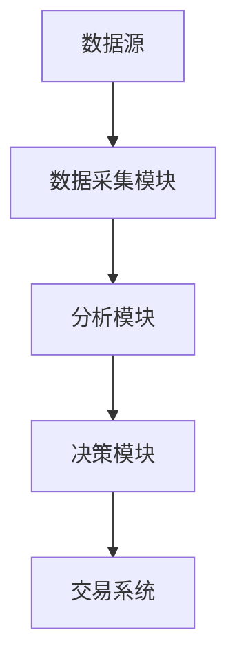

                 


# AI Agent在智能风险投资分析中的应用

> **关键词**：AI Agent，智能投资分析，风险投资，强化学习，系统架构

> **摘要**：本文探讨了AI Agent在智能风险投资分析中的应用，通过分析AI Agent的核心概念、算法原理、系统架构以及实际案例，展示了如何利用AI技术提升风险投资的效率和准确性。文章从背景介绍、核心概念与联系、算法原理、系统分析、项目实战等方面展开，结合Mermaid图和数学公式，详细阐述了AI Agent在风险投资中的应用场景和实现方法。

---

## 第1章: 背景与概述

### 1.1 AI Agent的基本概念
AI Agent（人工智能代理）是指能够感知环境、自主决策并执行任务的智能实体。它通过数据采集、分析和决策，能够实现自动化操作。AI Agent的核心特点包括自主性、反应性、目标导向和学习能力。

### 1.2 风险投资的基本概念
风险投资是一种通过投资高成长性企业，以获取高回报的投资方式。其核心在于对企业的基本面、市场前景和管理团队进行综合评估。传统风险投资依赖人工分析，效率低且容易受主观因素影响。

### 1.3 AI Agent在风险投资中的应用背景
随着金融市场的复杂化，传统投资分析方法逐渐暴露出效率低下和精准度不足的问题。AI Agent能够通过大数据分析和机器学习算法，快速识别投资机会，优化投资组合，降低风险。

---

## 第2章: AI Agent的核心概念与原理

### 2.1 AI Agent的感知机制
AI Agent通过数据采集和处理，获取企业的财务数据、市场动态和行业趋势。通过特征提取和分析，AI Agent能够识别潜在的投资机会。

#### 2.1.1 数据采集与处理
AI Agent从多个数据源（如财务报表、新闻报道）获取数据，并进行清洗和预处理。

#### 2.1.2 数据特征提取
通过自然语言处理（NLP）和统计分析，提取企业的关键特征，如盈利能力、成长潜力和风险指标。

### 2.2 AI Agent的决策机制
AI Agent基于强化学习算法，构建投资决策模型，优化投资组合。

#### 2.2.1 强化学习算法
通过强化学习，AI Agent能够在模拟环境中学习投资策略，逐步优化决策。

#### 2.2.2 投资组合优化
AI Agent根据市场动态和企业特征，动态调整投资组合，降低风险并提高收益。

### 2.3 AI Agent的执行机制
AI Agent通过自动化交易系统，执行投资决策。

#### 2.3.1 自动化交易
AI Agent能够快速识别交易机会，并通过API接口实现自动化交易。

#### 2.3.2 风险管理
AI Agent通过实时监控市场变化，及时调整投资策略，降低投资风险。

---

## 第3章: AI Agent在风险投资分析中的算法原理

### 3.1 强化学习算法
强化学习是一种通过试错学习优化决策的算法。在风险投资中，强化学习可以用于构建投资决策模型。

#### 3.1.1 Q-Learning算法
Q-Learning是一种经典的强化学习算法，通过状态-动作-奖励机制优化决策。

#### 3.1.2 策略网络
策略网络是一种基于深度学习的强化学习模型，能够直接输出最优动作。

### 3.2 注意力机制
注意力机制能够帮助AI Agent聚焦于重要的市场信息，提高决策的精准度。

#### 3.2.1 自注意力机制
通过自注意力机制，AI Agent能够捕捉数据中的长距离依赖关系。

#### 3.2.2 多头注意力
多头注意力机制能够同时关注多个信息源，提高模型的表达能力。

### 3.3 算法实现
通过Python代码实现强化学习算法，并通过Mermaid图展示算法流程。

```python
import numpy as np
from collections import deque

class AI-Agent:
    def __init__(self, state_space, action_space):
        self.state_space = state_space
        self.action_space = action_space
        self.q_table = np.zeros((state_space, action_space))
    
    def perceive(self, state):
        # 状态感知
        return state
    
    def decide(self, state):
        # 动作决策
        return np.argmax(self.q_table[state])
    
    def learn(self, state, action, reward):
        # Q-Learning学习
        self.q_table[state][action] += reward
```

---

## 第4章: 系统分析与架构设计

### 4.1 系统架构设计
AI Agent的风险投资分析系统由数据采集模块、分析模块和决策模块组成。

#### 4.1.1 数据采集模块
通过API接口获取企业的财务数据和市场信息。

#### 4.1.2 分析模块
使用机器学习算法对数据进行分析，提取投资特征。

#### 4.1.3 决策模块
基于强化学习算法，生成投资决策。

#### 4.1.4 系统架构图


### 4.2 系统功能设计
系统功能包括数据采集、分析、决策和执行。

#### 4.2.1 数据采集
从多个数据源获取企业的财务数据和市场信息。

#### 4.2.2 数据分析
使用机器学习算法分析数据，提取投资特征。

#### 4.2.3 投资决策
基于强化学习算法，生成投资决策。

#### 4.2.4 交易执行
通过自动化交易系统执行投资决策。

---

## 第5章: 项目实战

### 5.1 环境安装
安装必要的Python库，如TensorFlow、Keras和pandas。

### 5.2 核心代码实现
实现AI Agent的核心算法，包括数据处理、模型训练和交易执行。

#### 5.2.1 数据处理
```python
import pandas as pd

data = pd.read_csv('investment_data.csv')
```

#### 5.2.2 模型训练
```python
import tensorflow as tf
from tensorflow.keras import layers

model = tf.keras.Sequential([
    layers.Dense(64, activation='relu'),
    layers.Dense(1, activation='sigmoid')
])
model.compile(optimizer='adam', loss='binary_crossentropy')
model.fit(data, labels, epochs=10)
```

#### 5.2.3 交易执行
```python
def execute_trade(action):
    if action == 'buy':
        # 执行买入操作
    elif action == 'sell':
        # 执行卖出操作
```

### 5.3 案例分析
通过实际案例分析，验证AI Agent的投资决策效果。

---

## 第6章: 总结与展望

### 6.1 本章总结
本文详细探讨了AI Agent在风险投资分析中的应用，通过理论分析和实际案例，展示了AI Agent如何提升投资效率和准确性。

### 6.2 展望
未来，随着AI技术的不断发展，AI Agent在风险投资中的应用将更加广泛和深入。研究者需要进一步优化算法，提升系统的稳定性和准确性。

### 6.3 注意事项
在实际应用中，需要注意数据质量、模型过拟合以及系统安全性等问题。

### 6.4 拓展阅读
推荐读者阅读相关领域的书籍和论文，深入了解AI Agent和风险投资的最新研究进展。

---

## 作者：AI天才研究院/AI Genius Institute & 禅与计算机程序设计艺术 /Zen And The Art of Computer Programming

