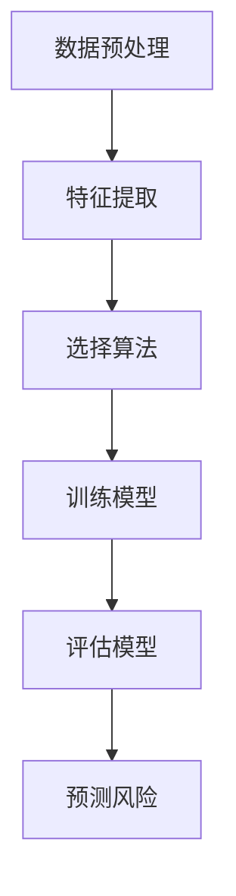
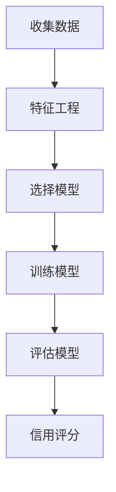
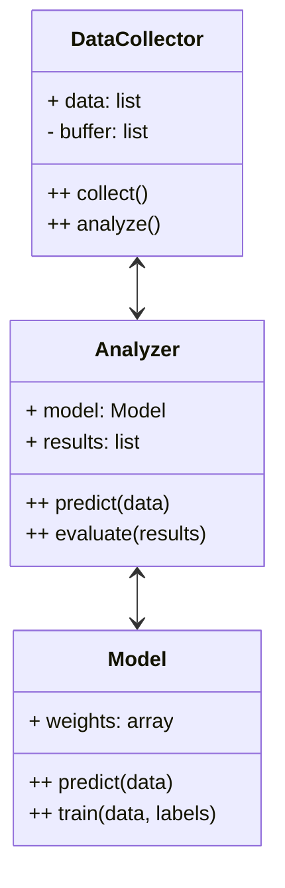
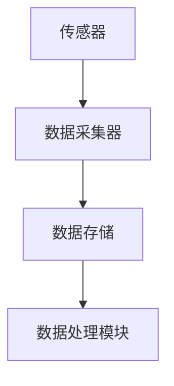
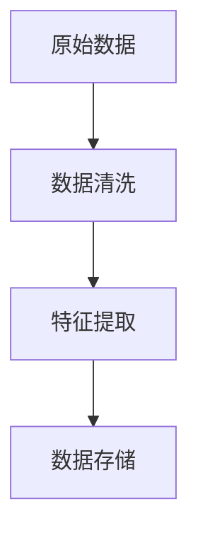
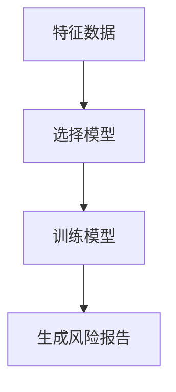
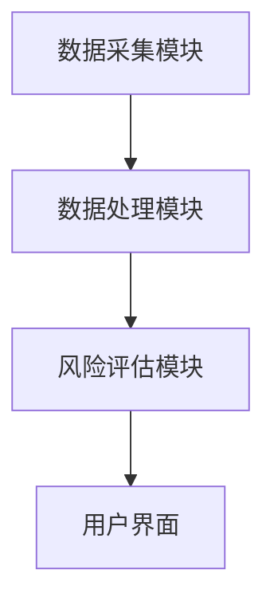
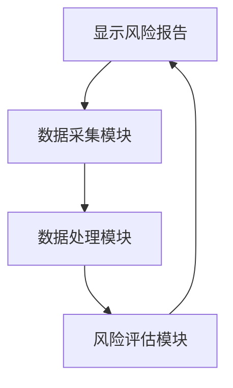

                 


# AI Agent在智能风险管理中的应用

> **关键词**：AI Agent，风险管理，人工智能，风险评估，机器学习

> **摘要**：本文探讨了AI Agent在智能风险管理中的应用，涵盖了AI Agent的基本概念、风险管理的核心原理、AI Agent在风险预测与评估中的技术实现，以及在金融、网络安全等领域的实际应用案例。通过详细的算法解析、系统架构设计和项目实战，本文为读者提供了从理论到实践的全面指导。

---

## 第1章 引言

### 1.1 什么是AI Agent
AI Agent（人工智能代理）是指能够感知环境、自主决策并执行任务的智能体。它通过传感器获取信息，利用算法处理数据，并通过执行器采取行动，以实现特定目标。

**AI Agent的核心特征**：
- **自主性**：能够在没有外部干预的情况下运行。
- **反应性**：能够实时感知环境并做出反应。
- **目标导向**：所有行动均以实现特定目标为导向。

### 1.2 风险管理的重要性
风险管理是识别、评估和应对潜在风险的过程，旨在降低风险带来的损失。在金融、医疗、交通等领域，风险管理至关重要，因为它能帮助企业规避重大损失。

**AI Agent在风险管理中的作用**：
- **实时监控**：持续监测环境中的潜在风险。
- **预测分析**：利用机器学习模型预测风险发生的可能性。
- **自动化应对**：在检测到风险时，自动采取应对措施。

---

## 第2章 AI Agent的核心技术

### 2.1 机器学习与风险管理

#### 2.1.1 机器学习的基本原理
机器学习是一种通过数据训练模型的技术，使模型能够从数据中学习规律并做出预测。常用的机器学习算法包括：

- **监督学习**：使用标记的数据训练模型，如线性回归和决策树。
- **无监督学习**：处理未标记数据，如聚类分析。
- **强化学习**：通过试错机制优化决策，如Q-learning。

#### 2.1.2 机器学习在风险管理中的应用
- **风险预测**：利用历史数据训练模型，预测未来风险。
- **异常检测**：识别数据中的异常值，用于欺诈检测。
- **风险评估**：评估风险的严重性和可能性，帮助制定应对策略。

**算法实现**：
以下是一个简单的线性回归模型，用于预测股票市场的风险：

```python
import numpy as np
from sklearn.linear_model import LinearRegression

# 示例数据
X = np.array([[1], [2], [3], [4]])  # 特征
y = np.array([1, 2, 3, 4])          # 目标

# 训练模型
model = LinearRegression()
model.fit(X, y)

# 预测
print(model.predict([[5]]))  # 输出：[[5]]
```

**算法流程图**：



### 2.2 自然语言处理（NLP）与风险管理

#### 2.2.1 自然语言处理的基本原理
NLP用于处理和理解人类语言，常用于文本分析、情感分析和信息提取。

#### 2.2.2 NLP在风险管理中的应用
- **舆情分析**：通过分析社交媒体数据，预测市场情绪。
- **新闻情感分析**：识别新闻中的情感倾向，辅助投资决策。
- **风险信息提取**：从非结构化数据中提取关键信息。

**NLP实现示例**：

```python
from textblob import TextBlob

text = "The stock market is expected to rise tomorrow."
blob = TextBlob(text)
print(blob.sentiment.polarity)  # 输出：0.75，表示正面情绪
```

---

## 第3章 AI Agent在风险管理中的应用

### 3.1 金融风险管理

#### 3.1.1 股票市场风险预测
利用AI Agent分析历史数据，预测股票价格波动。

**示例代码**：

```python
import numpy as np
from sklearn.svm import SVC

# 示例数据
X = np.array([[1, 2], [3, 4], [5, 6], [7, 8]])
y = np.array([0, 1, 0, 1])  # 0：低风险，1：高风险

# 训练模型
model = SVC()
model.fit(X, y)

# 预测
print(model.predict([[9, 10]]))  # 输出：1，表示高风险
```

#### 3.1.2 信用风险评估
通过AI Agent评估客户的信用状况，预测违约概率。

**算法流程图**：



### 3.2 网络安全风险管理

#### 3.2.1 入侵检测系统
AI Agent实时监控网络流量，识别异常行为。

**示例代码**：

```python
from sklearn.ensemble import RandomForestClassifier

# 示例数据
X = np.array([[1, 0, 0], [0, 1, 0], [0, 0, 1]])
y = np.array([0, 1, 2])  # 0：正常，1：可疑，2：入侵

# 训练模型
model = RandomForestClassifier(n_estimators=10)
model.fit(X, y)

# 预测
print(model.predict([[0, 1, 1]]))  # 输出：1，表示可疑
```

#### 3.2.2 网络流量分析
利用AI Agent分析网络流量，识别潜在的安全威胁。

**系统架构图**：



---

## 第4章 系统架构与设计

### 4.1 系统功能模块

#### 4.1.1 数据采集模块
负责收集环境中的数据，如传感器数据、日志文件等。

**数据采集流程图**：



#### 4.1.2 数据处理模块
对采集的数据进行清洗、转换和特征提取。

**数据处理流程图**：



#### 4.1.3 风险评估模块
利用机器学习模型评估风险，生成风险报告。

**风险评估流程图**：



### 4.2 系统架构设计

#### 4.2.1 系统架构图



#### 4.2.2 系统交互流程图



---

## 第5章 项目实战：智能风控系统

### 5.1 环境安装

安装所需的库：

```bash
pip install numpy scikit-learn textblob
```

### 5.2 核心实现

实现一个简单的风险管理模型：

```python
import numpy as np
from sklearn.ensemble import RandomForestClassifier

# 数据加载
X = np.load('features.npy')
y = np.load('labels.npy')

# 模型训练
model = RandomForestClassifier(n_estimators=100)
model.fit(X, y)

# 模型评估
print(model.score(X, y))  # 输出：准确率
```

### 5.3 案例分析

分析一个金融市场的风险预测案例：

```python
# 示例数据
X_test = np.array([[1, 2], [3, 4], [5, 6]])
y_pred = model.predict(X_test)

print(y_pred)  # 输出：预测的风险标签
```

### 5.4 结果解读

解释模型的预测结果，并根据结果制定应对策略。

---

## 第6章 总结与展望

### 6.1 最佳实践

- **数据质量**：确保数据的准确性和完整性。
- **模型选择**：根据具体问题选择合适的算法。
- **实时性**：确保系统的实时响应能力。

### 6.2 小结

AI Agent通过机器学习、NLP等技术，显著提升了风险管理的效率和准确性。随着技术的进步，AI Agent将在更多领域发挥重要作用。

### 6.3 注意事项

- 风险模型需要定期更新，以应对环境的变化。
- 注意数据隐私和安全，避免信息泄露。

### 6.4 拓展阅读

- 《机器学习实战》
- 《自然语言处理入门》
- 《风险管理与金融创新》

---

## 作者：AI天才研究院 & 禅与计算机程序设计艺术

---

通过以上内容，本文详细介绍了AI Agent在智能风险管理中的应用，从基础概念到技术实现，再到实际应用，为读者提供了全面的指导。希望读者能够通过本文，深入了解AI Agent在风险管理中的潜力，并将其应用到实际场景中。

