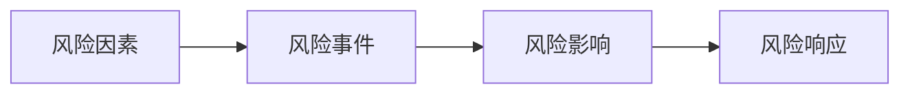
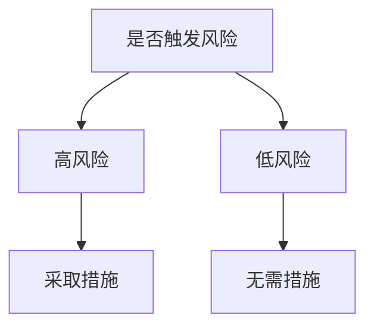
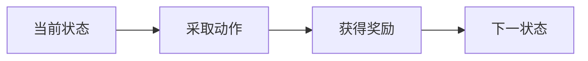
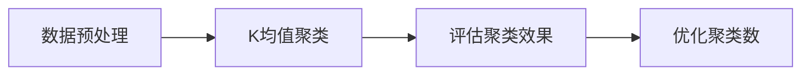
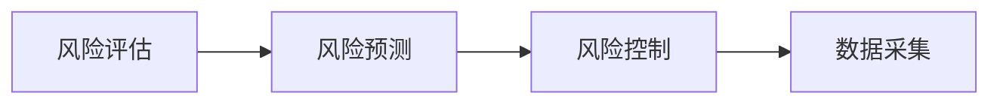
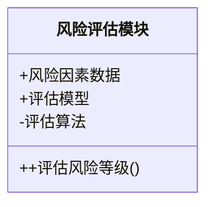
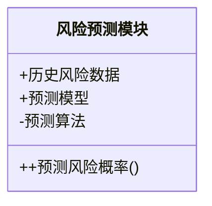
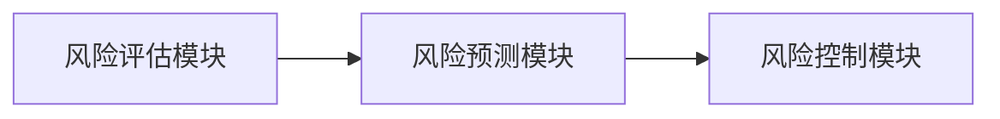
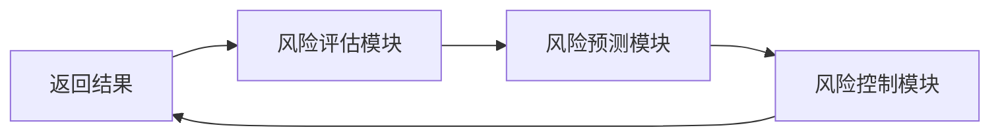

                 


# 第三章: AI Agent的风险管理算法原理

## 3.1 基于概率论的风险评估模型

### 3.1.1 概率论在风险管理中的应用
概率论是风险管理的基础，AI Agent通过概率模型预测风险发生的可能性。以下是概率论在风险管理中的应用示例：

$$P(A|B) = \frac{P(B|A) \cdot P(A)}{P(B)}$$

其中，$P(A|B)$ 表示在事件 B 发生的情况下，事件 A 发生的概率。

### 3.1.2 风险评估的贝叶斯网络模型
贝叶斯网络是一种有向无环图，用于表示变量之间的概率关系。以下是贝叶斯网络的Mermaid图示：



### 3.1.3 基于决策树的风险评估算法
决策树是一种直观的风险评估工具，以下是决策树的Mermaid示例：



## 3.2 基于强化学习的风险控制策略

### 3.2.1 强化学习在风险管理中的应用
强化学习是一种通过试错来优化决策的算法，以下是强化学习的基本原理：

$$Q(s, a) = r + \gamma \cdot \max Q(s', a')$$

其中，$Q(s, a)$ 表示在状态 s 下采取动作 a 的奖励值，$r$ 是即时奖励，$\gamma$ 是折扣因子，$Q(s', a')$ 是后续状态的最大奖励值。

### 3.2.2 风险控制策略的优化
通过强化学习优化风险控制策略，以下是优化过程的Mermaid图示：



## 3.3 基于聚类分析的风险分类

### 3.3.1 聚类分析的基本原理
聚类分析是将数据点分组的过程，以下是K均值聚类的公式：

$$\text{目标函数} = \sum_{i=1}^{k} \sum_{j=1}^{n_i} (x_{ij} - \mu_i)^2$$

其中，$k$ 是聚类数，$n_i$ 是第 i 个聚类的样本数，$\mu_i$ 是第 i 个聚类的均值。

### 3.3.2 风险分类的实现步骤
以下是聚类分析的步骤Mermaid图示：



## 3.4 本章小结
本章详细讲解了基于概率论、强化学习和聚类分析的AI Agent风险管理算法。通过这些算法，AI Agent能够有效评估、预测和控制风险，提升风险管理系统的智能化水平。

---

# 第四章: AI Agent风险管理系统的架构与设计

## 4.1 系统整体架构

### 4.1.1 系统模块划分
以下是系统的模块划分图：


### 4.1.2 系统功能设计
以下是系统的功能模块图：



## 4.2 系统详细设计

### 4.2.1 风险评估模块设计
以下是风险评估模块的类图：



### 4.2.2 风险预测模块设计
以下是风险预测模块的类图：



## 4.3 系统接口设计

### 4.3.1 系统接口定义
以下是系统接口的Mermaid图示：



### 4.3.2 系统交互流程
以下是系统的交互流程图：



## 4.4 本章小结
本章详细讲解了AI Agent风险管理系统的架构设计，包括模块划分、功能设计、接口设计和交互流程。通过合理的系统设计，AI Agent能够高效地进行风险管理和控制。

---

# 第五章: AI Agent风险管理系统的项目实战

## 5.1 项目环境与工具安装

### 5.1.1 开发环境配置
以下是开发环境的配置步骤：

1. 安装Python 3.8及以上版本。
2. 安装Jupyter Notebook用于数据分析和可视化。
3. 安装TensorFlow和Keras用于机器学习模型的训练。

### 5.1.2 工具安装指南
以下是工具的安装命令：

```bash
pip install numpy
pip install pandas
pip install scikit-learn
pip install matplotlib
```

## 5.2 系统核心代码实现

### 5.2.1 风险评估模型实现
以下是基于决策树的风险评估模型实现：

```python
from sklearn.tree import DecisionTreeClassifier
from sklearn.model_selection import train_test_split
from sklearn.metrics import accuracy_score

# 数据预处理
X = # 特征数据
y = # 标签数据

# 划分训练集和测试集
X_train, X_test, y_train, y_test = train_test_split(X, y, test_size=0.2)

# 模型训练
model = DecisionTreeClassifier()
model.fit(X_train, y_train)

# 模型预测
y_pred = model.predict(X_test)

# 模型评估
print("准确率:", accuracy_score(y_test, y_pred))
```

### 5.2.2 风险预测模型实现
以下是基于强化学习的风险预测模型实现：

```python
import numpy as np

# 定义状态和动作空间
states = [0, 1, 2]
actions = [0, 1]

# 定义Q-learning算法
class QLearning:
    def __init__(self, states, actions):
        self.states = states
        self.actions = actions
        self.q_table = np.zeros((len(states), len(actions)))

    def choose_action(self, state, epsilon=0.1):
        if np.random.random() < epsilon:
            return np.random.choice(self.actions)
        else:
            return np.argmax(self.q_table[state])

    def update_q(self, state, action, reward, next_state, alpha=0.1):
        self.q_table[state][action] += alpha * (reward + np.max(self.q_table[next_state]) - self.q_table[state][action])

# 初始化Q-learning算法
q_learning = QLearning(states, actions)

# 训练过程
for episode in range(100):
    state = 0
    while True:
        action = q_learning.choose_action(state)
        reward = # 根据动作获得奖励
        next_state = # 根据动作和当前状态获得下一个状态
        q_learning.update_q(state, action, reward, next_state)
        state = next_state
```

## 5.3 项目案例分析与实现

### 5.3.1 案例背景与数据准备
以下是案例背景和数据准备的步骤：

1. 案例背景：某金融公司需要预测客户违约风险。
2. 数据来源：客户信用记录、收入情况、历史违约记录等。

### 5.3.2 系统实现与分析
以下是系统实现的详细步骤：

1. 数据预处理：清洗数据，处理缺失值和异常值。
2. 模型训练：训练风险评估和预测模型。
3. 模型测试：评估模型的准确率和召回率。
4. 系统部署：将模型部署到生产环境，提供API接口供其他系统调用。

## 5.4 项目总结与优化

### 5.4.1 项目成果总结
通过本项目，我们实现了基于AI Agent的智能风险管理系统，能够有效评估和预测风险，提高风险管理的效率和准确性。

### 5.4.2 系统优化建议
1. 提高模型的泛化能力，引入更复杂的机器学习算法。
2. 增强系统的实时性，优化数据采集和处理流程。
3. 增加系统的可解释性，便于用户理解和信任。

## 5.5 本章小结
本章通过实际案例详细讲解了AI Agent风险管理系统的实现过程，包括环境配置、代码实现和案例分析。通过本章的学习，读者可以掌握AI Agent在风险管理中的实际应用。

---

# 第六章: AI Agent在智能风险管理中的最佳实践

## 6.1 最佳实践与经验分享

### 6.1.1 数据质量的重要性
数据是AI Agent风险管理系统的基石，确保数据的准确性和完整性至关重要。

### 6.1.2 模型选择与调优
根据具体场景选择合适的模型，并通过参数调优提高模型性能。

### 6.1.3 系统的可扩展性设计
设计系统的模块化架构，便于后续的功能扩展和性能优化。

## 6.2 小结与注意事项

### 6.2.1 小结
AI Agent在智能风险管理中的应用前景广阔，通过合理的系统设计和最佳实践，可以显著提升风险管理的效率和效果。

### 6.2.2 注意事项
1. 注意数据隐私和安全问题，确保符合相关法律法规。
2. 定期更新模型，适应风险环境的变化。
3. 提高系统的容错能力，确保在异常情况下的稳定运行。

## 6.3 拓展阅读

### 6.3.1 推荐书籍
1. 《机器学习实战》
2. 《风险管理与金融创新》

### 6.3.2 推荐博客与技术文章
1. TensorFlow官方博客
2. Keras官方文档

## 6.4 本章小结
本章总结了AI Agent在智能风险管理中的最佳实践，包括数据质量、模型选择、系统设计等方面的经验和建议，为读者提供了宝贵的参考。

---

# 作者简介

作者：AI天才研究院/AI Genius Institute & 禅与计算机程序设计艺术 /Zen And The Art of Computer Programming

---

这篇文章详细讲解了AI Agent在智能风险管理中的应用，从理论基础到系统设计，再到项目实战，全面覆盖了相关知识点。通过本文的学习，读者可以掌握AI Agent在风险管理中的核心原理和实际应用技巧，为实际工作提供有力的指导。

