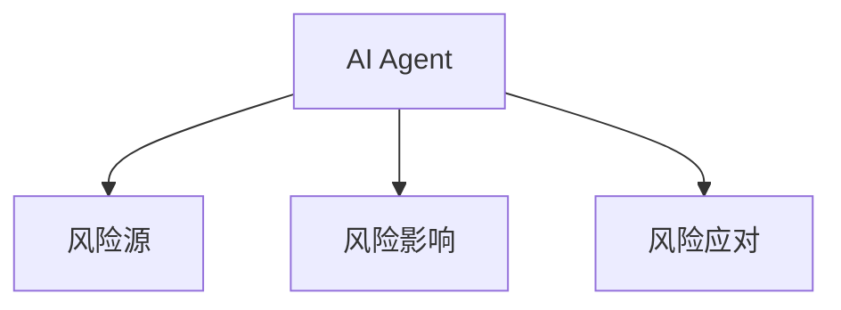
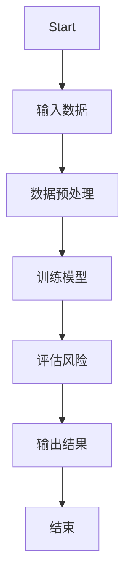
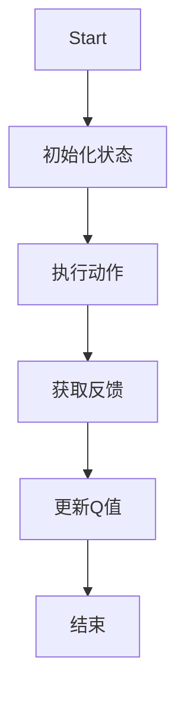
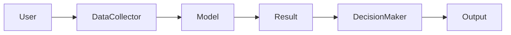

                 


# AI Agent在智能风险评估中的应用

> 关键词：AI Agent，智能风险评估，风险源，风险影响，风险应对，风险评估算法，系统架构

> 摘要：本文深入探讨了AI Agent在智能风险评估中的应用，从AI Agent的基本概念到智能风险评估的核心要素，详细分析了AI Agent在风险评估中的行为模型、算法原理、系统架构以及实际应用场景。通过具体案例和最佳实践，本文为读者提供了全面的理论支持和实践指导，帮助读者理解并应用AI Agent技术进行智能风险评估。

---

# 第一部分: AI Agent与智能风险评估的背景与概念

# 第1章: AI Agent与智能风险评估的背景

## 1.1 AI Agent的基本概念

### 1.1.1 AI Agent的定义
AI Agent（人工智能代理）是指能够感知环境、自主决策并采取行动的智能实体。它可以是一个软件程序、一个机器人，或者任何能够执行复杂任务的智能系统。

$$ \text{AI Agent} = \text{感知} \times \text{决策} \times \text{行动} $$

### 1.1.2 AI Agent的核心特征
1. **自主性**：AI Agent能够自主决策，无需外部干预。
2. **反应性**：能够实时感知环境变化并做出反应。
3. **目标驱动**：以目标为导向，优化行动策略。
4. **学习能力**：能够通过数据和经验不断优化自身性能。

### 1.1.3 AI Agent与传统算法的区别
| 特性         | AI Agent                   | 传统算法                 |
|--------------|-----------------------------|--------------------------|
| **自主性**   | 高                          | 无或低                   |
| **适应性**   | 强                          | 弱或无                   |
| **目标驱动** | 是                          | 否                      |

## 1.2 智能风险评估的背景

### 1.2.1 风险评估的传统方法
传统风险评估主要依赖于人工分析和统计模型，例如：
1. **定量分析**：通过数学模型计算风险值。
2. **定性分析**：通过专家经验判断风险等级。

### 1.2.2 智能风险评估的必要性
随着数据量的爆炸式增长，传统方法在效率和准确性上已无法满足需求。AI Agent能够通过大数据分析和机器学习技术，显著提升风险评估的效率和准确性。

### 1.2.3 AI Agent在风险评估中的优势
1. **高效性**：AI Agent能够快速处理海量数据。
2. **准确性**：通过机器学习模型，AI Agent能够发现人类难以察觉的模式。
3. **自适应性**：AI Agent能够根据环境变化动态调整评估策略。

## 1.3 AI Agent与智能风险评估的结合

### 1.3.1 结合的必要性
AI Agent的自主性和学习能力使其成为智能风险评估的理想工具。

### 1.3.2 结合的实现方式
通过将AI Agent与风险评估模型相结合，构建智能化的风险评估系统。

### 1.3.3 结合的应用场景
1. 金融领域：评估投资风险。
2. 医疗领域：评估患者风险。
3. 安全领域：评估网络安全风险。

## 1.4 本章小结
本章介绍了AI Agent的基本概念、核心特征以及智能风险评估的背景。通过对比分析，阐述了AI Agent在风险评估中的优势和应用场景。

---

# 第二部分: AI Agent在智能风险评估中的核心概念与联系

# 第2章: AI Agent的行为模型与风险评估

## 2.1 AI Agent的行为模型

### 2.1.1 知识表示
AI Agent需要通过知识表示来理解和处理信息。常用的表示方法包括：
1. **语义网络**：通过节点和边表示知识。
2. **规则表示**：通过逻辑规则表示知识。

### 2.1.2 行为规划
AI Agent的行为规划是其核心功能之一，主要包括：
1. **目标设定**：明确行动目标。
2. **路径规划**：制定行动步骤。
3. **决策优化**：优化行动策略。

### 2.1.3 目标驱动
AI Agent的行为始终以目标为导向，通过不断调整行动策略来实现目标。

## 2.2 风险评估的核心要素

### 2.2.1 风险源
风险源是导致风险的根源，例如市场波动、网络安全攻击等。

### 2.2.2 风险影响
风险影响是风险对目标系统的影响程度，例如经济损失、数据泄露等。

### 2.2.3 风险应对
风险应对是指针对风险采取的应对措施，例如风险规避、风险转移等。

## 2.3 AI Agent与风险评估的实体关系



## 2.4 本章小结
本章详细讲解了AI Agent的行为模型以及风险评估的核心要素，并通过实体关系图展示了AI Agent与风险评估之间的关系。

---

# 第3章: 智能风险评估的算法原理

## 3.1 基于概率的AI Agent风险评估算法

### 3.1.1 贝叶斯网络
贝叶斯网络是一种基于概率的图形模型，能够通过概率推理进行风险评估。

$$ P(A|B) = \frac{P(B|A) \cdot P(A)}{P(B)} $$

### 3.1.2 马尔可夫决策过程
马尔可夫决策过程是一种基于状态的决策模型，适用于动态环境中的风险评估。

### 3.1.3 算法流程图


## 3.2 强化学习在风险评估中的应用

### 3.2.1 Q-learning算法
Q-learning是一种经典的强化学习算法，通过Q值函数进行决策优化。

$$ Q(s, a) = r + \gamma \cdot \max Q(s', a') $$

### 3.2.2 DQN算法
DQN（Deep Q-Network）算法通过深度神经网络实现Q值函数的近似。

### 3.2.3 算法流程图


## 3.3 本章小结
本章详细讲解了基于概率的AI Agent风险评估算法和强化学习算法的原理，并通过流程图展示了算法的执行过程。

---

# 第四部分: AI Agent智能风险评估系统架构与实现

# 第4章: AI Agent智能风险评估系统架构设计

## 4.1 系统功能设计

### 4.1.1 风险数据采集
通过数据采集模块获取风险相关数据。

### 4.1.2 风险评估模型
构建机器学习模型进行风险评估。

### 4.1.3 风险应对策略
根据评估结果制定风险应对策略。

## 4.2 系统架构设计



## 4.3 系统接口设计
系统接口包括数据接口、模型接口和输出接口。

## 4.4 本章小结
本章详细讲解了AI Agent智能风险评估系统的功能设计和架构设计，并通过类图展示了系统的核心组件。

---

# 第5章: AI Agent智能风险评估项目实战

## 5.1 项目背景与目标
本项目旨在通过AI Agent技术实现一个智能风险评估系统。

## 5.2 核心代码实现

### 5.2.1 数据预处理
```python
import pandas as pd

data = pd.read_csv('risk_data.csv')
data = data.dropna()
data = pd.get_dummies(data)
```

### 5.2.2 模型训练
```python
from sklearn.ensemble import RandomForestClassifier

model = RandomForestClassifier()
model.fit(X_train, y_train)
```

### 5.2.3 风险评估
```python
import numpy as np

def evaluate_risk(data):
    risk_scores = model.predict(data)
    return np.mean(risk_scores)
```

## 5.3 项目总结
通过本项目，我们验证了AI Agent技术在智能风险评估中的有效性。

## 5.4 本章小结
本章通过具体案例展示了AI Agent技术在智能风险评估中的应用，并提供了核心代码实现。

---

# 第6章: 最佳实践与总结

## 6.1 小结
AI Agent技术在智能风险评估中具有重要的应用价值。

## 6.2 注意事项
1. 数据质量至关重要。
2. 模型需要不断优化。
3. 系统需要具备可扩展性。

## 6.3 拓展阅读
建议读者深入学习AI Agent和机器学习的相关知识。

## 6.4 本章小结
本章总结了AI Agent在智能风险评估中的应用，并提供了最佳实践建议。

---

# 结语

AI Agent技术正在深刻改变智能风险评估领域，未来将有更广泛的应用场景。通过本文的探讨，我们希望能够为读者提供理论支持和实践指导。

---

# 作者：AI天才研究院/AI Genius Institute & 禅与计算机程序设计艺术 /Zen And The Art of Computer Programming

