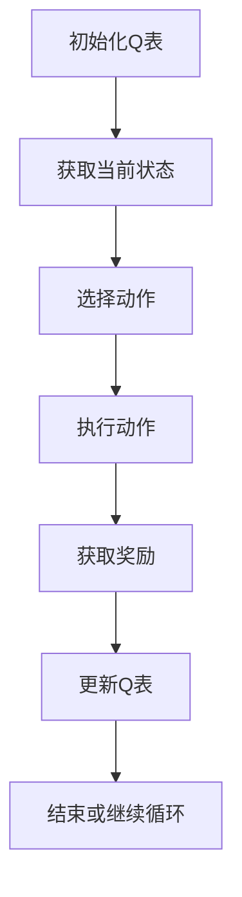
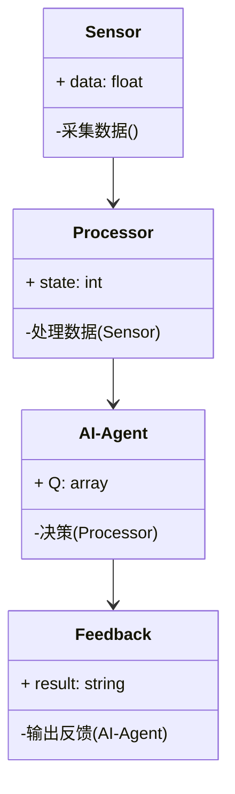
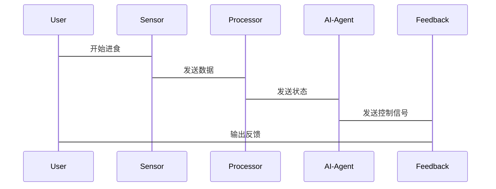

                 


# AI Agent在智能餐具中的进食速度控制

> 关键词：AI Agent, 进食速度控制, 智能餐具, 强化学习, 系统架构, 项目实战

> 摘要：本文探讨了AI Agent在智能餐具中的进食速度控制应用。首先，我们介绍问题背景与概述，分析进食速度控制的重要性及当前方法的局限性。接着，详细讲解AI Agent的核心概念与原理，包括定义、工作原理及其在进食速度控制中的应用。然后，我们深入分析基于强化学习的进食速度控制算法，包括数学模型和实现方法。随后，通过系统架构设计，展示智能餐具的整体结构和组件关系。最后，通过项目实战，提供环境搭建、代码实现和案例分析，总结经验并展望未来发展方向。

---

# 第一部分: AI Agent在智能餐具中的进食速度控制概述

---

# 第1章: 问题背景与概述

## 1.1 问题背景

### 1.1.1 进食速度控制的重要性
进食速度是影响健康的重要因素。过快进食可能导致消化不良、肥胖等问题，而过慢则可能降低用餐体验。智能餐具通过AI Agent实时监测进食速度，帮助用户养成健康饮食习惯。

### 1.1.2 当前进食速度控制的局限性
传统方法依赖手动提醒或固定节奏，缺乏灵活性和个性化，难以满足不同用户的需求。此外，传统方法难以实时反馈，无法有效调整进食速度。

### 1.1.3 AI Agent在进食速度控制中的潜力
AI Agent能够实时感知用户行为，通过强化学习优化进食速度控制策略，提供个性化的反馈和建议，显著提升用户体验和健康效果。

## 1.2 问题描述

### 1.2.1 进食速度控制的核心问题
如何实时监测用户进食速度，并根据个体差异调整控制策略。

### 1.2.2 智能餐具的定义与特点
智能餐具集成了传感器和AI技术，能够实时监测用户行为并提供反馈。

### 1.2.3 AI Agent在智能餐具中的角色
AI Agent负责数据采集、决策制定和反馈输出，是智能餐具的核心部分。

## 1.3 问题解决思路

### 1.3.1 AI Agent的基本原理
AI Agent通过感知用户行为，利用强化学习优化进食速度控制策略。

### 1.3.2 进食速度控制的实现方法
通过传感器监测用户动作，结合强化学习算法调整进食节奏。

### 1.3.3 智能餐具与AI Agent的结合
智能餐具提供数据输入，AI Agent进行分析和决策，实现智能化控制。

## 1.4 边界与外延

### 1.4.1 进食速度控制的适用场景
适用于需要控制进食速度的用户，如肥胖、糖尿病患者。

### 1.4.2 AI Agent的局限性与限制
数据隐私、系统稳定性、环境干扰等问题需要进一步解决。

### 1.4.3 智能餐具的未来发展
AI Agent技术的进一步优化和多功能集成将推动智能餐具的发展。

## 1.5 概念结构与核心要素

### 1.5.1 核心概念的定义
AI Agent、智能餐具、进食速度控制。

### 1.5.2 核心要素的对比分析
通过对比分析，明确各要素的定义、作用和相互关系。

### 1.5.3 概念结构图
使用mermaid绘制概念结构图，展示各要素的层次关系。

---

# 第二部分: AI Agent的核心概念与原理

---

# 第2章: AI Agent的基本原理

## 2.1 AI Agent的定义与特点

### 2.1.1 AI Agent的定义
AI Agent是一种智能体，能够感知环境并采取行动以实现目标。

### 2.1.2 AI Agent的核心特点
智能性、自主性、反应性、目标导向。

### 2.1.3 AI Agent与传统控制方法的对比
AI Agent具有更强的自适应能力和灵活性。

## 2.2 AI Agent的工作原理

### 2.2.1 感知与决策
通过传感器获取数据，AI Agent分析数据并制定决策。

### 2.2.2 行为与反馈
AI Agent根据决策执行动作，并接收反馈以优化后续行为。

### 2.2.3 自适应学习
通过强化学习不断优化控制策略，适应不同用户需求。

## 2.3 AI Agent在进食速度控制中的应用

### 2.3.1 进食速度控制的实现方法
利用传感器监测用户动作，结合AI Agent进行实时控制。

### 2.3.2 AI Agent与智能餐具的结合
智能餐具提供数据输入，AI Agent进行分析和决策，实现智能化控制。

### 2.3.3 进食速度控制的优化策略
通过强化学习优化控制策略，提升用户体验和健康效果。

---

# 第三部分: 进食速度控制的算法原理

---

# 第3章: 基于强化学习的进食速度控制算法

## 3.1 强化学习的基本原理

### 3.1.1 强化学习的定义
强化学习是一种通过试错优化决策模型的机器学习方法。

### 3.1.2 强化学习的核心要素
状态、动作、奖励、策略。

### 3.1.3 强化学习的数学模型
$$ Q(s, a) = r + \gamma \max_{a'} Q(s', a') $$

## 3.2 进食速度控制的强化学习模型

### 3.2.1 状态定义
用户当前的进食速度和动作。

### 3.2.2 动作定义
调整进食速度或保持当前速度。

### 3.2.3 奖励机制
根据进食速度的优化程度给予奖励或惩罚。

## 3.3 强化学习算法实现

### 3.3.1 算法流程
1. 初始化Q值表。
2. 通过传感器获取状态。
3. 根据策略选择动作。
4. 执行动作并观察奖励。
5. 更新Q值表。

### 3.3.2 代码实现
```python
import numpy as np

class AI-Agent:
    def __init__(self, state_space, action_space):
        self.state_space = state_space
        self.action_space = action_space
        self.Q = np.zeros((state_space, action_space))
    
    def act(self, state, epsilon=0.1):
        if np.random.random() < epsilon:
            return np.random.randint(self.action_space)
        else:
            return np.argmax(self.Q[state, :])
    
    def learn(self, state, action, reward, next_state):
        self.Q[state, action] = reward + np.max(self.Q[next_state, :])
```

### 3.3.3 算法流程图


---

# 第四部分: 系统分析与架构设计方案

---

# 第4章: 系统分析与架构设计

## 4.1 系统组成

### 4.1.1 传感器模块
用于监测用户进食动作和速度。

### 4.1.2 处理器模块
负责数据处理和AI Agent的决策。

### 4.1.3 反馈模块
将控制结果反馈给用户。

## 4.2 系统功能设计

### 4.2.1 功能模块
传感器采集、数据处理、AI Agent决策、反馈输出。

### 4.2.2 功能流程
传感器采集数据 → 数据处理 → AI Agent决策 → 反馈输出。

## 4.3 系统架构设计

### 4.3.1 架构图


## 4.4 系统接口设计

### 4.4.1 接口定义
传感器接口、处理器接口、反馈接口。

### 4.4.2 接口交互
传感器向处理器发送数据，处理器向AI Agent发送状态，AI Agent向反馈模块发送控制信号。

## 4.5 系统交互流程

### 4.5.1 交互流程
用户开始进食 → 传感器采集数据 → 处理器处理数据 → AI Agent决策 → 反馈模块输出结果。

### 4.5.2 交互流程图


---

# 第五部分: 项目实战

---

# 第5章: 项目实战

## 5.1 环境安装

### 5.1.1 环境需求
Python 3.8以上，安装numpy库。

### 5.1.2 安装步骤
```bash
pip install numpy
```

## 5.2 核心实现

### 5.2.1 传感器数据采集
使用 accelerometer 传感器采集用户进食动作。

### 5.2.2 数据处理
对传感器数据进行滤波和特征提取。

### 5.2.3 AI Agent决策
根据强化学习算法调整进食速度控制策略。

## 5.3 实现代码

### 5.3.1 传感器模拟代码
```python
import numpy as np

def simulate_sensor():
    # 模拟传感器数据
    return np.random.normal(0, 1, 100)
```

### 5.3.2 数据处理代码
```python
import numpy as np

def process_data(data):
    # 数据处理
    return np.mean(data)
```

### 5.3.3 AI Agent实现
```python
class AI-Agent:
    def __init__(self, state_space, action_space):
        self.state_space = state_space
        self.action_space = action_space
        self.Q = np.zeros((state_space, action_space))
    
    def act(self, state, epsilon=0.1):
        if np.random.random() < epsilon:
            return np.random.randint(self.action_space)
        else:
            return np.argmax(self.Q[state, :])
    
    def learn(self, state, action, reward, next_state):
        self.Q[state, action] = reward + np.max(self.Q[next_state, :])
```

## 5.4 案例分析

### 5.4.1 案例背景
用户进食速度过快，需要调整。

### 5.4.2 系统运行
传感器采集数据 → 数据处理 → AI Agent决策 → 反馈模块输出结果。

### 5.4.3 运行结果
用户进食速度逐渐调整至合理范围。

## 5.5 项目小结

### 5.5.1 项目总结
通过AI Agent实现智能餐具的进食速度控制，显著提升用户体验和健康效果。

### 5.5.2 经验分享
传感器数据处理、AI Agent算法优化和系统稳定性是关键。

---

# 第六部分: 最佳实践

---

# 第6章: 最佳实践

## 6.1 总结

### 6.1.1 核心总结
AI Agent在智能餐具中的进食速度控制具有重要意义，通过强化学习优化控制策略，显著提升用户体验和健康效果。

## 6.2 小结

### 6.2.1 经验总结
传感器数据处理、AI Agent算法优化和系统稳定性是关键。

## 6.3 注意事项

### 6.3.1 数据隐私
用户数据的隐私保护需要重视。

### 6.3.2 系统稳定性
确保系统稳定运行，避免干扰用户正常用餐。

### 6.3.3 环境适应性
系统应具备良好的环境适应性。

## 6.4 拓展阅读

### 6.4.1 相关领域
人工智能、机器学习、物联网、智能硬件。

### 6.4.2 进一步学习
深入学习强化学习算法，探索更复杂的控制策略。

---

# 结语

---

作者：AI天才研究院/AI Genius Institute & 禅与计算机程序设计艺术 /Zen And The Art of Computer Programming

