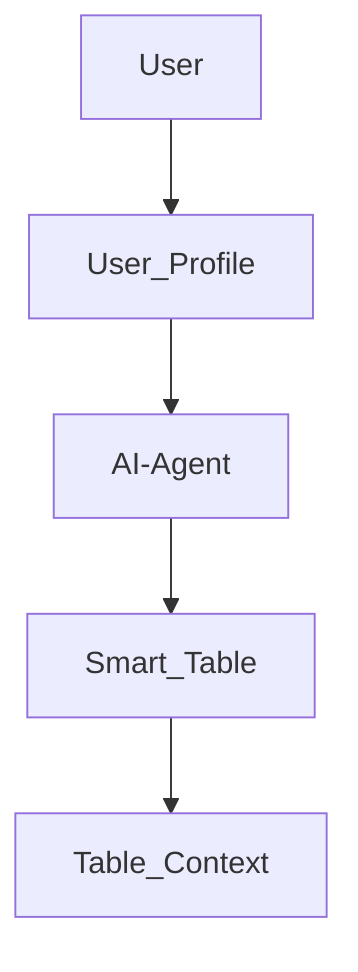
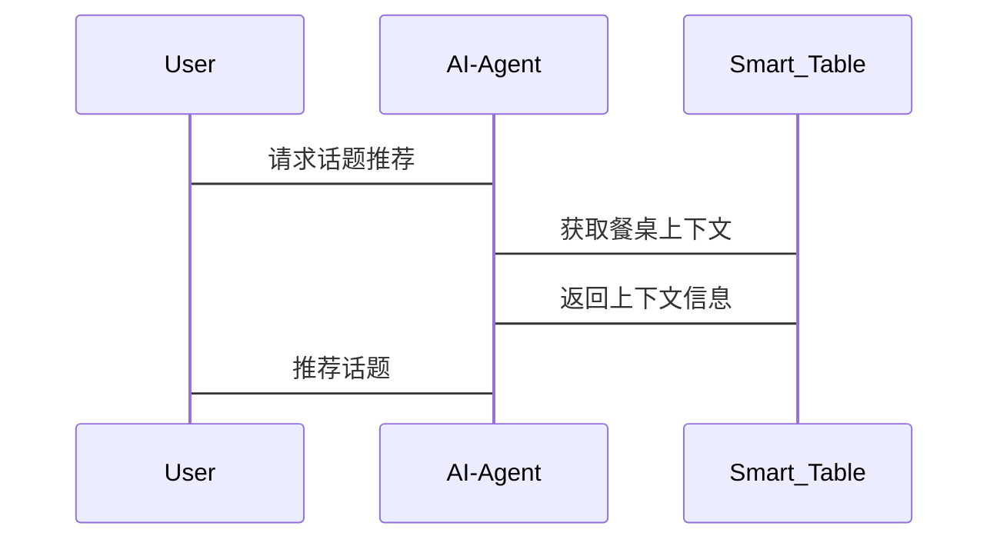

                 


# AI Agent在智能餐桌中的社交互动促进

> **关键词**: AI Agent, 智能餐桌, 社交互动, 推荐系统, 自然语言处理

> **摘要**: 本文探讨了AI Agent在智能餐桌中的应用，重点分析其如何通过推荐系统和自然语言处理促进社交互动。文章详细介绍了AI Agent的核心概念、算法原理、系统架构，并通过项目实战展示了技术实现。最后，总结了最佳实践和未来研究方向。

---

# 第1章: AI Agent与智能餐桌的背景介绍

## 1.1 问题背景与描述

### 1.1.1 社交互动在餐桌场景中的重要性

在现代社会，餐桌不仅是进食的场所，更是社交的重要场景。人们在餐桌上交流思想、建立联系，甚至达成合作。然而，传统的餐桌社交存在诸多痛点：陌生人的破冰难题、话题选择的局限性、以及缺乏个性化推荐等问题。这些问题严重影响了社交互动的效率和体验。

### 1.1.2 AI Agent在现代社交中的角色演变

AI Agent（人工智能代理）是一种能够感知环境并执行任务的智能实体。随着技术的发展，AI Agent已从简单的工具性角色逐渐转变为能够理解人类情感、行为和意图的社交辅助工具。在餐桌场景中，AI Agent可以扮演“社交协调者”的角色，帮助用户打破僵局，促进深度互动。

### 1.1.3 智能餐桌的定义与技术基础

智能餐桌是一种集成多种传感器、处理器和交互界面的设备，能够通过AI技术实现智能化服务。其技术基础包括：

- **传感器技术**: 感知餐桌环境（如温度、湿度）和用户行为（如手势、语音）。
- **AI技术**: 包括自然语言处理（NLP）、推荐系统等。
- **物联网（IoT）**: 实现设备间的互联互通。

---

## 1.2 问题解决与边界

### 1.2.1 AI Agent如何促进餐桌社交互动

AI Agent通过以下方式促进餐桌社交互动：

1. **推荐话题**: 根据用户兴趣和当前情境推荐话题。
2. **协调互动**: 在用户互动中起到桥梁作用，确保对话流畅。
3. **个性化服务**: 提供基于用户偏好的服务建议。

### 1.2.2 智能餐桌场景的边界与外延

智能餐桌的应用场景不仅限于家庭聚餐、商务宴请，还包括社交活动、教育培训等领域。其边界在于餐桌设备的物理限制和AI技术的能力范围。

### 1.2.3 核心问题的解决路径

1. **需求分析**: 理解用户需求，明确目标。
2. **技术选型**: 选择适合的技术方案，如基于协同过滤的推荐算法。
3. **系统设计**: 设计系统的架构和交互流程。
4. **实现与测试**: 开发系统并进行测试优化。

---

## 1.3 核心概念与结构

### 1.3.1 AI Agent的定义与组成要素

AI Agent由以下组成要素构成：

- **感知模块**: 采集环境和用户数据。
- **推理模块**: 分析数据并生成决策。
- **执行模块**: 执行任务并反馈结果。

### 1.3.2 智能餐桌系统的结构分析

智能餐桌系统的结构包括：

- **前端设备**: 用户交互界面。
- **后端系统**: 数据处理和AI算法。
- **连接模块**: 实现设备间的通信。

### 1.3.3 核心概念的ER实体关系图

```mermaid
er
    %% AI Agent与智能餐桌的关系图
    actor User
    actor AI-Agent
    actor Smart_Table
    table User_Profile {
        user_id
        preferences
        interaction_history
    }
    table Table_Context {
        table_id
        current_topics
        participant_list
    }
    User --> User_Profile
    AI-Agent --> User_Profile
    AI-Agent --> Table_Context
    Smart_Table --> Table_Context
```

---

# 第2章: AI Agent的核心概念与原理

## 2.1 核心概念的原理分析

### 2.1.1 AI Agent的基本原理

AI Agent通过感知环境、推理决策和执行任务实现目标。其核心原理包括：

1. **感知**: 通过传感器获取数据。
2. **推理**: 利用AI算法分析数据。
3. **决策**: 根据推理结果生成行动计划。

### 2.1.2 智能餐桌中的交互机制

智能餐桌的交互机制包括：

- **用户输入**: 用户通过语音或手势输入需求。
- **系统响应**: 系统根据输入生成响应。
- **反馈循环**: 系统根据用户反馈优化交互流程。

### 2.1.3 社交互动的核心算法

社交互动的核心算法包括：

- **协同过滤**: 基于用户相似性推荐话题。
- **情感分析**: 理解用户情感并调整互动策略。

---

## 2.2 核心概念的属性特征对比

### 2.2.1 AI Agent的属性分析

| 属性 | 描述 |
|------|------|
| 智能性 | 能够自主学习和优化 |
| 可交互性 | 支持多种交互方式 |
| 灵活性 | 能够适应不同场景 |

### 2.2.2 智能餐桌系统的特征对比

| 特征 | 描述 |
|------|------|
| 智能性 | 集成AI技术实现智能化服务 |
| 实时性 | 能够快速响应用户需求 |
| 互动性 | 支持多用户实时互动 |

---

## 2.3 AI Agent的ER实体关系图

```mermaid
er
    %% AI Agent的实体关系图
    actor User
    actor AI-Agent
    table User_Profile {
        user_id
        preferences
        interaction_history
    }
    User --> User_Profile
    AI-Agent --> User_Profile
    AI-Agent --> Table_Context
```

---

# 第3章: AI Agent的算法原理与实现

## 3.1 算法原理概述

### 3.1.1 AI Agent的核心算法

AI Agent的核心算法包括：

1. **推荐算法**: 基于协同过滤的推荐系统。
2. **自然语言处理**: 用于理解和生成自然语言。

### 3.1.2 智能餐桌中的推荐算法

推荐算法的目标是根据用户偏好推荐话题或菜品。常用算法包括：

- **协同过滤**: $R(u,i) = \theta^T X_{u,i}$
- **基于内容的推荐**: $R(u,i) = \sum_{k=1}^n w_k \cdot f_k(i,u)$

---

## 3.2 算法的数学模型与公式

### 3.2.1 推荐系统的数学模型

推荐系统的数学模型如下：

$$ R(u,i) = \theta^T X_{u,i} $$

其中，$R(u,i)$表示用户$u$对物品$i$的评分，$\theta$是参数向量，$X$是输入矩阵。

### 3.2.2 交互行为的匹配公式

交互行为的匹配公式如下：

$$ P(i,j) = \frac{count(i,j)}{count(i) \times count(j)} $$

其中，$P(i,j)$表示话题$i$和$j$的相关性，$count(i,j)$是共同出现的次数。

---

## 3.3 算法实现与代码示例

### 3.3.1 推荐算法的Python实现

```python
def recommend(user_id, user_item_matrix):
    # 计算用户相似性
    similarities = cosine_similarity(user_item_matrix[user_id])
    # 推荐用户相似性高的物品
    recommendations = []
    for i in range(len(similarities)):
        if i != user_id and similarities[i] > 0.5:
            recommendations.append(i)
    return recommendations
```

---

# 第4章: AI Agent的系统分析与架构设计

## 4.1 问题场景介绍

智能餐桌的应用场景包括家庭聚餐、商务宴请、社交活动等。AI Agent需要在这些场景中实现推荐话题、协调互动等功能。

## 4.2 系统功能设计

系统功能设计包括：

1. **用户交互**: 支持语音和手势输入。
2. **话题推荐**: 根据用户兴趣推荐话题。
3. **互动协调**: 协调用户之间的对话流程。

---

## 4.3 系统架构设计

### 4.3.1 系统架构图



### 4.3.2 系统交互图



---

## 4.4 项目实战

### 4.4.1 环境安装

需要安装以下环境：

- **Python 3.8+**
- **TensorFlow**
- **Scikit-learn**
- **Flask**

### 4.4.2 系统核心实现源代码

```python
from flask import Flask, request
import numpy as np

app = Flask(__name__)

@app.route('/recommend', methods=['POST'])
def recommend_topic():
    user_id = request.json['user_id']
    # 简单的推荐算法
    recommended_topics = ['科技', '娱乐', '体育']
    return {'recommendations': recommended_topics}

if __name__ == '__main__':
    app.run(debug=True)
```

---

## 4.4.3 代码应用解读与分析

上述代码实现了简单的推荐功能，用户通过POST请求发送用户ID，系统返回推荐的话题列表。实际应用中，需要结合更复杂的算法（如协同过滤）和实时数据。

---

## 4.4.4 实际案例分析和详细讲解剖析

以家庭聚餐为例，AI Agent可以根据用户兴趣推荐话题。例如，如果有用户对科技感兴趣，系统可以推荐“人工智能的发展”等话题，促进深度交流。

---

## 4.4.5 项目小结

通过本节的实战，读者可以理解AI Agent在智能餐桌中的具体实现方式。推荐算法和系统架构是实现的核心，需要根据实际需求进行优化。

---

# 第5章: 总结与展望

## 5.1 最佳实践 tips

1. **数据质量**: 确保用户数据的准确性和完整性。
2. **用户体验**: 优化交互流程，提升用户体验。
3. **系统维护**: 定期更新模型，适应用户需求变化。

---

## 5.2 小结

本文详细探讨了AI Agent在智能餐桌中的应用，从背景介绍到系统实现，全面分析了技术细节。AI Agent通过推荐系统和自然语言处理，显著提升了餐桌场景中的社交互动效率。

---

## 5.3 注意事项

- 确保系统的安全性，避免数据泄露。
- 考虑用户隐私，遵循相关法律法规。

---

## 5.4 拓展阅读

建议读者进一步阅读以下内容：

- **推荐系统**: 《推荐系统实战》
- **自然语言处理**: 《深度学习自然语言处理》
- **AI Agent**: 《智能体与多智能体系统》

---

# 作者：AI天才研究院/AI Genius Institute & 禅与计算机程序设计艺术 /Zen And The Art of Computer Programming

