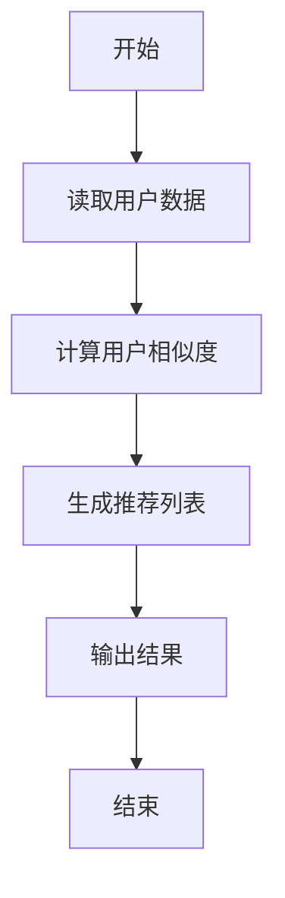
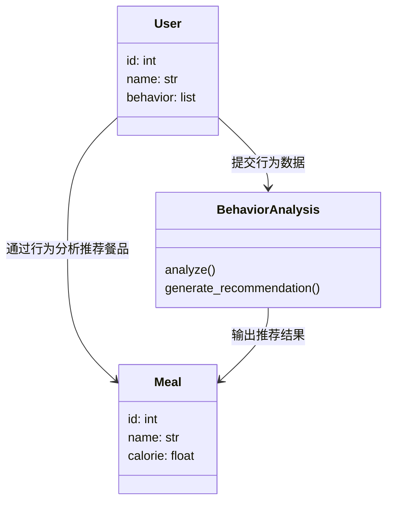
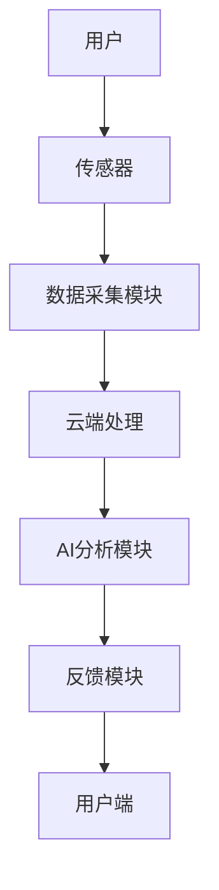
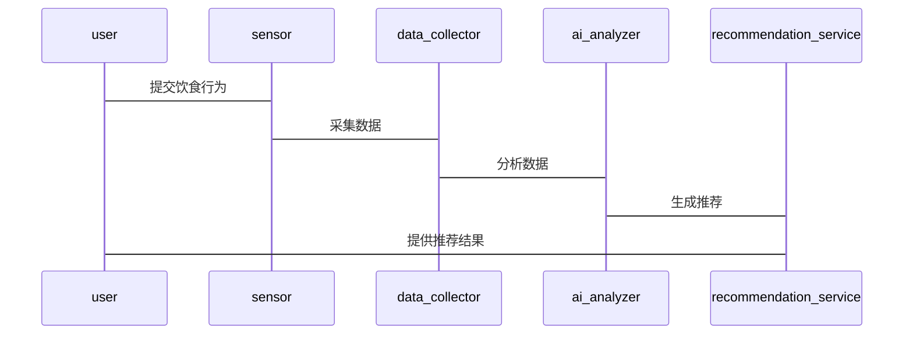

                 


# AI Agent在智能餐桌中的饮食行为分析

## 关键词：AI Agent, 智能餐桌, 饮食行为, 推荐算法, 系统架构

## 摘要：  
本文详细探讨了AI Agent在智能餐桌中的饮食行为分析，从AI Agent的基本概念、行为模型、推荐算法、系统架构到项目实战，全面分析了AI Agent在智能餐桌中的应用场景、技术实现和实际案例。通过本文的分析，读者可以深入了解AI Agent在饮食行为分析中的核心原理和实际应用，为智能餐桌的设计与优化提供理论支持和技术参考。

---

# 第1章: AI Agent与智能餐桌概述

## 1.1 AI Agent的基本概念

### 1.1.1 AI Agent的定义与特点  
AI Agent（人工智能代理）是一种能够感知环境、自主决策并执行任务的智能体。其核心特点包括：  
1. **自主性**：能够在没有外部干预的情况下独立运行。  
2. **反应性**：能够实时感知环境并做出反应。  
3. **目标导向**：通过目标驱动行为，优化决策以达到预定目标。  
4. **学习能力**：能够通过数据学习和优化自身行为。  

### 1.1.2 智能餐桌的定义与应用场景  
智能餐桌是一种结合物联网技术和AI技术的智能化餐桌系统，能够通过传感器、摄像头等设备感知用户的饮食行为，并通过AI Agent进行分析和优化。其应用场景包括：  
1. **饮食推荐**：根据用户的饮食习惯推荐菜谱。  
2. **健康管理**：通过分析用户的饮食数据提供健康建议。  
3. **行为矫正**：帮助用户改善不良饮食习惯。  

### 1.1.3 AI Agent在智能餐桌中的作用  
AI Agent在智能餐桌中的作用主要体现在以下几个方面：  
- **数据采集**：通过传感器采集用户的饮食行为数据。  
- **行为分析**：利用算法对数据进行分析，识别用户的饮食习惯。  
- **决策与反馈**：根据分析结果生成推荐或提醒，优化用户的饮食行为。  

---

## 1.2 饮食行为分析的背景与意义

### 1.2.1 当代饮食行为的问题与挑战  
随着生活节奏的加快，人们的饮食行为逐渐呈现出不规律、不健康的特点。常见的问题包括：  
1. **营养不均衡**：部分用户饮食单一，缺乏必要的营养。  
2. **热量摄入不当**：部分用户热量摄入过多或不足。  
3. **饮食习惯不佳**：如饭后零食过多、饮食时间不规律等。  

### 1.2.2 AI技术在饮食行为分析中的优势  
AI技术在饮食行为分析中的优势主要体现在以下几点：  
- **数据驱动**：通过大量数据的分析，能够准确识别用户的饮食习惯。  
- **实时反馈**：AI Agent可以实时采集并分析数据，提供即时反馈。  
- **个性化推荐**：基于用户的饮食数据，提供个性化的饮食建议。  

### 1.2.3 智能餐桌的应用前景  
智能餐桌的应用前景广阔，未来将成为家庭、办公室、餐厅等场所的重要组成部分。通过AI Agent的分析与优化，智能餐桌可以帮助用户实现健康饮食，提升生活质量。

---

## 1.3 本章小结  
本章主要介绍了AI Agent的基本概念及其在智能餐桌中的作用，分析了当代饮食行为的主要问题以及AI技术在其中的应用优势。通过本章的介绍，读者可以对AI Agent在智能餐桌中的应用场景有一个清晰的认识。

---

# 第2章: AI Agent的行为模型

## 2.1 AI Agent的行为特征

### 2.1.1 感知、决策与执行的行为三要素  
AI Agent的行为可以分为三个主要阶段：  
1. **感知**：通过传感器或摄像头等设备采集环境数据。  
2. **决策**：基于感知数据进行分析，生成决策方案。  
3. **执行**：根据决策结果执行相应的操作，如发出提醒或调整饮食建议。  

### 2.1.2 不同行为模型的特征对比  

| 行为模型 | 感知能力 | 决策能力 | 执行能力 | 适应性 |  
|----------|----------|----------|----------|--------|  
| 基于规则 | 弱        | 强        | 强        | 低      |  
| 基于学习 | 强        | 强        | 强        | 高      |  
| 基于混合 | 强        | 强        | 强        | 高      |  

从表中可以看出，基于学习的行为模型在感知、决策和执行能力方面均优于基于规则的模型，且适应性更强。

### 2.1.3 实际案例分析  
以智能餐桌为例，AI Agent通过摄像头识别用户的饮食行为，分析用户的饮食习惯，并根据分析结果推荐菜谱或提醒用户注意饮食健康。

---

## 2.2 智能餐桌中的实体关系

### 2.2.1 ER实体关系图  

```mermaid
erd
  table intelligent_dining_table {
    columns id, user_id, meal_time, food_category, calorie_intake
  }
  table user_behavior {
    columns id, user_id, timestamp, action_type, action_value
  }
  table food_recommendation {
    columns id, user_id, recommended_meal, time_stamp
  }
  // 关系定义
  intelligent_dining_table --> user_behavior: 用户行为记录
  user_behavior --> food_recommendation: 行为驱动推荐
```

从上图可以看出，智能餐桌系统主要包含三个实体：智能餐桌数据表、用户行为表和食品推荐表。用户的行为数据驱动食品推荐，形成一个完整的闭环。

---

# 第3章: 饮食行为分析的算法原理

## 3.1 基于协同过滤的推荐算法

### 3.1.1 算法流程图  



### 3.1.2 Python实现代码  

```python
def collaborative_filtering(user_data, target_user):
    # 计算用户相似度
    user_similarity = {}
    for user in user_data:
        if user != target_user:
            similarity = cosine_similarity(user_data[user], user_data[target_user])
            user_similarity[user] = similarity
    # 根据相似度排序
    sorted_users = sorted(user_similarity.items(), key=lambda x: x[1], reverse=True)
    # 生成推荐列表
    recommendations = []
    for user in sorted_users:
        for item in user_data[user]:
            if item not in recommendations:
                recommendations.append(item)
    return recommendations

# 示例数据
user_data = {
    'user1': ['米饭', '鱼', '蔬菜'],
    'user2': ['面条', '肉', '水果'],
    'target_user': ['米饭', '鱼']
}

# 调用函数
recommendations = collaborative_filtering(user_data, 'target_user')
print(recommendations)
```

### 3.1.3 数学模型与公式  

- **相似度计算公式**：  
  $$ \text{相似度} = \frac{\sum_{i=1}^{n} (x_i - \bar{x})(y_i - \bar{y})}{\sqrt{\sum_{i=1}^{n} (x_i - \bar{x})^2} \cdot \sqrt{\sum_{i=1}^{n} (y_i - \bar{y})^2}} $$  

- **预测评分公式**：  
  $$ \text{预测评分} = \frac{\sum_{u \in N} w_{u} \cdot r_{u,i}}{\sum_{u \in N} w_{u}} $$  

---

## 3.2 算法优化与实际应用  

- **算法优化**：基于协同过滤的算法可以通过引入用户偏好、物品特征等信息进一步优化推荐效果。  
- **实际应用**：在智能餐桌中，基于协同过滤的算法可以用于推荐菜谱，帮助用户优化饮食结构。

---

# 第4章: 系统分析与架构设计

## 4.1 项目场景介绍

### 4.1.1 用户需求分析  
用户需求主要包括：  
1. 实时监测饮食行为。  
2. 获取个性化的饮食建议。  
3. 获得食品推荐服务。  

### 4.1.2 系统目标设定  
系统目标包括：  
1. 实现用户的饮食行为监测与分析。  
2. 提供个性化的饮食建议与推荐。  
3. 实现用户与智能餐桌的无缝交互。  

---

## 4.2 系统功能设计

### 4.2.1 领域模型类图  



---

## 4.3 系统架构设计

### 4.3.1 分层架构图  



---

## 4.4 系统接口与交互设计

### 4.4.1 接口设计  
主要接口包括：  
1. 数据采集接口：用于采集用户的饮食行为数据。  
2. 数据分析接口：用于对数据进行分析并生成推荐结果。  
3. 反馈接口：用于将推荐结果反馈给用户。  

### 4.4.2 交互流程图  



---

# 第5章: 项目实战与案例分析

## 5.1 项目环境搭建

### 5.1.1 环境要求  
- **操作系统**：Windows/Mac/Linux  
- **编程语言**：Python 3.8+  
- **依赖库**：numpy, scikit-learn, Flask  

### 5.1.2 安装依赖  

```bash
pip install numpy scikit-learn Flask
```

---

## 5.2 系统核心实现

### 5.2.1 数据采集模块  

```python
import numpy as np
from sklearn.metrics.pairwise import cosine_similarity

def collect_data(users):
    data = {}
    for user in users:
        data[user] = []
        # 模拟采集数据
        for _ in range(10):
            data[user].append(input(f"请输入{user}的饮食数据："))
    return data
```

### 5.2.2 数据分析模块  

```python
def analyze_data(data):
    # 计算相似度矩阵
    matrix = np.array(list(data.values()))
    similarity = cosine_similarity(matrix)
    return similarity
```

### 5.2.3 推荐系统实现  

```python
from flask import Flask, jsonify

app = Flask(__name__)

@app.route('/recommend', methods=['POST'])
def recommend():
    data = request.json
    recommendations = collaborative_filtering(data, data['target_user'])
    return jsonify({'recommendations': recommendations})

if __name__ == '__main__':
    app.run(debug=True)
```

---

## 5.3 实际案例分析

### 5.3.1 数据采集与分析  
假设我们有以下用户数据：  

```python
users = ['user1', 'user2', 'target_user']
data = collect_data(users)
print(data)
```

输出：  
```
请输入user1的饮食数据：米饭
请输入user1的饮食数据：鱼
请输入user1的饮食数据：蔬菜
请输入user2的饮食数据：面条
请输入user2的饮食数据：肉
请输入user2的饮食数据：水果
请输入target_user的饮食数据：米饭
请输入target_user的饮食数据：鱼
```

---

## 5.4 项目小结  

通过本章的项目实战，我们可以看到AI Agent在智能餐桌中的实际应用。通过采集数据、分析数据并生成推荐，AI Agent能够有效优化用户的饮食行为。

---

# 第6章: 最佳实践与未来展望

## 6.1 最佳实践 Tips

### 6.1.1 数据隐私保护  
在实际应用中，用户数据的安全性和隐私保护是重中之重。需要采取加密技术和访问控制机制，确保用户数据不被泄露。  

### 6.1.2 算法优化建议  
可以通过引入更多的数据特征（如用户偏好、食品营养信息等）进一步优化推荐算法，提升推荐的准确性和实用性。  

### 6.1.3 系统性能优化  
可以通过分布式计算和缓存技术优化系统的性能，提升用户体验。  

---

## 6.2 未来展望  

随着AI技术的不断发展，智能餐桌的应用将更加广泛。未来的智能餐桌可能会集成更多功能，如食品供应链管理、健康监测等，为用户提供更加全面的饮食服务。

---

## 6.3 拓展阅读  

- **推荐书籍**：  
  1. 《集体智慧编程》  
  2. 《机器学习实战》  
- **推荐博客**：  
  1. [AI Agent技术博客](https://example.com)  
  2. [智能餐桌设计与实现](https://example.com)  

---

## 作者：AI天才研究院 & 禅与计算机程序设计艺术

通过本文的分析与实践，我们深入探讨了AI Agent在智能餐桌中的饮食行为分析，希望为读者提供有价值的参考与启发。

