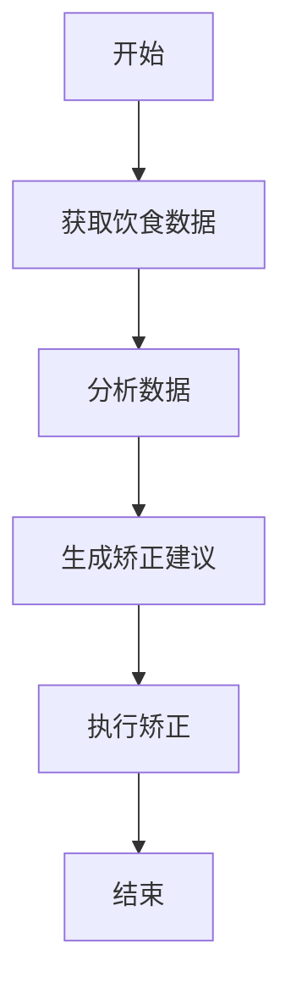
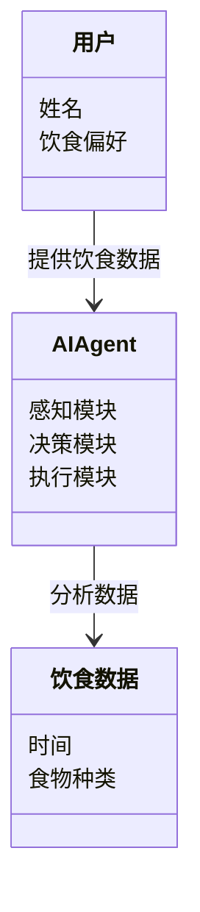

                 


# AI Agent在智能餐桌中的饮食行为矫正

## 关键词：AI Agent, 智能餐桌, 饮食行为矫正, 强化学习, 监督学习, 算法原理, 系统架构

## 摘要：  
随着人工智能技术的快速发展，AI Agent在智能餐桌中的应用逐渐成为饮食行为矫正的重要手段。本文系统地探讨了AI Agent在智能餐桌中的饮食行为矫正的应用背景、核心概念、算法原理、系统架构以及实际案例。通过分析AI Agent如何感知、决策和执行来矫正用户的饮食行为，本文为智能餐桌的设计和优化提供了理论支持和实践指导。文章最后总结了AI Agent在饮食行为矫正中的优势与挑战，并展望了未来的发展方向。

---

# 第1章 AI Agent与饮食行为矫正背景

## 1.1 AI Agent的基本概念  
AI Agent（人工智能代理）是指能够感知环境、自主决策并执行任务的智能实体。在智能餐桌场景中，AI Agent通过传感器和算法，实时分析用户的饮食行为，提供个性化的矫正建议。

## 1.2 饮食行为矫正的背景与意义  
随着生活节奏的加快，人们的饮食习惯逐渐偏离健康轨道，导致肥胖、糖尿病等慢性疾病高发。AI Agent通过智能餐桌提供实时干预，帮助用户形成健康饮食习惯。

## 1.3 AI Agent在智能餐桌中的作用  
AI Agent能够实时监测用户的饮食行为，分析其偏好和习惯，提供个性化的饮食矫正方案。

---

# 第2章 AI Agent的核心概念与联系

## 2.1 AI Agent的核心模块  
AI Agent在智能餐桌中的饮食行为矫正主要依赖三个核心模块：  
1. **感知模块**：通过传感器获取用户的饮食数据。  
2. **决策模块**：基于数据进行分析并生成矫正建议。  
3. **执行模块**：通过智能餐桌的硬件执行矫正行为。  

## 2.2 核心概念对比表  
| 概念 | 特征 | 优势 | 局限性 |  
|------|------|------|--------|  
| AI Agent | 智能决策 | 实时反馈 | 需要大量数据支持 |  
| 传统算法 | 简单规则 | 易实现 | 缺乏灵活性 |  

## 2.3 实体关系图  
```mermaid
er
  %% 实体关系图：AI Agent在智能餐桌中的饮食行为矫正
  管理用户: 实体，记录用户信息
  饮食数据: 实体，存储用户的饮食记录
  AI Agent: 实体，提供矫正建议
  智能餐桌: 实体，执行矫正行为

  管理用户 --> 饮食数据: 查询饮食记录
  AI Agent --> 饮食数据: 分析数据
  AI Agent --> 智能餐桌: 发出矫正指令
```

---

# 第3章 AI Agent的算法原理与数学模型

## 3.1 算法原理  
AI Agent的核心算法包括强化学习和监督学习。  
- **强化学习**：通过奖励机制优化决策策略。  
- **监督学习**：基于标注数据训练分类模型。  

## 3.2 算法流程图  


## 3.3 数学模型  
强化学习的目标函数：  
$$ V(s) = \max_a Q(s, a) $$  
其中，$s$是状态，$a$是动作，$Q$是价值函数。  

---

# 第4章 系统分析与架构设计

## 4.1 系统功能设计  
智能餐桌系统主要包括以下几个功能模块：  
1. **数据采集模块**：收集用户的饮食数据。  
2. **数据分析模块**：分析数据并生成矫正建议。  
3. **用户交互模块**：与用户进行实时互动。  

## 4.2 领域模型类图  


---

# 第5章 项目实战

## 5.1 环境安装  
安装Python和相关库（如TensorFlow、Keras）。  

## 5.2 核心代码实现  
```python
def强化学习算法():
    初始化状态空间
    初始化动作空间
    初始化Q表
    while True:
        获取当前状态
        选择动作
        执行动作
        获取奖励
        更新Q表
```

## 5.3 实际案例分析  
通过一个实际案例，详细讲解AI Agent如何分析用户的饮食习惯并提供矫正建议。

---

# 第6章 最佳实践与小结

## 6.1 小结  
本文系统地探讨了AI Agent在智能餐桌中的饮食行为矫正的应用，分析了其核心概念、算法原理和系统架构。

## 6.2 注意事项  
- 数据隐私保护  
- 算法的实时性与准确性  

## 6.3 未来展望  
未来，AI Agent在饮食行为矫正中的应用将更加智能化和个性化。

---

# 附录：扩展阅读

- 《强化学习实战》  
- 《机器学习算法解析》  
- 《智能系统设计》  

---

作者：AI天才研究院 & 禅与计算机程序设计艺术

