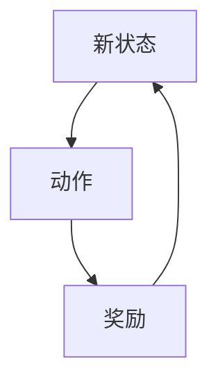
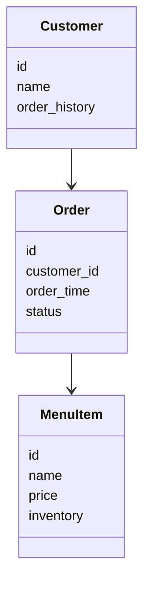
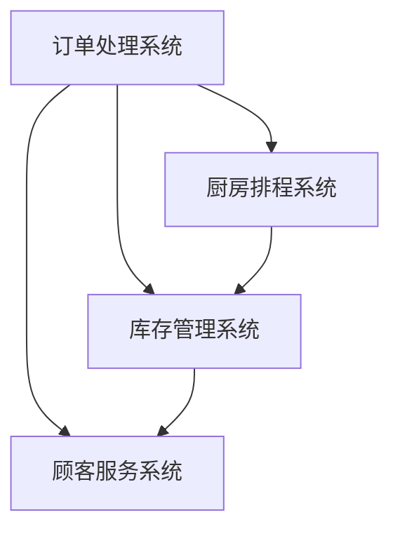
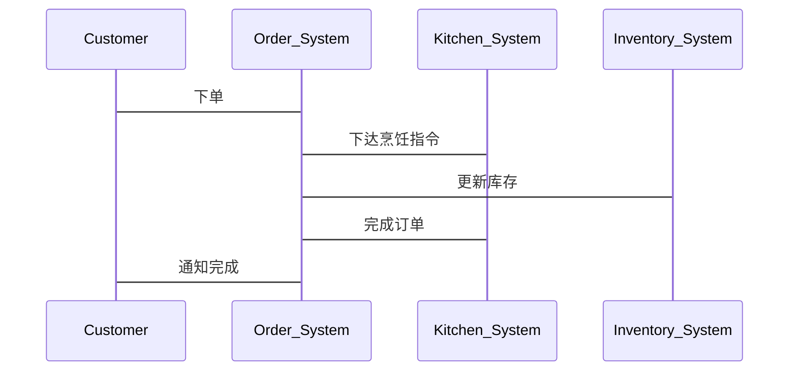

                 


# AI Agent在智能餐饮管理中的实践

## 关键词：
AI Agent, 智能餐饮管理, 强化学习, 系统架构设计, 项目实战, 数学模型

## 摘要：
本文深入探讨AI Agent在智能餐饮管理中的应用，从核心概念、算法原理到系统架构设计，结合实际案例，全面分析AI Agent如何优化餐饮管理流程，提升顾客体验，助力企业数字化转型。

---

# 第一部分: AI Agent与智能餐饮管理概述

# 第1章: AI Agent与智能餐饮管理的背景

## 1.1 AI Agent的基本概念

### 1.1.1 AI Agent的定义
AI Agent（人工智能代理）是一种能够感知环境、自主决策并执行任务的智能实体。它通过传感器获取信息，利用算法进行分析，并通过执行器采取行动，以实现特定目标。

### 1.1.2 AI Agent的核心特征
- **自主性**：能够在没有外部干预的情况下独立运作。
- **反应性**：能够实时感知环境变化并做出响应。
- **目标导向**：所有行动都围绕实现特定目标展开。
- **学习能力**：通过数据和经验不断优化自身算法。

### 1.1.3 AI Agent与传统软件的区别
AI Agent不仅能够执行预设任务，还能通过学习和适应环境变化，实现动态优化和自主决策，这是传统软件无法比拟的优势。

## 1.2 智能餐饮管理的背景与挑战

### 1.2.1 餐饮行业的数字化转型
随着科技的发展，餐饮行业正从传统模式向数字化、智能化转型，AI Agent作为核心技术之一，正在改变行业的运营方式。

### 1.2.2 智能餐饮管理的核心问题
- **订单处理效率低**：传统人工操作效率低下，容易出错。
- **库存管理复杂**：食材种类多，库存更新不及时，导致浪费。
- **顾客体验不足**：个性化需求难以满足，服务效率有待提高。

### 1.2.3 AI Agent在餐饮管理中的优势
AI Agent能够实时处理订单、优化库存管理、提升顾客体验，显著提高餐饮管理的效率和质量。

## 1.3 AI Agent在智能餐饮管理中的应用前景

### 1.3.1 AI Agent的潜在应用场景
- **智能点餐系统**：通过AI Agent实时处理订单，优化点餐流程。
- **库存管理**：AI Agent动态监控库存，提前预警补货需求。
- **顾客服务**：通过自然语言处理技术，提供个性化推荐和服务。

### 1.3.2 企业采用AI Agent的优势
- **提升效率**：AI Agent能够快速处理大量数据，显著提高管理效率。
- **降低成本**：通过优化库存管理和减少人为错误，降低运营成本。
- **提升顾客满意度**：通过个性化服务和快速响应，提升顾客体验。

### 1.3.3 AI Agent应用的挑战与机遇
- **技术挑战**：AI Agent的开发和部署需要较高的技术和资金投入。
- **数据隐私问题**：处理大量顾客数据可能引发隐私问题。
- **市场接受度**：部分消费者可能对AI技术在餐饮管理中的应用持怀疑态度。

## 1.4 本章小结
本章介绍了AI Agent的基本概念、智能餐饮管理的背景与挑战，以及AI Agent在餐饮管理中的应用前景。AI Agent作为一项前沿技术，正在逐步改变餐饮行业的管理模式，为企业带来新的发展机遇。

---

# 第2章: AI Agent的核心概念与联系

## 2.1 AI Agent的核心概念原理

### 2.1.1 AI Agent的感知模块
感知模块是AI Agent获取环境信息的关键部分，主要通过传感器、摄像头、麦克风等设备收集数据，并利用自然语言处理和计算机视觉技术进行分析。

### 2.1.2 AI Agent的决策模块
决策模块是AI Agent的核心，负责根据感知到的信息，结合预设的规则和学习到的模型，做出最优决策。常用的决策算法包括强化学习、监督学习和无监督学习。

### 2.1.3 AI Agent的执行模块
执行模块负责将决策模块的决策转化为实际操作，例如通过机器人手臂完成菜品摆放，或通过系统接口发送订单信息。

## 2.2 AI Agent的核心概念属性特征对比

| 属性 | AI Agent | 传统软件 |
|------|-----------|-----------|
| 自主性 | 高         | 低         |
| 反应性 | 高         | 低         |
| 学习能力 | 高         | 无         |
| 适应性 | 高         | 低         |

### 2.2.1 不同AI Agent模型的对比分析
- **基于规则的AI Agent**：通过预设规则进行决策，适用于简单场景。
- **基于学习的AI Agent**：通过机器学习算法不断优化决策模型，适用于复杂场景。
- **混合型AI Agent**：结合规则和学习两种方法，灵活性更强。

### 2.2.2 AI Agent与机器学习的对比
AI Agent是机器学习的一个应用领域，但AI Agent不仅具备学习能力，还能够自主决策和执行任务，而机器学习主要关注模型的训练和优化。

## 2.3 AI Agent的ER实体关系图

```mermaid
erd
    customer
    has_order
    order
    has_item
    menu_item
    has_supplier
    supplier
    has_inventory
    inventory
    has_category
    category
```

## 2.4 本章小结
本章详细介绍了AI Agent的核心概念与原理，包括感知、决策和执行模块，并通过对比分析和实体关系图，展示了AI Agent在智能餐饮管理中的系统架构。

---

# 第3章: AI Agent的算法原理讲解

## 3.1 AI Agent的算法原理

### 3.1.1 强化学习算法
强化学习是一种通过试错机制不断优化决策模型的算法，适用于动态环境下的决策问题。

#### 算法流程


### 3.1.2 Q-learning算法
Q-learning是一种常用的强化学习算法，通过不断更新Q值表来优化决策策略。

#### 数学模型
$$ Q(s,a) = Q(s,a) + \alpha (r + \max Q(s',a') - Q(s,a)) $$

### 3.1.3 策略梯度算法
策略梯度算法通过优化策略参数，直接最大化期望奖励，适用于复杂环境下的决策问题。

#### 数学模型
$$ \nabla \theta J(\theta) = \mathbb{E}[ \nabla_\theta \log \pi_\theta(a|s) Q(s,a) ] $$

## 3.2 AI Agent的数学模型与公式

### 3.2.1 状态转移方程
$$ P(s' | s, a) $$

### 3.2.2 奖励函数
$$ R(s, a) $$

### 3.2.3 动作选择策略
$$ \pi(a|s) $$

## 3.3 AI Agent的算法实现

### 3.3.1 环境配置
```python
class Environment:
    def __init__(self):
        self.state = None
        self.reward = 0
    def step(self, action):
        # 根据动作更新状态和奖励
        pass
    def reset(self):
        # 重置环境
        pass
```

### 3.3.2 AI Agent实现
```python
class Agent:
    def __init__(self, state_space, action_space):
        self.q_table = np.zeros((state_space, action_space))
    def choose_action(self, state):
        # 根据状态选择动作
        pass
    def learn(self, state, action, reward, next_state):
        # 更新Q表
        pass
```

## 3.4 本章小结
本章详细讲解了AI Agent的核心算法原理，包括强化学习、Q-learning和策略梯度算法，并通过数学模型和代码示例，展示了AI Agent的实现过程。

---

# 第4章: AI Agent的系统分析与架构设计

## 4.1 系统分析

### 4.1.1 问题场景介绍
以智能点餐系统为例，分析AI Agent在订单处理、库存管理和顾客服务中的应用。

### 4.1.2 系统功能需求
- **订单管理**：实时处理订单，优化厨房排程。
- **库存管理**：动态监控库存，提前预警补货需求。
- **顾客服务**：提供个性化推荐和服务。

## 4.2 系统架构设计

### 4.2.1 领域模型设计


### 4.2.2 系统架构图


## 4.3 系统接口设计

### 4.3.1 API接口
- **订单接口**：处理订单创建、取消和查询。
- **库存接口**：提供库存信息和补货通知。
- **顾客接口**：提供个性化推荐和服务。

## 4.4 系统交互设计

### 4.4.1 交互流程


## 4.5 本章小结
本章通过系统分析和架构设计，展示了AI Agent在智能餐饮管理中的具体应用，包括领域模型设计、系统架构图和交互流程。

---

# 第5章: AI Agent的项目实战

## 5.1 项目介绍

### 5.1.1 项目背景
以某连锁餐饮企业为例，介绍AI Agent在智能点餐系统中的应用。

### 5.1.2 项目目标
- 实现订单自动化处理。
- 优化库存管理。
- 提升顾客体验。

## 5.2 项目实现

### 5.2.1 环境配置
```bash
pip install numpy matplotlib
```

### 5.2.2 核心代码实现
```python
class Agent:
    def __init__(self, state_size, action_size):
        self.q_table = np.zeros((state_size, action_size))
    
    def choose_action(self, state):
        if np.random.random() < 0.1:
            return np.random.randint(0, action_size)
        else:
            return np.argmax(self.q_table[state])
    
    def learn(self, state, action, reward, next_state):
        self.q_table[state, action] = self.q_table[state, action] + 0.1 * (reward + np.max(self.q_table[next_state]) - self.q_table[state, action])
```

### 5.2.3 功能设计
- **订单处理**：AI Agent实时处理订单，优化厨房排程。
- **库存管理**：动态监控库存，提前预警补货需求。
- **顾客服务**：通过自然语言处理技术，提供个性化推荐和服务。

## 5.3 项目测试与优化

### 5.3.1 功能测试
- 测试订单处理的准确性和效率。
- 测试库存管理的实时性和准确性。
- 测试顾客服务的响应速度和准确性。

### 5.3.2 性能优化
- 优化算法参数，提高决策效率。
- 增加缓存机制，减少重复计算。
- 提升系统的可扩展性。

## 5.4 本章小结
本章通过一个实际的项目案例，详细介绍了AI Agent在智能餐饮管理中的实现过程，包括环境配置、核心代码实现和功能设计。

---

# 第6章: 总结与展望

## 6.1 总结
AI Agent作为一项前沿技术，正在逐步改变餐饮行业的管理模式。通过本文的探讨，我们了解到AI Agent在订单处理、库存管理和顾客服务中的广泛应用，以及其在提高管理效率和顾客满意度方面的重要作用。

## 6.2 未来展望
随着AI技术的不断发展，AI Agent在智能餐饮管理中的应用将更加广泛和深入。未来的研究方向包括：
- 提高AI Agent的自主性和适应性。
- 加强AI Agent的安全性和隐私保护。
- 探索AI Agent与其他技术的融合应用。

## 6.3 最佳实践 Tips
- 在实施AI Agent之前，充分了解企业的实际需求和痛点。
- 选择合适的AI Agent模型和算法，确保技术的可行性和高效性。
- 加强数据管理和隐私保护，确保系统的安全性和合规性。

## 6.4 本章小结
本章总结了AI Agent在智能餐饮管理中的应用价值，并展望了未来的发展方向，同时给出了实际应用中的最佳实践建议。

---

# 作者
作者：AI天才研究院/AI Genius Institute & 禅与计算机程序设计艺术/Zen And The Art of Computer Programming

---

希望这个目录大纲能够为您提供有价值的信息，并为您的写作提供清晰的指导！

