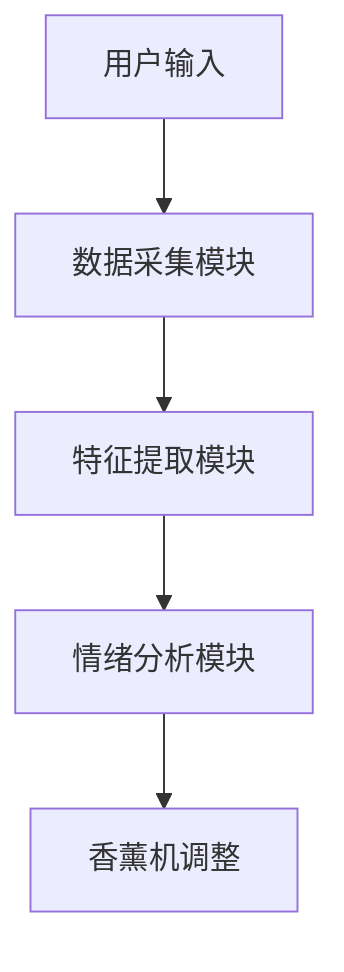

                 


# AI Agent在智能香薰机中的情绪管理助手

> 关键词：AI Agent, 智能香薰机, 情绪管理, 情感计算, 自然语言处理, 机器学习

> 摘要：本文探讨了AI Agent在智能香薰机中的应用，重点分析了情绪管理助手的核心技术，包括情绪识别、自然语言处理和机器学习模型。通过系统架构设计和项目实战，展示了如何利用AI技术提升香薰体验，同时提出了实际应用中的挑战与解决方案。

---

## 第1章 AI Agent与智能香薰机概述

### 1.1 AI Agent的基本概念
- AI Agent（人工智能代理）是一种能够感知环境并采取行动以实现目标的智能实体。
- AI Agent的核心特征包括自主性、反应性、目标导向和学习能力。

### 1.2 智能香薰机的介绍
- 智能香薰机通过传感器和AI技术，实现香气释放的自动化和个性化。
- 智能香薰机的功能包括情绪调节、环境监测和健康辅助。

### 1.3 情绪管理在智能香薰机中的作用
- 情绪管理通过调整香气种类和浓度，优化用户的心理健康和情绪状态。
- 情绪管理的目标是提供个性化的香薰体验，提升用户的生活质量。

---

## 第2章 情绪识别的理论基础

### 2.1 情绪识别的方法
- 基于生理数据的情绪识别：通过心率、皮肤温度等生理指标分析情绪状态。
- 基于自然语言处理的情绪识别：通过分析文本或语音中的情感倾向。

### 2.2 情绪识别的核心算法
- 基于机器学习的情绪分类：利用支持向量机（SVM）或随机森林（Random Forest）进行分类。
- 基于深度学习的情绪分析：使用卷积神经网络（CNN）或循环神经网络（RNN）进行情感分析。

---

## 第3章 AI Agent的核心技术

### 3.1 自然语言处理技术
- 自然语言处理（NLP）用于解析用户的输入，提取情感倾向。
- 常用的NLP工具包括词袋模型（Bag of Words）和词嵌入（Word Embedding）。

### 3.2 机器学习模型
- 使用K近邻算法（K-NN）进行情绪分类。
- 通过长短期记忆网络（LSTM）处理时间序列数据，捕捉情绪变化。

---

## 第4章 系统架构与数据流

### 4.1 系统模块划分
- 数据采集模块：采集用户的情绪数据。
- 特征提取模块：提取情绪相关的特征。
- 情绪分析模块：分析并分类情绪。
- 反馈模块：根据情绪结果调整香薰机的输出。

### 4.2 系统架构设计


---

## 第5章 项目实战

### 5.1 环境配置
- 使用Python 3.8及以上版本。
- 安装必要的库：numpy、pandas、scikit-learn、tensorflow。

### 5.2 核心代码实现
```python
import numpy as np
from sklearn.svm import SVC
from sklearn.metrics import accuracy_score

# 示例数据集
X = np.array([[1, 2], [2, 3], [3, 4], [4, 5]])
y = np.array([0, 1, 0, 1])

# 训练模型
model = SVC()
model.fit(X, y)

# 预测
new_data = np.array([[5, 6]])
prediction = model.predict(new_data)
print("预测结果:", prediction)
```

### 5.3 实际案例分析
- 分析用户输入的情绪文本，分类情绪类型，并调整香薰机的香气输出。

---

## 第6章 应用挑战与解决方案

### 6.1 数据隐私问题
- 解决方案：采用数据加密和匿名化处理。

### 6.2 实时性要求
- 解决方案：优化算法，使用轻量级模型。

---

## 第7章 总结与展望

### 7.1 总结
- 本文详细探讨了AI Agent在智能香薰机中的应用，展示了如何通过情绪管理提升用户体验。

### 7.2 未来展望
- 情感计算的多模态融合：结合视觉、语音等多种信号进行情绪识别。
- 个性化服务：根据用户情绪变化提供定制化的香薰方案。

---

## 参考文献
1. 书籍：《人工智能：一种现代方法》
2. 网站：自然语言处理工具包官方文档

---

## 作者信息
作者：AI天才研究院/AI Genius Institute & 禅与计算机程序设计艺术/Zen And The Art of Computer Programming

---

通过以上结构，文章详细阐述了AI Agent在智能香薰机中的情绪管理应用，结合理论分析和项目实战，为读者提供了全面的技术指导。

