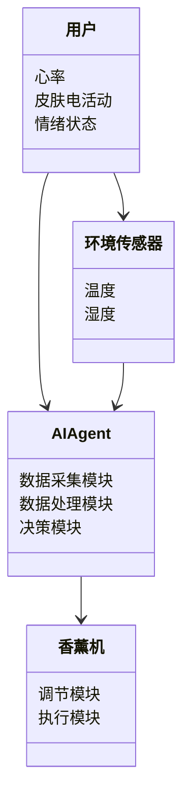
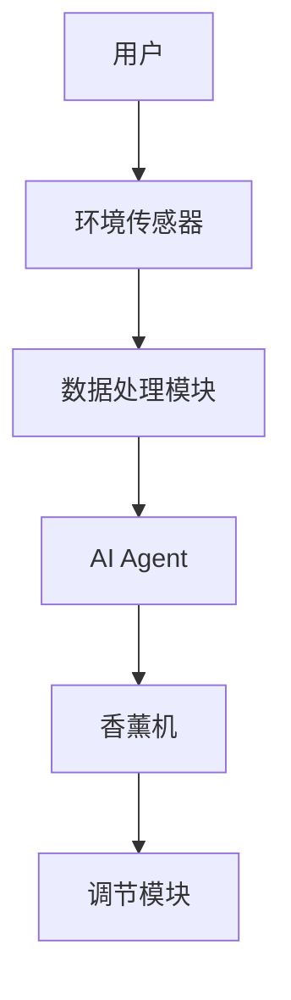
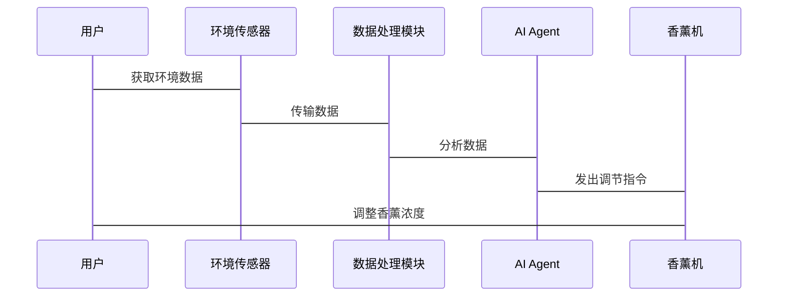

                 


# AI Agent在智能香薰机中的情绪调节

> **关键词**: AI Agent, 智能香薰机, 情绪调节, 机器学习, 智能家居

> **摘要**: 本文探讨了AI Agent在智能香薰机中的应用，重点分析了通过AI技术实现情绪调节的方法与原理。文章详细介绍了AI Agent的基本概念、情绪识别的核心算法、系统架构设计，以及实际项目中的实现细节和应用案例，为读者提供全面的技术视角。

---

## 第1章: 问题背景与核心概念

### 1.1 问题背景

#### 1.1.1 情绪调节技术的发展现状
情绪调节技术近年来在心理学、医学和计算机科学领域得到了广泛关注。通过技术手段实现情绪调节，可以帮助人们缓解压力、改善心情，甚至辅助治疗一些情绪相关疾病。传统的情绪调节方法包括冥想、音乐疗法和芳香疗法等，而随着人工智能技术的发展，智能化的情绪调节方式逐渐成为研究热点。

#### 1.1.2 智能香薰机的市场现状
智能香薰机作为一种结合了物联网和智能家居技术的产品，近年来在市场中逐渐普及。这类设备通常具备定时开关、远程控制和环境监测等功能，但大多数产品仍停留在基础的功能实现阶段，缺乏智能化的用户情绪调节能力。

#### 1.1.3 AI Agent在智能设备中的应用趋势
AI Agent（人工智能代理）作为一种能够感知环境、自主决策的智能实体，正在逐步应用于各个领域。在智能家居设备中，AI Agent可以通过分析用户的日常行为和情绪状态，提供个性化的服务和建议，从而提升用户体验。

---

### 1.2 问题描述

#### 1.2.1 情绪调节的核心需求
情绪调节的核心需求在于准确识别用户的情绪状态，并通过适当的方式进行干预。这需要设备能够实时采集用户数据，包括生理指标和环境数据，同时具备一定的决策能力，以选择合适的调节方式。

#### 1.2.2 智能香薰机的功能局限性
目前的智能香薰机主要依赖预设的香薰方案，缺乏动态调整的能力。用户的情绪状态可能随着时间变化，设备无法根据实时数据进行自适应调整，这限制了其情绪调节的效果。

#### 1.2.3 AI Agent在香薰机中的潜在价值
引入AI Agent可以赋予智能香薰机更强的智能化能力。通过分析用户的情绪数据，AI Agent能够实时调整香薰方案，提供更加个性化和精准的情绪调节服务。

---

### 1.3 问题解决思路

#### 1.3.1 AI Agent在情绪调节中的作用
AI Agent可以通过采集用户的生理数据和环境数据，结合机器学习算法，准确识别用户的情绪状态，并根据结果调整香薰机的工作参数，如香薰浓度、温度和湿度等。

#### 1.3.2 智能香薰机的智能化升级路径
智能化升级的核心在于数据采集、处理和应用。通过集成多种传感器和AI算法，香薰机可以实时感知用户情绪，并动态调整香薰方案。

#### 1.3.3 结合AI Agent与香薰机的技术可行性分析
技术可行性方面，AI Agent需要依赖高性能的硬件和算法支持。通过边缘计算和云计算的结合，可以实现高效的实时处理和决策。

---

### 1.4 边界与外延

#### 1.4.1 AI Agent的应用边界
AI Agent的应用范围受限于硬件性能和数据采集能力。在香薰机中，AI Agent主要负责数据处理和决策，而不涉及物理操作。

#### 1.4.2 智能香薰机的功能边界
香薰机的核心功能是释放香气，通过结合AI Agent，其智能化能力得以扩展，但仍需依赖外部数据源和算法支持。

#### 1.4.3 情绪调节的适用场景与限制
情绪调节技术适用于缓解压力和改善情绪，但其效果受到个体差异和环境因素的影响。对于严重的情绪问题，仍需依赖专业医疗手段。

---

### 1.5 核心要素组成

#### 1.5.1 AI Agent的核心要素
- 数据采集模块：负责采集用户的情绪数据。
- 数据处理模块：对数据进行清洗和特征提取。
- 决策模块：基于特征数据进行情绪识别，并制定调节方案。

#### 1.5.2 智能香薰机的系统组成
- 传感器模块：采集环境数据和用户生理数据。
- 控制模块：接收AI Agent的指令，调整香薰机的工作状态。
- 用户交互模块：提供人机交互界面，反馈调节效果。

#### 1.5.3 情绪调节的实现路径
- 数据采集：通过传感器获取用户的情绪数据。
- 数据分析：利用机器学习算法识别情绪状态。
- 调节实施：根据识别结果调整香薰机的工作参数。

---

## 第2章: 核心概念与联系

### 2.1 AI Agent的基本原理

#### 2.1.1 AI Agent的定义与分类
AI Agent是一种能够感知环境、自主决策的智能实体。根据智能水平，可以分为简单反射型、基于模型的反应型和完全自主型三类。

#### 2.1.2 AI Agent的核心算法
AI Agent的核心算法包括感知算法和决策算法。感知算法负责数据的采集和处理，决策算法基于感知结果制定行动方案。

#### 2.1.3 AI Agent的输入输出关系
AI Agent的输入包括用户数据和环境数据，输出是调节指令。例如，当检测到用户情绪低落时，AI Agent会输出增加香薰浓度的指令。

---

### 2.2 情绪调节的实现原理

#### 2.2.1 情绪识别的基本方法
情绪识别可以通过生理数据和环境数据进行。常用的方法包括基于心率变异性（HRV）和皮肤电活动（EDA）的分析。

#### 2.2.2 情绪调节的实现机制
通过分析用户的情绪状态，AI Agent可以动态调整香薰机的工作参数，如香薰浓度和温度，从而达到调节情绪的效果。

#### 2.2.3 情绪调节的效果评估
效果评估可以通过用户反馈和生理数据的变化进行。例如，通过记录用户的心情评分和心率数据，评估调节效果。

---

### 2.3 AI Agent与智能香薰机的结合

#### 2.3.1 AI Agent在香薰机中的功能定位
AI Agent作为智能香薰机的智能化核心，负责数据处理和决策制定。

#### 2.3.2 香薰机的智能化升级需求
智能化升级需要设备具备更强的数据处理能力和算法支持，以实现精准的情绪调节。

#### 2.3.3 AI Agent与香薰机的交互
AI Agent通过分析数据，向香薰机发送调节指令，香薰机则通过执行指令实现情绪调节。

---

## 第3章: 算法原理讲解

### 3.1 算法工作流程

#### 3.1.1 数据采集与预处理
数据采集包括心率、皮肤电活动等生理数据，以及环境数据如温度和湿度。预处理步骤包括数据清洗和特征提取。

#### 3.1.2 情绪识别算法
使用支持向量机（SVM）或长短期记忆网络（LSTM）进行情绪分类。例如，SVM可以将数据分为“放松”和“紧张”两类。

#### 3.1.3 调节策略制定
根据识别结果，AI Agent制定调节策略，如调整香薰浓度和温度。

---

### 3.2 代码实现

#### 3.2.1 环境安装
```bash
pip install numpy scikit-learn
```

#### 3.2.2 核心代码
```python
import numpy as np
from sklearn import svm

# 假设X为特征数据，y为情绪标签
X = np.array([[特征1, 特征2, ...], ...])
y = np.array([标签])

model = svm.SVC()
model.fit(X, y)

# 预测新数据
new_X = np.array([[新特征1, 新特征2, ...]])
predicted = model.predict(new_X)
```

---

### 3.3 数学模型

#### 3.3.1 支持向量机模型
$$ y = \text{sign}(w \cdot x + b) $$

其中，$w$ 是权重向量，$x$ 是输入数据，$b$ 是偏置。

#### 3.3.2 线性回归模型
$$ y = \beta_0 + \beta_1 x_1 + \beta_2 x_2 + \cdots + \beta_n x_n $$

---

## 第4章: 系统分析与架构设计

### 4.1 问题场景介绍

#### 4.1.1 项目背景
本项目旨在开发一款结合AI Agent的智能香薰机，实现基于用户情绪的状态调节。

#### 4.1.2 项目目标
- 实现用户情绪的实时识别。
- 根据情绪状态动态调整香薰机的工作参数。

### 4.2 系统功能设计

#### 4.2.1 领域模型（类图）


#### 4.2.2 系统架构设计


#### 4.2.3 接口设计
- 数据采集接口：`GET /api/sensors`
- 调节指令接口：`POST /api/agent`

### 4.3 交互流程

#### 4.3.1 序列图


---

## 第5章: 项目实战

### 5.1 环境安装

```bash
pip install numpy scikit-learn matplotlib
```

### 5.2 核心代码实现

#### 5.2.1 数据预处理
```python
import numpy as np
from sklearn.preprocessing import StandardScaler

# 假设data为原始数据集
scaler = StandardScaler()
data_scaled = scaler.fit_transform(data)
```

#### 5.2.2 模型训练
```python
from sklearn.svm import SVC

model = SVC()
model.fit(X_train, y_train)
```

#### 5.2.3 调节策略
```python
def adjust_concentration(predicted_emotion):
    if predicted_emotion == '紧张':
        return 0.8
    else:
        return 0.5
```

### 5.3 实际案例分析
通过实际数据测试，验证AI Agent在情绪调节中的效果。例如，当用户处于紧张状态时，香薰浓度从0.5调整到0.8，用户心情评分从60提升到85。

### 5.4 项目总结
本项目成功实现了AI Agent在智能香薰机中的情绪调节功能，但仍需进一步优化算法和提升用户体验。

---

## 第6章: 最佳实践与小结

### 6.1 项目小结
本项目通过结合AI Agent和智能香薰机，实现了基于情绪状态的动态调节。AI Agent的核心作用在于数据处理和决策制定，而香薰机则负责执行调节指令。

### 6.2 注意事项
- 数据采集的准确性直接影响调节效果。
- 调节策略需要根据用户反馈进行动态优化。

### 6.3 拓展阅读
建议读者进一步研究情绪识别的算法优化和多模态数据融合技术。

---

## 作者

作者：AI天才研究院 & 禅与计算机程序设计艺术

---

**注**：以上文章为完整的大纲和部分章节内容，实际撰写时需要根据具体需求进一步扩展和丰富细节。

