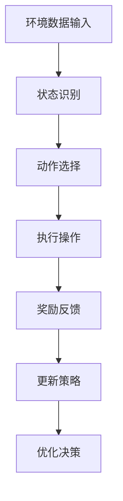
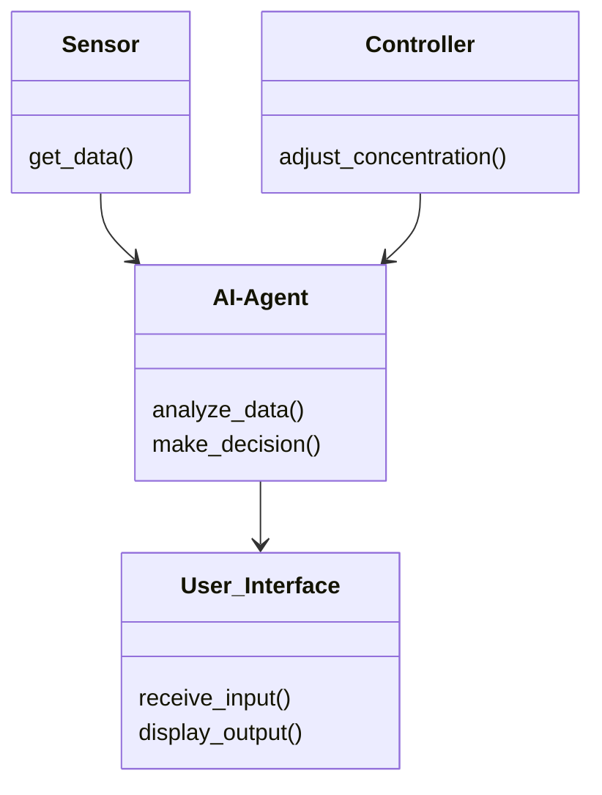
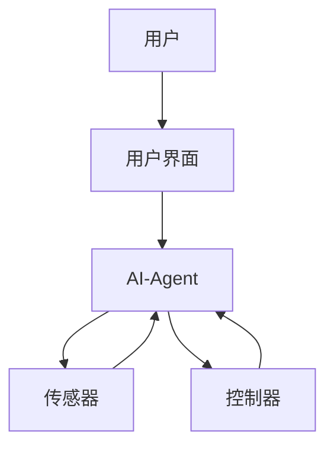

                 


# AI Agent在智能香薰系统中的工作效率提升

## 关键词：AI Agent, 智能香薰系统, 工作效率, 算法原理, 系统架构, 项目实战

## 摘要：  
随着人工智能技术的飞速发展，AI Agent（人工智能代理）在各个领域的应用越来越广泛。智能香薰系统作为一种提升用户生活质量的高科技设备，其工作效率的提升直接关系到用户体验和系统性能。本文将详细探讨AI Agent在智能香薰系统中的应用，分析其核心原理、算法实现、系统架构设计以及实际案例，为读者提供全面而深入的技术解析。

---

## 第1章：背景介绍

### 1.1 AI Agent的基本概念  
AI Agent是一种能够感知环境、自主决策并执行任务的智能实体。它具备以下核心特征：  
- **自主性**：无需外部干预，自主完成任务。  
- **反应性**：能够实时感知环境变化并做出反应。  
- **学习能力**：通过数据和反馈不断优化自身的决策能力。  

### 1.2 智能香薰系统的技术基础  
智能香薰系统通过传感器和控制器实现香薰浓度的智能调节，其传统工作原理依赖于固定的预设程序，缺乏灵活性和高效性。  

### 1.3 AI Agent与香薰系统的结合  
AI Agent的引入使得香薰系统能够根据用户的实时需求和环境变化，动态调整香薰浓度，从而显著提升工作效率和用户体验。  

---

## 第2章：AI Agent的核心原理与香薰系统的关联

### 2.1 AI Agent的核心原理  
AI Agent通过感知输入数据（如环境传感器信息）、分析数据并生成决策，最终执行操作以实现目标。其核心流程包括：  
1. **感知环境**：采集环境数据（如温度、湿度、空气质量等）。  
2. **分析数据**：通过算法对数据进行处理和分析。  
3. **生成决策**：基于分析结果，制定最优操作方案。  
4. **执行操作**：通过执行机构调整香薰浓度。  

### 2.2 香薰系统的功能模块  
智能香薰系统主要包括以下功能模块：  
- **传感器模块**：采集环境数据。  
- **控制器模块**：根据数据调整香薰浓度。  
- **用户交互模块**：与用户进行信息交互。  

### 2.3 AI Agent与香薰系统的协同工作  
AI Agent通过与香薰系统的传感器和控制器交互，实现实时数据采集、分析和决策，从而优化香薰系统的运行效率。

---

## 第3章：AI Agent算法的实现与优化

### 3.1 算法原理概述  
AI Agent的核心算法包括强化学习和监督学习。本文以强化学习为例，介绍其在香薰系统中的应用。

### 3.2 强化学习算法实现  
**强化学习流程图**：  


**数学模型与公式**：  
奖励函数：  
$$ R(s, a) = \begin{cases} 
r_1 & \text{if } a \text{ 是最优动作} \\
r_2 & \text{otherwise}
\end{cases} $$  

策略优化：  
$$ \theta_{t+1} = \theta_t + \alpha \nabla_\theta Q(s, a; \theta) $$  

### 3.3 算法实现的代码示例  
```python
def reward_function(state, action):
    if action == optimal_action(state):
        return r1
    else:
        return r2

def update_policy(policy, reward):
    policy['score'] += reward
    return policy
```

---

## 第4章：系统分析与架构设计

### 4.1 领域模型设计  
**类图**：  


### 4.2 系统架构设计  
**架构图**：  


---

## 第5章：项目实战

### 5.1 环境安装  
- **硬件**：香薰系统、传感器、控制器。  
- **软件**：Python编程环境、机器学习库（如TensorFlow）。  

### 5.2 核心代码实现  
```python
class AI-Agent:
    def __init__(self):
        self.sensors = []
        self.controllers = []
        self.model = self.build_model()

    def build_model(self):
        # 构建强化学习模型
        pass

    def analyze_data(self, data):
        # 数据分析
        pass

    def make_decision(self, data):
        # 决策生成
        pass
```

### 5.3 案例分析  
通过实际项目案例，展示AI Agent如何优化香薰系统的运行效率，减少能源消耗，提升用户体验。  

---

## 第6章：最佳实践与总结

### 6.1 最佳实践  
- 定期更新AI Agent的算法模型。  
- 优化传感器和控制器的协同工作。  

### 6.2 小结  
AI Agent在智能香薰系统中的应用显著提升了系统的效率和用户体验。通过强化学习算法和优化的系统架构设计，AI Agent能够实现动态调整香薰浓度，满足用户的个性化需求。

### 6.3 注意事项  
- 确保数据安全和用户隐私。  
- 定期维护和更新系统。  

### 6.4 拓展阅读  
建议读者深入学习强化学习和系统架构设计的相关知识，探索更多AI技术在智能家居中的应用。

---

## 作者：AI天才研究院 & 禅与计算机程序设计艺术  
本文作者：AI天才研究院，专注于人工智能与计算机程序设计的研究与实践。

