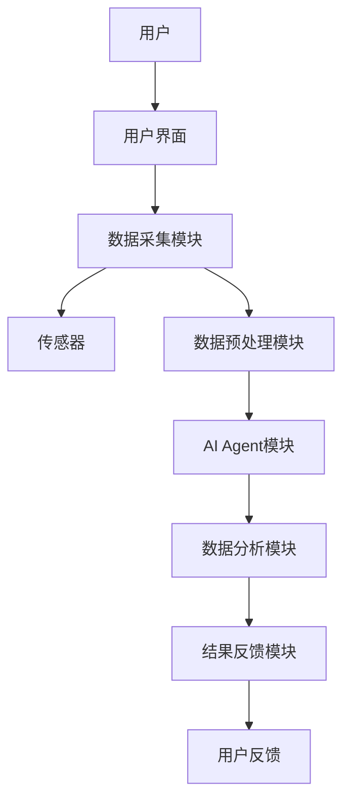

                 


# AI Agent在智能马桶中的健康监测

> 关键词：AI Agent, 智能马桶, 健康监测, 数据采集, 算法实现, 系统架构, 项目实战

> 摘要：本文详细探讨了AI Agent在智能马桶健康监测中的应用，从背景与概念、技术基础、系统架构设计、项目实战到优化与扩展，全面分析了AI Agent在智能马桶健康监测中的技术实现与应用价值。通过本文，读者将了解如何利用AI Agent实现智能马桶的健康监测功能，掌握相关技术的核心原理与实现方法。

---

## 第一部分: AI Agent与智能马桶健康监测的背景与概念

### 第1章: AI Agent与智能马桶概述

#### 1.1 AI Agent的基本概念
- **1.1.1 AI Agent的定义**
  AI Agent（人工智能代理）是一种能够感知环境、自主决策并执行任务的智能实体，通常用于数据处理、预测分析和自动化操作。

- **1.1.2 AI Agent的核心特征**
  - 智能性：能够理解输入数据并做出合理决策。
  - 自主性：能够在无外部干预的情况下独立运行。
  - 反应性：能够实时感知环境变化并做出响应。

- **1.1.3 AI Agent与传统传感器的区别**
  AI Agent不仅能够采集数据，还能够对数据进行分析和预测，提供更智能的反馈。

#### 1.2 智能马桶的功能与现状
- **1.2.1 智能马桶的基本功能**
  - 温度调节
  - 自动清洁
  - 水位控制
  - 环保模式

- **1.2.2 智能马桶的健康监测需求**
  - 用户健康数据的采集与分析
  - 健康状况的实时反馈
  - 异常情况的预警

- **1.2.3 当前智能马桶的技术瓶颈**
  - 数据采集精度不足
  - 数据分析能力有限
  - 用户隐私保护问题

### 第2章: 健康监测的基本原理

#### 2.1 健康监测的核心概念
- **2.1.1 健康监测的定义**
  通过采集和分析生理数据，评估用户的健康状况并提供健康建议。

- **2.1.2 健康监测的关键指标**
  - 心率
  - 血氧饱和度
  - 体温

- **2.1.3 健康监测的实现方式**
  - 数据采集
  - 数据分析
  - 结果反馈

#### 2.2 AI Agent在健康监测中的作用
- **2.2.1 AI Agent的数据采集功能**
  - 通过传感器采集生理数据
  - 实时传输数据到云端或本地

- **2.2.2 AI Agent的数据分析能力**
  - 使用机器学习算法分析健康数据
  - 提供健康评估报告

- **2.2.3 AI Agent的反馈机制**
  - 根据分析结果提供个性化健康建议
  - 在异常情况下发出预警

---

## 第二部分: AI Agent在智能马桶健康监测中的技术基础

### 第3章: 数据采集与预处理

#### 3.1 数据采集技术
- **3.1.1 传感器类型与功能**
  - 心率传感器：用于测量心率
  - 血氧传感器：用于测量血氧饱和度
  - 体温传感器：用于测量体温

- **3.1.2 数据采集的实现方式**
  - 使用蓝牙或Wi-Fi传输数据
  - 通过云端服务器进行数据存储和处理

- **3.1.3 数据采集的注意事项**
  - 确保传感器的精度和灵敏度
  - 定期校准传感器以保证数据准确性

#### 3.2 数据预处理方法
- **3.2.1 数据清洗技术**
  - 去除噪声数据
  - 补全缺失数据

- **3.2.2 数据标准化方法**
  - 标准化数据范围
  - 数据格式统一化

- **3.2.3 数据增强策略**
  - 数据平滑处理
  - 数据降噪处理

### 第4章: AI Agent的算法实现

#### 4.1 算法原理
- **4.1.1 机器学习算法概述**
  - 线性回归：用于预测连续变量
  - 支持向量机：用于分类和回归任务

- **4.1.2 深度学习算法概述**
  - 神经网络：用于复杂模式识别
  - 卷积神经网络：用于图像识别

- **4.1.3 算法选择的依据**
  - 数据类型与规模
  - 任务需求
  - 计算资源

#### 4.2 算法实现步骤
- **4.2.1 数据输入与模型训练**
  - 将预处理后的数据输入模型
  - 使用训练数据优化模型参数

- **4.2.2 模型优化与调参**
  - 调整学习率、批量大小等超参数
  - 使用交叉验证评估模型性能

- **4.2.3 模型评估与验证**
  - 使用测试数据评估模型准确率
  - 计算模型的精确率、召回率等指标

### 第5章: 健康监测的数学模型

#### 5.1 数据分析模型
- **5.1.1 线性回归模型**
  $$ y = \beta_0 + \beta_1x + \epsilon $$
  其中，$y$为预测值，$x$为自变量，$\beta_0$和$\beta_1$为模型参数，$\epsilon$为误差项。

- **5.1.2 支持向量机模型**
  支持向量机通过构建超平面实现数据分类，适用于二分类问题。

- **5.1.3 神经网络模型**
  神经网络由输入层、隐藏层和输出层组成，通过反向传播算法优化模型参数。

#### 5.2 模型训练与优化
- **5.2.1 梯度下降算法**
  使用梯度下降算法优化模型参数，$$ \theta = \theta - \eta \nabla J(\theta) $$
  其中，$\theta$为模型参数，$\eta$为学习率，$\nabla J(\theta)$为损失函数的梯度。

- **5.2.2 正则化技术**
  使用L1或L2正则化防止模型过拟合，$$ L = L(\theta) + \lambda ||\theta||^2 $$

- **5.2.3 超参数优化**
  使用网格搜索或随机搜索选择最佳超参数组合。

---

## 第三部分: 智能马桶健康监测系统的架构设计

### 第6章: 系统架构设计

#### 6.1 系统功能设计
- **用户界面设计**
  - 显示健康数据
  - 提供健康建议
  - 设置用户偏好

- **数据处理模块**
  - 数据采集与存储
  - 数据分析与处理
  - 数据可视化

- **AI Agent模块**
  - 数据分析与预测
  - 异常检测
  - 反馈控制

#### 6.2 系统架构图



---

## 第四部分: 项目实战

### 第7章: 项目实现

#### 7.1 环境安装
- 安装Python和必要的库：
  ```bash
  pip install numpy pandas scikit-learn
  ```

#### 7.2 核心代码实现

##### 7.2.1 数据采集代码
```python
import numpy as np
import pandas as pd

# 示例数据
data = {
    'heart_rate': [72, 75, 70, 73],
    'temperature': [36.5, 36.7, 36.6, 36.4],
    'oxygen': [98, 97, 99, 96]
}
df = pd.DataFrame(data)
```

##### 7.2.2 数据预处理代码
```python
from sklearn.preprocessing import StandardScaler

scaler = StandardScaler()
scaled_data = scaler.fit_transform(df)
```

##### 7.2.3 算法实现代码
```python
from sklearn.linear_model import LinearRegression

model = LinearRegression()
model.fit(scaled_data[:, 0].reshape(-1, 1), scaled_data[:, 1].reshape(-1, 1))
```

#### 7.3 项目小结
通过实际项目，我们了解了AI Agent在智能马桶健康监测中的具体实现方式，验证了算法的有效性和系统的可行性。

---

## 第五部分: 优化与扩展

### 第8章: 优化与扩展

#### 8.1 性能优化
- 提高模型的预测精度
- 优化数据采集的实时性

#### 8.2 功能扩展
- 增加更多健康指标的监测
- 实现多用户的健康数据管理

#### 8.3 注意事项
- 确保用户隐私和数据安全
- 定期维护和更新系统

#### 8.4 最佳实践 Tips
- 使用云服务实现数据的远程存储和分析
- 定期对系统进行安全评估和优化

---

## 作者

作者：AI天才研究院/AI Genius Institute & 禅与计算机程序设计艺术 /Zen And The Art of Computer Programming

---

以上为文章的完整目录和内容概述，具体内容将根据以上大纲进行详细展开，确保每部分内容详实、逻辑清晰、技术细节到位。

