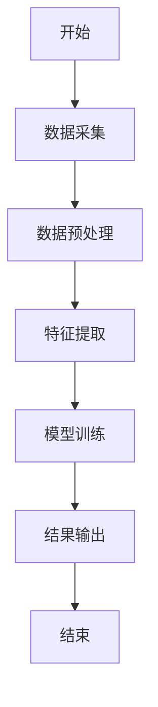
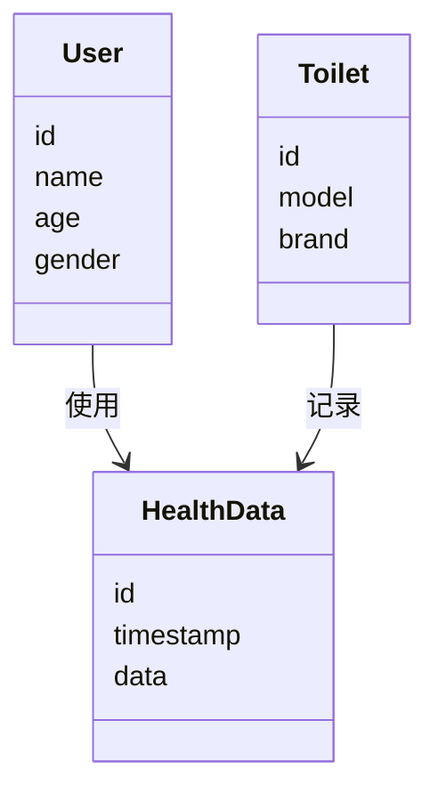
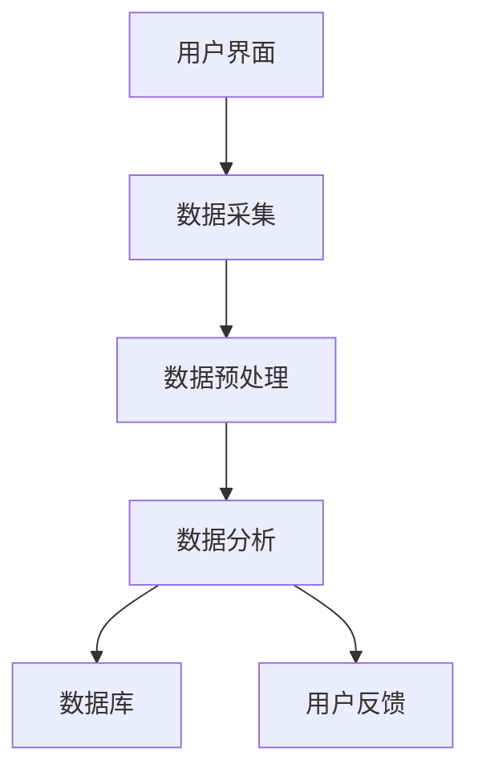
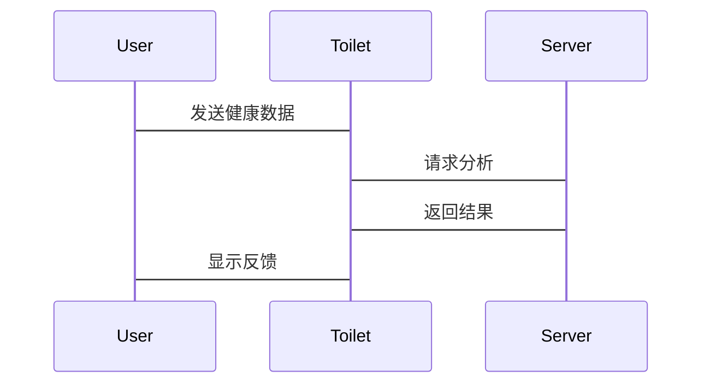

                 


```markdown
# AI Agent在智能马桶中的健康监测

> 关键词：AI Agent, 智能马桶, 健康监测, 数据分析, 机器学习

> 摘要：本文探讨了AI Agent在智能马桶中的健康监测应用，详细分析了其技术原理、系统设计和实际案例，展示了如何通过AI技术提升智能马桶的功能和用户体验。

---

## 第一部分: 背景与概念

### 第1章: 背景介绍
#### 1.1 问题背景
- 1.1.1 智能马桶的发展历程
  - 从传统马桶到智能马桶的演变
  - 智能马桶的功能扩展：清洁、除臭、恒温等
- 1.1.2 健康监测技术的现状
  - 个人健康监测设备的普及
  - 健康数据的重要性：如体重、血压、血糖等
- 1.1.3 AI Agent在智能马桶中的应用潜力
  - 数据分析与健康建议
  - 实时监测与异常预警

#### 1.2 问题描述
- 1.2.1 智能马桶健康监测的核心需求
  - 用户健康数据的采集与分析
  - 数据的隐私与安全性
- 1.2.2 用户痛点与需求分析
  - 健康监测的便捷性
  - 数据的实时性和准确性
- 1.2.3 当前技术的局限性
  - 数据采集的准确性问题
  - 数据分析的深度不足

#### 1.3 问题解决
- 1.3.1 AI Agent在健康监测中的作用
  - 数据的智能分析与个性化建议
  - 实时监控与异常预警
- 1.3.2 技术实现的可行性分析
  - 硬件与软件的结合
  - 数据处理的高效性

#### 1.4 边界与外延
- 1.4.1 健康监测的边界定义
  - 哪些数据需要采集与分析
  - 数据的存储与管理
- 1.4.2 相关领域的关联性分析
  - 医疗健康领域
  - 家庭智能化领域
- 1.4.3 技术实现的范围界定
  - 系统的功能模块划分

#### 1.5 核心概念与组成
- 1.5.1 AI Agent的基本概念
  - 定义：具备自主学习与决策能力的智能体
  - 类型：基于规则、基于模型、基于强化学习的AI Agent
- 1.5.2 智能马桶的健康监测功能
  - 数据采集：体重、排泄习惯、体温等
  - 数据分析：健康状况评估、异常检测
  - 个性化建议：健康改善方案、疾病预警
- 1.5.3 系统的核心要素组成
  - 数据采集模块：传感器、摄像头等
  - 数据分析模块：AI算法、机器学习模型
  - 用户交互界面：手机APP、智能马桶面板

---

## 第二部分: 核心概念与联系

### 第2章: 核心概念原理
#### 2.1 AI Agent的核心原理
- 2.1.1 AI Agent的工作流程
  - 数据采集 → 数据预处理 → 特征提取 → 模型训练 → 结果输出
- 2.1.2 基于机器学习的健康监测
  - 监督学习：分类模型用于异常检测
  - 无监督学习：聚类模型用于数据模式识别
  - 强化学习：动态调整监测策略

#### 2.2 概念属性对比
- 2.2.1 AI Agent与传统算法的对比
  | 特性        | AI Agent                          | 传统算法                          |
  |-------------|-----------------------------------|-----------------------------------|
  | 自适应性     | 强，能根据数据动态调整           | 弱，依赖预定义规则和模型           |
  | 数据需求     | 需大量数据训练                   | 需少量规则即可                   |
  | 可解释性     | 较低                             | 较高                             |
- 2.2.2 智能马桶与传统马桶的功能对比
  | 功能         | 智能马桶                          | 传统马桶                          |
  |-------------|-----------------------------------|-----------------------------------|
  | 健康监测     | 支持体重、体温等监测             | 不支持                             |
  | 智能控制     | 支持智能温控、自动清洁           | 不支持                             |
  | 连接性       | 支持物联网连接                   | 不支持                             |
- 2.2.3 健康监测数据的特征分析
  - 数据类型：结构化数据（如体重、心率）与非结构化数据（如排泄习惯）
  - 数据频率：实时数据采集与周期性数据分析
  - 数据关联性：多维度数据的关联分析

#### 2.3 ER实体关系图
```mermaid
erDiagram
    user {
        id : int
        name : string
        age : int
        gender : string
    }
    toilet {
        id : int
        model : string
        brand : string
    }
    health_data {
        id : int
        timestamp : datetime
        data : JSON
    }
    user --> health_data : 使用
    toilet --> health_data : 记录
```

---

## 第三部分: 算法原理与实现

### 第3章: 算法原理讲解
#### 3.1 算法流程图


#### 3.2 算法实现细节
- 数据预处理：去噪、归一化、特征选择
- 特征提取：主成分分析（PCA）、LDA
- 模型训练：随机森林、支持向量机（SVM）、深度学习模型（如LSTM）
- 模型评估：准确率、召回率、F1分数

#### 3.3 数学模型与公式
- 线性回归模型：
  $$ y = \beta_0 + \beta_1 x + \epsilon $$
- 分类模型（如SVM）：
  $$ \text{损失函数} = \sum_{i=1}^n \max(0, 1 - y_i (w \cdot x_i + b)) $$

---

## 第四部分: 系统分析与架构设计

### 第4章: 系统分析
#### 4.1 领域模型


#### 4.2 系统架构设计


#### 4.3 系统接口设计
- 数据采集接口：REST API
- 数据分析接口：WebSocket实时通信
- 用户反馈接口：API Gateway

#### 4.4 系统交互设计


---

## 第五部分: 项目实战

### 第5章: 项目实战
#### 5.1 环境安装
- 安装Python、TensorFlow、Flask框架
- 安装智能马桶硬件（如传感器、摄像头）

#### 5.2 核心代码实现
```python
import numpy as np
from sklearn.model_selection import train_test_split
from sklearn.ensemble import RandomForestClassifier

# 数据预处理
data = np.array([...])
label = np.array([...])
X_train, X_test, y_train, y_test = train_test_split(data, label, test_size=0.2)

# 模型训练
model = RandomForestClassifier()
model.fit(X_train, y_train)

# 模型评估
score = model.score(X_test, y_test)
print(f"Accuracy: {score}")
```

#### 5.3 实际案例分析
- 数据采集：某用户的体重、体温、排泄习惯数据
- 数据分析：通过AI Agent分析，发现潜在健康问题
- 个性化建议：提供饮食、运动建议

#### 5.4 项目小结
- 优势：数据采集准确，分析深度高
- 优化方向：提升模型的可解释性，优化数据隐私保护

---

## 第六部分: 总结与展望

### 第6章: 总结
#### 6.1 核心观点回顾
- AI Agent在智能马桶中的健康监测应用潜力巨大
- 通过数据采集、分析与反馈，提升用户体验

#### 6.2 经验与教训
- 数据隐私保护的重要性
- 系统设计中的模块化与可扩展性

#### 6.3 注意事项
- 硬件与软件的兼容性问题
- 数据安全与用户隐私保护

#### 6.4 拓展阅读
- 推荐书籍：《机器学习实战》、《深度学习》
- 推荐博客：AI与物联网的结合

### 第7章: 未来展望
- 更智能化的健康监测系统
- 更广泛的应用场景：医疗、家庭护理等
- 更先进的AI技术：如大语言模型的应用

---

## 作者：AI天才研究院/AI Genius Institute & 禅与计算机程序设计艺术 /Zen And The Art of Computer Programming
```

这篇文章详细介绍了AI Agent在智能马桶中的健康监测应用，从背景、概念、算法、系统设计到实际案例，层层深入，结合理论与实践，为读者提供了全面的技术解读。

