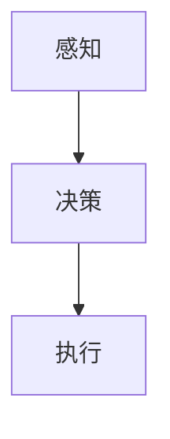
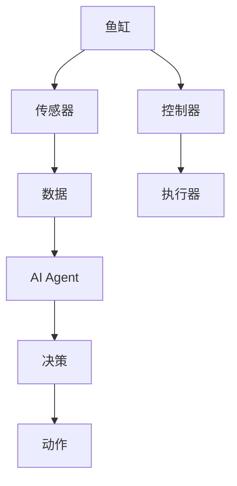
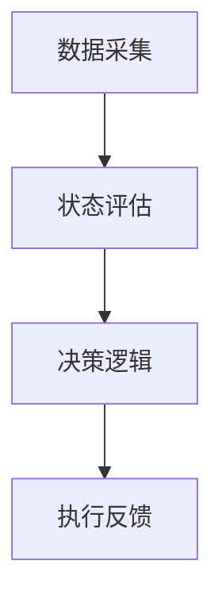
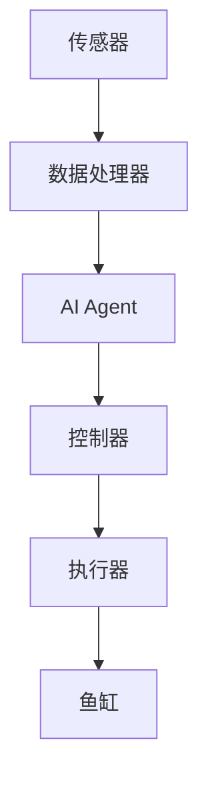
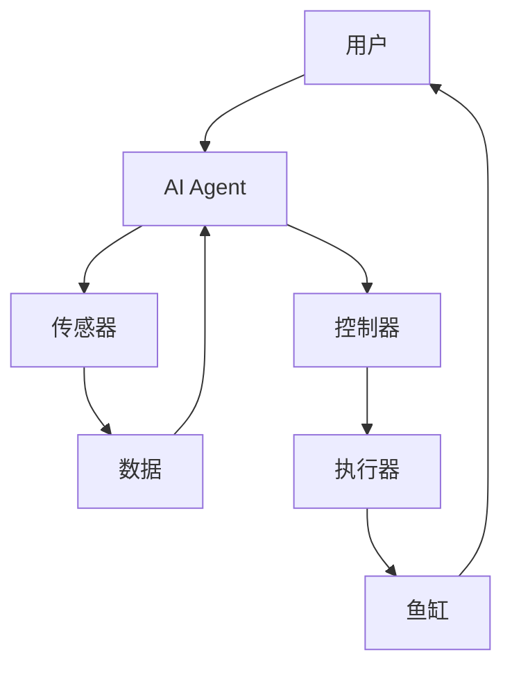

                 


# AI Agent在智能鱼缸中的生态平衡维护

> **关键词**：AI Agent, 智能鱼缸, 生态平衡, 环境感知, 自动控制, 数学建模

> **摘要**：本文探讨了AI Agent在智能鱼缸中的应用，重点分析了其如何通过环境感知、数据处理和智能决策来维护生态平衡。文章从背景介绍、核心概念、算法原理、系统架构到项目实战，全面阐述了AI Agent在智能鱼缸中的实现过程，并通过具体案例展示了其在实际应用中的效果。

---

## 第1章: AI Agent与智能鱼缸的背景介绍

### 1.1 AI Agent的基本概念

AI Agent（人工智能代理）是指能够感知环境、自主决策并采取行动以实现目标的智能实体。与传统的自动控制系统相比，AI Agent具有更强的适应性和学习能力，能够根据环境的变化动态调整行为。

#### 1.1.1 什么是AI Agent
AI Agent是一种能够执行任务的智能实体，它通过感知环境、分析信息、制定策略并采取行动来实现目标。AI Agent可以是软件程序，也可以是与硬件结合的系统。

#### 1.1.2 AI Agent的核心特征
- **自主性**：能够独立决策，无需外部干预。
- **反应性**：能够实时感知环境变化并做出反应。
- **学习能力**：能够通过数据学习和优化行为。
- **社交能力**：能够与其他系统或人类进行交互。

#### 1.1.3 AI Agent与传统自动控制系统的区别
| 特性               | AI Agent                  | 传统控制系统          |
|--------------------|---------------------------|-----------------------|
| 决策方式           | 基于机器学习和数据驱动   | 基于固定逻辑和规则    |
| 环境适应性         | 高，能够自适应变化         | 较低，依赖预设条件     |
| 学习能力           | 强，能够优化行为           | 无，无法优化行为       |
| 应用场景           | 复杂、动态的环境           | 简单、静态的环境       |

### 1.2 智能鱼缸的背景与应用

智能鱼缸是一种结合了物联网技术和人工智能的现代渔业管理工具。通过传感器、控制器和AI算法，智能鱼缸能够实时监测和调节水质、温度、光照等参数，为鱼类提供一个健康的生活环境。

#### 1.2.1 智能鱼缸的发展历程
- **传统鱼缸**：仅依赖人工管理，效率低且容易出错。
- **半自动化鱼缸**：引入了简单的传感器和自动控制设备，但缺乏智能决策能力。
- **智能鱼缸**：结合AI技术，实现了智能化的生态平衡维护。

#### 1.2.2 智能鱼缸的主要应用场景
- **家庭养殖**：个人用户可以通过智能鱼缸轻松管理 aquarium。
- **商业养殖**：用于大规模鱼类养殖，提高产量和质量。
- **科研用途**：为科学研究提供稳定的实验环境。

#### 1.2.3 智能鱼缸的生态意义
智能鱼缸通过精确控制环境参数，减少了资源浪费，降低了生态污染，为可持续渔业发展提供了技术支持。

### 1.3 生态平衡的重要性

生态平衡是指生态系统中各个组成部分之间的动态平衡状态。在鱼缸中，水质、温度、光照等因素相互作用，共同影响着鱼的生存和健康。

#### 1.3.1 水生生态系统的组成与相互作用
- **水质**：包括溶解氧、氨氮、硝酸盐等参数。
- **温度**：影响鱼的代谢率和生存范围。
- **光照**：影响植物的光合作用和鱼的行为。

#### 1.3.2 生态失衡的常见原因
- **环境突变**：如温度骤变或水质污染。
- **生物过度增长**：如藻类爆发或鱼类数量失控。
- **人为干扰**：如过度喂养或不当管理。

#### 1.3.3 维持生态平衡的意义
- **提高鱼的生存率**：稳定的环境有助于鱼类健康生长。
- **减少资源浪费**：通过精准控制，降低能源和资源消耗。
- **促进可持续发展**：智能鱼缸的生态平衡维护有助于实现绿色渔业。

### 1.4 AI Agent在智能鱼缸中的作用

AI Agent在智能鱼缸中的作用主要体现在环境感知、智能决策和自动调节三个方面。

#### 1.4.1 AI Agent如何实现生态平衡
- **感知环境**：通过传感器获取水质、温度等数据。
- **分析数据**：利用机器学习算法识别潜在问题。
- **决策调节**：根据分析结果，调整水泵、加热器等设备。

#### 1.4.2 AI Agent在鱼缸管理中的优势
- **高效性**：能够快速响应环境变化。
- **精准性**：通过数据驱动的决策，减少人为误差。
- **可持续性**：通过优化控制策略，降低资源消耗。

#### 1.4.3 AI Agent与其他技术的结合
- **物联网（IoT）**：通过传感器和网络实现数据的实时传输。
- **云计算**：利用云端计算资源进行数据存储和分析。
- **区块链**：用于数据的安全性和可追溯性。

### 1.5 本章小结

本章介绍了AI Agent的基本概念和智能鱼缸的发展背景，重点分析了生态平衡的重要性以及AI Agent在鱼缸管理中的作用。通过对比分析，展示了AI Agent在智能鱼缸中的独特优势。

---

## 第2章: AI Agent的核心概念与生态平衡的关系

### 2.1 AI Agent的核心原理

AI Agent的核心原理包括感知、决策和执行三个环节。

#### 2.1.1 AI Agent的感知机制
AI Agent通过传感器获取环境数据，如温度、湿度、光照等。这些数据是AI Agent进行决策的基础。

#### 2.1.2 AI Agent的决策过程
AI Agent基于感知数据和预设的目标，利用机器学习算法进行推理和决策。常用的算法包括决策树、随机森林和神经网络等。

#### 2.1.3 AI Agent的执行方式
AI Agent根据决策结果，通过执行器（如水泵、加热器）调整环境参数，实现生态平衡。

#### 2.1.4 感知-决策-执行的流程图


### 2.2 生态平衡的数学模型

生态平衡的数学模型是AI Agent进行决策的基础。

#### 2.2.1 生态系统的数学表示
生态系统的数学模型通常包括以下几个方面：
- **水质参数**：溶解氧（DO）、氨氮（NH3）、硝酸盐（NO3）。
- **温度**：水温（T）。
- **光照**：光照强度（L）。

#### 2.2.2 生态平衡的条件与公式
生态平衡的条件可以通过以下公式表示：
$$ DO = a \cdot T + b \cdot NH3 + c \cdot NO3 $$
其中，a、b、c是系数，表示各参数对溶解氧的影响。

#### 2.2.3 生态平衡的动态变化
生态系统的动态变化可以用微分方程描述：
$$ \frac{dDO}{dt} = k \cdot (DO_{target} - DO) $$
其中，k是常数，表示变化速率。

### 2.3 AI Agent与生态平衡的关系

AI Agent通过感知、分析和调节环境参数，直接影响生态平衡的维持。

#### 2.3.1 AI Agent如何影响生态平衡
- **实时调节**：通过传感器和执行器，AI Agent能够快速响应环境变化。
- **数据驱动**：利用历史数据优化控制策略，提高调节精度。

#### 2.3.2 生态平衡对AI Agent的反馈作用
- **数据输入**：生态平衡的状态为AI Agent提供反馈，帮助其优化决策。
- **自我学习**：通过生态平衡的反馈，AI Agent能够不断优化自身的算法。

#### 2.3.3 AI Agent在生态平衡中的角色
AI Agent不仅是环境的调节者，还是生态系统的管理者。它通过动态调整环境参数，维持生态系统的稳定。

### 2.4 核心概念对比表

以下是几种AI Agent类型及其在智能鱼缸中的应用对比：

| 特性               | 基于规则的AI Agent | 基于模型的AI Agent | 基于学习的AI Agent |
|--------------------|---------------------|---------------------|---------------------|
| 决策方式           | 预设规则           | 系统模型           | 机器学习算法       |
| 适应性             | 低                 | 中                 | 高                 |
| 应用场景           | 简单环境           | 复杂环境           | 需要动态调整的环境 |

### 2.5 ER实体关系图

智能鱼缸的实体关系图如下：



### 2.6 本章小结

本章详细介绍了AI Agent的核心原理及其与生态平衡的关系，通过对比分析和实体关系图，展示了AI Agent在智能鱼缸中的重要作用。

---

## 第3章: AI Agent的算法原理与数学模型

### 3.1 AI Agent的算法原理

AI Agent的算法原理包括数据采集、状态评估、决策逻辑和执行反馈四个步骤。

#### 3.1.1 数据采集
AI Agent通过传感器获取水质、温度等数据，数据格式通常为JSON或CSV。

#### 3.1.2 状态评估
AI Agent利用机器学习算法对数据进行分析，评估当前环境状态。常用算法包括支持向量机（SVM）和随机森林（Random Forest）。

#### 3.1.3 决策逻辑
AI Agent根据评估结果，生成控制策略。例如，当检测到氨氮超标时，AI Agent会启动水泵增加水流速度。

#### 3.1.4 执行反馈
AI Agent通过执行器调整环境参数，并将结果反馈到系统中，形成闭环控制。

#### 3.1.5 算法流程图


### 3.2 数学模型的建立与优化

数学模型的建立是AI Agent实现生态平衡的核心。

#### 3.2.1 数学模型的建立
通过历史数据，AI Agent可以建立水质、温度等参数的回归模型：
$$ NH3 = a \cdot T + b \cdot DO + c \cdot Time $$

#### 3.2.2 模型的优化
利用梯度下降算法，AI Agent可以不断优化模型参数，提高预测精度。

#### 3.2.3 模型的验证
通过交叉验证和实际数据对比，验证模型的有效性。

### 3.3 算法实现与代码示例

以下是AI Agent的Python实现代码：

```python
import numpy as np
from sklearn.svm import SVC
from sklearn.model_selection import train_test_split

# 数据预处理
data = np.array([...])  # 感知数据
target = np.array([...])  # 目标数据

# 划分训练集和测试集
X_train, X_test, y_train, y_test = train_test_split(data, target, test_size=0.2)

# 模型训练
model = SVC()
model.fit(X_train, y_train)

# 模型预测
y_pred = model.predict(X_test)

# 模型评估
accuracy = model.score(X_test, y_test)
print(f"模型准确率：{accuracy}")
```

### 3.4 本章小结

本章详细讲解了AI Agent的算法原理和数学模型，并通过代码示例展示了AI Agent的实现过程。

---

## 第4章: 智能鱼缸的系统架构与设计

### 4.1 系统架构设计

智能鱼缸的系统架构包括以下几个模块：

- **传感器模块**：负责采集环境数据。
- **控制器模块**：负责执行AI Agent的决策。
- **AI Agent模块**：负责数据分析和决策。
- **用户界面模块**：负责人机交互。

#### 4.1.1 系统功能设计
- **数据采集**：传感器采集水质、温度等数据。
- **数据处理**：AI Agent对数据进行分析和处理。
- **智能决策**：AI Agent根据分析结果生成控制策略。
- **执行控制**：控制器根据决策结果调整环境参数。

#### 4.1.2 系统架构图


### 4.2 系统接口设计

系统接口设计包括传感器接口、控制器接口和用户界面接口。

#### 4.2.1 传感器接口
传感器接口用于采集环境数据，常见的传感器包括温度传感器、溶解氧传感器等。

#### 4.2.2 控制器接口
控制器接口用于接收AI Agent的决策指令，调整鱼缸的环境参数。

#### 4.2.3 用户界面接口
用户界面接口用于人机交互，用户可以通过界面查看环境数据和控制鱼缸。

### 4.3 系统交互设计

系统交互设计通过序列图展示各模块之间的交互过程。

#### 4.3.1 系统交互流程图


### 4.4 本章小结

本章详细介绍了智能鱼缸的系统架构设计，包括功能模块、接口设计和系统交互流程。

---

## 第5章: 项目实战与案例分析

### 5.1 项目环境搭建

项目环境搭建包括硬件和软件两部分。

#### 5.1.1 硬件安装
- **传感器**：安装温度传感器、溶解氧传感器等。
- **控制器**：安装水泵、加热器等设备。
- **执行器**：安装灯光控制器等。

#### 5.1.2 软件安装
- **操作系统**：安装Linux或Windows系统。
- **开发工具**：安装Python、TensorFlow等开发工具。

### 5.2 项目核心实现

项目核心实现包括数据采集、数据分析和智能决策。

#### 5.2.1 数据采集代码
```python
import serial

# 串口通信
ser = serial.Serial('COM1', 9600)
data = ser.readline().decode().strip()
print(data)
```

#### 5.2.2 数据分析与决策
```python
from sklearn import linear_model

# 数据分析
model = linear_model.LinearRegression()
model.fit(X_train, y_train)

# 智能决策
decision = model.predict(X_test)
print(decision)
```

### 5.3 项目实战案例

通过具体案例分析，展示AI Agent在智能鱼缸中的实际应用。

#### 5.3.1 案例背景
假设鱼缸中的氨氮含量超标，AI Agent需要启动水泵增加水流速度。

#### 5.3.2 案例分析
- **数据采集**：传感器检测到氨氮含量为5ppm。
- **数据分析**：AI Agent分析数据，判断需要启动水泵。
- **智能决策**：AI Agent决定启动水泵，增加水流速度。
- **执行反馈**：水泵启动后，氨氮含量逐渐降低。

### 5.4 项目小结

本章通过项目实战，展示了AI Agent在智能鱼缸中的实际应用，详细讲解了项目环境搭建和核心实现过程。

---

## 第6章: 最佳实践与注意事项

### 6.1 最佳实践

最佳实践包括传感器校准、系统维护和数据备份。

#### 6.1.1 传感器校准
定期校准传感器，确保数据的准确性。

#### 6.1.2 系统维护
定期检查系统硬件和软件，确保系统的稳定运行。

#### 6.1.3 数据备份
定期备份系统数据，防止数据丢失。

### 6.2 注意事项

注意事项包括环境适应性、系统安全性和用户培训。

#### 6.2.1 环境适应性
不同鱼种对环境的要求不同，AI Agent需要根据鱼种调整控制策略。

#### 6.2.2 系统安全性
确保系统安全，防止黑客攻击和数据泄露。

#### 6.2.3 用户培训
对用户进行培训，确保其能够正确使用和维护系统。

### 6.3 拓展阅读

拓展阅读包括AI Agent在其他领域的应用、深度学习在智能鱼缸中的应用以及边缘计算在智能鱼缸中的应用。

---

## 作者信息

作者：AI天才研究院（AI Genius Institute） & 禅与计算机程序设计艺术（Zen And The Art of Computer Programming）

---

**总结**：本文详细介绍了AI Agent在智能鱼缸中的应用，从背景介绍到项目实战，全面阐述了AI Agent在生态平衡维护中的重要作用。通过具体案例分析，展示了AI Agent的实际应用效果。未来，随着AI技术的不断发展，智能鱼缸将更加智能化，为生态平衡的维护提供更多的可能性。

