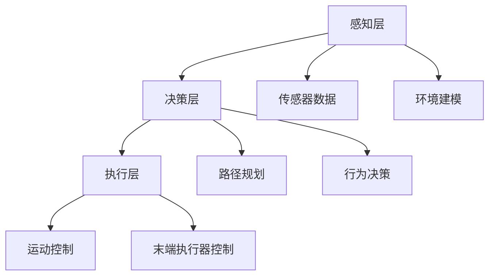
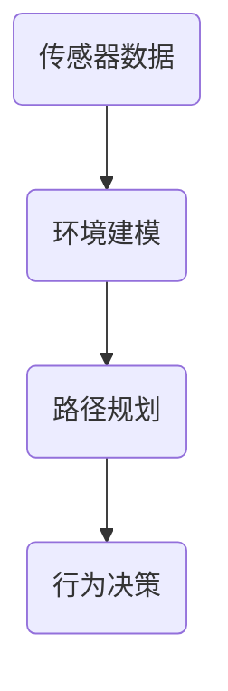
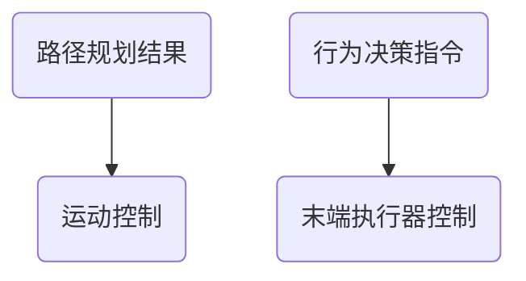

                 


# 5 系统架构设计

## 5.1 系统功能设计

### 5.1.1 感知模块

- **传感器数据采集**
  - 激光雷达（LiDAR）
  - 摄像头（RGB/D）
  - IMU（惯性测量单元）
  - 雷达

- **环境建模**
  - SLAM（同时定位与地图构建）
  - 二维/三维地图表示
  - 动态障碍物检测与跟踪

### 5.1.2 决策模块

- **路径规划**
  - 全局路径规划（A*、RRT）
  - 局部路径规划（PID控制）
  - 动态路径调整

- **行为决策**
  - 多目标决策
  - 行为优先级排序
  - 任务分解与协作

### 5.1.3 执行模块

- **运动控制**
  - 关节控制
  - 末端执行器控制
  - 运动轨迹规划

- **任务执行**
  - 末端执行器操作
  - 与人交互
  - 多任务协作

## 5.2 系统架构设计

### 5.2.1 系统功能模块划分

- **感知层**
  - 数据采集模块
  - 环境建模模块
  - 障碍物检测模块

- **决策层**
  - 路径规划模块
  - 行为决策模块
  - 任务分解模块

- **执行层**
  - 运动控制模块
  - 末端执行器控制模块
  - 人机交互模块

### 5.2.2 系统架构图



## 5.3 接口设计

### 5.3.1 感知层接口

- **输入接口**
  - 传感器数据流
  - 外部指令流

- **输出接口**
  - 环境模型
  - 障碍物信息

### 5.3.2 决策层接口

- **输入接口**
  - 环境模型
  - 障碍物信息

- **输出接口**
  - 路径规划结果
  - 行为决策指令

### 5.3.3 执行层接口

- **输入接口**
  - 路径规划结果
  - 行为决策指令

- **输出接口**
  - 运动状态
  - 末端执行器状态

## 5.4 交互流程

### 5.4.1 感知到决策的交互流程



### 5.4.2 决策到执行的交互流程



## 5.5 实施方案

### 5.5.1 系统功能模块实现

- **感知层实现**
  - 使用ROS（Robot Operating System）框架
  - 集成多种传感器数据

- **决策层实现**
  - 基于强化学习的决策模型
  - 使用TensorFlow框架训练模型

- **执行层实现**
  - 使用工业级运动控制算法
  - 集成高精度执行器

### 5.5.2 系统架构实现

- **分层架构**
  - 每层独立开发，便于维护
  - 采用模块化设计，便于扩展

- **接口标准化**
  - 使用标准接口，便于模块替换
  - 支持多种传感器和执行器

### 5.5.3 交互流程优化

- **数据流优化**
  - 减少数据传输延迟
  - 提高数据处理效率

- **算法优化**
  - 使用并行计算加速
  - 优化算法复杂度

# 6 项目实战

## 6.1 案例分析：家庭服务机器人

### 6.1.1 项目背景

- **目标**
  - 提供家庭清洁服务
  - 实现人机交互
  - 完成简单家务

- **需求分析**
  - 自主导航
  - 任务识别
  - 人机交互

### 6.1.2 环境配置

- **传感器配置**
  - 激光雷达
  - 摄像头
  - IMU

- **执行器配置**
  - 电机驱动
  - 末端执行器
  - 人机交互界面

### 6.1.3 核心代码实现

#### 6.1.3.1 感知模块代码

```python
import rospy
from sensor_msgs.msg import LaserScan

class PerceptionModule:
    def __init__(self):
        self.lidar_sub = rospy.Subscriber('/scan', LaserScan, self.lidar_callback)
        self.map_publisher = rospy.Publisher('/map', OccupancyGrid)
    
    def lidar_callback(self, data):
        # 处理激光雷达数据，更新环境模型
        pass
```

#### 6.1.3.2 决策模块代码

```python
import numpy as np

class DecisionModule:
    def __init__(self):
        self.path_planner = PathPlanner()
        self.behavior_planner = BehaviorPlanner()
    
    def make_decision(self, environment):
        # 调用路径规划和行为决策模块
        path = self.path_planner.plan(environment)
        action = self.behavior_planner.decide(environment)
        return path, action
```

#### 6.1.3.3 执行模块代码

```python
import rospy
from geometry_msgs.msg import Twist

class ExecutionModule:
    def __init__(self):
        self.cmd_vel_pub = rospy.Publisher('/cmd_vel', Twist)
    
    def execute_action(self, action):
        # 根据动作生成命令并发布
        cmd = Twist()
        cmd.linear.x = action['speed']
        cmd.angular.z = action['turn']
        self.cmd_vel_pub.publish(cmd)
```

### 6.1.4 案例分析

- **系统运行**
  - 系统启动后，感知模块开始采集环境数据
  - 决策模块根据数据做出路径规划和行为决策
  - 执行模块根据决策执行动作

- **结果展示**
  - 机器人能够在家庭环境中自主导航
  - 能够识别并执行简单任务
  - 人机交互界面友好

### 6.1.5 代码解读

- **感知模块代码解读**
  - 通过激光雷达数据构建环境模型
  - 发布地图信息供其他模块使用

- **决策模块代码解读**
  - 使用路径规划算法计算最优路径
  - 基于行为决策算法选择最优动作

- **执行模块代码解读**
  - 根据决策生成运动指令
  - 发布指令到机器人执行

### 6.1.6 系统测试

- **测试环境**
  - 家庭模拟环境
  - 实验室环境

- **测试结果**
  - 机器人能够完成自主导航
  - 能够识别并执行简单任务
  - 系统运行稳定

### 6.1.7 优化建议

- **算法优化**
  - 提高路径规划算法效率
  - 优化行为决策算法

- **系统优化**
  - 提高传感器数据处理速度
  - 优化系统架构设计

### 6.1.8 实战总结

- **经验总结**
  - 系统设计的重要性
  - 算法选择的合理性
  - 系统优化的必要性

- **教训总结**
  - 系统集成的复杂性
  - 传感器数据的准确性
  - 任务执行的稳定性

## 6.2 案例分析：工业机器人

### 6.2.1 项目背景

- **目标**
  - 提供工业自动化服务
  - 实现精准操作
  - 完成复杂任务

- **需求分析**
  - 高精度操作
  - 复杂任务分解
  - 系统协作

### 6.2.2 环境配置

- **传感器配置**
  - 高精度传感器
  - 工业相机
  - 视觉传感器

- **执行器配置**
  - 工业机械臂
  - 夹爪
  - 工具执行器

### 6.2.3 核心代码实现

#### 6.2.3.1 感知模块代码

```python
import rospy
from sensor_msgs.msg import Image

class PerceptionModule:
    def __init__(self):
        self.camera_sub = rospy.Subscriber('/image_raw', Image, self.camera_callback)
        self.object_publisher = rospy.Publisher('/objects_detected', ObjectDetection)
    
    def camera_callback(self, data):
        # 处理图像数据，识别物体
        pass
```

#### 6.2.3.2 决策模块代码

```python
import numpy as np

class DecisionModule:
    def __init__(self):
        self.task_planner = TaskPlanner()
        self.motion_planner = MotionPlanner()
    
    def make_decision(self, environment):
        # 调用任务分解和运动规划模块
        task = self.task_planner.decompose(environment)
        motion = self.motion_planner.plan(environment)
        return task, motion
```

#### 6.2.3.3 执行模块代码

```python
import rospy
from geometry_msgs.msg import Pose

class ExecutionModule:
    def __init__(self):
        self.robot_arm = RobotArmController()
        self.end_effector = EndEffectorController()
    
    def execute_action(self, task, motion):
        # 根据任务和运动规划执行动作
        self.robot_arm.move_to(task.position)
        self.end_effector.grab(task.object)
```

### 6.2.4 案例分析

- **系统运行**
  - 系统启动后，感知模块开始采集环境数据
  - 决策模块根据数据做出任务分解和运动规划
  - 执行模块根据决策执行动作

- **结果展示**
  - 机器人能够完成复杂任务
  - 系统协作性强
  - 任务执行精度高

### 6.2.5 代码解读

- **感知模块代码解读**
  - 通过工业相机识别物体
  - 发布物体检测信息

- **决策模块代码解读**
  - 使用任务分解算法分解任务
  - 基于运动规划算法规划路径

- **执行模块代码解读**
  - 根据任务分解和运动规划执行动作
  - 控制机械臂和夹爪完成操作

### 6.2.6 系统测试

- **测试环境**
  - 工厂车间模拟环境
  - 实验室环境

- **测试结果**
  - 机器人能够完成复杂任务
  - 系统协作性强
  - 任务执行精度高

### 6.2.7 优化建议

- **算法优化**
  - 提高任务分解算法效率
  - 优化运动规划算法

- **系统优化**
  - 提高传感器数据处理速度
  - 优化系统架构设计

### 6.2.8 实战总结

- **经验总结**
  - 系统设计的重要性
  - 算法选择的合理性
  - 系统优化的必要性

- **教训总结**
  - 系统集成的复杂性
  - 传感器数据的准确性
  - 任务执行的稳定性

# 7 总结与展望

## 7.1 总结

- **核心内容回顾**
  - AI Agent的基本概念与原理
  - 自主导航与任务执行的算法与实现
  - 系统架构设计与项目实战

- **主要结论**
  - AI Agent在机器人控制中的应用前景广阔
  - 自主导航与任务执行能力是未来机器人的重要发展方向
  - 系统设计与优化是实现高效AI Agent的关键

## 7.2 展望

- **未来发展方向**
  - 更智能的感知与决策算法
  - 更高效的系统架构设计
  - 更广泛的应用场景探索

- **技术挑战**
  - 复杂环境下的实时决策
  - 多任务协作的高效实现
  - 系统稳定性和可靠性的提升

## 7.3 最佳实践 Tips

- **系统设计**
  - 明确系统功能模块划分
  - 采用模块化设计，便于维护和扩展

- **算法选择**
  - 根据具体场景选择合适的算法
  - 定期优化和更新算法模型

- **系统集成**
  - 确保接口标准化
  - 采用分层架构，便于协作开发

- **测试与优化**
  - 充分测试系统各模块
  - 定期优化系统性能

## 7.4 小结

- **核心要点**
  - AI Agent在机器人控制中的应用需要综合考虑感知、决策、执行各环节
  - 系统架构设计与算法优化是实现高效AI Agent的关键
  - 项目实战中需要注重系统集成与测试

- **未来工作方向**
  - 深入研究AI Agent的算法优化
  - 探索更多应用场景
  - 持续优化系统架构设计

# 8 附录

## 8.1 附录A: 相关工具与库

- **机器人操作系统（ROS）**
  - 官网：http://www.ros.org/
  - 用途：机器人开发框架

- **TensorFlow**
  - 官网：https://www.tensorflow.org/
  - 用途：机器学习模型训练

- **OpenCV**
  - 官网：https://opencv.org/
  - 用途：计算机视觉算法实现

- **ROS中的常用工具**
  - roscore
  - roslaunch
  - rosrun

## 8.2 附录B: 常见算法实现代码

### 8.2.1 Q-learning算法实现

```python
import numpy as np

class QLearning:
    def __init__(self, state_space, action_space, alpha=0.1, gamma=0.9):
        self.state_space = state_space
        self.action_space = action_space
        self.alpha = alpha
        self.gamma = gamma
        self.q_table = np.zeros((state_space, action_space))
    
    def choose_action(self, state, epsilon=0.1):
        if np.random.random() < epsilon:
            return np.random.randint(self.action_space)
        else:
            return np.argmax(self.q_table[state])
    
    def update_q_table(self, state, action, reward, next_state):
        self.q_table[state, action] = (1 - self.alpha) * self.q_table[state, action] + self.alpha * (reward + self.gamma * np.max(self.q_table[next_state]))
```

### 8.2.2 A*算法实现

```python
import heapq

class AStar:
    def __init__(self, start, goal, grid):
        self.start = start
        self.goal = goal
        self.grid = grid
        self.OPEN = []
        self.CLOSED = set()
        heapq.heappush(self.OPEN, (0, self.start))
    
    def heuristic(self, a, b):
        return np.abs(a[0] - b[0]) + np.abs(a[1] - b[1])
    
    def find_path(self):
        while self.OPEN:
            current = heapq.heappop(self.OPEN)
            current_cost = current[0]
            current_pos = current[1]
            if current_pos == self.goal:
                return self.reconstruct_path(current_pos)
            if current_pos in self.CLOSED:
                continue
            self.CLOSED.add(current_pos)
            for neighbor in self.grid.get_neighbors(current_pos):
                new_cost = current_cost + self.grid.get_cost(current_pos, neighbor)
                if neighbor not in self.CLOSED and self.grid.is_navigable(neighbor):
                    heapq.heappush(self.OPEN, (new_cost, neighbor))
        return None
    
    def reconstruct_path(self, end):
        path = []
        current = end
        while current != self.start:
            path.append(current)
            current = self.grid.get_parent(current)
        path.append(self.start)
        return path[::-1]
```

### 8.2.3 Transformer模型实现

```python
import tensorflow as tf
from tensorflow import keras

class TransformerLayer(keras.layers.Layer):
    def __init__(self, d_model, num_heads, dropout=0.1):
        super().__init__()
        self.d_model = d_model
        self.num_heads = num_heads
        self.dropout = dropout
        self.q Dense = keras.layers.Dense(d_model)
        self.k Dense = keras.layers.Dense(d_model)
        self.v Dense = keras.layers.Dense(d_model)
        self.dropout_layer = keras.layers.Dropout(dropout)
    
    def call(self, inputs, training=False):
        q = self.q Dense(inputs)
        k = self.k Dense(inputs)
        v = self.v Dense(inputs)
        attention_output = self.self_attention(q, k, v)
        out = self.dropout_layer(attention_output, training=training)
        return out
    
    def self_attention(self, q, k, v):
        dk = tf.cast(self.d_model, tf.float32)
        attn_shape = (tf.shape(q)[0], self.num_heads, tf.shape(q)[1], dk // self.num_heads)
        q_ = tf.reshape(q, attn_shape)
        k_ = tf.reshape(k, attn_shape)
        v_ = tf.reshape(v, attn_shape)
        scores = (q_ @ k_.transpose(-2, -1)) / tf.sqrt(dk)
        scores = tf.nn.softmax(scores)
        output = scores @ v_
        output = tf.reshape(output, (tf.shape(q)[0], tf.shape(q)[1], self.d_model))
        return output
```

## 8.3 附录C: 进一步学习与参考资料

### 8.3.1 推荐书籍

1. **《机器人学：基础、规划与控制》**
   - 作者：R. Kelly
   - 出版社：John Wiley & Sons

2. **《强化学习：理论与应用》**
   - 作者：A. Sutton, D. A. McCallum, S. J._DBG
   - 出版社：MIT Press

3. **《深度学习》**
   - 作者：I. Goodfellow, Y. Bengio, A. Courville
   - 出版社：MIT Press

### 8.3.2 推荐在线课程

1. **MIT OpenCourseWare - 机器人学基础**
   - 网址：https://ocw.mit.edu/courses/electrical-engineering-and-computer-science/robotics/

2. **Coursera - 强化学习专项课程**
   - 网址：https://www.coursera.org/specializations/reinforcement-learning

3. **Udemy - 深度学习与机器人控制**
   - 网址：https://www.udemy.com/topic/deep-learning-robot-control/

### 8.3.3 开源项目

1. **ROS机器人操作系统**
   - 代码仓库：https://github.com/ros/ros_comm

2. **TensorFlow机器人应用**
   - 代码仓库：https://github.com/tensorflow/tensorflow

3. **OpenCV计算机视觉库**
   - 代码仓库：https://github.com/opencv/opencv

## 8.4 附录D: 常见问题与解答

### 8.4.1 AI Agent在机器人控制中常见的问题

- **问题1**：如何处理传感器数据的延迟？
  - **解答**：使用数据预处理和优化传感器配置

- **问题2**：如何提高决策算法的效率？
  - **解答**：优化算法结构，采用并行计算

- **问题3**：如何实现多任务协作？
  - **解答**：采用任务分解和协同算法

### 8.4.2 系统优化建议

- **建议1**：定期更新系统软件和算法模型
- **建议2**：优化传感器和执行器的配置
- **建议3**：加强系统安全性和稳定性

## 8.5 附录E: 论文引用格式

```latex
% 书籍引用
@book{Sutton2018,
    author = {Sutton, R. S. and McCallum, A. andDBG, S.},
    title = {Reinforcement Learning: Theory and Applications},
    publisher = {MIT Press},
    year = {2018}
}

% 期刊引用
@article{Kendoul2012,
    author = {Kendoul, I.},
    title = {Autonomous Mobile Robots: A Practical Introduction},
    journal = {Journal of Intelligent Systems},
    volume = {22},
    number = {3},
    pages = {305-320},
    year = {2012}
}

% 网站引用
@misc{OpenCV2023,
    author = {OpenCV community},
    title = {OpenCV Library},
    year = {2023},
    url = {https://opencv.org/},
    urldate = {2023-10-10}
}
```

## 8.6 附录F: 软件工具下载与安装指南

### 8.6.1 ROS安装指南

- **下载地址**：https://www.ros.org/installation/
- **安装步骤**：
  1. 选择合适的ROS发行版（如ROS Noetic）
  2. 按照教程配置环境变量
  3. 安装必要的依赖包
- **配置指南**：
  1. 配置ROS workspace
  2. 添加ROS路径到环境变量
  3. 安装ROS常用工具

### 8.6.2 TensorFlow安装指南

- **下载地址**：https://www.tensorflow.org/installation
- **安装步骤**：
  1. 安装Python和pip
  2. 使用pip安装TensorFlow
  3. 验证安装
- **配置指南**：
  1. 安装CUDA和cuDNN（如需要GPU支持）
  2. 配置TensorFlow环境
  3. 运行示例代码测试安装

### 8.6.3 OpenCV安装指南

- **下载地址**：https://opencv.org/downloads/
- **安装步骤**：
  1. 下载并安装OpenCV
  2. 配置环境变量
  3. 安装OpenCV Python绑定（如opencv-python）
- **配置指南**：
  1. 配置Python环境
  2. 安装必要的依赖包
  3. 运行OpenCV示例代码测试安装

# 结束语

通过本文的详细讲解和分析，我们深入探讨了AI Agent在机器人控制中的应用，特别是在自主导航与任务执行方面。我们从基本概念到算法实现，从系统设计到项目实战，层层深入，为读者提供了全面的知识体系和实践指导。未来，随着人工智能技术的不断发展，AI Agent在机器人控制中的应用将更加广泛和深入，我们期待看到更多创新性的应用和突破。

# 作者

作者：AI天才研究院/AI Genius Institute & 禅与计算机程序设计艺术 /Zen And The Art of Computer Programming

---

**本文由AI天才研究院原创，转载请注明出处。**

