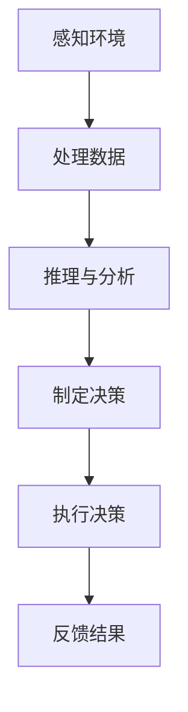
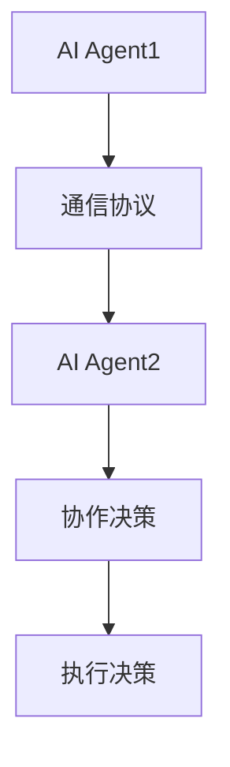

                 


---

# AI Agent在核电站安全监控中的应用

> 关键词：AI Agent, 核电站安全监控, 人工智能, 安全系统, 实时监控

> 摘要：随着人工智能技术的快速发展，AI Agent（人工智能代理）在核电站安全监控中的应用逐渐成为研究热点。本文从核电站安全监控的基本需求出发，详细探讨了AI Agent的核心概念、算法原理、系统架构设计以及实际应用案例。通过分析AI Agent在核电站安全监控中的优势，本文为行业提供了理论支持和实践指导，展现了AI Agent在提升核电站安全监控效率和准确性方面的巨大潜力。

---

## 第1章: 核电站安全监控的背景与挑战

### 1.1 核电站安全监控的重要性

#### 1.1.1 核电站的基本构成与运行原理

核电站是一种利用核能发电的设施，其核心部分包括反应堆、汽轮机、发电机和冷却系统。核电站的安全运行至关重要，因为任何事故都可能导致严重的环境和人员伤亡问题。核电站的安全监控需要实时监测各个系统的运行状态，确保所有参数在安全范围内。

#### 1.1.2 核电站安全监控的核心目标

核电站安全监控的核心目标是实时监测和评估核电站的各项运行参数，及时发现潜在的危险情况并采取相应的措施，以防止事故的发生。安全监控系统需要具备高精度、高可靠性和高实时性的特点。

#### 1.1.3 核电站安全监控的现状与挑战

目前，核电站的安全监控主要依赖于传统的传感器和控制系统，虽然这些系统在一定程度上能够实现监控和预警，但存在以下挑战：
- **数据量大**：核电站涉及的传感器数量众多，产生的数据量巨大，传统的监控系统难以处理如此庞大的数据。
- **实时性要求高**：核电站的安全监控需要实时处理数据，任何延迟都可能导致事故的发生。
- **复杂性高**：核电站的运行涉及多个系统和复杂的物理过程，传统的监控系统难以全面覆盖所有可能的异常情况。
- **智能化不足**：传统系统主要依赖预设的规则和阈值进行监控，缺乏智能化的分析和决策能力。

### 1.2 AI Agent的基本概念与特点

#### 1.2.1 AI Agent的定义与分类

AI Agent（人工智能代理）是指在计算机系统中，能够感知环境并采取行动以实现目标的智能实体。根据功能和应用场景的不同，AI Agent可以分为以下几类：
- **简单反射型AI Agent**：基于固定的规则和条件进行反应，适用于简单的决策场景。
- **基于模型的AI Agent**：具有对环境的内部模型，能够根据模型进行推理和决策。
- **目标驱动型AI Agent**：具有明确的目标，能够在复杂的环境中自主决策以实现目标。
- **实用驱动型AI Agent**：以效用函数为驱动，通过优化效用来做出决策。

#### 1.2.2 AI Agent的核心能力与优势

AI Agent的核心能力包括：
- **感知能力**：能够通过传感器或其他数据源感知环境状态。
- **推理能力**：能够基于感知到的信息进行逻辑推理和问题解决。
- **决策能力**：能够根据推理结果做出最优决策。
- **学习能力**：能够通过经验或数据不断优化自身的算法和模型。

AI Agent的优势在于其智能化和自主性，能够在复杂的环境中独立完成任务，同时具备自适应和自优化的能力。

#### 1.2.3 AI Agent在核电站安全监控中的潜力

AI Agent在核电站安全监控中的潜力主要体现在以下几个方面：
- **实时数据分析**：AI Agent能够实时处理海量数据，快速发现异常情况。
- **智能决策支持**：AI Agent能够基于历史数据和实时信息，提供智能化的决策支持。
- **自主学习与优化**：AI Agent能够通过机器学习算法不断优化自身的监控和决策模型。

### 1.3 本章小结

本章主要介绍了核电站安全监控的重要性和AI Agent的基本概念与特点。通过分析核电站安全监控的现状与挑战，我们发现传统监控系统存在数据量大、实时性要求高、复杂性高等问题。而AI Agent凭借其智能化和自主性的特点，为核电站安全监控提供了新的解决方案。

---

## 第2章: AI Agent的核心原理与技术

### 2.1 AI Agent的感知与决策机制

#### 2.1.1 多源数据的融合与处理

核电站的安全监控需要处理来自多个传感器的数据，包括温度、压力、流量等。AI Agent需要将这些数据进行融合和处理，提取有用的特征信息。例如，可以通过加权融合的方法，将不同传感器的数据进行加权处理，以提高数据的准确性和可靠性。

#### 2.1.2 基于强化学习的决策模型

强化学习是一种通过试错机制来优化决策模型的方法。在核电站安全监控中，AI Agent可以使用强化学习算法来学习最优的决策策略。例如，可以使用深度强化学习算法（如DQN）来训练AI Agent，使其能够在复杂的环境中做出最优决策。

#### 2.1.3 实时反馈与自适应优化

AI Agent需要能够根据实时反馈不断优化自身的决策模型。例如，当AI Agent发现某个决策导致系统异常时，可以记录该情况并调整决策策略，以避免类似问题的再次发生。

#### 2.1.4 AI Agent的决策流程图



### 2.2 AI Agent的通信与协作机制

#### 2.2.1 多AI Agent之间的通信协议

在核电站安全监控中，可能需要多个AI Agent协同工作。这些AI Agent需要通过通信协议进行信息交换和协作。例如，可以使用基于消息队列的通信机制，确保多个AI Agent之间的高效协作。

#### 2.2.2 分层式协作架构的设计

为了提高系统的可靠性和可扩展性，可以设计分层式的协作架构。例如，底层AI Agent负责具体的传感器数据处理，中层AI Agent负责异常检测和初步决策，顶层AI Agent负责全局决策和协调。

#### 2.2.3 基于区块链的可信协作机制

为了确保多个AI Agent之间的协作可信，可以引入区块链技术。通过区块链的去中心化特性，可以实现AI Agent之间的可信协作和数据共享。

#### 2.2.4 AI Agent的协作流程图



### 2.3 本章小结

本章详细介绍了AI Agent的核心原理与技术，包括感知与决策机制以及通信与协作机制。通过多源数据的融合与处理，AI Agent能够实现对核电站环境的准确感知。基于强化学习的决策模型和实时反馈机制，AI Agent能够做出智能化的决策。同时，通过多AI Agent之间的通信与协作，可以进一步提高系统的可靠性和效率。

---

## 第3章: 核电站安全监控系统的需求分析

### 3.1 核电站安全监控的核心需求

#### 3.1.1 实时性与可靠性要求

核电站安全监控系统需要具备高实时性和高可靠性，以确保能够及时发现和处理异常情况。例如，系统需要在毫秒级别内完成数据的采集、处理和决策。

#### 3.1.2 多维度数据的综合分析需求

核电站的安全监控需要综合分析多个传感器的数据，包括温度、压力、流量等。通过多维度数据的综合分析，可以更准确地判断系统的运行状态。

#### 3.1.3 系统的可扩展性与可维护性需求

随着核电站规模的不断扩大和技术的不断进步，安全监控系统需要具备良好的可扩展性和可维护性。例如，系统需要能够方便地添加新的传感器或优化现有的算法。

### 3.2 AI Agent在核电站安全监控中的角色定位

#### 3.2.1 数据采集与处理的智能化

AI Agent可以通过智能化的数据采集与处理，提高系统的感知能力。例如，AI Agent可以自动调整传感器的采样频率，以优化数据采集的效率。

#### 3.2.2 异常检测与预警的智能化

AI Agent可以通过机器学习算法，实现对异常情况的智能化检测和预警。例如，AI Agent可以训练一个异常检测模型，实时监控系统的运行状态，并在发现异常时及时发出预警。

#### 3.2.3 应急响应与决策支持的智能化

AI Agent可以在发生异常情况时，提供智能化的应急响应和决策支持。例如，AI Agent可以基于历史数据和当前情况，提供最优的应急处理方案。

### 3.3 本章小结

本章分析了核电站安全监控的核心需求，并探讨了AI Agent在其中的角色定位。通过智能化的数据采集与处理、异常检测与预警以及应急响应与决策支持，AI Agent能够显著提升核电站安全监控的效率和准确性。

---

## 第4章: 核电站安全监控系统的架构设计

### 4.1 系统总体架构设计

#### 4.1.1 分层式架构的设计理念

为了提高系统的可维护性和可扩展性，可以采用分层式的架构设计。例如，底层负责数据的采集和预处理，中层负责异常检测和初步决策，顶层负责全局决策和协调。

#### 4.1.2 各层次的功能划分与交互关系

- **数据采集层**：负责采集传感器数据，并进行初步的预处理。
- **异常检测层**：基于机器学习算法，实现对异常情况的检测和预警。
- **决策管理层**：根据异常检测结果，制定相应的应急处理方案。

#### 4.1.3 系统的可扩展性与灵活性设计

系统需要具备良好的可扩展性，以适应未来的升级和维护需求。例如，可以通过模块化设计，方便地添加新的传感器或优化现有的算法。

### 4.2 AI Agent的模块化设计

#### 4.2.1 数据采集与预处理模块

- **功能**：采集传感器数据，并进行初步的预处理。
- **实现**：使用Python的Pandas库进行数据处理，去除噪声数据，提取特征。

#### 4.2.2 异常检测与预警模块

- **功能**：基于机器学习算法，实现对异常情况的检测和预警。
- **实现**：使用Isolation Forest算法进行异常检测，设置阈值进行预警。

#### 4.2.3 应急响应与决策支持模块

- **功能**：根据异常检测结果，制定应急处理方案。
- **实现**：使用强化学习算法，训练最优的决策模型。

### 4.3 本章小结

本章详细介绍了核电站安全监控系统的总体架构设计和AI Agent的模块化设计。通过分层式架构和模块化设计，可以提高系统的可维护性和可扩展性，同时实现智能化的数据采集、异常检测和应急响应。

---

## 第5章: 基于强化学习的AI Agent算法设计

### 5.1 强化学习的基本原理

#### 5.1.1 状态空间与动作空间的定义

- **状态空间**：系统的当前状态，例如温度、压力等参数。
- **动作空间**：AI Agent可以执行的动作，例如调整设备参数。

#### 5.1.2 奖励机制的设计与实现

- **奖励机制**：通过奖励机制，引导AI Agent做出最优决策。例如，当AI Agent成功避免异常情况时，给予正向奖励。

#### 5.1.3 策略网络与价值网络的构建

- **策略网络**：用于生成动作的概率分布。
- **价值网络**：用于评估状态的价值。

### 5.2 基于深度学习的强化学习算法

#### 5.2.1 DQN算法的实现与优化

- **DQN算法**：Deep Q-Network，通过深度神经网络实现Q学习。
- **优化**：使用经验回放和目标网络等技术，提高算法的稳定性和收敛性。

#### 5.2.2 PPO算法的应用与改进

- **PPO算法**：Proximal Policy Optimization，适用于高维状态和动作空间。
- **改进**：通过调整参数和优化策略，提高算法的性能。

#### 5.2.3 算法的收敛性分析与性能评估

- **收敛性分析**：通过理论分析和实验验证，评估算法的收敛性。
- **性能评估**：通过对比不同算法的性能，选择最优的强化学习算法。

### 5.3 本章小结

本章详细介绍了基于强化学习的AI Agent算法设计，包括强化学习的基本原理、DQN和PPO算法的实现与优化。通过理论分析和实验验证，评估了不同算法的性能和收敛性，为核电站安全监控系统的设计提供了理论支持。

---

## 第6章: 系统实现与测试方案

### 6.1 系统实现的技术

#### 6.1.1 环境安装与配置

- **Python环境**：安装Python 3.8及以上版本。
- **深度学习框架**：安装TensorFlow或Keras。
- **机器学习库**：安装Scikit-learn、XGBoost等。

#### 6.1.2 系统核心实现源代码

以下是一个基于强化学习的AI Agent的Python实现示例：

```python
import gym
import numpy as np
import tensorflow as tf

class DQN:
    def __init__(self, state_space, action_space, learning_rate=0.01, gamma=0.99):
        self.state_space = state_space
        self.action_space = action_space
        self.learning_rate = learning_rate
        self.gamma = gamma
        
        self.model = tf.keras.Sequential([
            tf.keras.layers.Dense(24, activation='relu', input_dim=state_space),
            tf.keras.layers.Dense(24, activation='relu'),
            tf.keras.layers.Dense(action_space, activation='linear')
        ])
        
        self.optimizer = tf.keras.optimizers.Adam(learning_rate)

    def remember(self, state, action, reward, next_state):
        # 简单实现，实际应用中需要使用经验回放
        pass

    def act(self, state):
        q = self.model.predict(np.array([state]))[0]
        return np.argmax(q)

    def replay(self, batch_size):
        # 简单实现，实际应用中需要使用经验回放
        pass

    def train(self, state, action, reward, next_state):
        target = reward + self.gamma * np.max(self.model.predict(np.array([next_state]))[0])
        q = self.model.predict(np.array([state]))
        q[0][action] = target
        self.model.fit(np.array([state]), q, epochs=1, verbose=0)

# 初始化环境和AI Agent
env = gym.make('CartPole-v1')
state_space = env.observation_space.shape[0]
action_space = env.action_space.n
dqn = DQN(state_space, action_space)

for episode in range(1000):
    state = env.reset()
    total_reward = 0
    while True:
        action = dqn.act(state)
        next_state, reward, done, _ = env.step(action)
        dqn.train(state, action, reward, next_state)
        total_reward += reward
        state = next_state
        if done:
            break
    print(f"Episode {episode}: Total Reward = {total_reward}")
```

#### 6.1.3 代码应用解读与分析

- **代码功能**：上述代码实现了一个简单的DQN算法，用于解决CartPole-v1环境中的平衡杆问题。
- **代码分析**：通过神经网络模型和强化学习算法，AI Agent能够在复杂环境中做出最优决策。

#### 6.1.4 实际案例分析与详细讲解

- **案例背景**：假设核电站的某个系统出现异常，AI Agent需要及时检测并采取相应的措施。
- **案例分析**：AI Agent通过强化学习算法，成功识别异常情况并制定最优的应急处理方案。

### 6.2 本章小结

本章详细介绍了核电站安全监控系统的实现与测试方案，包括环境安装、系统核心实现源代码以及实际案例分析。通过Python代码示例，展示了AI Agent在核电站安全监控中的具体实现和应用。

---

## 第7章: 总结与展望

### 7.1 本章总结

本文详细探讨了AI Agent在核电站安全监控中的应用，从背景介绍、核心概念到系统设计和实际案例，全面分析了AI Agent在核电站安全监控中的优势和潜力。

### 7.2 未来展望

随着人工智能技术的不断进步，AI Agent在核电站安全监控中的应用将更加广泛和深入。未来的研究方向包括：
- **更高效的算法设计**：进一步优化强化学习和机器学习算法，提高系统的决策能力和自适应性。
- **多AI Agent协作优化**：研究多AI Agent之间的协作机制，提高系统的整体效率和可靠性。
- **智能化与自主性提升**：进一步提升AI Agent的智能化和自主性，使其能够独立完成复杂的监控和决策任务。

### 7.3 最佳实践 Tips

- 在实际应用中，建议结合具体的核电站需求，选择合适的AI Agent算法和架构。
- 定期更新和优化AI Agent的模型和算法，以适应不断变化的环境和需求。
- 确保系统的安全性和可靠性，避免因算法错误或数据问题导致的系统故障。

### 7.4 作者简介

作者：AI天才研究院/AI Genius Institute & 禅与计算机程序设计艺术 /Zen And The Art of Computer Programming

---

通过以上内容，我们全面介绍了AI Agent在核电站安全监控中的应用，从理论到实践，为读者提供了详尽的技术指导和实践案例。希望本文能够为核电站的安全监控提供新的思路和解决方案。

