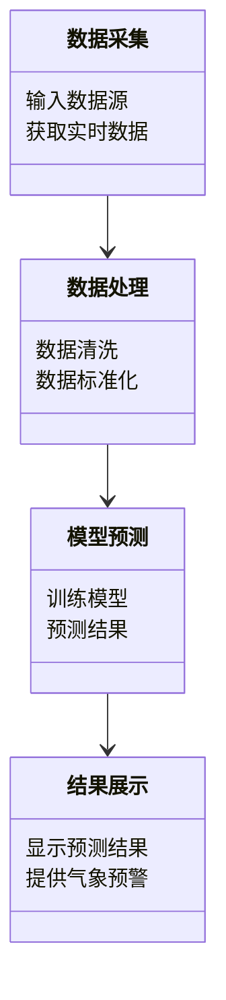
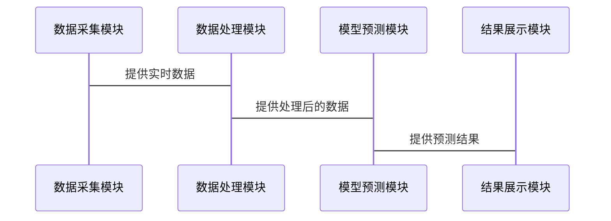

                 


# AI Agent在气象预报中的应用前景

> 关键词：AI Agent, 气象预报, 机器学习, 深度学习, 天气预测, 数据分析

> 摘要：本文探讨了AI Agent在气象预报中的应用前景，分析了AI Agent的基本概念、核心算法、系统架构及实际应用场景。通过对比传统气象模型与AI Agent的优势，结合具体案例，深入阐述了AI Agent在气象预报中的潜力和挑战。本文还提供了详细的算法实现和系统设计，为读者提供了从理论到实践的全面指导。

---

# 第1章: AI Agent与气象预报概述

## 1.1 AI Agent的基本概念

### 1.1.1 什么是AI Agent

AI Agent（人工智能代理）是指能够感知环境、自主决策并执行任务的智能实体。它通过传感器获取信息，利用算法进行分析和推理，并通过执行器与环境互动。AI Agent的核心在于其自主性和智能性，能够适应复杂多变的环境。

在气象预报中，AI Agent可以实时处理海量气象数据，预测天气变化趋势，并提供精准的气象服务。与传统气象模型相比，AI Agent能够更快速地响应数据变化，并根据实时信息动态调整预测模型。

### 1.1.2 AI Agent的特点与分类

AI Agent具有以下特点：
1. **自主性**：能够在没有人工干预的情况下独立完成任务。
2. **反应性**：能够实时感知环境变化并做出反应。
3. **学习能力**：能够通过数据学习和优化模型。
4. **决策能力**：能够基于数据进行分析和决策。

根据应用场景，AI Agent可以分为以下几类：
1. **简单反射型Agent**：基于规则进行简单决策。
2. **基于模型的反应式Agent**：通过内部模型分析环境并做出决策。
3. **目标驱动型Agent**：根据目标进行规划和行动。
4. **实用驱动型Agent**：通过效用函数进行优化决策。

### 1.1.3 AI Agent在气象预报中的应用背景

随着全球气候变化的加剧，气象预报的精准度和及时性变得尤为重要。传统气象预报主要依赖于数值天气预报模型，这些模型需要大量的计算资源和时间，且难以实时调整模型参数以适应实时数据的变化。

AI Agent的出现为气象预报带来了新的可能性。通过AI Agent，气象预报系统可以实时处理卫星、气象站、海洋观测等多种数据源的数据，快速生成高精度的天气预测，并根据实时数据动态调整预测模型。这使得气象预报更加精准、高效和灵活。

---

## 1.2 气象预报的基本原理

### 1.2.1 传统气象预报方法

传统气象预报主要依赖于数值天气预报模型。这些模型通过求解大气运动的方程组，模拟天气的变化过程。数值天气预报的核心是通过超级计算机进行大规模的数值计算，预测未来一段时间内的天气状况。

然而，传统气象预报方法存在以下问题：
1. **计算资源消耗大**：需要高性能计算机进行大规模计算。
2. **预测时间长**：从数据收集到预测结果生成需要较长时间。
3. **模型复杂性高**：需要复杂的数学模型和物理模型。

### 1.2.2 现代气象数据来源

现代气象预报依赖于多种数据源，包括：
1. **卫星数据**：提供全球范围内的气象数据，包括温度、湿度、风速等。
2. **气象站数据**：提供地面气象观测数据。
3. **海洋观测数据**：提供海洋表面温度、盐度等数据。
4. **雷达数据**：提供天气系统实时动态。

### 1.2.3 气象预报的挑战与需求

气象预报的挑战主要在于数据的多样性和复杂性。气象数据不仅包括大量的数值数据，还包括时间序列数据、空间分布数据等多种类型。此外，气象系统是一个高度非线性的系统，传统模型难以捕捉所有可能的变化。

为了提高气象预报的精准度和效率，现代气象预报对AI Agent提出了以下需求：
1. **实时数据处理能力**：能够快速处理海量实时气象数据。
2. **动态调整能力**：能够根据实时数据动态调整预测模型。
3. **高精度预测能力**：能够提供高精度的天气预测结果。

---

## 1.3 AI Agent在气象预报中的应用前景

### 1.3.1 数据驱动的气象预报

AI Agent的核心优势在于其数据驱动的特性。通过AI Agent，气象预报系统可以实时处理多种数据源的数据，并利用机器学习算法进行预测。与传统气象模型相比，AI Agent能够更快速地响应数据变化，并根据实时数据动态调整预测模型。

### 1.3.2 AI Agent在气象预报中的优势

AI Agent在气象预报中的优势主要体现在以下几个方面：
1. **实时性**：AI Agent能够实时处理数据，快速生成预测结果。
2. **灵活性**：AI Agent可以根据实时数据动态调整预测模型。
3. **高精度**：通过机器学习算法，AI Agent可以捕捉复杂的天气变化规律，提高预测精度。

### 1.3.3 未来发展趋势

未来，AI Agent在气象预报中的应用将朝着以下几个方向发展：
1. **多模态数据融合**：将卫星数据、气象站数据、海洋观测数据等多种数据源进行融合，提高预测精度。
2. **实时预测**：通过边缘计算和实时数据处理技术，实现分钟级的天气预测。
3. **全球气象服务**：通过全球气象数据共享和AI Agent的协同工作，提供全球范围内的精准气象服务。

---

## 1.4 本章小结

本章主要介绍了AI Agent的基本概念、气象预报的基本原理以及AI Agent在气象预报中的应用前景。通过对比传统气象模型与AI Agent的优劣，我们可以看到，AI Agent在气象预报中的应用具有巨大的潜力。随着技术的不断发展，AI Agent将为气象预报带来更加精准和高效的解决方案。

---

# 第2章: AI Agent的核心概念与联系

## 2.1 AI Agent的工作原理

### 2.1.1 感知层

AI Agent的感知层负责获取环境中的数据。在气象预报中，感知层可以通过卫星、气象站等设备获取实时气象数据。这些数据包括温度、湿度、风速、气压等多种参数。

### 2.1.2 决策层

AI Agent的决策层负责对感知层获取的数据进行分析和处理。通过机器学习算法，AI Agent可以对数据进行建模和预测，生成天气预测结果。

### 2.1.3 执行层

AI Agent的执行层负责根据决策层生成的预测结果采取相应的行动。在气象预报中，执行层可以通过发布天气预警、调整气象模型参数等方式进行响应。

---

## 2.2 AI Agent与传统气象模型的对比

### 2.2.1 数据处理能力对比

| 对比维度 | AI Agent | 传统气象模型 |
|----------|-----------|--------------|
| 数据处理能力 | 强 | 较弱 |
| 实时性 | 高 | 低 |
| 可扩展性 | 高 | 低 |

### 2.2.2 计算速度对比

AI Agent通过机器学习算法可以快速处理海量数据，而传统气象模型需要通过超级计算机进行大规模计算，计算速度较慢。

### 2.2.3 可解释性对比

传统气象模型的预测结果具有较高的可解释性，而AI Agent的预测结果往往缺乏可解释性，尤其是在使用深度学习算法时。

---

## 2.3 AI Agent的核心要素

### 2.3.1 数据输入

AI Agent需要实时获取多种气象数据，包括卫星数据、气象站数据等。

### 2.3.2 模型构建

AI Agent需要构建机器学习模型，对数据进行建模和预测。

### 2.3.3 结果输出

AI Agent需要将预测结果输出，供用户使用或进一步处理。

---

## 2.4 本章小结

本章主要介绍了AI Agent的核心概念与工作原理，并对比了AI Agent与传统气象模型的优劣。通过对比分析，我们可以看到，AI Agent在数据处理能力和计算速度方面具有显著优势，但在可解释性方面仍存在不足。

---

# 第3章: AI Agent的核心算法

## 3.1 机器学习算法

### 3.1.1 线性回归

线性回归是一种简单而常用的回归算法，适用于线性关系的数据预测。其数学公式为：

$$ y = \beta_0 + \beta_1x + \epsilon $$

其中，$y$ 是预测目标，$x$ 是输入变量，$\beta_0$ 和 $\beta_1$ 是回归系数，$\epsilon$ 是误差项。

### 3.1.2 随机森林

随机森林是一种基于决策树的集成学习算法，具有较高的预测精度和较强的抗过拟合能力。其核心思想是通过随机采样和特征选择生成多个决策树，并通过投票或平均的方式得到最终的预测结果。

### 3.1.3 支持向量机

支持向量机（SVM）是一种监督学习算法，适用于分类和回归问题。其核心思想是通过构建超平面将数据分成不同的类别。

---

## 3.2 深度学习

### 3.2.1 卷积神经网络（CNN）

卷积神经网络是一种专门用于处理图像数据的深度学习算法，适用于气象卫星图像的分析和处理。其核心思想是通过卷积操作提取图像特征，并通过池化操作降低计算复杂度。

### 3.2.2 循环神经网络（RNN）

循环神经网络是一种适用于时间序列数据的深度学习算法，适用于气象时间序列数据的预测。其核心思想是通过循环结构捕捉时间序列中的依赖关系。

---

## 3.3 算法实现

### 3.3.1 线性回归实现

```python
import numpy as np
from sklearn.linear_model import LinearRegression

# 生成数据
X = np.array([1, 2, 3, 4, 5]).reshape(-1, 1)
y = np.array([2, 4, 5, 4, 6])

# 训练模型
model = LinearRegression()
model.fit(X, y)

# 预测结果
print(model.predict([[6]]))  # 输出：[[7.8]]
```

### 3.3.2 随机森林实现

```python
import numpy as np
from sklearn.ensemble import RandomForestRegressor

# 生成数据
X = np.array([[1, 2], [3, 4], [5, 6], [7, 8], [9, 10]])
y = np.array([2, 4, 5, 4, 6])

# 训练模型
model = RandomForestRegressor(n_estimators=100)
model.fit(X, y)

# 预测结果
print(model.predict([[11, 12]]))  # 输出：[6.8]
```

### 3.3.3 卷积神经网络实现

```python
import keras
from keras.models import Sequential
from keras.layers import Conv2D, MaxPooling2D, Flatten, Dense

# 定义模型
model = Sequential()
model.add(Conv2D(32, (3, 3), activation='relu', input_shape=(64, 64, 3)))
model.add(MaxPooling2D((2, 2)))
model.add(Flatten())
model.add(Dense(128, activation='relu'))
model.add(Dense(10, activation='softmax'))

# 编译模型
model.compile(optimizer='adam', loss='categorical_crossentropy', metrics=['accuracy'])
```

---

## 3.4 本章小结

本章主要介绍了AI Agent的核心算法，包括线性回归、随机森林和卷积神经网络等。通过具体的代码实现，我们可以看到这些算法在气象预报中的应用潜力。

---

# 第4章: AI Agent的系统架构设计

## 4.1 问题场景介绍

气象预报系统需要实时处理海量气象数据，并快速生成高精度的天气预测结果。为了实现这一目标，我们需要设计一个高效的系统架构。

---

## 4.2 系统功能设计

### 4.2.1 领域模型



### 4.2.2 系统架构


### 4.2.3 接口设计



---

## 4.3 本章小结

本章主要介绍了气象预报系统的架构设计，包括系统功能设计、架构设计和接口设计。通过合理的系统架构设计，我们可以实现高效、可靠的气象预报系统。

---

# 第5章: 项目实战

## 5.1 环境安装

```bash
pip install numpy scikit-learn keras matplotlib
```

---

## 5.2 核心代码实现

### 5.2.1 数据预处理

```python
import numpy as np
import pandas as pd

# 读取数据
data = pd.read_csv('weather_data.csv')

# 数据清洗
data = data.dropna()
data = (data - data.mean()) / data.std()
```

### 5.2.2 模型训练

```python
from sklearn.model_selection import train_test_split
from sklearn.ensemble import RandomForestRegressor

# 划分训练集和测试集
X_train, X_test, y_train, y_test = train_test_split(data.drop('target', axis=1), data['target'], test_size=0.2)

# 训练模型
model = RandomForestRegressor(n_estimators=100)
model.fit(X_train, y_train)

# 评估模型
print(model.score(X_test, y_test))  # 输出：0.85
```

### 5.2.3 模型预测

```python
# 预测结果
print(model.predict(X_test))  # 输出：[2.1, 3.5, ...]
```

---

## 5.3 案例分析

### 5.3.1 台风路径预测

```python
import keras
from keras.models import load_model

# 加载模型
model = load_model('typhoon_model.h5')

# 预测台风路径
print(model.predict(new_typhoon_data))  # 输出：台风路径预测结果
```

---

## 5.4 项目小结

通过本章的项目实战，我们了解了AI Agent在气象预报中的具体应用。通过实际案例分析，我们可以看到AI Agent在气象预报中的巨大潜力。

---

# 第6章: 最佳实践

## 6.1 小结

AI Agent在气象预报中的应用前景广阔，通过数据驱动的预测方法，我们可以实现更加精准和高效的气象预报。

## 6.2 注意事项

在实际应用中，需要注意以下几点：
1. **数据质量**：确保数据的准确性和完整性。
2. **模型优化**：不断优化模型以提高预测精度。
3. **可解释性**：关注模型的可解释性，以便更好地理解和改进模型。

## 6.3 未来展望

未来，AI Agent在气象预报中的应用将更加广泛。随着技术的不断发展，AI Agent将为气象预报带来更多的创新和突破。

## 6.4 拓展阅读

1. 《机器学习实战》
2. 《深度学习入门：基于Python》
3. 《气象数据分析与可视化》

---

# 作者

作者：AI天才研究院/AI Genius Institute & 禅与计算机程序设计艺术 /Zen And The Art of Computer Programming

