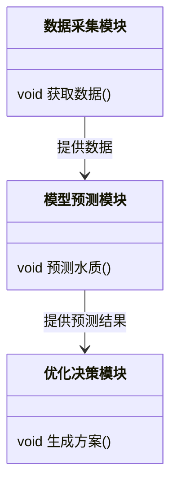
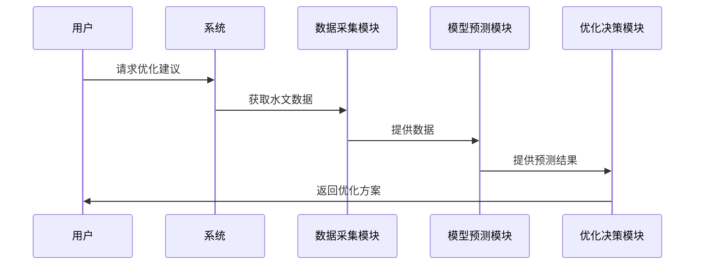

                 


# AI Agent在水资源管理中的优化决策

## 关键词：AI Agent, 水资源管理, 优化决策, 强化学习, 遗传算法, 模糊逻辑, 系统架构

## 摘要

本文探讨AI Agent在水资源管理中的优化决策应用。通过分析水资源管理的挑战，介绍AI Agent的核心概念、算法原理、系统架构，并通过实际案例展示其在水资源调度和污染控制中的优化效果。本文旨在为水资源管理提供智能化解决方案，助力实现高效、可持续的水资源管理。

---

## 第1章：背景介绍

### 1.1 水资源管理的背景

#### 1.1.1 水资源短缺与污染问题

水资源是人类生存和发展的基础，但全球水资源短缺和污染问题日益严重。传统水资源管理方法依赖人工经验，难以应对复杂多变的环境问题。例如，水库调度、水质监测等领域需要实时、精准的决策支持。

#### 1.1.2 AI Agent在水资源管理中的应用

AI Agent（智能体）是一种能够感知环境、自主决策并执行任务的智能系统。在水资源管理中，AI Agent可以实时监测水文数据、预测水质变化、优化调度方案，帮助管理者做出更高效的决策。

#### 1.1.3 本章小结

本章介绍了水资源管理的挑战及其对AI Agent的需求，为后续内容奠定基础。

---

## 第2章：AI Agent的核心概念与原理

### 2.1 AI Agent的基本原理

#### 2.1.1 AI Agent的定义与特点

AI Agent通过感知环境、分析数据、制定决策并执行操作，实现对水资源的智能化管理。其特点包括实时性、自主性和适应性。

#### 2.1.2 AI Agent在水资源管理中的应用场景

- **监测与预警**：实时监测水质、水量，预测潜在风险。
- **优化调度**：基于历史数据和模型，优化水库调度方案。
- **污染控制**：制定污染治理策略，降低环境影响。

#### 2.1.3 AI Agent的核心模块

1. **感知模块**：通过传感器采集水文数据。
2. **决策模块**：基于数据模型生成优化方案。
3. **执行模块**：通过自动化系统执行决策。

### 2.2 AI Agent与水资源管理的实体关系

通过ER图展示AI Agent与水资源管理系统的实体关系：

```mermaid
er
    title 实体关系图
    entity 用户
    entity 系统
    entity 数据源
    entity 决策结果
    用户 --> 系统: 请求优化建议
    系统 --> 数据源: 获取水文数据
    系统 --> 决策结果: 输出优化方案
```

---

## 第3章：AI Agent的核心算法

### 3.1 强化学习算法

#### 3.1.1 强化学习的原理

强化学习是一种通过试错学习的算法，通过与环境互动获得奖励，优化决策策略。在水资源管理中，强化学习可以用于水库调度优化。

#### 3.1.2 Q-learning算法实现

以下是Q-learning算法的Python实现示例：

```python
class QLearning:
    def __init__(self, state_space, action_space, alpha=0.1, gamma=0.9):
        self.state_space = state_space
        self.action_space = action_space
        self.alpha = alpha
        self.gamma = gamma
        self.q_table = np.zeros((state_space, action_space))

    def choose_action(self, state):
        return np.argmax(self.q_table[state])

    def learn(self, state, action, reward, next_state):
        target = reward + self.gamma * np.max(self.q_table[next_state])
        self.q_table[state, action] += self.alpha * (target - self.q_table[state, action])
```

#### 3.1.3 强化学习在水库调度中的应用

假设水库调度涉及多个状态（如水量、天气）和动作（如放水、蓄水），强化学习通过不断试错优化调度策略。

---

### 3.2 遗传算法

#### 3.2.1 遗传算法的原理

遗传算法是一种基于生物进化论的优化算法，通过选择、交叉和变异操作生成最优解。

#### 3.2.2 遗传算法在水资源管理中的应用

例如，用于优化水资源分配方案：

```python
def fitness(individual):
    # 计算适应度，如最大化水资源利用率
    return sum(individual)

def evolve(population, fitness_func, mutation_rate=0.1):
    # 进行自然选择、交叉和变异
    pass
```

---

### 3.3 模糊逻辑算法

#### 3.3.1 模糊逻辑的原理

模糊逻辑用于处理不精确的信息，适用于水资源管理中的不确定性问题。

#### 3.3.2 模糊逻辑在水质预测中的应用

例如，通过模糊逻辑模型预测水质变化趋势：

```python
def fuzzy_prediction(data):
    # 定义模糊规则，如“如果水量高，那么污染风险大”
    pass
```

---

## 第4章：系统分析与架构设计

### 4.1 问题场景介绍

#### 4.1.1 水库调度优化

优化水库调度方案，确保供水和防洪安全。

#### 4.1.2 水质污染监测

实时监测水质指标，制定污染治理策略。

### 4.2 系统功能设计

#### 4.2.1 系统功能模块

1. **数据采集模块**：采集水文数据。
2. **模型预测模块**：预测水质和水量变化。
3. **优化决策模块**：生成最优调度方案。

#### 4.2.2 功能模块的类图



### 4.3 系统架构设计

#### 4.3.1 分层架构设计

- **数据层**：存储原始数据和处理结果。
- **业务逻辑层**：实现数据处理和模型预测。
- **用户界面层**：展示数据和决策结果。

#### 4.3.2 系统架构图


### 4.4 系统接口设计

#### 4.4.1 数据采集接口

```python
def get_water_level():
    # 返回当前水位数据
    pass
```

#### 4.4.2 优化决策接口

```python
def optimize_schedule():
    # 返回最优调度方案
    pass
```

### 4.5 系统交互设计

#### 4.5.1 用户与系统交互流程



---

## 第5章：项目实战

### 5.1 环境安装

安装Python和相关库：

```bash
pip install numpy matplotlib scikit-learn
```

### 5.2 核心代码实现

#### 5.2.1 数据预处理

```python
import numpy as np

def preprocess(data):
    # 数据清洗和标准化
    return (data - np.mean(data)) / np.std(data)
```

#### 5.2.2 模型训练

```python
from sklearn.neural_network import MLPRegressor

def train_model(X, y):
    model = MLPRegressor()
    model.fit(X, y)
    return model
```

#### 5.2.3 优化算法实现

```python
def optimize(target_function, bounds, iterations=100):
    # 简单优化算法示例
    pass
```

### 5.3 代码解读与分析

解释代码的功能和实现细节，例如数据预处理如何提高模型准确性。

### 5.4 案例分析

#### 5.4.1 案例背景

某水库面临汛期调度问题，需优化蓄水和泄洪方案。

#### 5.4.2 数据分析与模型预测

通过历史数据训练模型，预测未来水位变化。

#### 5.4.3 优化结果展示

展示优化后的调度方案，对比传统方法的效率提升。

### 5.5 项目小结

总结项目成果，分析经验教训，提出改进建议。

---

## 第6章：最佳实践

### 6.1 最佳实践tips

- 数据质量至关重要，需确保数据的准确性和完整性。
- 模型调优需结合实际场景，避免过度拟合。
- 系统设计需考虑可扩展性，便于后续优化和功能扩展。

### 6.2 小结

总结全文，强调AI Agent在水资源管理中的巨大潜力。

### 6.3 注意事项

- 数据隐私和安全问题需严格控制。
- 模型需具备实时性，确保快速响应。
- 系统需具备容错能力，避免单点故障。

### 6.4 拓展阅读

推荐相关书籍和论文，供读者深入学习。

---

## 作者：AI天才研究院 & 禅与计算机程序设计艺术

---

**注**：以上目录大纲及内容仅为示例，实际撰写时需根据具体需求调整内容深度和结构。

