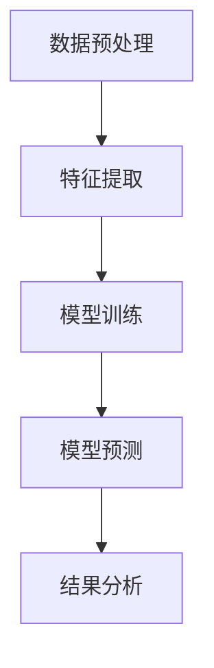
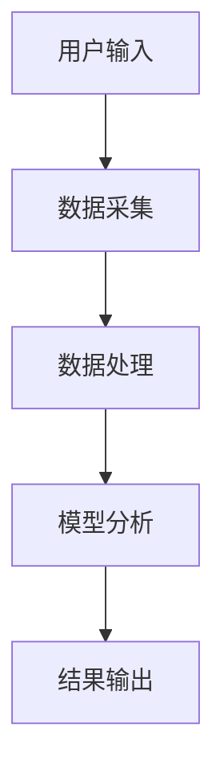
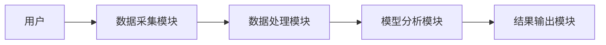

                 


# AI Agent在水资源管理中的应用：水质监测与分配

> 关键词：AI Agent、水资源管理、水质监测、水量分配、机器学习、智能系统

> 摘要：本文深入探讨了AI Agent在水资源管理中的应用，特别是水质监测与水量分配领域。通过分析AI Agent的核心概念、算法原理、系统架构设计和实际项目案例，展示了如何利用人工智能技术解决复杂的水资源管理问题。文章内容涵盖背景介绍、核心概念、算法原理、系统分析、项目实战以及总结与展望，为读者提供了一套全面的解决方案。

---

## 第一部分: AI Agent在水资源管理中的应用概述

### 第1章: AI Agent与水资源管理概述

#### 1.1 AI Agent的基本概念
- **AI Agent的定义**：AI Agent（人工智能代理）是一种能够感知环境、自主决策并执行任务的智能实体。它能够根据输入的数据做出最优选择，并通过反馈机制不断优化自身行为。
- **AI Agent的核心特征**：
  - 感知能力：通过传感器或其他数据源获取环境信息。
  - 决策能力：基于感知信息，运用算法做出决策。
  - 执行能力：通过执行机构或接口将决策转化为实际操作。
  - 学习能力：通过反馈机制不断优化自身的感知、决策和执行能力。
- **AI Agent在水资源管理中的应用背景**：
  - 水资源管理涉及水质监测、水量分配、污染控制等多个方面，具有复杂性和动态性。
  - 传统的管理方法依赖人工经验，效率低下且难以应对复杂问题。
  - AI Agent的引入为水资源管理提供了智能化、自动化和高效化的解决方案。

#### 1.2 水资源管理的现状与挑战
- **水资源管理的基本概念**：
  - 水资源管理是指对地表水、地下水和水资源的合理分配与利用，以满足人类社会、经济和生态需求。
  - 主要包括水质监测、水量分配、水资源保护和优化利用等内容。
- **当前水资源管理的主要问题**：
  - 水污染问题日益严重，水质监测成本高且效率低。
  - 水资源分配不均，导致部分地区水资源短缺，另一部分地区浪费严重。
  - 传统管理方法依赖人工经验，难以应对复杂的动态变化。
- **AI技术在水资源管理中的潜力**：
  - AI Agent可以通过实时监测和数据分析，优化水资源的分配和利用。
  - 通过机器学习算法，AI Agent能够预测水质变化趋势，提前采取措施应对潜在问题。
  - AI Agent可以实现智能化的水资源管理，提高管理效率和决策准确性。

### 第2章: AI Agent的核心概念

#### 2.1 AI Agent的基本原理
- **AI Agent的感知、决策与执行机制**：
  - 感知：AI Agent通过传感器或数据接口获取环境信息，如水质参数（pH值、溶解氧、温度等）和水量数据。
  - 决策：基于感知到的信息，AI Agent运用机器学习算法进行分析，生成最优决策。
  - 执行：通过执行机构（如水泵、阀门等）将决策转化为实际操作。
- **AI Agent的核心算法与技术**：
  - 机器学习算法：如支持向量机（SVM）、随机森林、神经网络等。
  - 数据处理技术：如数据清洗、特征提取、数据可视化等。
  - 自然语言处理（NLP）：用于分析与水资源相关的文本数据。

#### 2.2 水质监测与水量分配的AI Agent模型
- **水质监测的基本原理**：
  - 通过传感器实时监测水质参数，如pH值、溶解氧、温度、浊度等。
  - 数据采集后，AI Agent对数据进行分析，识别异常情况并发出预警。
- **水量分配的优化方法**：
  - 基于AI Agent的优化算法，如遗传算法、粒子群优化算法等，对水量进行合理分配。
  - 结合历史数据和实时需求，动态调整水量分配策略。
- **AI Agent在水质监测与水量分配中的作用**：
  - 实时监测：AI Agent能够实时采集和分析水质数据，快速识别异常情况。
  - 智能决策：基于历史数据和实时信息，AI Agent能够做出最优的水量分配决策。
  - 自动化控制：AI Agent可以通过接口控制水泵、阀门等设备，实现自动化管理。

---

## 第二部分: AI Agent的算法原理与数学模型

### 第3章: AI Agent的算法原理

#### 3.1 机器学习算法在AI Agent中的应用
- **常见机器学习算法概述**：
  - 监督学习：如线性回归、支持向量机（SVM）、随机森林等。
  - 无监督学习：如聚类算法（K-means）、主成分分析（PCA）等。
  - 强化学习：如Q-learning、深度强化学习（DRL）等。
- **支持向量机（SVM）在水质监测中的应用**：
  - SVM是一种监督学习算法，适用于分类和回归问题。
  - 在水质监测中，SVM可以用于识别水质异常情况，如超标污染物检测。
- **随机森林在水量分配中的应用**：
  - 随机森林是一种基于决策树的集成学习算法，适用于分类和回归问题。
  - 在水量分配中，随机森林可以用于预测不同区域的用水需求，优化水量分配策略。

#### 3.2 数学模型与公式
- **线性回归模型**：
  $$ y = \beta_0 + \beta_1x + \epsilon $$
  - 其中，$y$ 是目标变量（如水质指标），$x$ 是自变量（如温度、pH值），$\beta_0$ 和 $\beta_1$ 是回归系数，$\epsilon$ 是误差项。
- **分类算法的损失函数**：
  $$ L = -\frac{1}{m}\sum_{i=1}^{m} [y_i \cdot \ln(p_i) + (1 - y_i) \cdot \ln(1 - p_i)] $$
  - 其中，$y_i$ 是真实标签，$p_i$ 是预测概率，$m$ 是样本数量。
- **聚类算法的距离度量**：
  $$ d(x, y) = \sqrt{\sum_{i=1}^{n}(x_i - y_i)^2} $$
  - 其中，$x$ 和 $y$ 是两个样本，$n$ 是特征数量。

#### 3.3 算法流程图


---

## 第三部分: 系统分析与架构设计

### 第4章: 系统分析与架构设计

#### 4.1 系统功能设计
- **系统功能模块划分**：
  - 数据采集模块：负责采集水质和水量数据。
  - 数据处理模块：对采集到的数据进行清洗、特征提取和数据转换。
  - 模型分析模块：基于机器学习算法进行水质监测和水量分配。
  - 结果输出模块：将分析结果输出到用户界面或控制设备。
- **系统功能流程图**：


#### 4.2 系统架构设计
- **系统架构图**：

- **系统接口设计**：
  - 数据采集接口：与传感器或其他数据源对接。
  - 模型分析接口：与机器学习模型对接，获取分析结果。
  - 结果输出接口：将分析结果输出到用户界面或控制设备。
- **系统交互设计**：
  ```mermaid
  sequenceDiagram
      participant 用户
      participant 数据采集模块
      participant 数据处理模块
      participant 模型分析模块
      participant 结果输出模块
      用户 -> 数据采集模块: 请求数据
      数据采集模块 -> 数据处理模块: 传输数据
      数据处理模块 -> 模型分析模块: 分析数据
      模型分析模块 -> 结果输出模块: 输出结果
      结果输出模块 -> 用户: 显示结果
  ```

---

## 第四部分: 项目实战

### 第5章: 项目实战

#### 5.1 环境安装
- **安装Python环境**：
  - 使用Anaconda安装Python 3.8及以上版本。
- **安装机器学习库**：
  - 安装scikit-learn、xgboost、numpy、pandas等库。
  - 使用命令：`pip install scikit-learn xgboost numpy pandas`

#### 5.2 系统核心实现
- **数据采集模块**：
  ```python
  import pandas as pd
  def collect_data():
      # 从传感器获取数据
      data = pd.DataFrame({
          'timestamp': pd.date_range(start='2023-01-01', periods=100),
          'ph': [7.5]*100,
          'dissolved_oxygen': [8.0]*100,
          'temperature': [25.0]*100
      })
      return data
  ```
- **数据处理模块**：
  ```python
  from sklearn.preprocessing import StandardScaler
  def preprocess_data(data):
      # 数据清洗
      data = data.dropna()
      # 特征提取
      features = data[['ph', 'dissolved_oxygen', 'temperature']]
      # 标准化处理
      scaler = StandardScaler()
      features_scaled = scaler.fit_transform(features)
      return features_scaled
  ```
- **模型分析模块**：
  ```python
  from sklearn.ensemble import RandomForestClassifier
  def train_model(X_train, y_train):
      model = RandomForestClassifier(n_estimators=100, random_state=42)
      model.fit(X_train, y_train)
      return model
  ```

#### 5.3 案例分析与代码解读
- **案例分析**：
  - 假设我们有一个水质监测系统，需要预测水质是否超标。
  - 数据集包括pH值、溶解氧、温度等特征，以及标签（0表示正常，1表示超标）。
- **代码解读**：
  ```python
  # 数据采集
  data = collect_data()
  # 数据处理
  features_scaled = preprocess_data(data)
  # 训练模型
  model = train_model(features_scaled, data['label'])
  ```

#### 5.4 项目小结
- **项目总结**：
  - 通过AI Agent实现了水质监测和水量分配的智能化管理。
  - 系统能够实时采集数据，自动分析并做出决策，显著提高了管理效率。
  - 通过机器学习算法优化了水资源分配策略，降低了浪费，提高了利用效率。

---

## 第五部分: 总结与展望

### 第6章: 总结与展望

#### 6.1 总结
- 本文详细探讨了AI Agent在水资源管理中的应用，特别是在水质监测和水量分配方面。
- 通过理论分析、算法实现和项目实战，展示了AI Agent如何帮助解决复杂的水资源管理问题。
- AI Agent的引入不仅提高了管理效率，还为水资源的可持续利用提供了新的思路。

#### 6.2 展望
- **未来发展方向**：
  - 更加智能化的算法：如深度学习、强化学习等，进一步提高AI Agent的决策能力。
  - 多模态数据融合：将水质、水量、气象等多源数据进行融合，提升系统的综合判断能力。
  - 智能化与自动化的结合：通过物联网技术实现更高效的水资源管理。

---

## 作者信息

作者：AI天才研究院/AI Genius Institute & 禅与计算机程序设计艺术 /Zen And The Art of Computer Programming

---

**参考文献**：
1. Russell, S., & Norvig, P. (2010).《人工智能：一种现代方法》.
2. 周志华. (2016).《机器学习》.
3. LeCun, Y., Bengio, Y., & Hinton, G. (2015).《Deep Learning》.

---

**注**：本文为技术博客文章，转载请注明出处。

