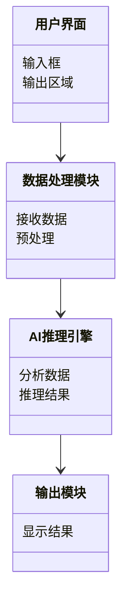
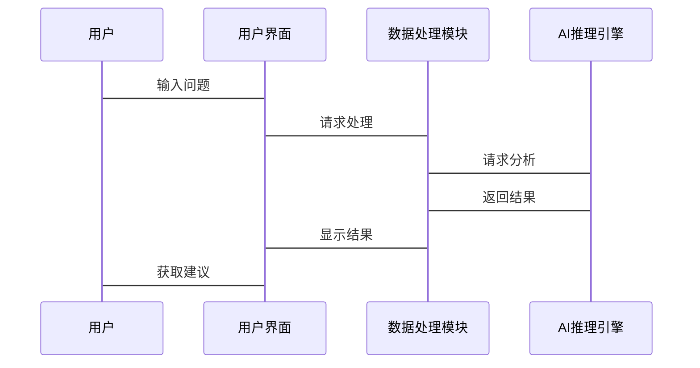

                 


# AI Agent在法律服务中的应用

> **关键词**：AI Agent，法律服务，自然语言处理，机器学习，法律咨询，合同审查

> **摘要**：本文探讨了AI Agent在法律服务中的应用，分析了其在法律咨询、合同审查和案件分析中的潜力。通过详细讲解AI Agent的技术原理和系统架构，结合实际项目案例，展示了如何利用AI技术提升法律服务的效率和准确性。

---

# 第一部分: 引言

## 第1章: AI Agent与法律服务的背景介绍

### 1.1 AI Agent的基本概念

#### 1.1.1 AI Agent的定义

AI Agent（人工智能代理）是一种能够感知环境并采取行动以实现目标的智能实体。它可以是一个软件程序，通过接收输入、处理信息并生成输出来完成特定任务。

#### 1.1.2 AI Agent的核心特征

- **自主性**：能够自主决策和行动。
- **反应性**：能够实时感知环境并做出反应。
- **学习能力**：通过数据和经验不断优化性能。

#### 1.1.3 AI Agent在法律服务中的潜在价值

AI Agent可以辅助律师进行法律研究、合同审查和案件分析，提高效率并降低成本。

### 1.2 法律服务的数字化转型

#### 1.2.1 法律服务的传统模式

传统法律服务依赖人工操作，效率较低且成本较高。

#### 1.2.2 数字化转型的驱动力

技术进步（如AI、大数据）推动法律服务向数字化、智能化方向发展。

#### 1.2.3 AI Agent在法律服务中的应用现状

AI Agent已经在法律咨询、合同审查等领域开始应用，但尚未普及。

### 1.3 AI Agent在法律服务中的问题背景

#### 1.3.1 法律服务中的痛点与挑战

- **效率低下**：人工处理大量法律文档耗时耗力。
- **成本高昂**：律师费用昂贵，中小企业难以负担。
- **信息不对称**：客户和律师之间存在信息鸿沟。

#### 1.3.2 AI Agent如何解决这些问题

通过自动化处理法律文档、提供即时法律咨询和优化案件管理流程，AI Agent可以显著降低成本并提高效率。

#### 1.3.3 问题的边界与外延

AI Agent的应用范围包括法律咨询、合同审查和案件分析，但目前仍需人工律师的最终审核。

## 1.4 本章小结

本章介绍了AI Agent的基本概念及其在法律服务中的潜力，分析了传统法律服务的痛点，并探讨了AI Agent如何解决这些问题。

---

# 第二部分: AI Agent的核心概念与法律服务的联系

## 第2章: AI Agent的核心概念与原理

### 2.1 AI Agent的核心原理

#### 2.1.1 人工智能的基本原理

人工智能通过数据训练模型，使其能够进行分类、预测和生成等任务。

#### 2.1.2 代理（Agent）的定义与特征

代理是一种能够感知环境并采取行动的实体，具有自主性和反应性。

#### 2.1.3 AI Agent的分类与应用场景

- **基于规则的AI Agent**：适用于简单的决策任务。
- **基于机器学习的AI Agent**：适用于复杂任务，如法律咨询。

### 2.2 法律服务中的核心概念

#### 2.2.1 法律咨询的定义与流程

法律咨询是律师为客户提供法律建议的过程，通常包括问题分析、法律研究和建议制定。

#### 2.2.2 合同审查的关键要素

合同审查需要识别合同中的法律风险和关键条款，确保客户利益最大化。

#### 2.2.3 案件分析的复杂性

案件分析涉及大量法律文件和 precedents，需要深入的法律知识和经验。

### 2.3 AI Agent与法律服务的结合

#### 2.3.1 AI Agent在法律咨询中的应用

AI Agent可以通过自然语言处理技术理解客户的问题，并提供初步法律建议。

#### 2.3.2 AI Agent在合同审查中的作用

AI Agent可以自动识别合同中的关键条款和潜在风险。

#### 2.3.3 AI Agent在案件分析中的潜力

AI Agent可以辅助律师进行案件分析，提高效率并减少人为错误。

### 2.4 本章小结

本章详细介绍了AI Agent的核心原理，并探讨了其在法律服务中的应用，特别是在法律咨询、合同审查和案件分析中的潜力。

---

# 第三部分: AI Agent在法律服务中的技术原理

## 第3章: AI Agent的技术架构与算法原理

### 3.1 AI Agent的技术架构

#### 3.1.1 感知层：自然语言处理

自然语言处理（NLP）技术使AI Agent能够理解和生成人类语言。

#### 3.1.2 理解层：知识表示与推理

知识表示和推理技术帮助AI Agent理解和推理复杂的法律问题。

#### 3.1.3 行动层：决策与执行

决策层基于推理结果做出最佳决策，并通过执行层完成任务。

### 3.2 法律服务中的自然语言处理

#### 3.2.1 文本分类与主题识别

文本分类用于识别法律文档的主题，如合同、法律意见书等。

#### 3.2.2 实体识别与关系抽取

实体识别用于提取法律文档中的关键实体，如公司名称、合同条款等。

#### 3.2.3 问答系统与对话生成

问答系统用于回答客户的法律问题，对话生成技术用于生成自然的对话。

### 3.3 AI Agent的算法原理

#### 3.3.1 基于规则的推理算法

基于规则的推理算法通过预定义的规则进行推理，适用于简单的法律问题。

#### 3.3.2 基于机器学习的推理算法

基于机器学习的推理算法通过训练数据进行模式识别，适用于复杂的法律问题。

#### 3.3.3 基于大模型的生成式推理

大模型（如GPT）可以通过生成式推理生成复杂的法律文本。

### 3.4 本章小结

本章详细介绍了AI Agent的技术架构和算法原理，特别是自然语言处理技术在法律服务中的应用。

---

# 第四部分: 系统分析与架构设计

## 第4章: 法律服务AI Agent的系统架构

### 4.1 系统功能设计

#### 4.1.1 用户界面

用户界面是客户与AI Agent交互的界面，通常包括输入框和输出区域。

#### 4.1.2 数据处理模块

数据处理模块负责接收输入数据并进行预处理。

#### 4.1.3 AI推理引擎

AI推理引擎负责对数据进行分析和推理，生成结果。

#### 4.1.4 输出模块

输出模块将推理结果呈现给用户，通常包括文本和建议。

### 4.2 系统架构设计

#### 4.2.1 领域模型

领域模型描述了系统的功能模块及其交互关系。



#### 4.2.2 系统架构图


#### 4.2.3 接口设计

系统需要提供API接口，以便与其他法律系统集成。

#### 4.2.4 交互流程



### 4.2.5 本章小结

本章详细描述了法律服务AI Agent的系统架构，包括功能模块、接口设计和交互流程。

---

# 第五部分: 项目实战与案例分析

## 第5章: 法律服务AI Agent的项目实战

### 5.1 项目介绍

本项目旨在开发一个AI Agent，用于法律咨询和合同审查。

### 5.2 环境安装

需要安装Python、TensorFlow和自然语言处理库（如spaCy）。

### 5.3 系统核心实现

#### 5.3.1 数据预处理

```python
import spacy

nlp = spacy.load("en_core_web_sm")

text = "This is a contract for legal services."
doc = nlp(text)

for token in doc:
    print(token.text, token.pos_)
```

#### 5.3.2 AI推理引擎

```python
import tensorflow as tf
from tensorflow.keras import layers

model = tf.keras.Sequential()
model.add(layers.Dense(64, activation='relu'))
model.add(layers.Dense(1, activation='sigmoid'))
model.compile(optimizer='adam', loss='binary_crossentropy', metrics=['accuracy'])
```

### 5.4 案例分析

#### 5.4.1 合同审查案例

AI Agent自动识别合同中的关键条款，并生成风险报告。

#### 5.4.2 法律咨询案例

客户输入问题，AI Agent提供初步法律建议，并提醒客户咨询专业律师。

### 5.5 项目小结

本章通过实际项目案例展示了AI Agent在法律服务中的应用，包括环境安装、系统实现和案例分析。

---

# 第六部分: 总结与展望

## 第6章: 总结与展望

### 6.1 本章总结

本文详细探讨了AI Agent在法律服务中的应用，分析了其技术原理和系统架构，并通过实际案例展示了其潜力。

### 6.2 未来展望

未来，随着AI技术的不断发展，AI Agent在法律服务中的应用将更加广泛，特别是在智能合同审查和案件分析方面。

---

# 作者：AI天才研究院 & 禅与计算机程序设计艺术

