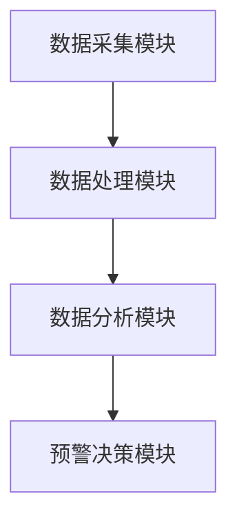

                 


# AI Agent在海啸预警中的数据处理

> 关键词：AI Agent、海啸预警、数据处理、机器学习、实时分析、多模态数据、智能决策

> 摘要：本文详细探讨了AI Agent在海啸预警中的数据处理技术，从背景到核心算法，再到系统架构和项目实战，全面解析了AI Agent如何通过高效的数据处理提升海啸预警的准确性和及时性。

---

# 第1章 AI Agent在海啸预警中的作用

## 1.1 背景介绍

海啸是一种极具破坏力的自然灾害，通常由海底地震或火山爆发引发。由于其突发性和不可预测性，及时有效的预警系统对于减少人员伤亡和财产损失至关重要。传统的海啸预警系统依赖于地震数据和潮汐监测，但存在数据来源单一、处理效率低、预警时间长等问题。

AI Agent（人工智能代理）作为一种智能实体，能够自主感知环境、处理信息并做出决策。在海啸预警中，AI Agent可以通过整合多源数据，实时分析并生成预警信号，显著提升预警的准确性和及时性。

## 1.2 AI Agent的核心功能

AI Agent在海啸预警中的核心功能包括：

1. **实时数据处理**：AI Agent能够实时采集和处理来自地震仪、潮汐监测站、卫星等多种数据源的信息。
2. **智能预测**：通过机器学习算法，AI Agent可以预测海啸的发生概率和影响范围。
3. **决策支持**：AI Agent能够根据分析结果，协助相关部门做出应急决策。

## 1.3 数据处理挑战

海啸预警的数据处理面临以下挑战：

1. **数据来源多样性**：包括地震数据、潮汐数据、海洋环境数据等多种类型。
2. **实时性要求高**：需要在短时间内完成数据处理和分析。
3. **数据质量保障**：数据可能存在缺失、噪声等问题，影响预警的准确性。

---

# 第2章 AI Agent的数据处理流程

## 2.1 数据采集

AI Agent通过多种数据源采集相关信息：

- **地震数据**：来自全球地震监测网络，包括地震 magnitude 和震源深度。
- **潮汐数据**：来自海洋监测站，包括潮汐高度和流速。
- **卫星数据**：包括海平面变化和海洋底部地形数据。

## 2.2 数据预处理

数据预处理是确保AI Agent高效分析的基础：

- **数据清洗**：去除噪声和错误数据，确保数据准确性。
- **数据标准化**：将不同单位的数据统一化，便于后续分析。
- **特征提取**：从原始数据中提取关键特征，如地震的震源深度和潮汐变化速率。

## 2.3 数据分析

AI Agent使用多种算法进行数据分析：

- **时间序列分析**：利用LSTM（长短期记忆网络）模型预测海啸发生概率。
- **异常检测**：通过Isolation Forest算法识别异常数据点，提高预警准确性。

## 2.4 决策支持

基于分析结果，AI Agent生成预警信号：

- **预警触发**：当预测概率超过阈值时，触发预警。
- **影响范围预测**：结合地理信息系统（GIS），预测海啸的影响区域。

---

# 第3章 AI Agent的核心算法与模型

## 3.1 算法选择

AI Agent的核心算法包括：

- **LSTM网络**：适用于时间序列数据的预测。
- **Isolation Forest**：用于异常检测。

## 3.2 模型实现

以下是基于LSTM的时间序列预测模型的Python代码示例：

```python
import numpy as np
from keras.models import Sequential
from keras.layers import LSTM, Dense

# 示例数据：假设x为时间序列输入，y为标签
x = np.random.random((1000, 1, 1))
y = np.random.random((1000, 1))

model = Sequential()
model.add(LSTM(64, input_shape=(1, 1)))
model.add(Dense(1, activation='sigmoid'))
model.compile(loss='binary_crossentropy', optimizer='adam', metrics=['accuracy'])

model.fit(x, y, epochs=10, batch_size=32)
```

## 3.3 模型优化

- **超参数调优**：通过网格搜索优化LSTM的隐藏层大小和学习率。
- **评估指标**：准确率、召回率和F1分数用于评估模型性能。

---

# 第4章 系统架构设计

## 4.1 系统模块划分

海啸预警系统主要包括以下模块：

- **数据采集模块**：负责采集地震、潮汐等数据。
- **数据处理模块**：清洗、标准化和特征提取。
- **数据分析模块**：运行机器学习模型进行预测。
- **预警决策模块**：生成预警信号并发送给相关部门。

## 4.2 系统架构图

以下是系统架构的Mermaid图：



## 4.3 接口设计

- **数据输入接口**：接收多源数据输入。
- **预警触发接口**：当预测概率超过阈值时，触发预警信号。

---

# 第5章 项目实战与案例分析

## 5.1 项目部署

环境搭建：

- 安装Python和必要的库（如Keras、TensorFlow、Pandas）。
- 配置数据采集接口，连接地震和潮汐监测站。

## 5.2 代码实现

以下是数据处理和模型训练的代码示例：

```python
import pandas as pd
from sklearn.preprocessing import StandardScaler

# 数据加载
data = pd.read_csv('seismic_data.csv')

# 数据清洗
data.dropna(inplace=True)

# 标准化
scaler = StandardScaler()
data_scaled = scaler.fit_transform(data)

# 模型训练
model = Sequential()
model.add(LSTM(64, input_shape=(data_scaled.shape[1], 1)))
model.add(Dense(1, activation='sigmoid'))
model.compile(loss='binary_crossentropy', optimizer='adam')
model.fit(data_scaled, y, epochs=20, batch_size=32)
```

## 5.3 案例分析

假设有一组地震数据，AI Agent通过分析预测海啸概率为90%，并触发预警。相关部门迅速启动应急措施，成功减少了损失。

---

# 第6章 总结与展望

## 6.1 总结

AI Agent通过高效的数据处理和智能分析，显著提升了海啸预警的准确性和及时性。其在多源数据整合、实时分析和智能决策方面的优势，为海啸预警系统带来了新的可能性。

## 6.2 展望

未来，AI Agent在海啸预警中的应用将更加智能化和自动化。可能的发展方向包括更先进的算法、边缘计算的应用以及与其他自然灾害预警系统的集成。

---

# 作者信息

作者：AI天才研究院 & 禅与计算机程序设计艺术

---

通过以上内容，我们详细解析了AI Agent在海啸预警中的数据处理技术，从理论到实践，为提升海啸预警系统的效率和准确性提供了新的思路。

