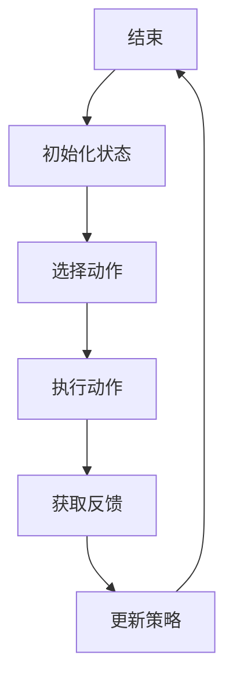
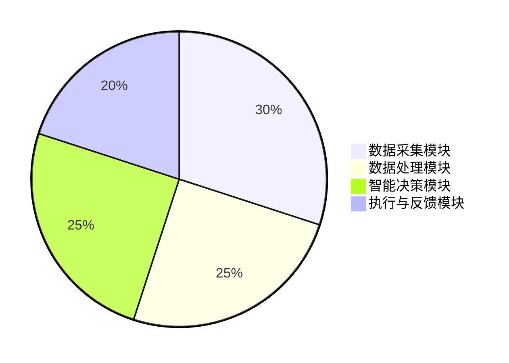
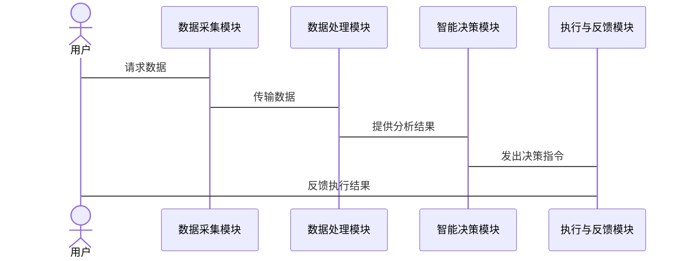

                 


# AI Agent在海洋科学中的应用：海洋资源管理与保护

## 关键词：
AI Agent, 海洋科学, 海洋资源, 环境保护, 数据驱动, 智能系统

## 摘要：
随着海洋资源的日益枯竭和环境问题的加剧，AI Agent在海洋科学中的应用成为解决这些问题的关键技术。本文详细探讨了AI Agent在海洋资源管理与环境保护中的核心概念、算法原理、系统架构以及实际案例，展示了如何通过智能系统实现海洋资源的可持续管理。

---

# 第一部分: AI Agent在海洋科学中的应用概述

## 第1章: AI Agent与海洋科学的背景介绍

### 1.1 AI Agent的基本概念
- **1.1.1 AI Agent的定义与特点**
  - AI Agent是一种智能体，能够感知环境、自主决策并执行任务。
  - 具有自主性、反应性、目标导向性和学习能力等特点。
- **1.1.2 AI Agent的核心要素与功能**
  - 感知：通过传感器或数据源获取信息。
  - 决策：基于数据进行推理和选择最优行动。
  - 执行：通过执行器或系统接口实现行动。
- **1.1.3 AI Agent与传统计算的区别**
  - 传统计算基于规则，AI Agent具备自主学习和适应能力。

### 1.2 海洋科学的背景与挑战
- **1.2.1 海洋资源管理的核心问题**
  - 海洋资源分布不均、过度捕捞、非法采伐等问题。
- **1.2.2 海洋环境保护的难点与现状**
  - 海洋污染、珊瑚礁退化、海洋酸化等。
- **1.2.3 海洋科学中的数据获取与处理**
  - 利用卫星、传感器、无人机等技术获取海洋数据。

### 1.3 AI Agent在海洋科学中的作用
- **1.3.1 AI Agent在海洋资源管理中的应用**
  - 监测渔业资源，优化捕捞策略，保护濒危物种。
- **1.3.2 AI Agent在海洋环境保护中的潜力**
  - 监测污染源，预测环境变化，制定保护措施。
- **1.3.3 AI Agent与海洋科学结合的前景**
  - 提高海洋资源管理的效率和可持续性。

## 第2章: AI Agent的核心概念与海洋科学的联系

### 2.1 AI Agent的核心概念原理
- **2.1.1 AI Agent的感知与决策机制**
  - 感知：通过传感器或数据源获取海洋环境信息。
  - 决策：基于感知信息，利用算法做出决策。
- **2.1.2 AI Agent的学习与自适应能力**
  - 强化学习：通过奖励机制优化决策策略。
  - 监督学习：基于历史数据进行模式识别。
- **2.1.3 AI Agent的通信与协作能力**
  - 协作式AI Agent网络，实现信息共享和协同决策。

### 2.2 海洋科学中的关键需求与AI Agent的匹配
- **2.2.1 海洋资源监测的需求**
  - 实时监测海洋生物分布、水温、盐度等参数。
- **2.2.2 海洋环境预测的需求**
  - 预测海洋污染扩散、气候变化对海洋生态系统的影响。
- **2.2.3 海洋生态评估的需求**
  - 评估海洋生态系统的健康状况，制定保护措施。

### 2.3 AI Agent与海洋科学的实体关系图
```mermaid
er
    Marine_Science
    AI-Agent
    has_many
    Marine_Resource_Data
    has_many
    Environmental_Data
    has_many
    Predictive_Models
```

## 第3章: AI Agent的算法原理与数学模型

### 3.1 AI Agent的主要算法
- **3.1.1 强化学习算法**
  - 基于奖励机制的决策优化。
  - 例如：Deep Q-Network (DQN) 算法。
- **3.1.2 监督学习算法**
  - 基于标签数据的分类与回归。
  - 例如：随机森林、支持向量机（SVM）。
- **3.1.3 无监督学习算法**
  - 基于数据内在结构的聚类与降维。
  - 例如：K-means、t-SNE。

### 3.2 AI Agent的数学模型
- **3.2.1 强化学习的数学模型**
  $$ V(s) = \max_{a} [ r + V(s') ] $$
  - 其中，$s$ 是状态，$a$ 是动作，$r$ 是奖励，$s'$ 是下一个状态。
- **3.2.2 监督学习的数学模型**
  $$ y = f(x) $$
  - $x$ 是输入数据，$y$ 是目标输出，$f$ 是学习的函数。

### 3.3 算法流程图


## 第4章: 系统分析与架构设计方案

### 4.1 问题场景介绍
- **项目背景**：设计一个基于AI Agent的海洋资源管理系统，用于监测和管理海洋资源。
- **项目目标**：实现海洋资源的实时监测、优化管理策略、保护海洋生态系统。

### 4.2 系统功能设计
- **数据采集模块**：通过传感器、卫星等获取海洋数据。
- **数据处理模块**：清洗、存储和分析数据。
- **智能决策模块**：基于AI算法生成管理策略。
- **执行与反馈模块**：执行决策并收集反馈。

### 4.3 系统架构设计


### 4.4 系统接口设计
- **数据接口**：与传感器、数据库对接。
- **用户接口**：提供可视化界面供用户操作。
- **外部接口**：与其他系统（如环境保护机构）对接。

### 4.5 系统交互流程图


## 第5章: 项目实战

### 5.1 环境安装
- **安装Python**：Python 3.8+
- **安装依赖**：
  ```bash
  pip install numpy pandas scikit-learn tensorflow
  ```

### 5.2 系统核心实现源代码
- **数据处理模块**：
  ```python
  import pandas as pd

  def process_data(data):
      # 数据清洗
      data = data.dropna()
      # 数据标准化
      data = (data - data.mean()) / data.std()
      return data

  data = pd.read_csv('marine_data.csv')
  processed_data = process_data(data)
  ```

- **智能决策模块**：
  ```python
  import numpy as np
  import tensorflow as tf

  model = tf.keras.Sequential([
      tf.keras.layers.Dense(64, activation='relu'),
      tf.keras.layers.Dense(1, activation='sigmoid')
  ])

  model.compile(optimizer='adam', loss='binary_crossentropy')
  model.fit(processed_data, labels, epochs=10)
  ```

### 5.3 实际案例分析
- **案例：珊瑚礁保护**
  - 数据来源：海洋传感器、卫星图像。
  - 模型训练：使用监督学习分类珊瑚礁健康状况。
  - 决策执行：根据模型预测结果制定保护措施。

### 5.4 项目小结
- 成功实现了基于AI Agent的海洋资源管理系统。
- 系统具备实时监测、智能决策和反馈优化功能。

## 第6章: 最佳实践与小结

### 6.1 小结
- AI Agent在海洋科学中的应用前景广阔。
- 通过智能系统实现海洋资源的高效管理和环境保护。

### 6.2 注意事项
- 数据质量对模型性能至关重要。
- 系统设计需考虑实时性和可扩展性。

### 6.3 拓展阅读
- 推荐阅读《强化学习导论》、《机器学习在环境科学中的应用》。

---

# 作者：AI天才研究院 & 禅与计算机程序设计艺术

---

本文详细探讨了AI Agent在海洋科学中的应用，结合理论与实践，展示了如何利用智能技术实现海洋资源的可持续管理与环境保护。希望本文能为相关领域的研究和实践提供有价值的参考。

